## 2025 Q4

## 二次元移动游戏体验评测分析报告

## 获取每日免费报告

每日微信群分享

最新行业报告

## 高端社群

所有行业报告均为公开合规版，知识产权属于发布机构，使用场景限于小范围内部学习。

## 二次元移动游戏市场概况&体验指标分析

2025年二次元移动游戏收入同比产生明显下滑，收入TOP1的二游产品已跌至游戏畅销总榜第9。市场竞争转移至玩法层面突破，同时商业化变革悄然进行中。

典型二次元移动游戏体验测评

二次元移动游戏市场发展趋势

## 二次元移动游戏的定义与特征

## 二次元并没有明确的表象定义，其核心本质是“一种群体认同的文化属性”

二次元移动游戏主要特征概览

<table><tr><td></td><td>二次元移动游戏特征</td></tr><tr><td>文化影响</td><td>受日本的动画、漫画、游戏、轻小说等文化产品的影响，二次元与ACGN有着密不可分的联系。需要明确的是，虽然二者常被用于互相解释，但并不等同。二次元侧重于一种文化属性，而非作品体裁。
※需要注意的事：部分产品虽然最初并不被认为是二次元游戏，但在其迭代过程中产生了向二次元文化靠拢的偏向性，并逐渐被二次元玩家群体认可，从而在现如今也纳入了二次元移动游戏的范围。</td></tr><tr><td>核心塑造</td><td>通过角色立绘、角色建模、角色配音、剧情推进、战斗玩法等方面，以打造角色为核心，来建立玩家与角色之间的感情链接。</td></tr><tr><td>画面风格</td><td>早期以日本动漫风格为主，但随着文化的发展，部分韩漫、国漫等画面风格，也逐渐被玩家认可为二次元。</td></tr><tr><td>游戏玩法</td><td>二次元移动游戏发展至今已包含了各种各样的玩法，其中以卡牌战斗、ARPG、恋爱养成等玩法最为主流，不限定PVP与PVE。</td></tr><tr><td>商业模式</td><td>以抽卡（也称为扭蛋、Gacha）为最主流的商业模式，其底层逻辑十分契合斯金纳箱的实验原理。</td></tr><tr><td>玩家群体</td><td>在行业共识中，往往会将玩家区分为“核心二次元玩家”和“泛二次元玩家”。
这两类玩家的最大区别在于对二次元文化的喜好程度及愿意为之付出的程度（包括时间与金钱）。</td></tr><tr><td colspan="2">本次报告中所涉及的“二次元移动游戏”，皆满足以上特征。但并不代表只要满足了这些特征的产品，就是二次元移动游戏。
※另一种主流观点也同样适用于本报告：即主要目标受众群体为“核心二次元玩家”的移动游戏产品，可以认为是“二次元移动游戏”。</td></tr></table>

来源：点点数据自主研究及绘制

## 中国移动游戏市场主要二次元移动游戏产品汇总

以下排名不分先后

<table><tr><td>火影忍者</td><td>世界之外</td><td>航海王热血航线</td><td>无期迷途</td><td>东方归言录</td><td>航海王强者之路</td><td>第七史诗</td><td>公主连结Re:Dive</td><td>天姬变</td><td>高能手办团</td></tr><tr><td>恋与深空</td><td>航海王：壮志雄心</td><td>时温的旅行</td><td>恋与制作人</td><td>女神异闻录：夜幕魅影</td><td>航海王-启航</td><td>崩坏学园2</td><td>闪烁之光</td><td>欢迎来到梦乐园</td><td>异世界慢生活</td></tr><tr><td>原神</td><td>以闪亮之名</td><td>火影忍者：忍者新世代</td><td>崩坏3</td><td>梦想协奏曲！少女乐团派对！</td><td>铃兰之剑：为这和平的世界</td><td>偶像梦幻祭2</td><td>幻塔</td><td>魔卡少女樱：回忆钥匙</td><td>山海镜花</td></tr><tr><td>崩坏：星穹铁道</td><td>命运-冠位指定</td><td>未定事件簿</td><td>战双帕弥什</td><td>命运圣契</td><td>蔚蓝档案</td><td>不朽箴言</td><td>自在西游</td><td>食之契约</td><td>机动战队大作战</td></tr><tr><td>明日方舟</td><td>重返未来：1999</td><td>同步音律</td><td>龙魂旅人</td><td>数码宝贝：新世纪</td><td>星痕共鸣</td><td>物华弥新</td><td>血族</td><td>时空猎人3</td><td>天境传说</td></tr><tr><td>鸣潮</td><td>如鸢</td><td>晶核</td><td>初音未来：缤纷舞台</td><td>影之诗</td><td>森之国度</td><td>忘川风华录</td><td>战舰少女R</td><td>空之要塞：启航</td><td>魔卡幻想</td></tr><tr><td>光与夜之恋</td><td>无限暖暖</td><td>时空中的绘旅人</td><td>圣斗士星矢</td><td>灌篮高手</td><td>伊瑟</td><td>炽焰天穹</td><td>阴阳师：百闻牌</td><td>锚点降临</td><td>阴阳师：妖怪屋</td></tr><tr><td>绝区零</td><td>胜利女神：新的希望</td><td>龙珠激斗</td><td>银与绯</td><td>航海王：燃烧意志</td><td>宝可梦大集结</td><td>深空之眼</td><td>刀剑乱舞</td><td>餐厅萌物语</td><td>启源女神</td></tr><tr><td>阴阳师</td><td>闪耀暖暖</td><td>万象物语</td><td>决战！平安京</td><td>尘白禁区</td><td>闪耀！优俊少女</td><td>黑色信标</td><td>猫之城</td><td>雀姬麻将</td><td>灰烬战线</td></tr><tr><td>永远的蔚蓝星球</td><td>碧蓝航线</td><td>奇迹暖暖</td><td>少女前线2：追放</td><td>绯色回响</td><td>白荆回廊</td><td>交错战线</td><td>异界原点传说：史莱姆不哭</td><td>永远的7日之都</td><td>......</td></tr></table>

来源：点点数据自主研究及绘制

## 中国二次元移动游戏市场收入规模

## 收入同比产生明显下滑 商业化变革悄然进行中

点点数据在2024年10月发布的《全球二次元移动游戏市场研究报告》中提到，2024年的市场收入规模已开始小幅收缩。而从下图来看，2025年中国二次元移动游戏市场进一步加剧了下滑趋势。这一方面是因为现今二次元移动游戏产品出现了明显的“定式”，包括商业化、养成体系乃至玩法层面，玩家已出现了相当程度的审美疲劳；另一方面，玩家的消费比例出现了部分转移（如谷子经济的崛起，虽然扩大了受众，但同样转移了玩家消费倾向）。而基于此，游戏厂商也开始进行了积极的战略调整，如10月末上线的《二重螺旋》完全抛弃了二游传统的抽卡商业化模式，转向了纯Avatar付费。虽然游戏正式上线后的表现难以与市面上头部二游产品比肩，但变革的种子已悄然埋在了广大玩家内心中。

2025Q3中国二次元移动游戏市场收入规模（仅App Store）

[image_caption]
该图像为柱状图和折线图的组合，展示了中国二次元移动游戏市场的收入规模及其环比增长率。

### 图表类型
- **柱状图**：表示每个季度的市场收入规模（单位：亿元/人民币）。
- **折线图**：表示每个季度的环比增长率。

### 数据信息
#### 市场收入规模（柱状图）
- **2024Q1**：40.7亿元
- **2024Q2**：40.4亿元
- **2024Q3**：35.7亿元
- **2024Q4**：39.7亿元
- **2025Q1**：33.7亿元
- **2025Q2**：39.2亿元
- **2025Q3**：39.7亿元

#### 环比增长率（折线图）
- **2024Q1至2024Q2**：-0.88%
- **2024Q2至2024Q3**：-11.63%
- **2024Q3至2024Q4**：11.35%
- **2024Q4至2025Q1**：-15.21%
- **2025Q1至2025Q2**：16.44%
- **2025Q2至2025Q3**：1.25%

### 趋势分析
- **市场收入规模**：整体呈现波动趋势，从2024Q1的40.7亿元下降至2024Q3的35.7亿元，随后在2024Q4回升至39.7亿元，2025Q1降至33.7亿元，2025Q2回升至39.2亿元，最后在2025Q3稳定在39.7亿元。
- **环比增长率**：增长率波动较大，从2024Q1的-0.88%到2024Q4的11.35%，再到2025Q1的-15.21%，显示出市场的不稳定性和周期性变化。2025Q2的增长率显著提升至16.44%，随后在2025Q3略有下降至1.25%。

### 总结
该图表清晰地展示了中国二次元移动游戏市场在2024年第一季度至2025年第三季度的收入规模和环比增长率的变化趋势，反映了市场的波动性和增长潜力。
[/image_caption]

注释：1、中国移动游戏市场统计范围：仅包含在中国大陆地区上线的移动端游戏，不包含PC端、游戏主机端或其他硬件平台上的游戏（例如一款游戏同时发布了移动端版本、PC客户端版本和游戏主机端版本，本报告也仅统计移动端版本的相关数据）；2、收入规模包含统计范围内用户消费的总金额，不包含广告变现、第三方充值等其他收入模式；3、本报告中后续涉及的“中国移动游戏收入”相关的统计数据，都以此标准进行统计；4、部分数据可能会在点点数据2025年相关报告中做出调整。

来源：中国移动游戏市场收入规模是综合了点点数据、企业财报、专家访谈，根据点点数据统计模型核算所得。

## 中国二次元移动游戏市场下载量变化趋势

## 下载量波动与新品强相关 市场竞争转移至玩法突破

近一年来，中国二次元移动游戏下载量呈现出显著波动。这种“断崖式波动”实则与新品上线周期强相关。我们回顾一下每个季度头部的新品就能看出：2024Q1-《恋与深空》、2024Q2-《鸣潮》、2024Q3-《绝区零》、2024Q4-《宝可梦大集结》《航海王：壮志雄心》、2025Q1-无、2025Q2-《永远的蔚蓝星球》《胜利女神：新的希望》。上述各季度头部新品的脱颖而出，一方面离不开游戏发行厂商在宣发资源上的投入，更重要的是产品内容上的变化：玩法突破。点点数据认为，二次元游戏已经完成了拼美术、拼画面、拼设定的竞争阶段，转而向游戏体验深度方向寻求新的竞争，这其中不仅包含了gameplay层面的极致化与创新性，同时也包括了商业化层面的性价比与长期内容供给层面的信任度。

2025Q3中国二次元移动游戏市场下载量（仅App Store）

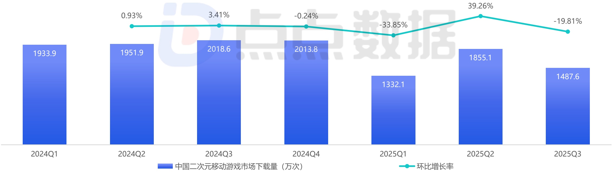
[image_caption]
该图像为柱状图，展示了中国二次元移动游戏市场下载量（单位：万次）及其环比增长率。图表包含以下数据：

- **2024Q1**：下载量为1933.9万次，环比增长率为0.93%。
- **2024Q2**：下载量为1951.9万次，环比增长率为3.41%。
- **2024Q3**：下载量为2018.6万次，环比增长率为-0.24%。
- **2024Q4**：下载量为2013.8万次，环比增长率为-33.85%。
- **2025Q1**：下载量为1332.1万次，环比增长率为39.26%。
- **2025Q2**：下载量为1855.1万次，环比增长率为-19.81%。
- **2025Q3**：下载量为1487.6万次。

图表中蓝色柱状图表示各季度的下载量，绿色折线图表示环比增长率。整体趋势显示下载量在2024年Q3达到峰值后有所下降，2025年Q1出现显著增长，随后在2025年Q2和Q3有所回落。
[/image_caption]

注释：1、中国移动游戏下载量统计范围：仅包含在中国大陆地区上线的移动端游戏，不包含PC端、游戏主机端或其他硬件平台上的游戏（例如一款游戏同时发布了移动端版本、PC客户端版本和游戏主机端版本，本报告也仅统计移动端版本的相关数据）；2、下载量是指首次下载某个移动游戏的设备数量，应用更新和同一设备上的重复下载不计入其中；3、本报告中后续涉及的“下载量”相关的统计数据，都以此标准进行统计；4、部分数据可能会在点点数据2025年相关报告中做出调整。

来源：中国移动游戏市场收入规模是综合了点点数据、企业财报、专家访谈，根据点点数据统计模型核算所得。

## 中国二次元移动游戏收入排名变化

## 前4强玩法各异形成第一竞争梯队 但TOP1产品已跌至游戏总榜第9

二次元移动游戏在2021~2023期间经历了市场高光阶段，彼时以《原神》为代表的头部产品经常能摘得游戏总畅销榜（乃至全部APP畅销榜）的桂冠。但近两年来，虽然仍有新品崭露头角，但商业化策略几乎仍遵循着定式，只有质量顶尖的产品才有存活机会。而老产品上也日显颓势，2025Q3排名TOP1的《火影忍者》在全部游戏畅销榜仅位列第9。值得注意的是，2025年稳居收入榜TOP4产品在玩法上截然不同，涵盖了格斗、卡牌、动作、回合制，这也印证了报告上文提出的二游市场竞争正在转向至玩法突破层面。

2024Q3-2025Q3中国二次元移动游戏收入排名变化（仅App Store）

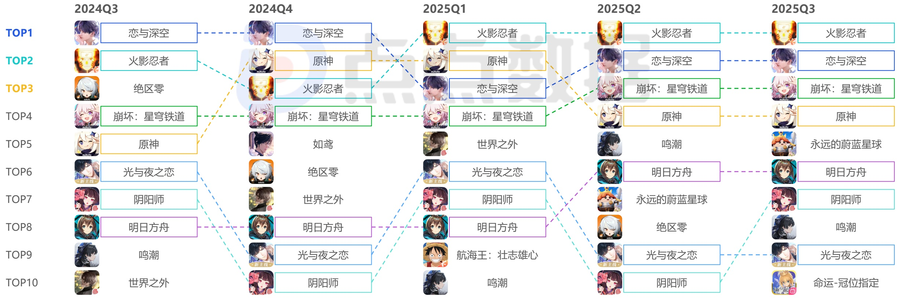
[image_caption]
该图像展示了一个游戏排名变化的流程图，具体描述如下：

### 图表类型
- **流程图**

### 主要信息
图表展示了从2024年第三季度（2024Q3）到2025年第三季度（2025Q3）期间，十款游戏在各季度的排名变化情况。每个季度的排名分为TOP1到TOP10，每款游戏用一个图标和名称表示。

### 排名变化
- **2024Q3**
  - TOP1: 恋与深空
  - TOP2: 火影忍者
  - TOP3: 绝区零
  - TOP4: 崩坏：星穹铁道
  - TOP5: 原神
  - TOP6: 光与夜之恋
  - TOP7: 阴阳师
  - TOP8: 明日方舟
  - TOP9: 鸣潮
  - TOP10: 世界之外

- **2024Q4**
  - TOP1: 恋与深空
  - TOP2: 原神
  - TOP3: 火影忍者
  - TOP4: 崩坏：星穹铁道
  - TOP5: 如鸢
  - TOP6: 绝区零
  - TOP7: 世界之外
  - TOP8: 明日方舟
  - TOP9: 光与夜之恋
  - TOP10: 阴阳师

- **2025Q1**
  - TOP1: 火影忍者
  - TOP2: 原神
  - TOP3: 恋与深空
  - TOP4: 崩坏：星穹铁道
  - TOP5: 世界之外
  - TOP6: 光与夜之恋
  - TOP7: 阴阳师
  - TOP8: 明日方舟
  - TOP9: 航海王：壮志雄心
  - TOP10: 鸣潮

- **2025Q2**
  - TOP1: 火影忍者
  - TOP2: 恋与深空
  - TOP3: 崩坏：星穹铁道
  - TOP4: 原神
  - TOP5: 鸣潮
  - TOP6: 明日方舟
  - TOP7: 永远的蔚蓝星球
  - TOP8: 绝区零
  - TOP9: 光与夜之恋
  - TOP10: 阴阳师

- **2025Q3**
  - TOP1: 火影忍者
  - TOP2: 恋与深空
  - TOP3: 崩坏：星穹铁道
  - TOP4: 原神
  - TOP5: 永远的蔚蓝星球
  - TOP6: 明日方舟
  - TOP7: 阴阳师
  - TOP8: 鸣潮
  - TOP9: 光与夜之恋
  - TOP10: 命运-冠位指定

### 数据趋势
- **恋与深空**：从2024Q3到2025Q3一直保持在TOP1或TOP2的位置。
- **火影忍者**：从2024Q4开始进入TOP1，并在2025Q2和2025Q3继续保持TOP1。
- **原神**：在多个季度中保持在TOP2或TOP3的位置。
- **崩坏：星穹铁道**：在多个季度中保持在TOP3或TOP4的位置。
- **绝区零**：在2024Q4和2025Q2中进入TOP3和TOP8。
- **明日方舟**：在多个季度中保持在TOP6或TOP8的位置。
- **阴阳师**：在多个季度中保持在TOP6或TOP10的位置。
- **鸣潮**：在2025Q2和2025Q3中进入TOP5和TOP8。
- **光与夜之恋**：在多个季度中保持在TOP6或TOP10的位置。
- **世界之外**：在2024Q4和2025Q1中进入TOP5和TOP5。

### 总结
该流程图清晰地展示了各季度游戏排名的变化趋势，其中“恋与深空”和“火影忍者”表现尤为突出，长期占据前列位置。其他游戏如“原神”、“崩坏：星穹铁道”等也表现出稳定的排名。
[/image_caption]

来源：点点数据自主研究及绘制

## 点点数据-二次元移动游戏体验评测体系

5大维度体系、18项细分指标构筑点点数据游戏体验测评模型

## 二次元移动游戏综合评分

## 画面与音效表现

## 美术风格与设计

## 技术画面呈现

## 动画与演出

## 动画与演出

是否有独特且令人印象深刻的美术风格U1、角色、场景的风格是否统一；

- 角色设计是否精美、富有魅力;场景构建是否细腻、符合世界观;角色动作是否流畅;

技能释放的动画是否华丽、有冲击力，且反馈清晰等维度

## 核心战斗与玩法

## 操作手感与响应

## 战斗系统深度

## 关卡与敌人设计

## 动画与演出

## 游戏内容与系统

## 剧情与世界观

## 养成系统

## 玩法模式多样性

## 系统功能与uiux

## 商业化运营与社区

## 商业化与世界观

## 运营活动

## 技术运营与服务

## 社区生态

## 硬件兼容性

## 性能优化

- 在各种主流机型上能否流畅运行；

- 安装包体积是否过大手机的耗电和发热是否合理等维度

- 技能按键布局是否合理，释放是否便捷智能；

- 受击时的屏幕震动、音效、特效等反馈是否清晰；

- 不同角色或职业的技能、定位是否有明显特色；

- 属性克制:技能搭配、阵容组合等策略空间是否充分等维度

- 技能按键布局是否合理，释放是否便捷智能；

- 受击时的屏幕震动、音效、特效等反馈是否清晰；

- 不同角色或职业的技能、定位是否有明显特色；

- 属性克制:技能搭配、阵容组合等策略空间是否充分等维度

## 点点数据-二次元移动游戏体验评测方法与原则

## 数据、用户、专家三位一体 构建科学系统评测体系

针对二次元移动游戏的体验评测，点点数据构建了一套科学且系统的评估体系：以产品的大数据表现作为基础，结合海量用户评价进行综合分析，并将用户体验专家的深度评估作为核心判断标准。在评价过程中，我们始终坚持以用户为中心，并将产品创新与游戏体验视为评估基石。同时，严格遵循全面性、价值导向、客观可量化及情感化体验等核心原则，从而确保整个评价体系兼具系统性与科学性。

[image_caption]
该图像展示了一个结构化的信息图表，分为三个主要部分，每个部分都有一个标题和相应的描述：

1. **大数据表现**：
   - 标题背景为紫色。
   - 描述内容：结合点点数据平台中有关二次元移动游戏的收入、下载、活跃、留存、使用分布、用户特征等关键数据表现，结合产品本身的发展阶段进行客观评测。
   - 右侧有一个上升趋势的图标，表示数据的增长。

2. **用户评价**：
   - 标题背景为绿色。
   - 描述内容：综合App Store、Google Play、TapTap、好游快爆等第三方游戏平台上的用户评分、用户评论、以及各类社区论坛社交媒体上的用户发声进行综合考量。
   - 右侧同样有一个上升趋势的图标，表示用户评价的积极反馈。

3. **专家评估**：
   - 标题背景为蓝色。
   - 描述内容：组织点点数据游戏专家团队对二次元移动游戏进行画面、玩法、系统、活动、界面、创新等多方面进行综合评价。
   - 右侧也有一个上升趋势的图标，表示专家评估的正面意见。

整体来看，该图表通过三个不同的维度（大数据表现、用户评价、专家评估）来全面评估二次元移动游戏的表现和质量。每个部分都强调了积极的趋势和综合考量的重要性。
[/image_caption]

[image_caption]
该图片展示了一个流程图，描述了游戏评价的六个原则。流程图呈圆形排列，每个原则由一个彩色的扇形区域表示，并用数字1到6进行标注。以下是每个原则的详细描述：

1. **用户沉浸**（紫色扇形）：
   - 游戏是否成功让我“代入”其中，关心这个世界的命运和角色的故事。

2. **情感联结与社区**（青色扇形）：
   - 游戏是否让玩家感到自己是某个有趣社群的一份子。

3. **技术表现与适配**（蓝色扇形）：
   - 美术表现与技术优化是否能满足不同设备玩家的沉浸体验。

4. **诚信运营与长期主义**（绿色扇形）：
   - 游戏的运营是否诚信，是否有长期发展的规划。

5. **公平感知与价值**（浅蓝色扇形）：
   - 游戏是否让玩家感受到公平，提供的价值是否合理。

6. **核心驱动**（绿色扇形）：
   - 支撑玩家日复一日登录游戏的实质性目标和动力。

流程图的中心位置标有“评价原则”，表明这六个原则共同构成了对游戏的全面评价标准。每个原则之间通过箭头连接，形成一个闭环，强调这些原则之间的相互关联和循环影响。
[/image_caption]

## 公平感知与价值

玩家进行付费时，是否感到被尊重而非被算计，是否觉得“物有所值”

## 诚信运营与长期主义

研发厂商与运营团队是否有能力和诚意将这款游戏长久健康地运营下去

## 二次元移动游戏市场 概况&体验指标分析

## 典型二次元移动游戏体验测评

典型二次元移动游戏体验测评：点点数据构建了5大维度体系、18项细分指标的体验测评模型，对10款热门二次元移动游戏展开综合分析：没有产品能做到全维度“通杀，画面与玩法仍是核心考评点。

## 二次元移动游戏市场发展趋势

## 典型二次元移动游戏综合评分对比

## 没有产品能做到全维度“通杀”画面与玩法仍是核心考评点

(注：典型产品由点点数据专家团队基于市场热度与玩家关注度选取，下方排名不代表市场整体的TOP10)

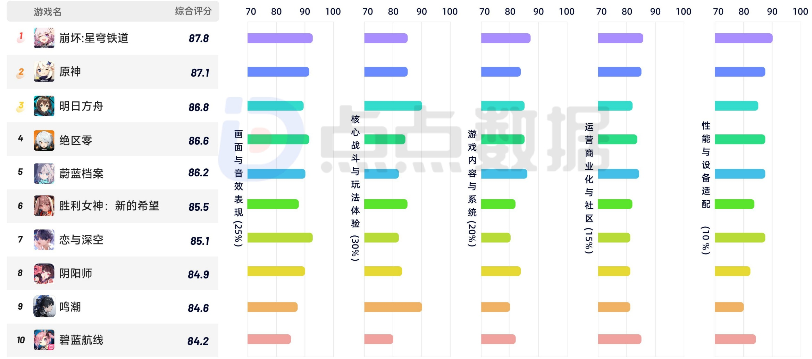
[image_caption]
这是一张柱状图，展示了十款游戏的综合评分及其在不同评价维度上的得分情况。图表的主要信息如下：

1. **游戏排名与名称**：
   - 1. 崩坏:星穹铁道
   - 2. 原神
   - 3. 明日方舟
   - 4. 绝区零
   - 5. 蔚蓝档案
   - 6. 胜利女神：新的希望
   - 7. 恋与深空
   - 8. 阴阳师
   - 9. 鸣潮
   - 10. 碧蓝航线

2. **综合评分**：
   - 崩坏:星穹铁道：87.8
   - 原神：87.1
   - 明日方舟：86.8
   - 绝区零：86.6
   - 蔚蓝档案：86.2
   - 胜利女神：新的希望：85.5
   - 恋与深空：85.1
   - 阴阳师：84.9
   - 鸣潮：84.6
   - 碧蓝航线：84.2

3. **评价维度及权重**：
   - 核心战斗与玩法体验（30%）
   - 游戏内容与系统（20%）
   - 运营商业化与社区（15%）
   - 性能与设备适配（10%）
   - 画面与音效表现（5%）

4. **各维度得分**：
   - **核心战斗与玩法体验**：
     - 崩坏:星穹铁道：接近100
     - 原神：接近90
     - 明日方舟：接近90
     - 绝区零：接近85
     - 蔚蓝档案：接近85
     - 胜利女神：新的希望：接近85
     - 恋与深空：接近80
     - 阴阳师：接近80
     - 鸣潮：接近80
     - 碧蓝航线：接近75

   - **游戏内容与系统**：
     - 崩坏:星穹铁道：接近95
     - 原神：接近90
     - 明日方舟：接近90
     - 绝区零：接近85
     - 蔚蓝档案：接近85
     - 胜利女神：新的希望：接近85
     - 恋与深空：接近80
     - 阴阳师：接近80
     - 鸣潮：接近80
     - 碧蓝航线：接近75

   - **运营商业化与社区**：
     - 崩坏:星穹铁道：接近90
     - 原神：接近85
     - 明日方舟：接近85
     - 绝区零：接近80
     - 蔚蓝档案：接近80
     - 胜利女神：新的希望：接近80
     - 恋与深空：接近75
     - 阴阳师：接近75
     - 鸣潮：接近75
     - 碧蓝航线：接近70

   - **性能与设备适配**：
     - 崩坏:星穹铁道：接近90
     - 原神：接近85
     - 明日方舟：接近85
     - 绝区零：接近80
     - 蔚蓝档案：接近80
     - 胜利女神：新的希望：接近80
     - 恋与深空：接近75
     - 阴阳师：接近75
     - 鸣潮：接近75
     - 碧蓝航线：接近70

   - **画面与音效表现**：
     - 崩坏:星穹铁道：接近95
     - 原神：接近90
     - 明日方舟：接近90
     - 绝区零：接近85
     - 蔚蓝档案：接近85
     - 胜利女神：新的希望：接近85
     - 恋与深空：接近80
     - 阴阳师：接近80
     - 鸣潮：接近80
     - 碧蓝航线：接近75

图表通过不同颜色的条形图直观地展示了每款游戏在各个评价维度上的得分情况，综合评分则反映了整体表现。
[/image_caption]

来源：点点数据自主研究及绘制

## 《崩坏：星穹铁道》基础数据

## 在传统回合制中打造出策略深度 以丰富玩法与稳定更新保持活力

产品优势解析：游戏在美术、音乐、演出上保持了米哈游一贯的高水准，尤其在角色建模、场景构建和剧情演出上，品质堪称行业标杆。玩法上虽然采用了较为传统的回合制玩法，但将“行动顺序”和“弱点破解”深度融入了核心战斗机制，使其具有相当的策略深度。同时，游戏成功引入了Roguelite等高耐玩性玩法，极大地丰富了游戏体验。从2023年4月上线至今，《崩坏：星穹铁道》始终保持了稳定的版本更新节奏。并且无论是在剧情还是新玩法上，都保持的较高的水准。从下方的数据可以看出，其2025年的两大重点版本（4月3.2版本-走过安眠地的花丛、7月3.4版本-因为太阳将要毁伤）仍取得了十分优异的流水表现。

2025年《崩坏：星穹铁道》国服收入规模与活跃用户数据表现

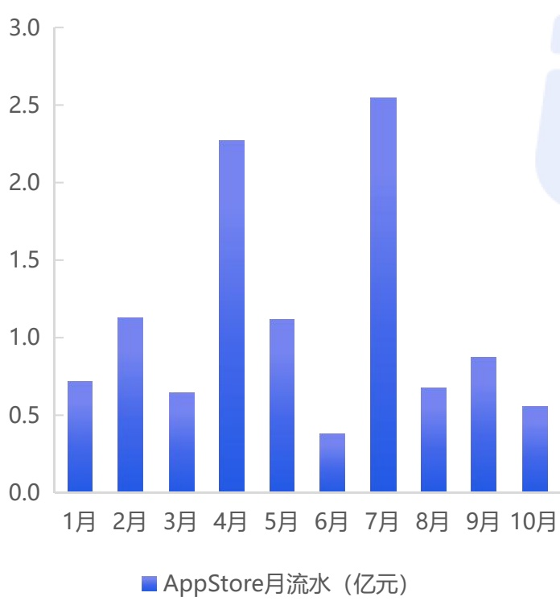
[image_caption]
该图像为柱状图，展示了AppStore每月流水（单位：亿元）的变化情况。图表的横轴表示月份，从1月到10月；纵轴表示AppStore月流水，单位为亿元，范围从0.0到3.0。

具体数据如下：
- 1月：约0.7亿元
- 2月：约1.1亿元
- 3月：约0.6亿元
- 4月：约2.2亿元
- 5月：约1.1亿元
- 6月：约0.4亿元
- 7月：约2.5亿元
- 8月：约0.7亿元
- 9月：约0.9亿元
- 10月：约0.6亿元

从图表中可以看出，AppStore月流水在4月和7月达到峰值，分别为约2.2亿元和2.5亿元，而在6月则降至最低点，约为0.4亿元。整体趋势显示波动较大，没有明显的线性增长或下降趋势。
[/image_caption]

## 2025Q1-Q3用户留存

平均次留： 约48.9%

平均月留： 约 \(17.6\%\)

男生占比： 约67.9%

## 用户兴趣偏好

\(\Lsh\) 动漫

网络

科技资讯

模拟辅助

系统工具

综艺

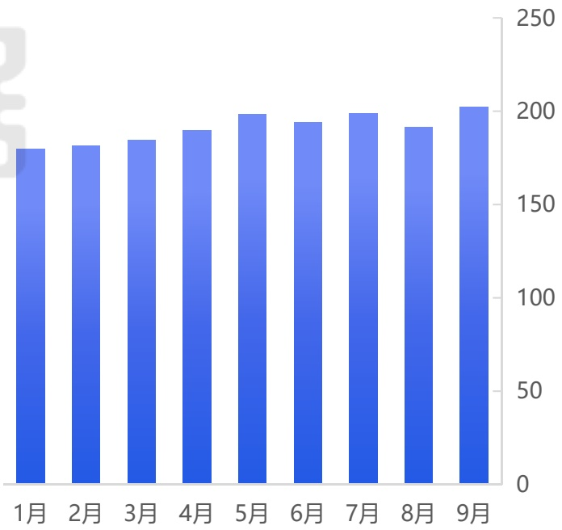
[image_caption]
这是一张柱状图，显示了从1月到9月的数据变化。每个柱子代表一个月的数据，颜色为蓝色渐变。纵轴表示数值，范围从0到250。具体数值如下：

- 1月：约180
- 2月：约190
- 3月：约200
- 4月：约210
- 5月：约220
- 6月：约210
- 7月：约220
- 8月：约210
- 9月：约230

从图中可以看出，数据在5月和7月达到峰值，分别为220，而在6月、8月略有下降，9月再次上升至230。整体趋势显示数据在逐渐增加。
[/image_caption]

iOS月活跃用户数（万人）

来源：点点数据自主研究及绘制

## 《崩坏：星穹铁道》- 点点数据测评分析

## 顶尖的视听表现堪称行业标杆 高质量版本更新带来稳健营收

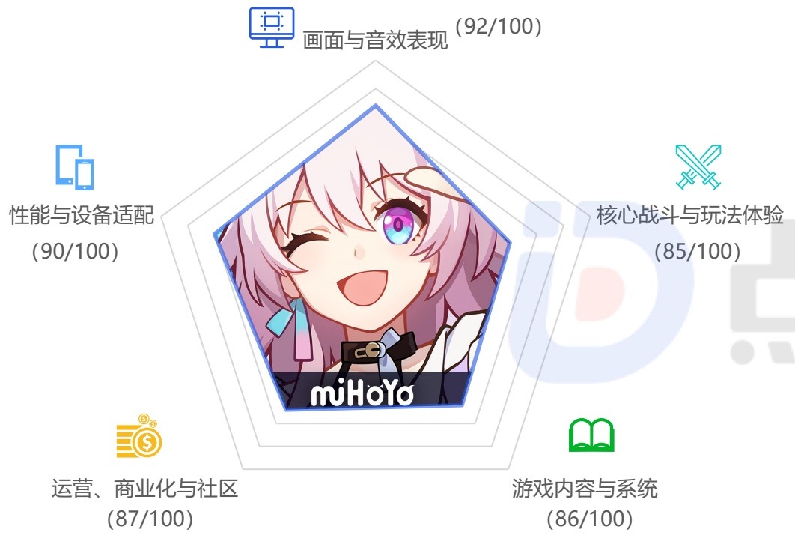
[image_caption]
该图像展示了一个五边形评分图，中心是一个动漫风格的角色插画，角色有粉色的头发和一只紫色的眼睛，穿着带有“miHoYo”标志的服装。五边形的五个顶点分别代表不同的评价维度，并附有相应的评分：

1. **画面与音效表现**：92/100
2. **性能与设备适配**：90/100
3. **核心战斗与玩法体验**：85/100
4. **游戏内容与系统**：86/100
5. **运营、商业化与社区**：87/100

每个维度旁边都有一个图标，分别对应不同的评价内容。整体设计简洁明了，直观地展示了各个方面的评分情况。
[/image_caption]

综合评分： 87.8

顶尖的视听表现堪称行业标杆，成熟的回合制玩法与创新元素具有一定的策略深度。同时，游戏成功引入了Roguelite等创新玩法，极大地丰富了游戏体验。稳定的版本更新节奏和高质量的更新内容带来了稳健的商业表现和玩家活跃度。

## 画面与音效表现 (25%)

游戏角色建模精美，场景构建丰富多样，从贝洛伯格到仙舟「罗浮」，都展现了独特的美学风格。在剧情演出中运用了章节式动画剧情、实时渲染过场以及生动的表情气泡等，增强了玩家的沉浸感和代入感。

## 核心战斗与玩法体验（30%）

作为一款回合制卡牌RPG，其操作核心在于策略部署与技能释放时机的选择。在传统回合制基础上，引入了行动序列和共享战技点设计，属性弱点破解机制以及角色技能间的配合，提供了丰富的策略空间。

## 游戏内容与系统 (20%)

继承了“崩坏”IP的世界观，并将视野延展至宇宙，格局宏大。角色养成线清晰，通过装备随机属性形成了差异化培养策略。游戏UI界面简洁直观。日常任务（委托）耗时相对较短，便利性优化良好，例如合成材料无需前往特定合成台。

[image_caption]
该图像为一个图标，显示了两个黄色的美元符号（$）和三条水平的黄色线条。这种图标通常用于表示金钱、财务或与经济相关的内容。
[/image_caption]

## 运营、商业化与社区 (15%)

游戏采用抽卡付费模式，其抽卡概率（0.6%基础概率，160抽大保底）及角色武器分离机制，在抽卡手游中属于定价较高的一档。不过，游戏通过活动和版本更新提供了较多的免费抽卡资源（星琼），月卡玩家能通过积累获得不少抽卡机会。

## 性能与设备适配（10%）

游戏支持iOS、Android、PC、主机多平台，且数据互通。在主流设备上帧率稳定，画面显示效果与设备耗电量发热量之间的平衡控制良好。

## 《原神》基础数据

## 顶尖视听、玩法设计、极致技术力等多个方面都对当代二游发展影响颇深

《原神》虽然已上线5年有余，但其画面表现与音乐设计至今仍是行业顶尖水准，并且不同国度的美术风格既融合了超现实主义风格，又叠加了丰富的奇幻元素，构建出辨识度极高的视觉系统。在开放世界的大框架下，地图探索设计的精巧不失乐趣，配合围绕元素反应体系建立的角色技能策略，再加之成熟的战斗动作表现，形成了深度与广度兼备的游戏体验。游戏另一大特点，是实现了手机、PC与主机端的账号互通与数据同步，虽然这并非《原神》首创，但其背后是游戏在不同性能硬件上均能保持高水平画面表现的优化能力，这是游戏厂商技术力的重要体现，并且可以说是《原神》引领了移动游戏跨端的潮流风向。

2025年《原神》国服收入规模与活跃用户数据表现

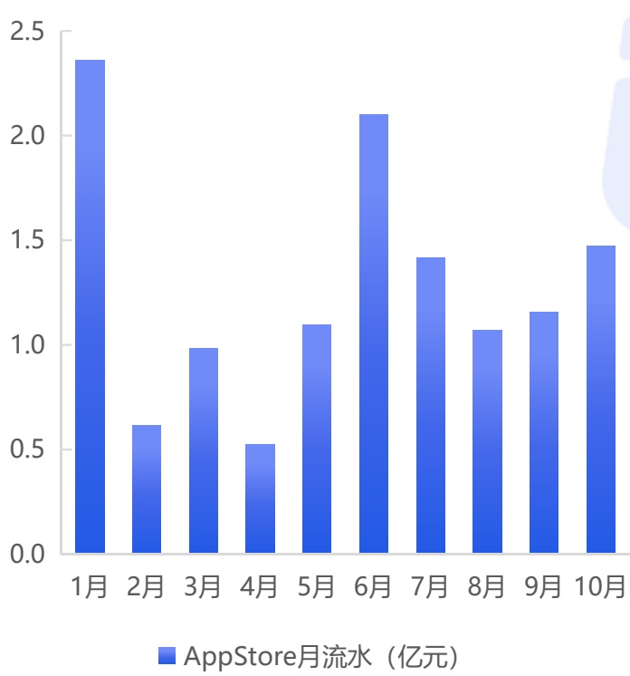
[image_caption]
这是一张柱状图，展示了AppStore每月流水（以亿元为单位）的变化情况。图表的横轴表示月份，从1月到10月，纵轴表示AppStore的月流水，单位为亿元，范围从0.0到2.5。

具体数据如下：
- 1月：约2.3亿元
- 2月：约0.6亿元
- 3月：约1.0亿元
- 4月：约0.5亿元
- 5月：约1.1亿元
- 6月：约2.1亿元
- 7月：约1.4亿元
- 8月：约1.1亿元
- 9月：约1.2亿元
- 10月：约1.5亿元

从图表中可以看出，AppStore的月流水在不同月份之间有较大的波动。1月和6月的流水较高，分别为约2.3亿元和2.1亿元；而2月和4月的流水较低，分别为约0.6亿元和0.5亿元。整体来看，下半年的流水相对稳定，且有小幅上升的趋势。
[/image_caption]

## 2025Q1-Q3用户留存

平均次留： 约56.5%

平均月留： 约21.4%

男生占比： 约68.5%

## 用户兴趣偏好

\(\Lsh\) 动漫

基础教育

电影

高等教育

网络小说

电视剧

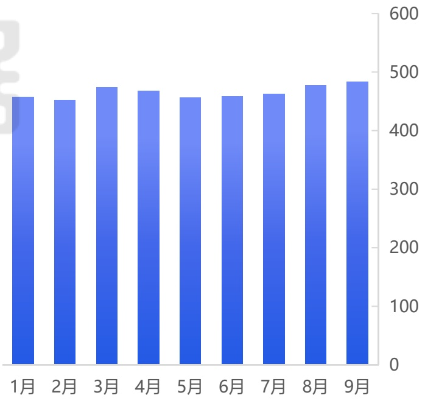
[image_caption]
这是一张柱状图，展示了从1月到9月的数据变化情况。每个柱子代表一个月的数据，颜色为蓝色渐变。纵轴表示数值，范围从0到600。具体数值如下：

- 1月：约500
- 2月：约480
- 3月：约520
- 4月：约510
- 5月：约490
- 6月：约500
- 7月：约500
- 8月：约510
- 9月：约520

从图中可以看出，数据在各个月份之间有轻微波动，但总体趋势较为平稳，没有明显的上升或下降趋势。
[/image_caption]

iOS月活跃用户数（万人）

来源：点点数据自主研究及绘制

## 《原神》- 点点数据测评分析

## 毋庸置疑的行业先驱者与领头羊 但在长期内容迭代上已初显疲态

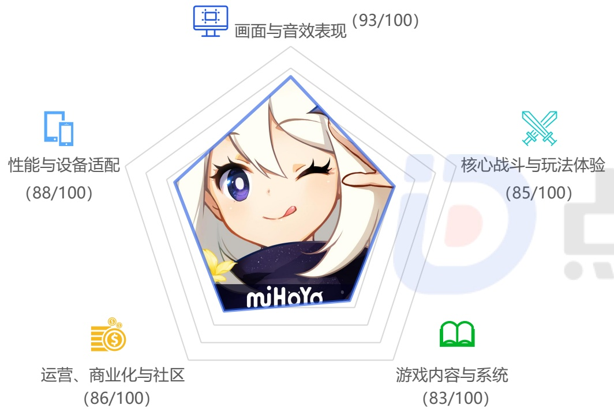
[image_caption]
该图像展示了一个五边形评分图，中心是一个动漫风格的角色头像，周围环绕着五个不同类别的评分指标及其对应的分数：

1. **画面与音效表现**：评分为93/100，图标为一个显示器。
2. **性能与设备适配**：评分为88/100，图标为两个手机。
3. **核心战斗与玩法体验**：评分为85/100，图标为两把交叉的剑。
4. **游戏内容与系统**：评分为83/100，图标为一本打开的书。
5. **运营、商业化与社区**：评分为86/100，图标为一个带有美元符号的货币符号。

每个评分指标旁边都有相应的图标和文字说明，整体设计简洁明了，直观地展示了各个方面的评分情况。
[/image_caption]

综合评分： 87.1

开放世界移动游戏与二次元移动游戏的双重标杆，行业顶尖的画面表现与音乐设计，构建出辨识度极高的视觉系统。元素反应体系与角色技能组合经过多年打磨形成了深度与广度兼备的战斗框架，核心玩法成熟且稳定。

## 画面与音效表现 (25%)

从蒙德的田园诗意到璃月的山水磅礴，再到纳塔的炽热生机，每个区域都展现出独特的美学语言，统一而多变。音乐音效设计同样精致，不同元素的互动、角色技能的释放都有独特且贴合的声音反馈。角色设计上，服装细节与文化符号的融合不仅极富幻想色彩，同时又展现出深度的中华文化底蕴。

## 核心战斗与玩法体验（30%）

元素反应机制作为游戏战斗核心，提供了丰富的策略选择。但基于环境导致角色强度膨胀、以及过于复杂的boss机制无法被玩家有效理解，也造成了一定的体验损失。游戏最大的挑战在于内容消耗过快。新地图、新版本的前期体验极佳，但进入“长草期”后每日游玩内容重复性高。

## 游戏内容与系统 (20%)

自上线以来，多年的剧情铺陈已形成宏大的叙事框架。但在叙事节奏上，部分任务文本量过大且不可跳过也时常被玩家诟病。角色养成线清晰明确，已成为现在二游的标杆。并且随机词条的设定，也让养成深度大大增加。游戏包含的玩法也极其丰富，从主线任务到版本活动，从深渊挑战到尘歌壶家园系统，都让玩家津津乐道。

[image_caption]
该图是一个图标，显示了三个黄色的水平条纹，每个条纹上方都有一个美元符号。最上方的条纹上还有一个额外的美元符号和一个小圆圈，象征着金钱或财富的概念。
[/image_caption]

## 运营、商业化与社区 (15%)

游戏的付费设计以抽卡为核心，角色与武器定价已成为行业标杆，现如今处于行业中等水平。不过玩家通过持续游玩也能获得可观数量的原石来辅助获取主要角色。研发团队最大优势在于能保持稳定更新节奏，且版本质量可控。玩家社群活跃度高涨，二创文化繁荣，但存在明显的玩家分化问题。

## 性能与设备适配（10%）

游戏在多平台兼容上表现优异，从高端PC到中端移动设备都能提供相应画质体验。但目前产品存在随着版本更新导致游戏安装包体积过大的问题。

## 《明日方舟》

## 基础数据

## 以玩法和立绘见长的“长板”足以长到弥补短板的不足

作为一款市场热门游戏中难得一见的塔防游戏，其玩法乐趣与策略深度相当突出。游戏不仅关卡设计优秀，还通过集成战略、危机合约等模式，极大地丰富了游戏体验。虽然战斗中采用的仍是Q版小人形象，但独特的人物设计和精美的立绘皮肤都展现出别具一格的风味。更值得一提的是其音乐部分，其线下音乐演出活动“音律联觉”更是场场爆满一票难求。但需要明确的是，作为一款上线超7年的产品，部分“历史遗留问题”也对整体游戏体验稍有影响，例如主线剧情“谜语人”、剧情表现张力不够、养成材料掉率低、挂机虽有“代理”但仍十分费时等。

2025年《明日方舟》国服收入规模与活跃用户数据表现

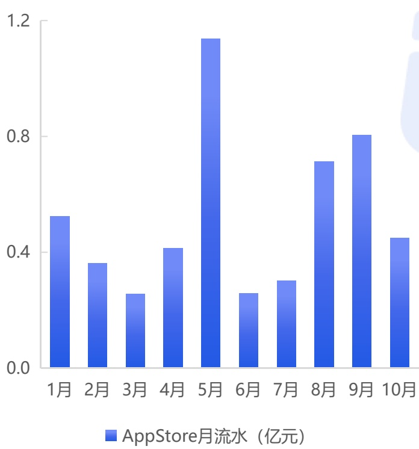
[image_caption]
这是一张柱状图，展示了AppStore每月流水（以亿元为单位）的变化情况。图表的横轴表示月份，从1月到10月，纵轴表示AppStore的月流水，范围从0.0到1.2亿元。每个柱子代表一个月的流水数据，颜色为蓝色渐变。

具体数值如下：
- 1月：约0.5亿元
- 2月：约0.4亿元
- 3月：约0.3亿元
- 4月：约0.4亿元
- 5月：约1.2亿元
- 6月：约0.3亿元
- 7月：约0.3亿元
- 8月：约0.75亿元
- 9月：约0.8亿元
- 10月：约0.45亿元

从图表中可以看出，5月的流水显著高于其他月份，达到峰值1.2亿元，而3月和6月的流水相对较低，均为约0.3亿元。整体趋势显示，5月之后流水有所下降，但在8月和9月又有所回升。
[/image_caption]

## 2025Q1-Q3用户留存

平均次留： 约 \(50.6\%\)

平均月留： 约 \(15.3\%\)

男生占比： 约79.6%

## 用户兴趣偏好

\(\Lsh\) 动漫

电影

网络小说

基础教育科目

高等教育

电视剧

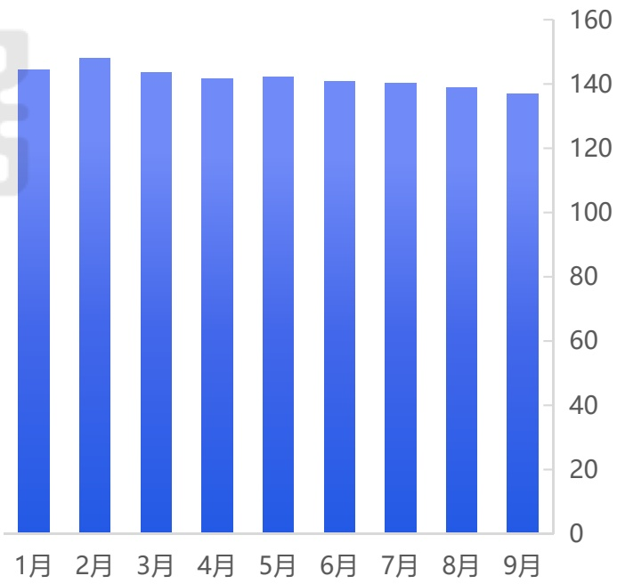
[image_caption]
这是一张柱状图，显示了从1月到9月的数据变化。每个柱子代表一个月的数据，颜色为蓝色渐变。纵轴表示数值范围，从0到160。每个月的数值大致在140到150之间，整体趋势略有下降。

具体数值如下：
- 1月：约150
- 2月：约155
- 3月：约150
- 4月：约145
- 5月：约148
- 6月：约147
- 7月：约145
- 8月：约143
- 9月：约140

图表的主要信息是显示了这九个月的数据变化趋势，整体呈现轻微下降的趋势。
[/image_caption]

iOS月活跃用户数（万人）

来源：点点数据自主研究及绘制

## 《明日方舟》- 点点数据测评分析

## 丰富的策略性与优秀关卡设计带来二次元游戏TOP级玩法体验

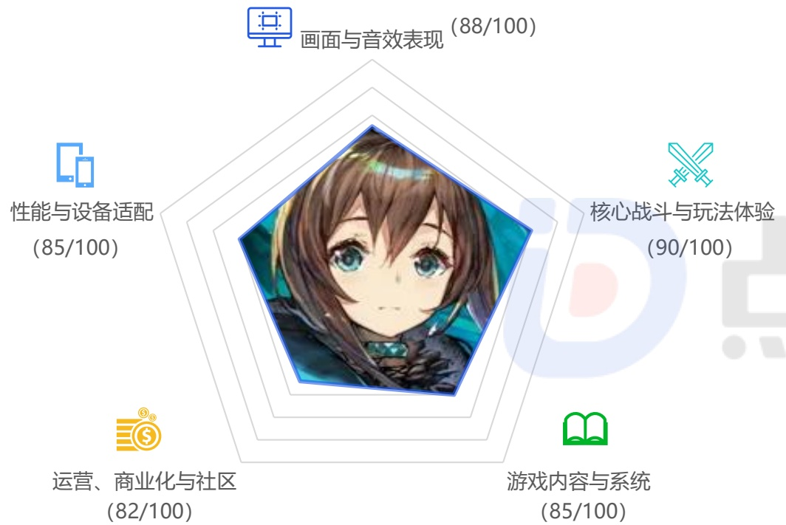
[image_caption]
这是一张展示游戏评价的雷达图（或称星形图）。图表中心是一个动漫风格的角色头像，周围有五个不同类别的评价指标，每个指标都有对应的评分。

1. **画面与音效表现**：评分为88/100，图标为一个显示器。
2. **性能与设备适配**：评分为85/100，图标为两个手机。
3. **核心战斗与玩法体验**：评分为90/100，图标为两把交叉的剑。
4. **游戏内容与系统**：评分为85/100，图标为一本书。
5. **运营、商业化与社区**：评分为82/100，图标为一个带有美元符号的货币袋。

每个指标的评分以百分比形式显示，并通过线条连接到中心角色头像，形成一个多边形区域，直观展示各个方面的评价情况。
[/image_caption]

综合评分： 86.8

作为一款塔防游戏，其玩法深度在一众二游中相当突出。不仅关卡设计优秀，还通过集成战略（肉鸽）、危机合约等模式，极大地丰富了游戏体验。但角色养成需要通过反复刷关获取，且耗时较长，虽然这种方式延长了玩家的游戏时长，但缺乏相应的乐趣。

## 画面与音效表现 (25%)

游戏具有极其精美的立绘。虽然部分玩家诟病风格不统一的问题，但游戏通过分阵营等方式，将这种差异控制在可接受范围内。游戏的音乐更是顶尖，其线下音乐演出活动“音律联觉”更是自2021年起持续举办，并场场爆满一票难求。

## 核心战斗与玩法体验（30%）

作为市场鲜有的塔防玩法，游戏在多个维度的设计（可部署位置、朝向、射程、攻击方式等）都十分成熟，再辅以极其优秀的关卡设计，策略性与挑战性并存。随活动推出的新机制和新干员，满足了乐于思考、喜欢通过策略解决困难问题的玩家。

## 游戏内容与系统 (20%)

游戏剧情以文字对话+插图的方式展现，部分玩家认为其表现力不如动态演出，但优质的剧情和文本使其在玩家间仍有一定的讨论度。角色养成结构清晰简洁，但资源消耗量庞大，综合养成成本属于较高的一档。初期玩法模式偏单调，但是在集成战略（肉鸽玩法）上线后，大大提升了游戏的可玩性，大幅改善了二游“长草期”的枯燥。

[image_caption]
该图是一个图标，显示了两个黄色的美元符号（$）和三条水平的黄色线条。美元符号位于线条的上方，整体设计简洁明了，常用于表示与金钱、财务或经济相关的概念。
[/image_caption]

## 运营、商业化与社区 (15%)

玩家普遍认为游戏的抽卡爆率较高且“歪率”相对较低，这实际反应在玩家的“氪度”上，活跃玩家基本保持大小月卡就能非常接近满干员的程度。并且官方运营较为“大方”，甚至称得上国内二游的补偿标杆，这点也受到玩家一致好评。玩家社群活跃，二次文化繁荣，但游戏内社交系统较为薄弱。

## 性能与设备适配（10%）

作为一款2D为主的移动游戏，其硬件要求较低，且安装包体积控制得当，在主流设备上运行帧率稳定。

## 《绝区零》基础数据

## 在复古潮酷画风与高速ACT赛道上确立了自身旗帜

《绝区零》在视听表现上延续了米哈游的高品质，凭借独特的“潮酷漫画风”与多元文化融合，塑造了鲜明的美术与音乐风格，带来沉浸式体验。战斗系统兼具流畅手感与操作深度，通过连携技、弹刀等机制，实现易上手、难精通。运营方面，版本更新稳定，并成功实现iOS、安卓、PC与PS5多平台覆盖，展现出优秀的跨端能力。但相较于米哈游的其他产品，《绝区零》的问题也同样明显：在受众定位上面临挑战，硬核与轻度玩家对难度感受不一，部分战斗机制前期提示不足，导致体验分化。主线流程的“走格子”玩法在前期节奏偏慢，初期引发玩家不满（后续已全部重做）。此外，角色、武器及驱动盘等多维养成系统，即存在一定的审美疲劳，也给追求多角色发展的玩家带来一定的资源压力。

2025年《绝区零》国服收入规模与活跃用户数据表现

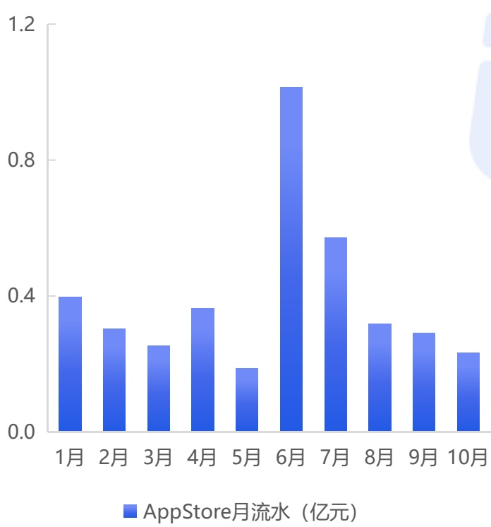
[image_caption]
这是一张柱状图，展示了AppStore每月流水（以亿元为单位）的变化情况。图表的横轴表示月份，从1月到10月，纵轴表示AppStore的月流水，范围从0.0到1.2亿元。

具体数据如下：
- 1月：约0.4亿元
- 2月：约0.35亿元
- 3月：约0.3亿元
- 4月：约0.38亿元
- 5月：约0.25亿元
- 6月：约0.9亿元
- 7月：约0.5亿元
- 8月：约0.35亿元
- 9月：约0.32亿元
- 10月：约0.3亿元

从图表中可以看出，6月的AppStore月流水显著高于其他月份，达到约0.9亿元，而5月的流水则相对较低，约为0.25亿元。其他月份的流水大致在0.3到0.4亿元之间波动。
[/image_caption]

## 2025Q1-Q3用户留存

平均次留： 约24.4%

平均月留： 约 \(3.4\%\)

男生占比： 约68.1%

## 用户兴趣偏好

聊天社交

影音娱乐 效率

小公

购物

生活实用

阅读

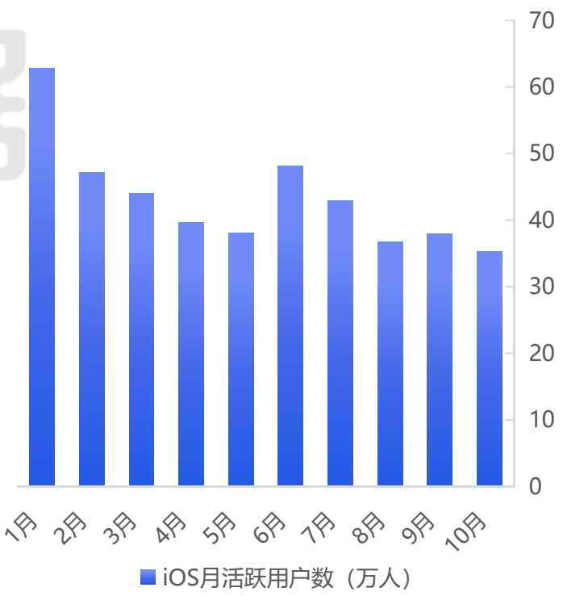
[image_caption]
这是一张柱状图，展示了从1月到10月的iOS月活跃用户数（单位：万人）。图表的主要信息和数据趋势如下：

- **1月**：约65万人
- **2月**：约50万人
- **3月**：约48万人
- **4月**：约45万人
- **5月**：约42万人
- **6月**：约52万人
- **7月**：约47万人
- **8月**：约41万人
- **9月**：约42万人
- **10月**：约39万人

从图表中可以看出，iOS月活跃用户数在1月达到最高点，随后在2月至5月期间有所下降，6月出现回升，之后在7月至10月期间波动并逐渐下降。整体趋势显示用户数在年初较高，中期有波动，年末趋于稳定但略低于年初水平。
[/image_caption]

来源：点点数据自主研究及绘制

## 《绝区零》- 点点数据测评分析

## 上手易精通难的战斗玩法爽快不失深度 研发厂商听劝的态度赢回了玩家的信心

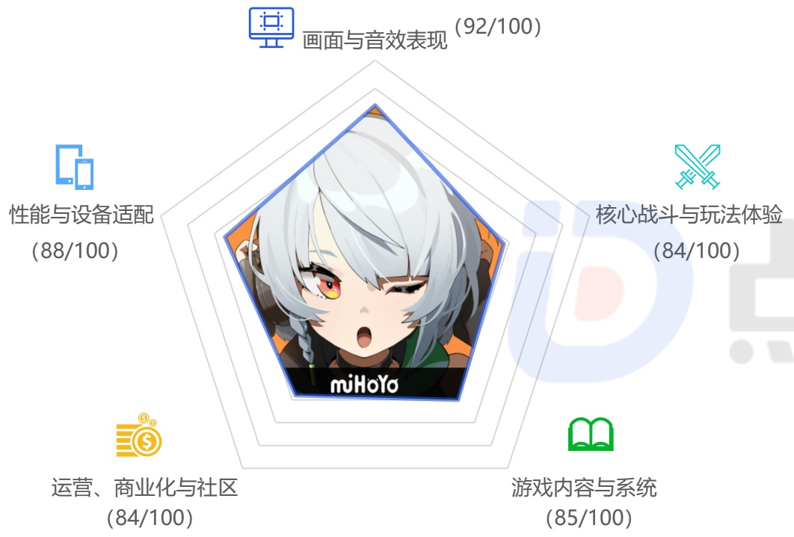
[image_caption]
这是一张展示游戏评价的雷达图（或称星形图），中心是一个动漫风格的角色头像，周围有五个不同类别的评价指标及其对应的分数：

1. **画面与音效表现**：92/100
   - 图标为电脑显示器，表示视觉和听觉效果的评分。

2. **性能与设备适配**：88/100
   - 图标为手机和平板，表示游戏在不同设备上的性能表现和适配情况。

3. **核心战斗与玩法体验**：84/100
   - 图标为交叉的剑，表示游戏的核心战斗机制和玩法体验的评分。

4. **游戏内容与系统**：85/100
   - 图标为书本，表示游戏的内容丰富度和系统设计的评分。

5. **运营、商业化与社区**：84/100
   - 图标为金币和美元符号，表示游戏的运营策略、商业化模式以及社区互动的评分。

每个类别的评分以百分制形式给出，数值越高表示该方面的表现越好。角色头像下方有“miHoYo”的字样，表明这是由米哈游公司开发的游戏。整体图表设计简洁明了，便于快速了解游戏在各个方面的表现。
[/image_caption]

综合评分： 86.6

独特的复古潮酷画风与多元文化的融合，形成了极强的视听辨识度和沉浸感。通过闪避、弹刀、连携技、失衡等机制，实现了易上手难精通的战斗体验，兼具爽快感与操作深度。厂商积极听取玩家意见，做到了从底层玩法架构层面的大幅调整，展现了项目组长线运营的决心。

## 画面与音效表现 (25%)

整体色彩运用大胆前卫，融合了复古设计与潮流元素。角色建模细腻，服饰也具有明显的物理效果。游戏的剧情演出形式多元，包括站桩对话、配音漫画和剧情动画，张力和趣味性兼备。游戏音乐品质备受认可，更值得一提的是其战斗音效的反馈，能有效提升战斗时的爽快感。

## 核心战斗与玩法体验（30%）

作为一款动作游戏，其战斗体验流畅爽快。操作上虽然只有普攻、闪避、特殊技和连携技四个主要按键，但通过长按、短按、QTE等多种方式，组成了不同角色间的特殊操作手感。利用闪避和格挡化解敌人攻击进入子弹时间所带来的战斗体验极佳，对于深度玩家也有更极致的操作上限可以去挑战突破。

## 游戏内容与系统 (20%)

游戏故事发生在被神秘的超自然灾害「空洞」所侵袭的近未来。整体诙谐幽默，角色塑造鲜明。主线、支线与活动内容丰，。在“新艾利都”的街头，玩家还可以体验各种小游戏，感受浓郁的都市生活气息。角色养成系统与米哈游其他游戏一脉相承，对于部分二次元移动游戏老玩家来说，会出现一定程度的审美疲劳。

[image_caption]
该图像为一个图标，展示了一个黄色的货币符号（美元）和两个金币图案。货币符号位于图标的中心，上方有两个较小的金币图案，整体设计简洁明了，常用于表示金钱、财富或金融相关的内容。
[/image_caption]

## 运营、商业化与社区 (15%)

游戏采用抽卡付费模式，基本沿袭米哈游其他游戏的商业化模式。但由于动作游戏的上手门槛较高，游戏口碑在玩家社区呈现出两极分化的状态，如何兼顾硬核动作玩家与轻度手游玩家仍是不小的挑战。但官方展现出真诚听取玩家意见的态度，特别是早期主线任务中饱受诟病的“走格子”玩法，在不到半年的时间就被全部更新迭代。

## 性能与设备适配（10%）

游戏支持iOS、Android、PC及PS5等多个平台，在主流设备上的帧率稳定性总体良好。  
即便的中低端机，也能依靠稍微降低画质来保障至少30帧的稳定运行。

## 以清亮的视觉风格和“老师与学生”的深厚羁绊构建了独一无二的青春乌托邦

凭借其极具辨识度赛璐璐美术风格，《蔚蓝档案》塑造出清新明亮的独特视觉语言，在二游市场中风格鲜明。游戏剧情被誉为“二游T1水准”，通过“老师”与学生之间的细腻互动，传递出充满理想主义的温情叙事，成功赢得玩家情感共鸣。在运营层面，游戏通过稳定版本更新与积极响应玩家反馈，展现出良好可持续性，其Steam版本93%的好评率亦印证了跨端表现与社区认可。战斗系统中角色可自动前进与攻击，虽有cost机制作为策略选择，但整体仍缺乏足够的操作纵深与战术变化空间。此外，游戏后期玩法内容消耗较快，重复体验渐显，亟待注入更多持续吸引玩家的新意。

2025年《蔚蓝档案》国服收入规模与活跃用户数据表现

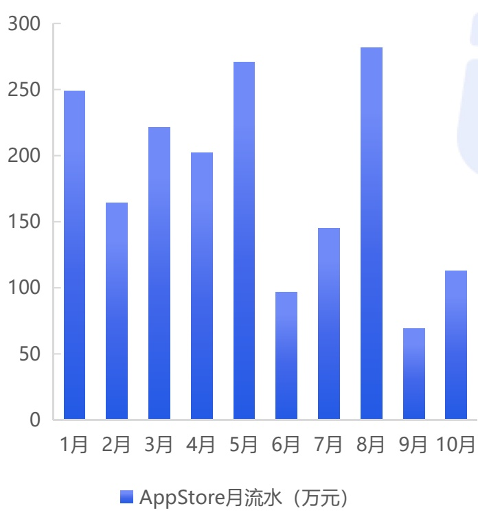
[image_caption]
这是一张柱状图，展示了AppStore在不同月份的月流水情况，单位为万元。图表的主要信息和数据趋势如下：

- **1月**：约250万元
- **2月**：约160万元
- **3月**：约220万元
- **4月**：约200万元
- **5月**：约270万元
- **6月**：约100万元
- **7月**：约140万元
- **8月**：约280万元
- **9月**：约70万元
- **10月**：约110万元

从图表中可以看出，AppStore的月流水在不同月份有显著波动。其中，8月的月流水最高，达到约280万元；而9月的月流水最低，仅为约70万元。整体来看，上半年（1月至6月）的月流水相对较高，下半年（7月至10月）则有所下降。
[/image_caption]

## 2025Q1-Q3用户留存

平均次留： 约63.2%

平均月留： 约 \(18.6\%\)

男生占比： 约69.1%

## 用户兴趣偏好

\(\Lsh\) 动漫

电影

基础教育

网络小说

高等教育

文学

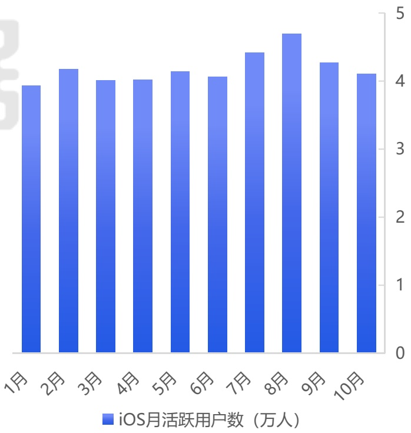
[image_caption]
这是一张柱状图，展示了从1月到10月的iOS月活跃用户数（单位：万人）。图表中的每个柱子代表一个月的用户数量，颜色为蓝色渐变。具体数值如下：

- 1月：约420万人
- 2月：约450万人
- 3月：约430万人
- 4月：约440万人
- 5月：约450万人
- 6月：约440万人
- 7月：约460万人
- 8月：约490万人
- 9月：约470万人
- 10月：约450万人

从图表中可以看出，iOS月活跃用户数在8月达到最高点，为约490万人，而在其他月份则相对稳定，波动不大。
[/image_caption]

来源：点点数据自主研究及绘制

## 《蔚蓝档案》- 点点数据测评分析

## 玩法看似轻量化和缺乏深度却被许多玩家视为完美“副游”

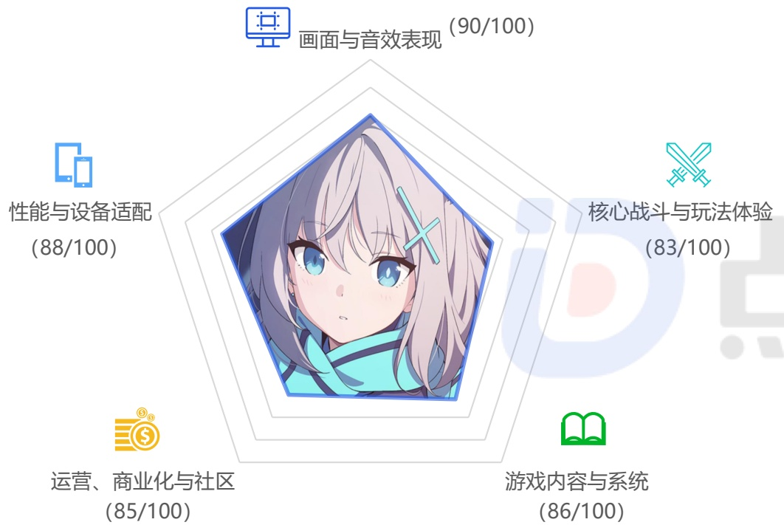
[image_caption]
这是一张展示游戏评分的图表，采用五边形评分图的形式。中心是一个动漫风格的角色插画，周围环绕着五个评分项及其对应的分数：

1. **画面与音效表现**：90/100
2. **性能与设备适配**：88/100
3. **核心战斗与玩法体验**：83/100
4. **游戏内容与系统**：86/100
5. **运营、商业化与社区**：85/100

每个评分项旁边都有相应的图标，分别代表不同的评价维度。整体设计简洁明了，便于快速了解游戏在各个方面的表现。
[/image_caption]

综合评分： 86.2

独特的赛璐璐美术风格和深入人心的剧情演绎是深深吸引玩家的核心要素。俯视角自动掩体射击和消耗cost释放技能的玩法新颖有趣，但深度略有不足，后期重复感明显上升。

## 画面与音效表现 (25%)

游戏采用赛璐璐画风，整体画面简洁干净，没有复杂的背景和过多的装饰。这种风格使玩家的视线更集中于角色的表情、神态，提高了角色在玩家心中的辨识度。游戏在剧情的CG表现方式独特，在画面中仅停留极短时间就迅速切换，通过对同一主题场景的大量不同机位、不同瞬间的捕捉，营造出漫画分镜般的演出质感和强烈的临场感。

## 核心战斗与玩法体验（30%）

游戏采用了可自动战斗的俯视角射击玩法，有趣的是角色不仅会自动前进和攻击敌人，并且在遇到掩体也会自动进行躲避。这也涉及游戏中的别出心裁的掩体设计，部分掩体在战斗开始前就存在，也有一部分掩体是随着战斗过程场景的破坏与变化而产生。同时在战斗策略上引入了cost要素，不同角色的技能cost也各不相同，需要玩家来合理调配。

## 游戏内容与系统（20%）

游戏剧情被玩家誉为“二游中的T1水平”。联邦调查局领导人和基沃托斯老师的双重身份，大幅影响了剧情选择和走向，整体剧情风格正面且具感染力，传递了“在平凡日常中创造奇迹”的理想主义色彩。日常化的互动系统（如可以看到学生们在班级群里闲聊）也极大加深了玩家和角色之间的情感链接。

[image_caption]
该图是一个图标，显示了两个黄色的美元符号（$）和三条水平的黄色线条。美元符号位于线条的上方，整体设计简洁明了，常用于表示与金钱、财务或经济相关的概念。
[/image_caption]

## 运营、商业化与社区 (15%)

游戏采用抽卡付费模式，角色的培养需要通过抽卡获取，所有的角色都可以升到满星，升星过程会消耗碎片。装备武器的升级点则主要依靠积累素材。但在福利方面较为大方，备受玩家认可。作为海外进口游戏，官方在本地化方面也展现了诚意，国服配套了全中文配音的主线剧情。

## 性能与设备适配（10%）

游戏对设备性能要求较低，多数移动设备可以畅玩。同时PC方面，游戏已正式上架Steam平台，且在Steam上的好评率超 \(90 + \%\) ，为“特别好评”。

## 《胜利女神：新的希望》基础数据

## 金亨泰独特美学+背身射击视角在二游赛道形成了独树一帜的鲜明风格

本作由《剑灵》前美术总监金亨泰领导的Shift Up操刀，沿袭了其独特的角色设计流派（紧身服饰、夸张曲线、光线质感等），打造出视觉冲击力极强的画面表现。而创新的第三人称背身站桩射击玩法，不仅战斗体验本身有足量的保障，同时也完美服务了“突出角色”这一目标。此外，其出彩的末世剧情（如开场玩家亲手处决伙伴“玛丽安”的震撼桥段）与细腻的角色塑造深受玩家好评。不过国服部分角色立绘和剧情文本的调整，对追求原汁原味体验的玩家造成了一定影响。并且培养多角色的养成压力较大，虽然游戏内提供了“同步器”系统已大幅缓解了角色横向养成压力，但只有满破SSR角色才能达到等级上限，这在中前期对玩家来说是个不小的挑战。

2025年《胜利女神：新的希望》国服收入规模与活跃用户数据表现

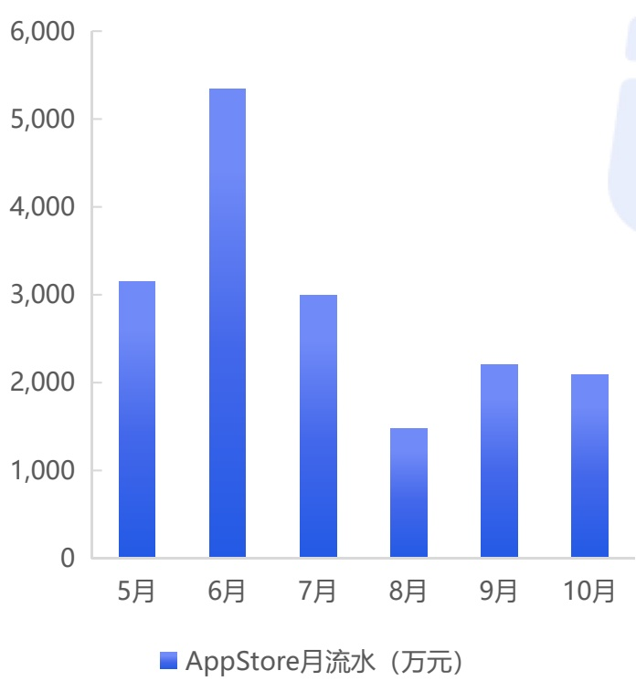
[image_caption]
这是一张柱状图，展示了AppStore在不同月份的月流水情况（单位：万元）。图表的主要信息和数据趋势如下：

- **5月**：AppStore月流水约为3000万元。
- **6月**：AppStore月流水达到最高值，约为5200万元。
- **7月**：AppStore月流水下降至约3000万元。
- **8月**：AppStore月流水显著下降，降至约1400万元。
- **9月**：AppStore月流水回升至约2200万元。
- **10月**：AppStore月流水保持在约2100万元。

从图表中可以看出，AppStore的月流水在6月达到峰值后有所波动，但在8月出现明显下降，随后在9月和10月趋于稳定。
[/image_caption]

## 2025Q1-Q3用户留存

平均次留： 约23.3%

平均月留： 约 \(3.6\%\)

男生占比： 约81.7%

## ASO关键词覆盖

二次元

射击

nikke

二次元

游戏

胜利女神

抽卡

射击游戏

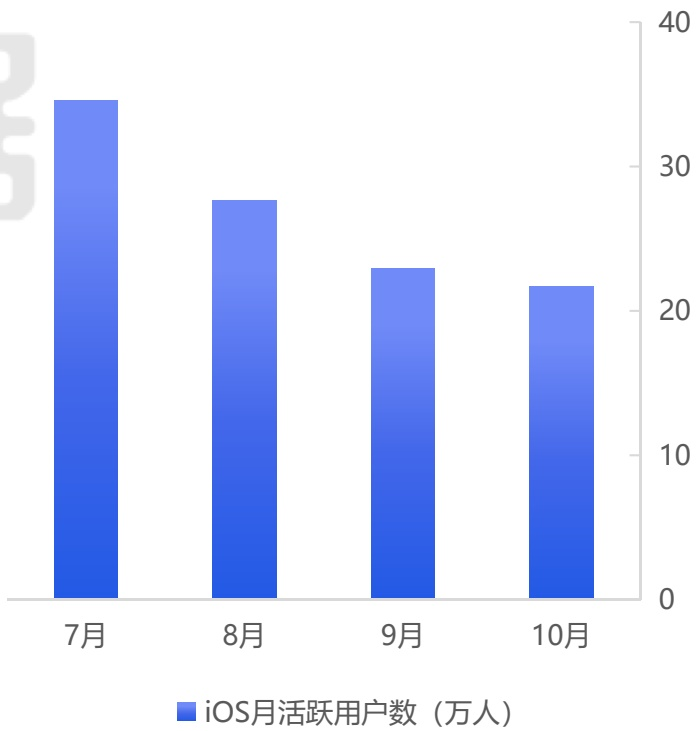
[image_caption]
这是一张柱状图，展示了iOS月活跃用户数（万人）在7月至10月的变化情况。

- **图表类型**：柱状图
- **X轴**：表示月份，从左到右依次为7月、8月、9月和10月。
- **Y轴**：表示iOS月活跃用户数（万人），刻度从0到40，每隔10万人有一个刻度标记。
- **数据趋势**：
  - 7月的月活跃用户数约为35万人。
  - 8月的月活跃用户数约为30万人。
  - 9月的月活跃用户数约为25万人。
  - 10月的月活跃用户数约为23万人。
- **总体趋势**：从7月到10月，iOS月活跃用户数呈现逐渐下降的趋势。

图例显示蓝色柱状条代表iOS月活跃用户数（万人）。
[/image_caption]

来源：点点数据自主研究及绘制

## 《胜利女神：新的希望》-点点数据测评分析

## 从背身射击、爆裂技能、横竖屏切换等多方面都能看出研发团队目标清晰明确

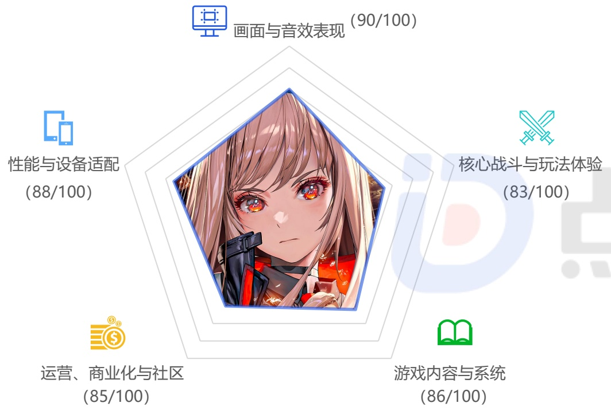
[image_caption]
该图像展示了一个五边形评分图，中心是一个动漫风格的角色插画，周围环绕着五个不同类别的评分指标及其对应的分数：

1. **画面与音效表现**：评分为90/100，图标为一个显示器。
2. **性能与设备适配**：评分为88/100，图标为两个手机。
3. **核心战斗与玩法体验**：评分为83/100，图标为两把交叉的剑。
4. **游戏内容与系统**：评分为86/100，图标为一本打开的书。
5. **运营、商业化与社区**：评分为85/100，图标为一个带有美元符号的货币符号。

每个类别旁边都有相应的图标和评分，整体布局清晰，便于快速了解各个方面的评价。
[/image_caption]

综合评分： 85.5

游戏凭借金亨泰的独特审美，打造了视觉冲击力极强的画面表现。而创新的第三人称背身站桩射击玩法，不仅体验本身有保障，同时也完美服务了“突出角色”这一目标。

## 画面与音效表现 (25%)

游戏由《剑灵》前美术总监金亨泰领导的Shift Up操刀，沿袭了其独特的角色设计流派（紧身服饰、夸张曲线、光线质感等），具有极高的辨识度。游戏角色动态立绘的细腻程度在手游中属第一梯队，特别是SSR角色释放爆裂技能时的特写镜头，能产生强烈的视觉冲击。游戏在剧情演出中运用了章节式动画剧情，沉浸感和代入感都属上乘。

## 核心战斗与玩法体验（30%）

游戏创新采用了第三人称背身站桩射击玩法，在完美展现角色形象的同时，也有一定的操作感。“爆裂技能”循环是战斗系统的核心。玩家需要合理搭配爆裂I、II、III不同阶段角色的技能，以触发全队爆裂状态。自动战斗与手动技能的结合，使得玩家在大部分时间可以解放双手，同时在关键时刻（如开启爆裂技能）又能保持操作参与感。

## 游戏内容与系统 (20%)

游戏采用了末世风格搭配美少女救世界的主题，充满了矛盾感与情绪张力。主线开场亲手处决同伴“玛丽安”的一幕，堪称二游名场面。并且多位角色拥有深度远超一般二游的独立支线。游戏内提供了“同步器”系统大幅缓解了角色横向养成压力，但只有满破SSR角色才能达到等级上限，这在中前期对玩家来说是个不小的挑战。

[image_caption]
该图像为一个图标，显示了两个黄色的美元符号（$）和三条水平的黄色线条。这种图标通常用于表示金钱、财务或与经济相关的内容。
[/image_caption]

## 运营、商业化与社区 (15%)

游戏采用抽卡付费模式，活动池200抽保底、普池无保底的设定看似定价较高，但游戏本身福利丰厚，整体来看，对于中小R玩家来说反而更加友好。玩家社群活跃，二创文化繁荣。官方也积极与玩家互动，最知名且破圈的Doro梗也被官方收录至游戏内，形成了良好的社区交流氛围。

## 性能与设备适配（10%）

游戏不仅移动端、PC端互通，并实现了二游中少见的横\(\cdot\)竖屏切换功能，满足了战力党、厨力党不同的游戏需求，也放大了游戏在玩法和人设上的优势。

## 以革新性的3D沉浸技术重新定义了恋爱手游的感官体验

凭借全3D建模和第一人称视角，在角色刻画、表情细节和场景光影上达到了游戏行业标杆水准，为玩家提供了极强的代入感和沉浸式恋爱体验。同时作为一款乙女游戏，它突破性地加入了动作战斗系统，并与恋爱养成内容结合，创造了“并肩作战”的平等伙伴关系。游戏内还提供了诸如大头贴、喵喵牌、抓娃娃等创意小游戏，以及高自由度的捏脸系统和自定义声线，这些日常互动玩法有效增强了玩家与角色之间的情感联结。但部分剧情节奏拖沓，存在男主“站桩”对话的情况，影响了叙事流畅度。此外，游戏也被一些评论指出“故事内容较浅”，在剧情深度上有提升空间。且需要注意的是，游戏社区存在一定程度的“饭圈”现象，可能会影响新玩家想要体验游戏的欲望。

2025年《恋与深空》国服收入规模与活跃用户数据表现

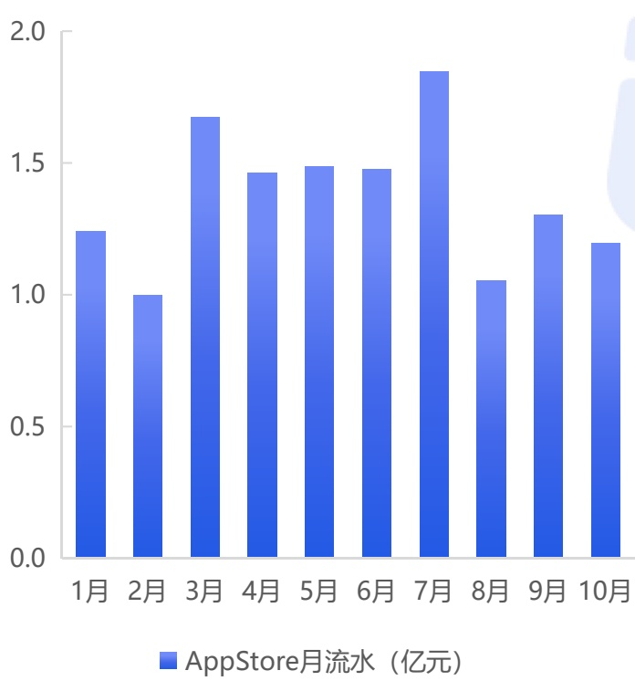
[image_caption]
这是一张柱状图，展示了AppStore每月流水（以亿元为单位）的变化情况。图表的横轴表示月份，从1月到10月，纵轴表示AppStore的月流水，单位为亿元，范围从0.0到2.0。

具体数据如下：
- 1月：约1.2亿元
- 2月：约1.0亿元
- 3月：约1.7亿元
- 4月：约1.5亿元
- 5月：约1.5亿元
- 6月：约1.5亿元
- 7月：约1.9亿元
- 8月：约1.1亿元
- 9月：约1.3亿元
- 10月：约1.2亿元

从图表中可以看出，AppStore的月流水在3月和7月达到峰值，分别为约1.7亿元和1.9亿元。整体趋势显示，月流水在年初和年中较高，年中后有所下降，但仍在1亿元以上波动。
[/image_caption]

## 2025Q1-Q3用户留存

平均次留： 约24.8%

平均月留： 约3.4%

女生占比： 约75.4%

## 用户兴趣偏好

\(\Lsh\) 动漫

电影

网络小说

基础教育

电视剧

菜品

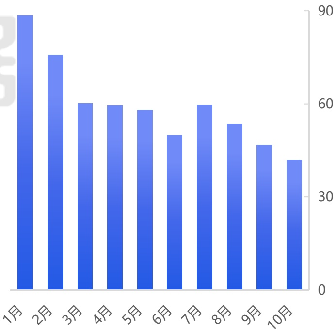
[image_caption]
这是一张柱状图，展示了从1月到10月的数据变化情况。图表的横轴表示月份，从1月到10月依次排列；纵轴表示数值，范围从0到90。每个柱子代表对应月份的数值，颜色为蓝色渐变。

具体数值如下：
- 1月：约90
- 2月：约85
- 3月：约70
- 4月：约65
- 5月：约60
- 6月：约55
- 7月：约65
- 8月：约60
- 9月：约55
- 10月：约50

从图表中可以看出，数据在1月和2月达到最高值，随后逐渐下降，6月有一个小的回升，之后继续下降。整体趋势是下降的。
[/image_caption]

iOS月活跃用户数（万人）

来源：点点数据自主研究及绘制

## 《恋与深空》- 点点数据测评分析

## 凭借创新的内容形态与情感设计成为女性向赛道的长线吸金之作

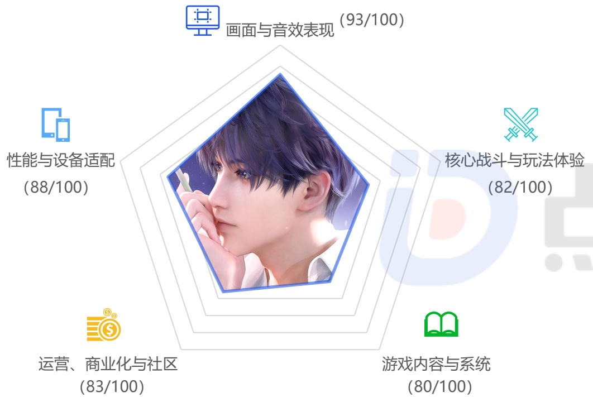
[image_caption]
该图像展示了一个五边形评分图，中心是一个人物插画，周围环绕着五个不同类别的评分指标及其对应的分数。具体如下：

1. **画面与音效表现**：评分为93/100，图标为一个显示器。
2. **性能与设备适配**：评分为88/100，图标为两个手机。
3. **核心战斗与玩法体验**：评分为82/100，图标为两把交叉的剑。
4. **游戏内容与系统**：评分为80/100，图标为一本打开的书。
5. **运营、商业化与社区**：评分为83/100，图标为一个带有美元符号的货币符号。

每个类别旁边都有相应的图标和分数，整体布局清晰，便于理解各项评分的具体内容和数值。
[/image_caption]

综合评分： 85.1

游戏凭借全3D建模和第一人称视角，在角色刻画、表情细节和场景光影上达到了女性向游戏市场标杆水准。同时作为一款乙女游戏，突破性地加入了动作战斗系统，并与恋爱养成内容结合，创造了“并肩作战”的平等伙伴关系。

[image_caption]
该图像为一个图标，显示了一个蓝色的显示器轮廓，屏幕上有一个由点组成的正方形图案。此图标通常用于表示计算机、屏幕或与数字技术相关的内容。
[/image_caption]

## 画面与音效表现 (25%)

游戏采用了全3D建模，角色形象立体、表情和动作细腻，光影效果出色，加之极具高级感的UI，其综合美术表现远超全球同题材手游产品。游戏剧情表现上采用了第一人称视角的3D实时渲染，使玩家能够身临其境地感受角色的呼吸与细微反应，打破了现实与虚拟的界限，提供了极致拟真的沉浸式体验。游戏配乐质量备受认可，甚至邀请了演唱家莎拉·布莱曼献唱主题曲，极大地提升了产品的格调。

## 核心战斗与玩法体验（30%）

游戏战斗玩法相对传统简洁，战斗时可与男主频繁语音互动，其战斗体验秉持了“战斗环节也是‘陪伴’的一环”的设计理念，让玩家感受到与角色在同一水平线上的互相合作和扶持。但从受众角度来说，战斗玩法只是“调味剂”，剧情演出和角色互动才是游戏真正的核心玩法。而这一点，在目前同类游戏上属于绝对T0级别。

## 游戏内容与系统 (20%)

游戏提供了丰富的恋爱养成和日常互动玩法。除了主线外，还有陪伴玩法（如运动陪伴、拍照合影），以及大头照、喵喵牌、抓娃娃等创意小游戏。随着版本更新，还加入了如“陪我睡觉”、“手帐”等新功能，持续丰富陪伴体验。角色养成线清晰，但长期养成的资源压力不容忽视。高星级卡牌养成资源需求大，且编队机制要求同一男主角的卡牌组成小队，再加之属性区分，使得前期养成压力较大。

[image_caption]
该图像为一个图标，显示了两个黄色的美元符号（$）和三条水平的黄色线条。这种图标通常用于表示金钱、财务或与经济相关的内容。
[/image_caption]

## 运营、商业化与社区 (15%)

游戏采用抽卡付费模式。卡池排期相对密集，且钻石获取途径有限。此外部分道具/皮肤被认为定价过高。游戏保持了稳定的版本更新节奏，且质量上乘，曾多次登顶iOS畅销榜。玩家社群活跃，但社区环境存在一定程度的“饭圈化”问题。

## 性能与设备适配（10%）

作为一款全3D手游，其安装包体积较大，对设备存储空间有一定要求。在主流设备上帧率稳定。

## 《阴阳师》基础数据

## 和风美学构建了独一无二的视觉符号 九年的内容焕新使IP生命力历久弥新

游戏凭借唯美和风打造了极强的视听辨识度，其美术与音乐质量在长期运营中保持了高水准，并形成了独特的文化符号。核心的回合制战斗与御魂搭配系统，经过近九年的沉淀，具有丰富的策略深度。此外，游戏也积累了如秘闻副本、为崽而战、超鬼王等大量经典玩法模式。对于免费玩家和月卡党，游戏通过持续的活动和福利，提供了相对良性的资源循环，支持长线养成。但部分月度活动被玩家认为存在模板化倾向，创新玩法的频率和力度有待提升，玩家在游戏后期容易感到内容重复。御魂的强化随机性（俗称“强歪”）是长期存在的痛点。并且随着式神数量和系统复杂度的累积，新玩家的“入坑”门槛偏高。

2025年《阴阳师》国服收入规模与活跃用户数据表现

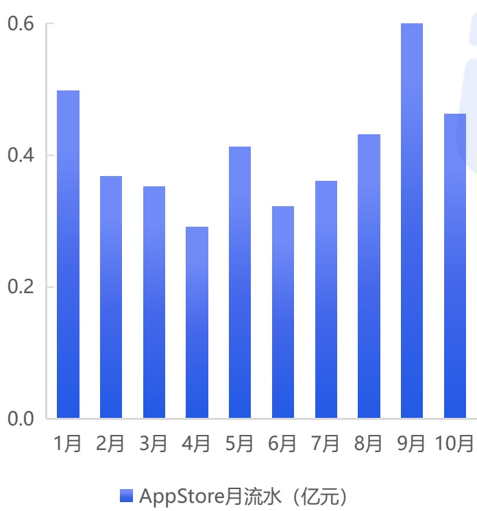
[image_caption]
这是一张柱状图，展示了AppStore每月流水（以亿元为单位）的变化情况。图表的横轴表示月份，从1月到10月，纵轴表示AppStore的月流水，范围从0.0到0.6亿元。

具体数据如下：
- 1月：约0.45亿元
- 2月：约0.38亿元
- 3月：约0.36亿元
- 4月：约0.25亿元
- 5月：约0.41亿元
- 6月：约0.33亿元
- 7月：约0.37亿元
- 8月：约0.42亿元
- 9月：约0.60亿元
- 10月：约0.45亿元

从图表中可以看出，AppStore的月流水在不同月份之间有波动，其中9月的流水最高，达到约0.60亿元，而4月的流水最低，约为0.25亿元。整体趋势显示，尽管有波动，但总体上AppStore的月流水保持在0.35亿元以上。
[/image_caption]

## 2025Q1-Q3用户留存

平均次留： 约22.1%

平均月留： 约4.8%

男生占比： 约74.8%

## ASO关键词覆盖

阴阳师 式神 痔痒鼠

日和风 晴明 onmyoji

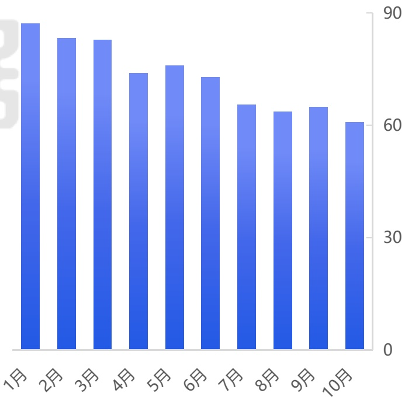
[image_caption]
这是一张柱状图，展示了从1月到10月的数值变化。每个月份对应一个蓝色的柱子，柱子的高度表示该月的数值。具体数值如下：

- 1月：约90
- 2月：约85
- 3月：约85
- 4月：约75
- 5月：约80
- 6月：约70
- 7月：约65
- 8月：约60
- 9月：约65
- 10月：约60

从图中可以看出，数值在1月至3月期间保持较高水平，随后逐渐下降，至10月达到最低点。整体趋势为先高后低。
[/image_caption]

iOS月活跃用户数（万人）

来源：点点数据自主研究及绘制

## 《阴阳师》- 点点数据测评分析

## 在回合制中深耕出极致的策略纵深 “听劝”的运营维系着社群的长期信赖

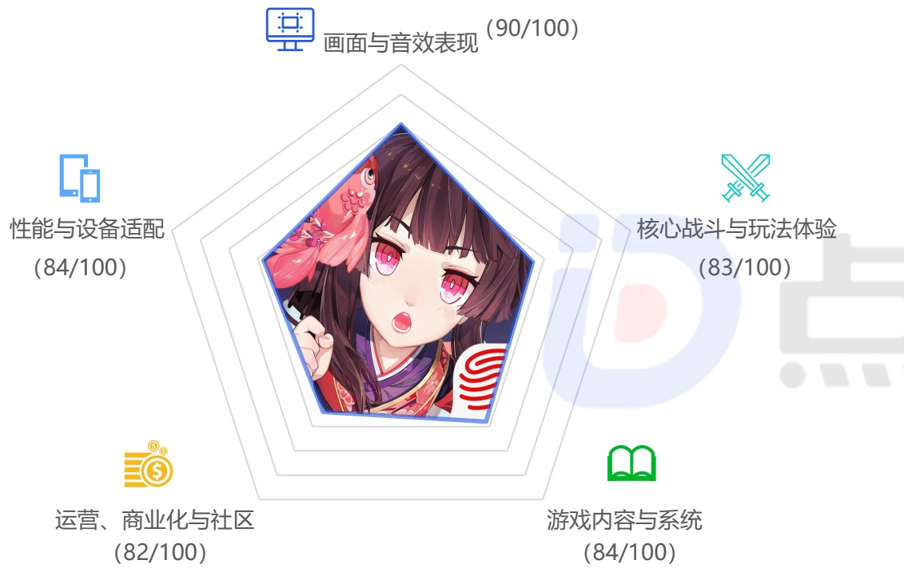
[image_caption]
该图像展示了一个五边形评分图，中心是一个动漫风格的角色插画。围绕中心角色的五个边分别代表不同的评价维度，并附有相应的评分：

1. **画面与音效表现**：评分为90/100，图标为显示器和音量符号。
2. **性能与设备适配**：评分为84/100，图标为手机和电脑屏幕。
3. **核心战斗与玩法体验**：评分为83/100，图标为交叉的剑。
4. **游戏内容与系统**：评分为84/100，图标为书本。
5. **运营、商业化与社区**：评分为82/100，图标为带有货币符号的方块。

每个维度的评分以数字形式显示在对应图标下方，整体构图清晰，便于快速理解各方面的评价情况。
[/image_caption]

综合评分： 84.9

游戏凭借唯美和风打造了极强的视听辨识度，其美术与音乐质量在长期运营中保持了高水准，并形成了独特的文化符号。核心的回合制战斗与御魂搭配系统，经过近九年的沉淀，具有丰富的策略深度。对于免费玩家和月卡党，游戏通过持续的活动和福利，提供了相对良性的资源循环，支持长线养成。

## 画面与音效表现 (25%)

游戏以日式和风为基底，角色（式神）设计精美，服饰细节考究。作为一款运营多年的手游，其建模精度与特效在不断迭代更新。新式神的建模和特效表现相比早期有明显提升。游戏配乐质量优秀，与和风世界观契合度高，获得了玩家的广泛认可。

## 核心战斗与玩法体验（30%）

作为一款回合制卡牌RPG，其操作核心在于策略部署与技能释放时机的选择。策略深度主要来源于式神技能组合与御魂套装效果的搭配，策略空间巨大。今年新增的UR式神及其与同名式神的连携技能机制，进一步拓展了战斗的策略维度。PVE玩法中的秘闻副本等提供了具有挑战性的关卡设计。但PVP斗技玩法，由于新式神的影响，环境变化较快，有时会被玩家认为对新式神依赖度较高。

## 游戏内容与系统 (20%)

游戏塑造了庞大的平安京世界，主线剧情与众多式神个人故事共同构建了丰富的故事线。游戏在早期就以章节式动画剧情作为卖点，增强了玩家的沉浸感和代入感。式神的养成线清晰，但御魂作为核心系统，其词条强化随机性大，是玩家长期吐槽的焦点。游戏提供了极其丰富的玩法。除了主线外，还有数十种不同的副本和活动。游戏UI经过多次迭代，整体简洁明了。

[image_caption]
该图是一个图标，显示了两个黄色的美元符号（$）和三条水平的黄色线条。美元符号位于线条的上方，整体设计简洁明了，常用于表示与金钱、财务或经济相关的概念。
[/image_caption]

## 运营、商业化与社区 (15%)

游戏以抽卡为主要付费点。2025年新增的UR式神为SSR全集赏玩家提供了免费获取途径，同时也可通过抽卡获取。游戏保持了稳定的版本更新和节日活动节奏。官方也通过“制作组回信”等形式回应玩家反馈。玩家社群活跃，二创文化繁荣。游戏内嵌的LBS社交等玩法，也一定程度促进了玩家互动。

## 性能与设备适配（10%）

作为一款运营多年的游戏，其对主流设备的兼容性持续优化。官方的桌面版模拟器也能提供接近原生PC游戏的体验。

## 《鸣潮》基础数据

## 清晰扎实的战斗系统贴近ACT二游上限 探索乐趣与养成体系仍有优化迭代空间

游戏的动作设计与操作手感被认为是行业标杆，“弹刀”、闪避、空中连段等操作反馈清晰扎实。“合轴”机制通过精准释放技能触发协奏反应，提供了极高的策略性和操作深度。角色建模精细，技能演出效果华丽且不拖沓。钩索、跑墙、滑翔等移动手段让开放世界探索非常流畅自由。但开放世界内容深度有待提升，且地图设计相对平淡，缺乏令人印象深刻的标志性景观。收集品奖励大多为养成材料和基础货币，缺乏独特性。角色、武器、声骸的养成线较长，资源需求量大，后期存在“坐牢刷词条”的压力。抽卡保底机制与主流竞品一致，但部分玩家对角色/武器混池颇有微词。在移动端和部分PC配置上，仍存在一些优化问题，如卡顿、掉帧、穿模等。

2025年《鸣潮》国服收入规模与活跃用户数据表现

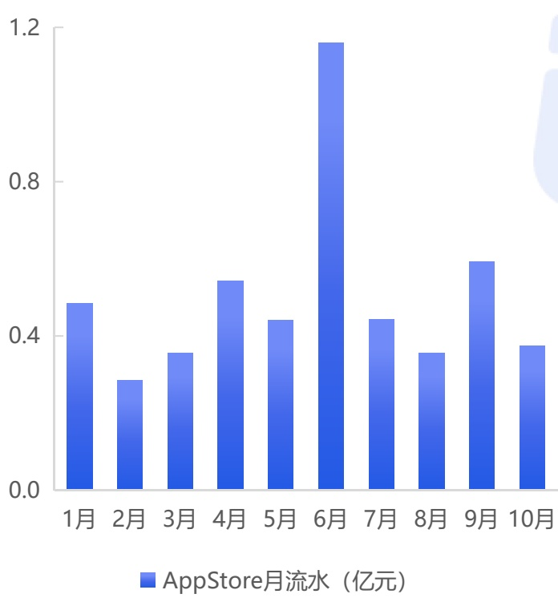
[image_caption]
这是一张柱状图，展示了AppStore在不同月份的月流水情况（单位：亿元）。图表的主要信息和数据趋势如下：

- **图表类型**：柱状图
- **X轴**：表示月份，从1月到10月。
- **Y轴**：表示AppStore的月流水，单位为亿元，范围从0.0到1.2。
- **数据趋势**：
  - 1月：约0.45亿元
  - 2月：约0.32亿元
  - 3月：约0.36亿元
  - 4月：约0.50亿元
  - 5月：约0.42亿元
  - 6月：约1.18亿元（显著高于其他月份）
  - 7月：约0.43亿元
  - 8月：约0.37亿元
  - 9月：约0.55亿元
  - 10月：约0.38亿元

从图表中可以看出，6月的AppStore月流水显著高于其他月份，达到了约1.18亿元，而其他月份的月流水相对较为平稳，大约在0.32亿元到0.55亿元之间。
[/image_caption]

## 2025Q1-Q3用户留存

平均次留： 约31.9%

平均月留： 约 \(4.9\%\)

男生占比： 约83.1%

## 用户兴趣偏好

\(\Lsh\) 动漫

电影

网络小说

音乐

高等教育

基础教育

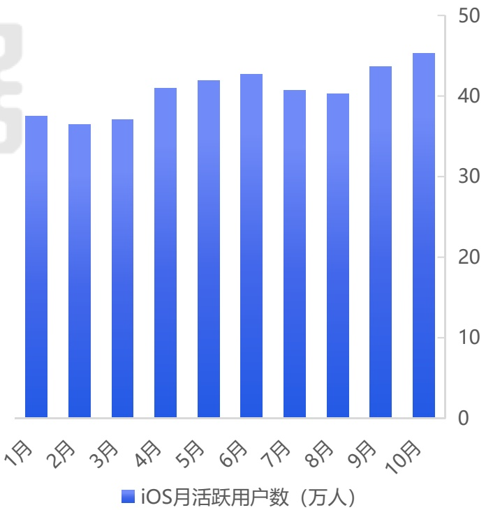
[image_caption]
这是一张柱状图，展示了从1月到10月的iOS月活跃用户数（单位：万人）。图表的主要信息和数据趋势如下：

- 横轴表示月份，从1月到10月。
- 纵轴表示iOS月活跃用户数，单位为万人，范围从0到50。
- 每个月的柱状条高度代表该月的iOS月活跃用户数。

具体数值如下：
- 1月：约40万人
- 2月：约38万人
- 3月：约39万人
- 4月：约43万人
- 5月：约45万人
- 6月：约46万人
- 7月：约44万人
- 8月：约43万人
- 9月：约47万人
- 10月：约48万人

从图表中可以看出，iOS月活跃用户数在1月至10月期间总体呈上升趋势，尤其是在6月至10月期间，用户数显著增加。
[/image_caption]

来源：点点数据自主研究及绘制

## 《鸣潮》-点点数据测评分析

## 剧情演进与玩法迭代助力重塑口碑 移动端性能优化仍是持续攻坚课题

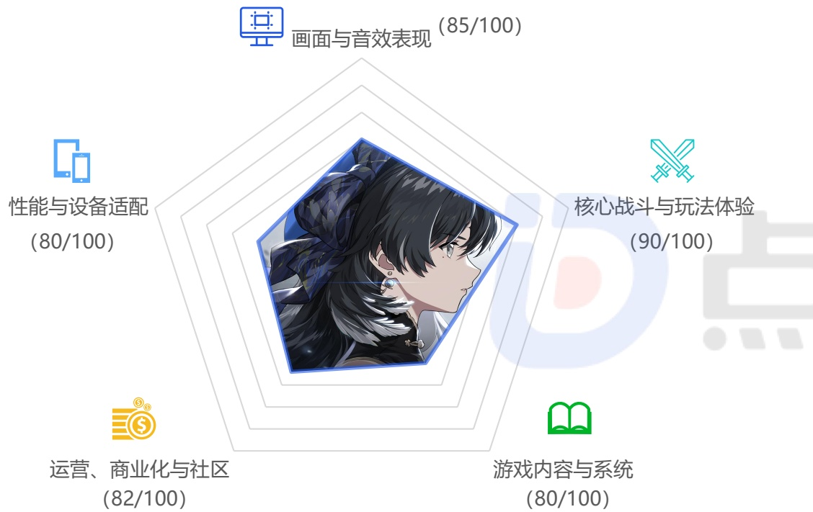
[image_caption]
该图是一个五边形雷达图，用于评估和展示不同方面的评分情况。中心位置是一张动漫风格的人物插画，周围环绕着五个评分项及其对应的图标和分数：

1. **画面与音效表现**：评分为85/100，图标为一个显示器。
2. **性能与设备适配**：评分为80/100，图标为两个手机。
3. **核心战斗与玩法体验**：评分为90/100，图标为两把交叉的剑。
4. **游戏内容与系统**：评分为80/100，图标为一本打开的书。
5. **运营、商业化与社区**：评分为82/100，图标为一个带有货币符号的图标。

每个评分项沿着五边形的边向外延伸，形成一个评分雷达图，直观地展示了各个方面的表现。
[/image_caption]

综合评分： 84.6

游戏的动作设计与操作手感扎实,"弹刀"、闪避、连段等操作反馈清晰。"合轴"机制通过精准释放技能触发协奏反应，提供了极高的策略性和操作深度。角色建模精细，技能演出效果华丽且不拖沓。钩索、跑墙、滑翔等移动手段让开放世界探索非常流畅自由。

## 画面与音效表现 (25%)

游戏整体美术风格偏向冷色调的末世废土风。但部分角色设计上色彩鲜艳、风格华丽，稍显割裂。不过在2.0版本之后，地图设计和画面精度都有所提升。角色骨骼动作流畅，战斗中的技能演出效果华丽且不拖沓。战斗音效被玩家普遍称赞，特别是"弹刀"机制成功后的音效、特效和反馈感极强。

## 核心战斗与玩法体验（30%）

游戏的动作设计造诣受到广泛认可，战斗系统爽快流畅。“弹刀”和闪避等核心动作体系，在国内二次元游戏中并不多见，操作反馈清晰。“合轴”机制是战斗的灵魂，通过精准释放特定技能触发协奏反应，能造成高额伤害和华丽特效，还具有多种战略效果，为战斗提供了极高的策略性和操作深度。不同角色的技能组差异明显，操作手感和战斗定位各有特色。

## 游戏内容与系统 (20%)

在开服初期，主角在剧情中存在感较低，缺乏明确的目标和个人动机，部分剧情选择显得突兀。前期主线剧情节奏有时拖沓，部分对话文案生硬。不过，在后续版本中（如2.7版本），剧情表现有所改善，获得了玩家的肯定。角色、武器、声骸的养成线较长，资源需求量大。后期声骸系统存在长期刷词条的压力，导致长期养成有一定的挫败感。

[image_caption]
该图像为一个图标，显示了两个黄色的美元符号（$）和三条水平的黄色线条。这种图标通常用于表示金钱、财务或与经济相关的内容。
[/image_caption]

## 运营、商业化与社区 (15%)

抽卡是主要计费点，\(0.8\%\) 的基础抽卡概率，高于部分二游产品。但卡池机制（如角色/武器混池）以及特定角色的获取难度，也引起部分玩家的讨论。但游戏的版本更新节奏稳定且持续优化游戏内容，例如V2.7版本「暗潮将映的黎明」引入了新角色和体系。玩家反馈的一些问题也在逐步调整。玩家社群保持活跃，对于新角色、新剧情以及战斗体验都有广泛的讨论。

## 性能与设备适配（10%）

游戏采用虚幻引擎开发，场景精度高，昼夜和气候变化明显。但高配PC的体验明显更优。低配PC和移动端上存在明显的卡顿、掉帧、穿模等问题。

## 高审美立绘与轻玩法成就副游典范 多年长线运营以诚意滋养玩家生态

游戏成功将“双摇杆弹幕射击”与“舰娘收集养成”结合，辅以优秀的Live2D技术和中日双语配音，形成了独特的视听体验和玩法辨识度。作为一款长期运营的游戏，其资源投放和养成曲线对免费玩家和月卡党相对友好。付费点主要集中在皮肤，无命座、无逼氪，社区氛围也较为和谐稳定。游戏通过每月新活动和季度大型版本，保持了长期的新鲜感。八周年之际，官方仍通过优化新手引导、整合剧情系统等方式，持续改善玩家体验。但也有部分玩家认为，游戏核心养成的“电子盆栽”感较强，但整体“游戏性”相对薄弱。

2025年《碧蓝航线》国服收入规模与活跃用户数据表现

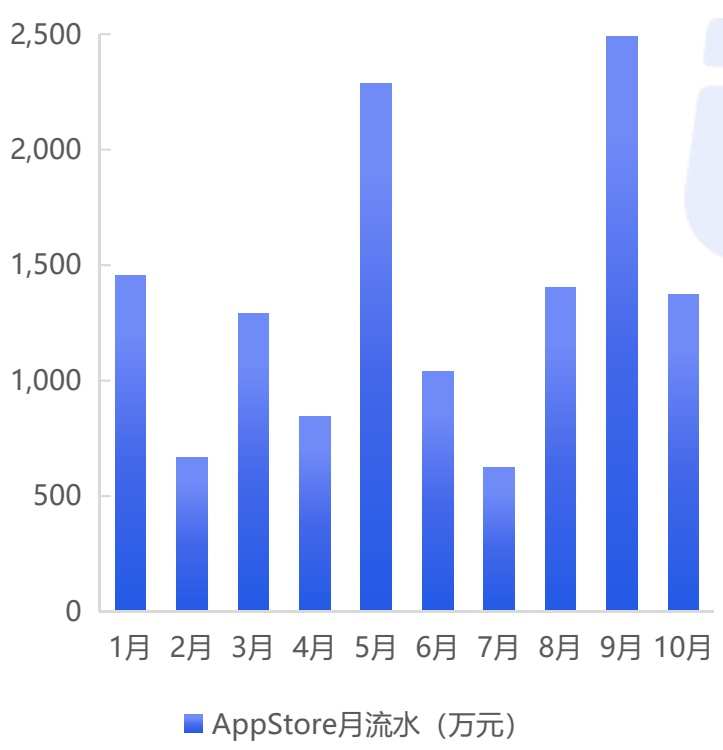
[image_caption]
这是一张柱状图，展示了AppStore在不同月份的月流水情况（单位：万元）。图表的横轴表示月份，从1月到10月，纵轴表示月流水金额，范围从0到2500万元。每个柱子代表一个月的流水金额，颜色为蓝色渐变。

具体数值如下：
- 1月：约1450万元
- 2月：约650万元
- 3月：约1250万元
- 4月：约850万元
- 5月：约2250万元
- 6月：约1000万元
- 7月：约600万元
- 8月：约1350万元
- 9月：约2450万元
- 10月：约1350万元

从图表中可以看出，5月和9月的月流水最高，分别为约2250万元和2450万元；2月和7月的月流水最低，分别为约650万元和600万元。整体趋势显示，月流水在某些月份有显著的高峰，而在其他月份则相对较低。
[/image_caption]

## 2025Q1-Q3用户留存

平均次留： 约21.8%

平均月留： 约 \(3.9\%\)

男生占比： 约79.9%

## 用户兴趣偏好

\(\Lsh\) 动漫

电影

网络小说

基础教育

直播

电视剧

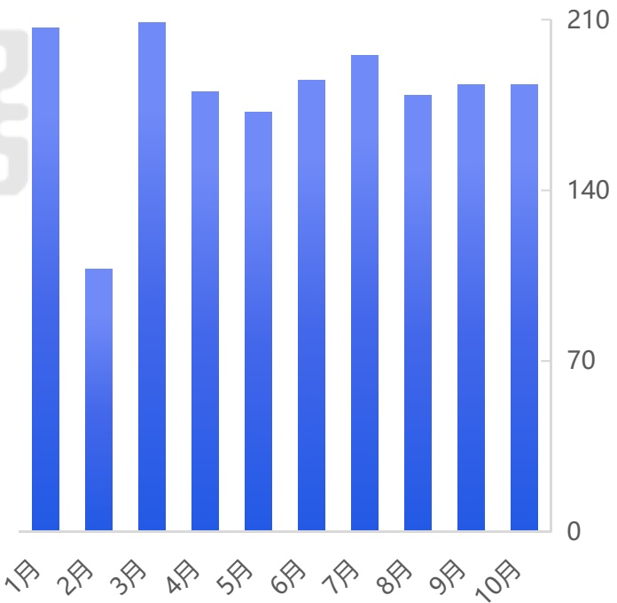
[image_caption]
这是一张柱状图，展示了从1月到10月的某个指标的变化情况。每个柱子代表一个月的数据，柱子的高度表示该月的数值。具体数值如下：

- 1月：约210
- 2月：约70
- 3月：约210
- 4月：约140
- 5月：约140
- 6月：约140
- 7月：约140
- 8月：约140
- 9月：约140
- 10月：约140

从图中可以看出，1月和3月的数值最高，达到约210；2月的数值最低，约为70；其余月份的数值相对稳定，集中在约140左右。
[/image_caption]

iOS月活跃用户数（万人）

来源：点点数据自主研究及绘制

## 《碧蓝航线》-点点数据测评分析

## 情感化运营构筑玩家与舰娘深层羁绊 官方推动社区二创形成良性内容循环

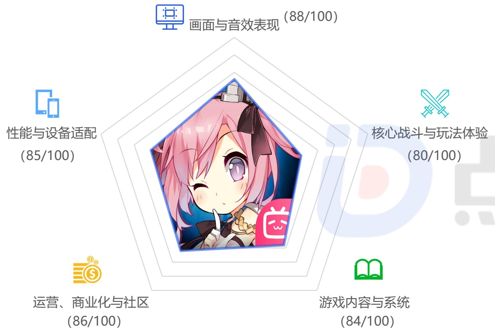
[image_caption]
该图像展示了一个五边形评分图，中心是一个动漫风格的角色插画。五边形的每个顶点代表一个评价维度，并附有相应的图标和评分：

1. **画面与音效表现**：位于顶部，图标为显示器，评分为88/100。
2. **性能与设备适配**：位于左侧，图标为手机，评分为85/100。
3. **核心战斗与玩法体验**：位于右侧，图标为剑，评分为80/100。
4. **游戏内容与系统**：位于底部右侧，图标为书本，评分为84/100。
5. **运营、商业化与社区**：位于底部左侧，图标为货币符号，评分为86/100。

每个维度的评分以数字形式显示在括号内，整体构图清晰，便于快速了解各个方面的评价情况。
[/image_caption]

综合评分： 84.2

游戏成功将“双摇杆弹幕射击”与“舰娘收集养成”结合，辅以优秀的Live2D技术和中日双语配音，形成了独特的视听体验和玩法辨识度。作为一款长期运营的游戏，其资源投放和养成曲线对免费玩家和月卡党相对友好。付费点主要集中在皮肤，无命座、无逼氪，社区氛围也较为和谐稳定。

[image_caption]
该图像为一个图标，显示了一个蓝色的显示器轮廓，屏幕上有一个由点组成的正方形图案。此图标通常用于表示计算机、屏幕或与数字技术相关的内容。
[/image_caption]

## 画面与音效表现 (25%)

游戏大量运用Live2D动态技术，使皮肤具备动态呼吸与触摸反馈。战斗中的Q版小人动作流畅，炮击与爆炸特效也张弛有度。游戏在剧情演出中运用了章节式动画剧情，增强了玩家的沉浸感和代入感。游戏具备中日双语配音，每艘船拥有大量互动台词。BGM能根据场景在爵士乐、电子摇滚和交响乐间切换，有效烘托氛围。

## 核心战斗与玩法体验（30%）

游戏采用独特的双摇杆操作，左侧移动舰船，右侧手动瞄准射击，兼顾了策略与操作感。深度主要来源于舰种克制（驱逐 \(\rightarrow\) 轻巡 \(\rightarrow\) 重巡 \(\rightarrow\) 战列）和阵营加成等编队策略。动态弹幕躲避与BOSS的阶段化机制，也考验玩家的即时反应。敌舰弹幕类型多样，包括扇形扩散、追踪导弹等。

## 游戏内容与系统 (20%)

游戏围绕“舰船拟人化”核心，通过12章主线战役及大型活动，逐步揭露“塞壬”势力的阴谋。八周年之际，官方推出了剧情线系统，将各阵营故事按时间线统一归档，降低了新玩家的理解成本。游戏UI简洁直观。官方持续进行人性化优化，如自律作战（通关后可挂机）、代理指挥、低耗队编成等，有效减轻了玩家的重复操作负担。

[image_caption]
该图像为一个图标，显示了两个黄色的美元符号（$）和三条水平的黄色线条。这种图标通常用于表示金钱、财务或与经济相关的内容。
[/image_caption]

## 运营、商业化与社区 (15%)

游戏以皮肤和抽卡为主要付费点。抽卡资源通过日常任务获取较为充足。皮肤虽然部分定价较高，但可以通过月卡慢慢积攒资源获取，整体上形成了“零氪不掉队，微氪体验足”的平衡。玩家社群活跃，二创文化繁荣。游戏社区给人一种温和而稳定的陪伴感，玩家之间建立起的关系超出了游戏本身。

## 性能与设备适配（10%）

作为一款运营多年的游戏，其对主流设备的兼容性持续优化。同时，游戏也支持在模拟器上流畅运行。游戏在主流设备上帧率稳定，触屏操作反应流畅。

## 二次元移动游戏市场概况&体验指标分析

## 典型二次元移动游戏体验测评

## 二次元移动游戏市场发展趋势

二次元移动游戏市场发展趋势：AI参与的多线程叙事、商业模式的多元化探索、“类模拟经营”元素深化至核心玩法循环将是未来3年全球二次元移动游戏的主要竞争要点。

## AI参与的多线程叙事是趋势还是陷阱？

## 叙事从来都是二次元游戏的核心之一 但AI对于角色形象的可控性仍有待商榷

为二次元角色引入AI对话功能，赋予角色前所未有的“生命力”，让玩家能够跨越预设剧本的边界，与心仪的角色进行自由互动，这极大地满足了情感陪伴需求，是叙事沉浸感的终极想象。但同时，这也是一把双刃剑，其核心矛盾在于“叙事的可控性”与“互动的自由度”之间的冲突。二次元游戏的商业模式高度依赖通过精密剧情塑造出的、人设鲜明的角色来驱动玩家付费。每一个情节、每一句台词都在强化角色的独特魅力与情感联结。而当前AI的核心风险在于其不可预测性。一旦赋予玩家无限制的对话自由，角色极易被“玩坏”——即出现人设崩塌的言论（类似二游玩家常说的OOC）。这将直接解构官方苦心经营的叙事权威，稀释角色的核心吸引力。当角色不再保持其令人迷恋的“确定性”时，核心粉丝的付费动机很可能随之减弱。从当前的时间点来看，审慎的策略仍是“有限自由”：将AI功能置于主线叙事之外，作为日常陪伴的补充玩法，并为AI模型设立坚固的“人设防火墙”，确保其所有回应都严格遵循角色底层逻辑。这是在技术想象力与商业风险之间必要的平衡。

直至今日已有许多游戏实装了AI NPC功能，但多数只能作为娱乐玩法

《逆水寒》手游是首款被市场所熟知的具备AI NPC产品。但AI功能基本集中在非重点NPC上，不会对世界观或主线剧情故事产生影响。

《Whispers from the star》由米哈游创始人蔡浩宇研发，将实时AI叙事作为了游戏主要玩法，玩家的每句话都会影响故事走向。该游戏更像是一款实验性产品，PC端售价33.99元。

《和平精英》在近年更新了AI队友-吉莉，可以部分玩法中称为玩家的队友，并且能实时语音沟通、协同作战。

来源：点点数据自主研究及绘制

## 商业模式的多元化探索

## 主要集中在“变现路径探索”与“价值感受重塑”

二次元移动游戏中以“抽卡”为付费点的商业模式目前正在面临两大核心困境：

首先，将角色核心机制拆分为“命座”或“碎片”的付费设计，本质上是将完整的角色体验商品化，这虽然深度挖掘了重氪玩家的价值，却不可避免地损害了大多数普通玩家的游戏体验，引发“付费才能变完整”的负面感受。针对此，部分游戏已开始尝试改革，例如《伊瑟》将重复抽取的收益限定为数值成长，而非机制解锁。此举虽然降低了重氪玩家的追求动力，但显著改善了大众玩家的基础体验，体现了从“深度付费”向“广度付费”的平衡调整。

其次，抽卡模式本身经过多年透支，其带来的随机性焦虑已令玩家感到疲惫。对此，行业出现两种应对路径：一是进行机制优化，如取消“小保底”歪池、提高基础概率等，但这终究是在不颠覆根本框架下的温和改良；二是更为激进的模式革新，例如《二重螺旋》直接取消角色与武器抽卡，全部通过玩法产出，将付费点完全转移至皮肤等不影响强度的外观项目。

这些探索共同指向一个趋势：行业正在寻求从榨取单客价值的“深度付费”模型，转向更注重玩家基数和长期生态的“广度付费”模型。虽然新模式的成败尚待验证，但这种从“卖角色”到“卖体验”的转变，无疑是二次元游戏在红海竞争中寻求差异化和可持续发展的必然尝试。

部分二次元移动游戏商业化迭代展示

《伊瑟》中抽取到重复的角色碎片，仅能提升角色的数值属性。角色机制在初始时就为“完全体”。

《二重螺旋》中的主要付费点集中在抽取皮肤外观上。角色本体、专属武器都能通过免费活动获取。

## “类模拟经营”元素进一步深化核心玩法循环中

## 多款二游新作齐发力“模拟经营”附属系统演变为重要竞争维度

过往产品中的家园系统，本质是叙事与养成的延伸。它提供一个低压力、高展示性的静态空间，核心价值在于呈现角色在主线外的互动与生活细节，以此巩固情感投射。其玩法深度浅，不影响核心循环，属于“观赏性陪伴”。而当前部分新作（如蛮湫网络的《蓝色星原：旅遥》、鹰角网络的《明日方舟：终末地》、诗悦网络的《望月》等）宣发中凸显的建造、种田、自动化生产等重度模拟经营要素，则标志着功能定位的根本转变。其驱动力在于：

第一，提供可长期消耗的玩法内容，弥补二次元游戏传统以“版本活动”为驱动的间歇性长草缺陷，形成稳定的日常玩法锚点。

第二，创造系统性的资源循环，将经营产出与角色养成、探索战斗等模块挂钩，增强游戏内生态的有机性与玩家投入的正反馈。

第三，通过规划、建造与管理，赋予玩家更强的主导感与沉浸感，从“观看故事”部分转向“亲手建设”，这符合开放世界品类对玩家自主性的更高要求。

然而，深度模拟经营玩法存在特定的受众边界，可能与传统二次元核心玩家追求“低负担、高情感”的诉求产生冲突。如何将经营乐趣与角色叙事深度融合，将是决定此类设计成败的关键。若能成功整合，它有望构建一个更具沉浸感、可持续且差异化的游戏世界，成为二次元赛道新的护城河。

部分新老二次元移动游戏“类模拟经营”要素展示

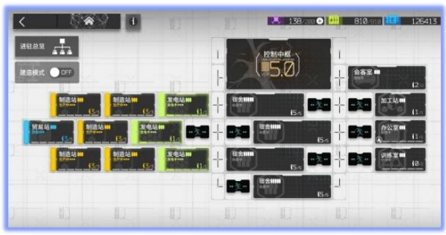
[image_caption]
该图像显示了一个游戏界面，具体为一个工厂或生产管理类游戏的布局图。界面分为几个主要区域：

1. **顶部信息栏**：
   - 显示当前资源数量：人口159，金币810，电力126413。
   - 有一个“过滤模式”开关，当前设置为关闭（OFF）。

2. **左侧控制面板**：
   - 包含“进入总站”按钮，用于返回主界面。
   - 下方有多个“制造站”图标，每个图标上标有“制造站”字样和不同的颜色（黄色、绿色、蓝色），表示不同类型的制造站点。

3. **中央控制区**：
   - 显示“控制中枢”，数值为15.0。
   - 周围分布着多个功能模块，包括“发电站”、“加工站”、“办公室”等，每个模块旁边都有相应的图标和数值。

4. **右侧功能区**：
   - 包含“合客室”模块，以及多个“制造站”和“加工站”模块，每个模块旁边都有相应的图标和数值。

整体布局清晰，展示了工厂内部的各个功能区域及其状态，玩家可以通过这些界面进行管理和操作。
[/image_caption]

《明日方舟》- 基建系统

《原神》-尘歌壶

《重返未来1999》- 家园系统

丰富探索玩法激活养成

多款即将在2026-2027年上线的二次元

移动游戏都将自身的“模拟经营”部分

作为重点宣传要素，并且玩法各异，包

括都市经营、工业基建、开垦种田等。

## 法律声明

## 版权声明

报告中所有的文字、图片、表格均受有关商标和著作权的法律保护，部分文字和数据采集于公开信息，所有权为原作者所有。没有经过本公司新媒体许可，任何组织和个人不得以任何形式复制或传递，报告中所涉及的所有素材版权均归广告主所有。任何未经授权使用本报告的相关商业行为都将违反《中华人民共和国著作权法》和其他法律法规以及有关国际公约的规定。

## 免责条款

本报告中行业数据及市场预测主要为分析师采用桌面研究、行业访谈及其他研究方法，并且结合点点数据团队监测产品数据，通过统计预测模型估算获得，仅供参考。受研究方法和数据获取资源的限制，本报告只提供给用户作为市场参考资料，本公司对该报告的数据和观点不承担法律责任。任何机构或个人援引或基于上述数据信息所采取的任何行动所造成的法律后果均与点点数据无关，由此引发的相关争议或法律责任皆由行为人承担。

## POINT AWARDS 》 火热申报中

## 2025出海移动游戏/APP年度榜单

权威背书：100%数据驱动评选，助力海内外融资与合作

全球曝光：路透社等200+全球媒体报道，打造硬核影响力

6 长效资产：出海白皮书、点点出海公众号专稿长尾流量

2025年度实力出海移动游戏

2025年度实力出海应用

2025先锋出海游戏/应用

2025年度卓越出海服务企业

申报截止至12.31

## 游戏数据/移动应用分析平台

Tap

全球商店数据

[image_caption]
该图是一个图标，由三个圆形和一个加号组成。两个圆形位于下方并排排列，第三个圆形位于上方偏左位置，加号位于上方偏右位置，整体布局简洁明了。
[/image_caption]

多维度榜单

[image_caption]
该图像为一个图标，显示了一个蓝色的矩形框，内含一条白色的折线图案。此图标通常用于表示信号强度、网络连接状态或某种波动的数据趋势。
[/image_caption]

下载/收入

[image_caption]
该图像为一个图标，显示了一个饼图的一部分。饼图由一个圆形和一个扇形组成，扇形占据了圆形的四分之一，颜色为蓝色，其余部分为白色。此图标通常用于表示数据的百分比或比例。
[/image_caption]

竞品分析

用户画像

sdk技术集成

用户粘性

aso/asa策略分析

- 点点数据是移动应用、游戏数据监测服务商，为全球企业提供APP下载量、收入、使用行为和应用市场监测的一体化平台。

应用覆盖

1000万+

日活跃设备监控

1.7亿+

日数据存储量

100亿+

加入出海社群

监测国家地区数

276个

## 获取每日免费报告

每日微信群分享

最新行业报告

## 高端社群

所有行业报告均为公开合规版，知识产权属于发布机构，使用场景限于小范围内部学习。