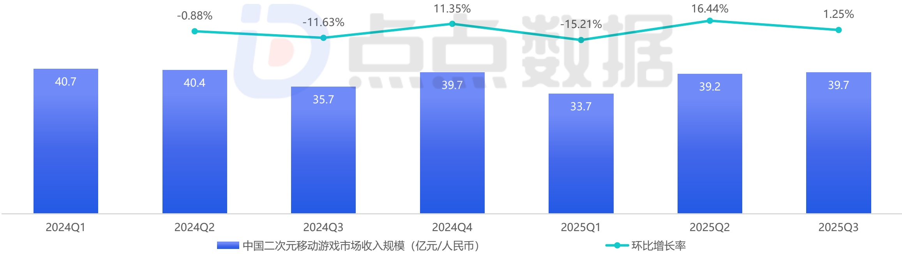

<!-- page 5 -->

## 中国二次元移动游戏市场收入规模

## 收入同比产生明显下滑 商业化变革悄然进行中

点点数据在2024年10月发布的《全球二次元移动游戏市场研究报告》中提到，2024年的市场收入规模已开始小幅收缩。而从下图来看，2025年中国二次元移动游戏市场进一步加剧了下滑趋势。这一方面是因为现今二次元移动游戏产品出现了明显的“定式”，包括商业化、养成体系乃至玩法层面，玩家已出现了相当程度的审美疲劳；另一方面，玩家的消费比例出现了部分转移（如谷子经济的崛起，虽然扩大了受众，但同样转移了玩家消费倾向）。而基于此，游戏厂商也开始进行了积极的战略调整，如10月末上线的《二重螺旋》完全抛弃了二游传统的抽卡商业化模式，转向了纯Avatar付费。虽然游戏正式上线后的表现难以与市面上头部二游产品比肩，但变革的种子已悄然埋在了广大玩家内心中。

2025Q3中国二次元移动游戏市场收入规模（仅App Store）

[image_caption]
该图像为柱状图和折线图的组合，展示了中国二次元移动游戏市场的收入规模及其环比增长率。

### 图表类型
- **柱状图**：表示每个季度的市场收入规模（单位：亿元/人民币）。
- **折线图**：表示每个季度的环比增长率。

### 数据信息
#### 市场收入规模（柱状图）
- **2024Q1**：40.7亿元
- **2024Q2**：40.4亿元
- **2024Q3**：35.7亿元
- **2024Q4**：39.7亿元
- **2025Q1**：33.7亿元
- **2025Q2**：39.2亿元
- **2025Q3**：39.7亿元

#### 环比增长率（折线图）
- **2024Q1至2024Q2**：-0.88%
- **2024Q2至2024Q3**：-11.63%
- **2024Q3至2024Q4**：11.35%
- **2024Q4至2025Q1**：-15.21%
- **2025Q1至2025Q2**：16.44%
- **2025Q2至2025Q3**：1.25%

### 趋势分析
- **市场收入规模**：整体呈现波动趋势，从2024Q1的40.7亿元下降至2024Q3的35.7亿元，随后在2024Q4回升至39.7亿元，2025Q1降至33.7亿元，2025Q2回升至39.2亿元，最后在2025Q3稳定在39.7亿元。
- **环比增长率**：增长率波动较大，从2024Q1的-0.88%到2024Q4的11.35%，再到2025Q1的-15.21%，显示出市场的不稳定性和周期性变化。2025Q2的增长率显著提升至16.44%，随后在2025Q3略有下降至1.25%。

### 总结
该图表清晰地展示了中国二次元移动游戏市场在2024年第一季度至2025年第三季度的收入规模和环比增长率的变化趋势，反映了市场的波动性和增长潜力。
[/image_caption]

注释：1、中国移动游戏市场统计范围：仅包含在中国大陆地区上线的移动端游戏，不包含PC端、游戏主机端或其他硬件平台上的游戏（例如一款游戏同时发布了移动端版本、PC客户端版本和游戏主机端版本，本报告也仅统计移动端版本的相关数据）；2、收入规模包含统计范围内用户消费的总金额，不包含广告变现、第三方充值等其他收入模式；3、本报告中后续涉及的“中国移动游戏收入”相关的统计数据，都以此标准进行统计；4、部分数据可能会在点点数据2025年相关报告中做出调整。

来源：中国移动游戏市场收入规模是综合了点点数据、企业财报、专家访谈，根据点点数据统计模型核算所得。