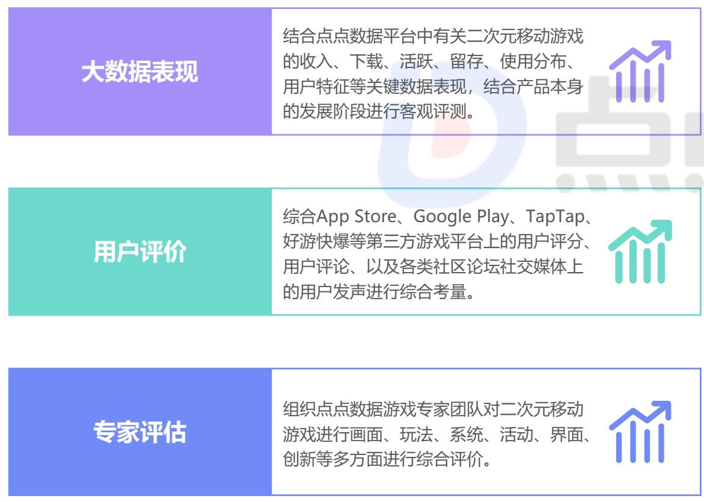
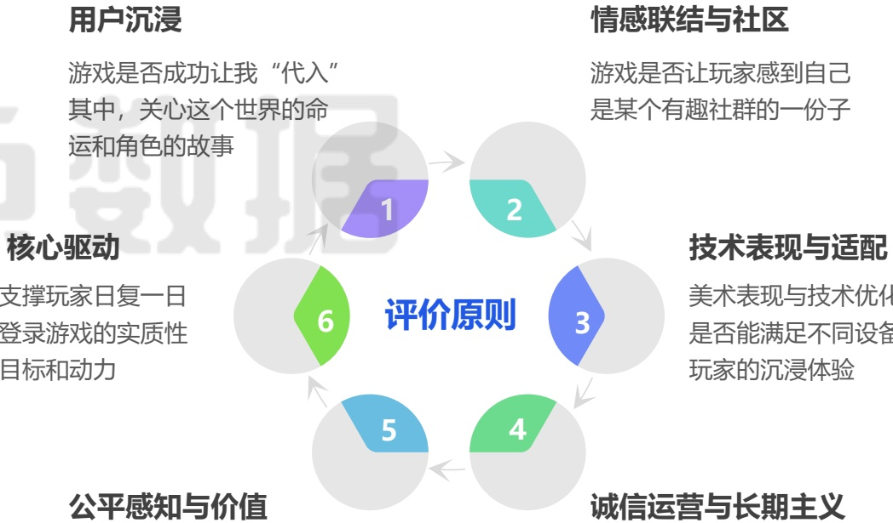

<!-- page 9 -->

## 点点数据-二次元移动游戏体验评测方法与原则

## 数据、用户、专家三位一体 构建科学系统评测体系

针对二次元移动游戏的体验评测，点点数据构建了一套科学且系统的评估体系：以产品的大数据表现作为基础，结合海量用户评价进行综合分析，并将用户体验专家的深度评估作为核心判断标准。在评价过程中，我们始终坚持以用户为中心，并将产品创新与游戏体验视为评估基石。同时，严格遵循全面性、价值导向、客观可量化及情感化体验等核心原则，从而确保整个评价体系兼具系统性与科学性。

[image_caption]
该图像展示了一个结构化的信息图表，分为三个主要部分，每个部分都有一个标题和相应的描述：

1. **大数据表现**：
   - 标题背景为紫色。
   - 描述内容：结合点点数据平台中有关二次元移动游戏的收入、下载、活跃、留存、使用分布、用户特征等关键数据表现，结合产品本身的发展阶段进行客观评测。
   - 右侧有一个上升趋势的图标，表示数据的增长。

2. **用户评价**：
   - 标题背景为绿色。
   - 描述内容：综合App Store、Google Play、TapTap、好游快爆等第三方游戏平台上的用户评分、用户评论、以及各类社区论坛社交媒体上的用户发声进行综合考量。
   - 右侧同样有一个上升趋势的图标，表示用户评价的积极反馈。

3. **专家评估**：
   - 标题背景为蓝色。
   - 描述内容：组织点点数据游戏专家团队对二次元移动游戏进行画面、玩法、系统、活动、界面、创新等多方面进行综合评价。
   - 右侧也有一个上升趋势的图标，表示专家评估的正面意见。

整体来看，该图表通过三个不同的维度（大数据表现、用户评价、专家评估）来全面评估二次元移动游戏的表现和质量。每个部分都强调了积极的趋势和综合考量的重要性。
[/image_caption]

[image_caption]
该图片展示了一个流程图，描述了游戏评价的六个原则。流程图呈圆形排列，每个原则由一个彩色的扇形区域表示，并用数字1到6进行标注。以下是每个原则的详细描述：

1. **用户沉浸**（紫色扇形）：
   - 游戏是否成功让我“代入”其中，关心这个世界的命运和角色的故事。

2. **情感联结与社区**（青色扇形）：
   - 游戏是否让玩家感到自己是某个有趣社群的一份子。

3. **技术表现与适配**（蓝色扇形）：
   - 美术表现与技术优化是否能满足不同设备玩家的沉浸体验。

4. **诚信运营与长期主义**（绿色扇形）：
   - 游戏的运营是否诚信，是否有长期发展的规划。

5. **公平感知与价值**（浅蓝色扇形）：
   - 游戏是否让玩家感受到公平，提供的价值是否合理。

6. **核心驱动**（绿色扇形）：
   - 支撑玩家日复一日登录游戏的实质性目标和动力。

流程图的中心位置标有“评价原则”，表明这六个原则共同构成了对游戏的全面评价标准。每个原则之间通过箭头连接，形成一个闭环，强调这些原则之间的相互关联和循环影响。
[/image_caption]

## 公平感知与价值

玩家进行付费时，是否感到被尊重而非被算计，是否觉得“物有所值”

## 诚信运营与长期主义

研发厂商与运营团队是否有能力和诚意将这款游戏长久健康地运营下去