## 2025年全球手游市场营销趋势白皮书

2025 GLOBAL MOBILE GAME MARKETING TRENDS WHITE PAPER

## 获取每日免费报告

每日微信群分享

最新行业报告

## 高端社群

所有行业报告均为公开合规版，知识产权属于发布机构，使用场景限于小范围内部学习。

## 广大大

## SocialPeta

使用广大大洞察竞争对手的广告数据，可通过全球渠道、媒体、广告主的不同维度广告数据获取信息和灵感。我们覆盖超70个国家/地区，80+全球广告渠道。比如Facebook，X(原Twitter)，YouTube，TikTok，Unity等知名广告渠道，全部广告创意已经达到17亿级别，并保持小时级别更新频率。

通过投放天数、展现曝光、热度、互动、人气值5大指标，我们可以快速定位出在投优质素材，为您提供实时的市场营销参考。

广大大作为全球领先的广告营销平台，凭借庞大的数据库和服务上千家移动应用客户的经验，为移动营销从业者提供更切实可行的方法论，助力打造出更受玩家喜爱的应用作品。

关注官方微信

广大出海笔记

## 600万

APP广告主

## 17亿

APP创意素材

## 120 万

每日新增

官网：www.guangdada.net

## singular

Singular是新一代的归因和市场营销分析平台，为营销人员提供可落地的洞察。

Singular通过对投放于成千上万个渠道的营销漏斗顶层的活动数据进行收集、整合和标准化，并与营销漏斗底层的归因数据相连接，帮助营销人员衡量他们所有活动的每个用户触点的ROI，借此进行最精细的优化。

Singular的客户包括X(Twitter)、Airbnb、微软、领英,Lyft、IGG、Kakao Games、Kika、Uber、河马游戏、Shopify、耐克、WebToon等。

关注官方微信

Singular

## #1 用户评价最高

Singular长期位居G2平台上用

户评价最高的营销归因平台榜首

## 数十亿

每年通过Singular平台归因的

应用程序安装量达到数十亿次

## 1,000+

超过1,000款增长最快的应用程

序都信赖Singular，将其作为

衡量市场表现的权威数据源

官网： www.singular-cn.net

## aarkl

Aarki是一家专注于人工智能的广告科技公司，我们致力于通过可衡量的智能解决方案，帮助品牌与应用开发者实现可持续的移动收入增长。

我们的核心是由人工智能深度驱动的需求方平台（DSP）。平台基于对海量用户参与行为的智能建模，以及对实时竞价（RTB）市场动态机制的精准洞察，助力市场营销人员实现高效的广告投放决策，规模化获取高价值用户。

## 全流程、全方位、全覆盖的移动广告技术平台

Aarki的效能源于我们独特且完整的三大技术支柱：

- 领先的 AI 广告技术平台：基于多层 DNN 与动态出价模型，在保障流量质量的同时，智能最大化每一次投放的 ROI。

- 隐私为先的用户策略：在全球超100亿设备的无ID环境中，通过每秒500万次实时分析，实现基于上下文信号的精准定位。

- 一体化的创意服务：融合数据、创意与投放，让广告创意本身成为可优化、可定位的增长杠杆。

这三大基石相辅相成，共同赋能广告主：以精准触达保障效果

以智能出价锁定人群。我们不仅追求卓越的 RTB 表现,

更致力于持续探索移动营销的未来增长边界。

与Aarki 携手，打造移动营销增长新引擎！

关注官方微信Aarki

## 2200亿

每日竞价请求

## 65亿

独立用户覆盖

## 100亿

可触达移动设备

## 500万

每秒移动广告请求

官网：www.aarki.com

## 目录

## CONTENTS

## CONTENTS

全球手游市场营销趋势洞察

2 全球手游热门榜单

3 游戏获客：真实变革何在

4 全球手游全链路增长策略指南

5 全球手游热门品类营销洞察

全球热门地区手游营销观察

全球手游热门广告主营销观察

特别鸣谢 &报告说明

## 01

## 2025年全球手游市场营销趋势洞察

2025 OBSERVATION ON GLOBAL MOBILE GAME MARKETING

## 2025年 全球手游投放趋势观察

## 2025年6月份在投手游广告主超过9万，每月新投手游均值接近8000

- 2025年月均手游广告主超8.4万名，同比增长了 \(21.9\%\) ，在6月份达到峰值超过9万名，全年手游广告主超40万；

- 每月平均新增近8000名手游广告主，月均占比 \(9.4\%\) ，其中9、10、12这3个月占比超 \(10\%\) ，全年新广告主占比 \(23.4\%\) ，与去年占比几乎持平。

## 2025年 月均在投广告主

84.0K

同比 \(21.9\%\)

## 2025年 月均新投广告主占比

9.4%

月均新广告主：7.9K

2025年全球手游各月广告主趋势

[image_caption]
该图像为一个柱状图，展示了每月在投广告主的数量及其新广告主占比的变化趋势。

### 图表描述：

- **图表类型**：柱状图 + 折线图
- **X轴**：表示月份，从1月到12月。
- **Y轴**：表示在投广告主的数量，单位为千（K），范围从0到100K。
- **蓝色柱状图**：代表每月的在投广告主数量。
- **黄色折线图**：代表每月新广告主占总广告主的比例，以百分比形式标注在折线上方。

### 数据趋势与具体数值：

#### 在投广告主数量（蓝色柱状图）：
- 1月：约70K
- 2月：约70K
- 3月：约80K
- 4月：约85K
- 5月：约90K
- 6月：约90K
- 7月：约85K
- 8月：约90K
- 9月：约85K
- 10月：约85K
- 11月：约85K
- 12月：约85K

#### 新广告主占比（黄色折线图）：
- 1月：8.1%
- 2月：8.0%
- 3月：8.8%
- 4月：9.2%
- 5月：8.9%
- 6月：8.9%
- 7月：9.7%
- 8月：9.6%
- 9月：10.8%
- 10月：10.4%
- 11月：9.9%
- 12月：10.2%

### 主要信息：
- 在投广告主数量在3月至6月期间达到峰值，分别为约80K、85K、90K和90K，随后略有下降，但在7月至12月期间保持相对稳定，约为85K。
- 新广告主占比在3月至6月期间波动较小，均在8.8%至8.9%之间。7月开始显著上升，8月达到9.7%，9月进一步上升至10.8%，之后略有下降，但仍保持在较高水平，12月为10.2%。

整体来看，广告主数量在上半年增长较快，下半年趋于稳定，而新广告主的占比则在下半年显著提升，表明市场中新增广告主的比例逐渐增加。
[/image_caption]

近3年手游广告主趋势

[image_caption]
这是一张柱状图，展示了2023年至2025年广告主的数量及其年新广告主的占比。

1. **图表类型**：柱状图
2. **主要信息**：
   - **蓝色柱状**：表示广告主的数量，单位为千（K）。
     - 2023年：约170K
     - 2024年：约270K
     - 2025年：约400K
   - **黄色折线**：表示年新广告主的占比。
     - 2023年：51.6%
     - 2024年：23.6%
     - 2025年：23.4%

3. **数据趋势**：
   - 广告主数量逐年增加，从2023年的约170K增长到2025年的约400K。
   - 年新广告主的占比在2023年达到最高点51.6%，随后在2024年和2025年分别下降至23.6%和23.4%。

这张图表清晰地展示了广告主数量的增长趋势以及年新广告主占比的变化情况。
[/image_caption]

## 2025年 全球手游新投放趋势观察

## 每月投新素材广告主已经稳超8成，新素材占比在11月份突破 \(60\%\)

- 2025年每月投放新素材广告主平均占比超过 \(82\%\) ，对比去年同期提升了 \(14.6\%\) 。且投新素材广告主占比稳定攀升，在12月份达到峰值 \(88.2\%\)

- 每月新素材占比在11月份超过 \(60\%\) 于12月份达到峰值 \(63.2\%\) ，新素材占比趋势逐步提升，2025年月均新素材占比为 \(58.1\%\) ，比去年高出5.9个百分点。

82.5% 同比：14.6%↑

2025年 月均投新广告主占比

58.1% 同比：5.9%↑

2025年 每月新素材占比

2024&2025 每月投新素材和新素材占比趋势

[image_caption]
这是一张折线图，展示了2024年1月至2025年12月期间两个指标的变化趋势：投新素材广告主占比（蓝色折线）和新投素材占比（黄色折线）。图表的横轴表示时间，从2024年1月到2025年12月，纵轴表示百分比。

### 投新素材广告主占比（蓝色折线）
- 2024年1月：63.6%
- 2024年2月：62.8%
- 2024年3月：61.1%
- 2024年4月：61.9%
- 2024年5月：63.4%
- 2024年6月：67.8%
- 2024年7月：69.3%
- 2024年8月：69.6%
- 2024年9月：70.6%
- 2024年10月：72.8%
- 2024年11月：75.4%
- 2024年12月：76.9%
- 2025年1月：77.9%
- 2025年2月：77.2%
- 2025年3月：82.0%
- 2025年4月：83.4%
- 2025年5月：82.0%
- 2025年6月：81.5%
- 2025年7月：81.4%
- 2025年8月：82.6%
- 2025年9月：83.9%
- 2025年10月：85.4%
- 2025年11月：85.2%
- 2025年12月：88.2%

### 新投素材占比（黄色折线）
- 2024年1月：51.4%
- 2024年2月：46.9%
- 2024年3月：49.9%
- 2024年4月：50.7%
- 2024年5月：50.9%
- 2024年6月：59.0%
- 2024年7月：54.9%
- 2024年8月：52.1%
- 2024年9月：51.7%
- 2024年10月：52.8%
- 2024年11月：52.5%
- 2024年12月：53.2%
- 2025年1月：54.3%
- 2025年2月：52.9%
- 2025年3月：57.4%
- 2025年4月：59.4%
- 2025年5月：57.8%
- 2025年6月：57.2%
- 2025年7月：59.1%
- 2025年8月：58.3%
- 2025年9月：58.9%
- 2025年10月：58.2%
- 2025年11月：60.1%
- 2025年12月：63.2%

### 主要信息
- **投新素材广告主占比**：整体呈上升趋势，从2024年1月的63.6%逐渐增加到2025年12月的88.2%。
- **新投素材占比**：波动较大，但在2025年有明显的上升趋势，从2024年1月的51.4%增加到2025年12月的63.2%。

这张图表清晰地展示了两个指标随时间变化的趋势，投新素材广告主占比持续上升，而新投素材占比在经历波动后也呈现上升趋势。
[/image_caption]

## 2025年 全球手游热门品类营销观察

## 娱乐场品类营销占比显著提升；RPG产品2025年平均投放超800条创意

- 2025年RPG产品年均素材量超800条，依旧是投放力度最大的游戏品类，其次为策略类产品，单产品一年投放728条创意；

- 娱乐场品类占比猛增，广告主占比47%，比去年提升22.7%，素材占比22.3%，比去年提升13.9%。

热门游戏品类2025年均素材量

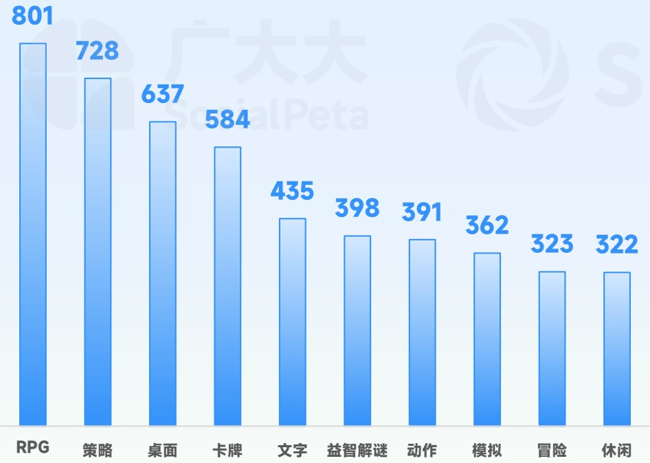
[image_caption]
这是一张柱状图，展示了不同类型游戏的受欢迎程度或数量。图表中的数据如下：

- RPG: 801
- 策略: 728
- 桌面: 637
- 卡牌: 584
- 文字: 435
- 益智解谜: 398
- 动作: 391
- 模拟: 362
- 冒险: 323
- 休闲: 322

柱状图的背景为浅蓝色，每个柱子的颜色从上到下由深蓝渐变到浅蓝。图表上方有“广大大 SocialPeta”的水印。
[/image_caption]

<table><tr><td>类别名称</td><td>广告主占比</td><td>同比占比变化</td><td>类别名称</td><td>素材占比</td><td>同比占比变化</td></tr><tr><td>娱乐场</td><td>47.0%</td><td>22.7%</td><td>休闲</td><td>23.9%</td><td>-5.6%</td></tr><tr><td>休闲</td><td>19.9%</td><td>-5.9%</td><td>娱乐场</td><td>22.3%</td><td>13.9%</td></tr><tr><td>益智解谜</td><td>8.0%</td><td>-3.1%</td><td>益智解谜</td><td>11.9%</td><td>0.3%</td></tr><tr><td>模拟</td><td>4.5%</td><td>-2.5%</td><td>RPG</td><td>9.5%</td><td>-2.9%</td></tr><tr><td>RPG</td><td>3.2%</td><td>-1.8%</td><td>策略</td><td>6.7%</td><td>-0.2%</td></tr><tr><td>动作</td><td>3.0%</td><td>-2.5%</td><td>模拟</td><td>6.0%</td><td>-1.6%</td></tr><tr><td>策略</td><td>2.5%</td><td>-1.3%</td><td>动作</td><td>4.4%</td><td>-1.4%</td></tr><tr><td>街机</td><td>2.4%</td><td>-0.3%</td><td>卡牌</td><td>3.2%</td><td>-0.5%</td></tr><tr><td>冒险</td><td>2.0%</td><td>-1.1%</td><td>桌面</td><td>3.0%</td><td>0.3%</td></tr><tr><td>卡牌</td><td>1.5%</td><td>-0.9%</td><td>冒险</td><td>2.4%</td><td>-1.0%</td></tr></table>

## 2025年 热门地区手游营销观察

## 欧洲成今年唯一月均广告主超4万地区；港澳台月均素材投放TOP1，北美、大洋洲紧随其后

- 欧洲地区2025年月均手游广告主数量已经超过4.6万名，比第二名北美地区高出6000多，是唯一月均手游广告主超4万的地区。此外东南亚和南美月均手游广告主均超过3万名；

- 中国港澳台地区以月均投放122条素材成为2025年营销竞争最卷地区，北美地区以月均119条创意紧随其后，此外大洋洲和日韩市场月均素材都超过110条。

## 月均广告主最高：

## 欧洲地区46.2K

## 月均素材量最大：

## 港澳台地区 122条

[image_caption]
这是一张柱状图，展示了不同地区月均广告主数量和月均素材数的对比。图表的横轴表示不同的地区，包括欧洲、北美、东南亚、南美、南亚、日韩、中东、大洋洲、中国港澳台和非洲。纵轴表示数量，单位为千（K）。

具体数据如下：
- 欧洲：月均广告主45.0K，月均素材数103
- 北美：月均广告主38.0K，月均素材数119
- 东南亚：月均广告主33.0K，月均素材数75
- 南美：月均广告主31.0K，月均素材数104
- 南亚：月均广告主26.0K，月均素材数81
- 日韩：月均广告主23.0K，月均素材数113
- 中东：月均广告主22.0K，月均素材数107
- 大洋洲：月均广告主21.0K，月均素材数115
- 中国港澳台：月均广告主20.0K，月均素材数122
- 非洲：月均广告主19.0K，月均素材数93

蓝色柱状表示月均广告主数量，黄色柱状表示月均素材数。从图中可以看出，北美和中国港澳台地区的月均素材数较高，而东南亚地区的月均广告主数量相对较低。整体来看，月均素材数普遍高于月均广告主数量。
[/image_caption]

## 2025年 全球手游素材类型观察

## 2025年视频素材占比74.1%，比去年提升14.2%；图片素材中方形图片占比最高为67.2%

- 视频类创意在今年猛增至74.1%，对比2024年提升14.2%。其中30s以下的短创意占比58%，超过60s的超长创意占比6.9%；

- 图片素材占比24.7%，比去年占比下降11.6%，其中方形图片创意占比最高为67.2%。

视频类素材时长观察

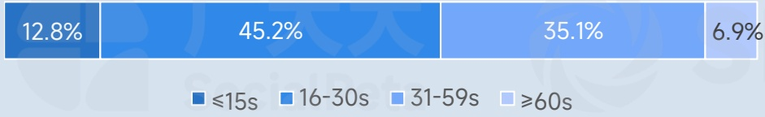
[image_caption]
这是一张柱状图，展示了不同年龄段的人群在某个事件或行为中的占比。具体数据如下：

- ≤15s：12.8%
- 16-30s：45.2%
- 31-59s：35.1%
- ≥60s：6.9%

图表使用了四种不同深浅的蓝色来区分不同的年龄段，从左到右依次为：最深蓝（≤15s）、中深蓝（16-30s）、浅蓝（31-59s）和最浅蓝（≥60s）。每个柱状条上方标注了具体的百分比数值。
[/image_caption]

2 图片类素材类型观察

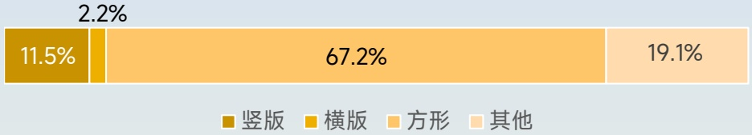
[image_caption]
该图表是一个水平条形图，展示了不同类型图片的比例分布。具体数据如下：

- 竖版：11.5%
- 横版：67.2%
- 方形：19.1%
- 其他：2.2%

图表中使用了不同颜色来区分各类图片：
- 竖版用深黄色表示
- 横版用浅橙色表示
- 方形用浅黄色表示
- 其他用浅灰色表示

横版图片占比最大，为67.2%，其次是方形图片，占比19.1%。竖版图片占比11.5%，其他类型图片占比最小，为2.2%。
[/image_caption]

2025年全球手游素材类型占比

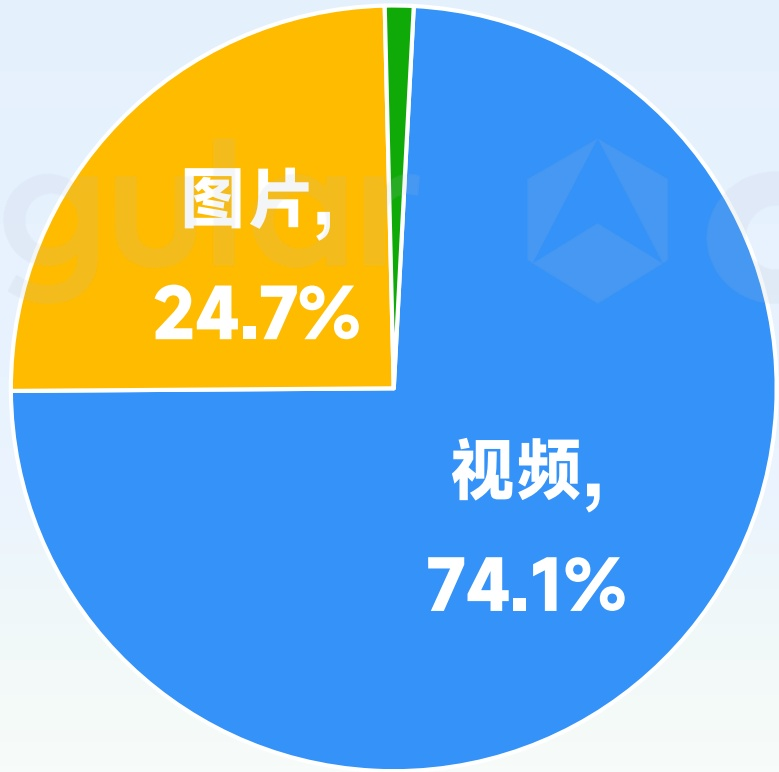
[image_caption]
这是一张饼图，展示了两种类型的媒体内容占比。蓝色部分代表视频，占比74.1%；橙色部分代表图片，占比24.7%。图表中没有其他数据或趋势信息。
[/image_caption]

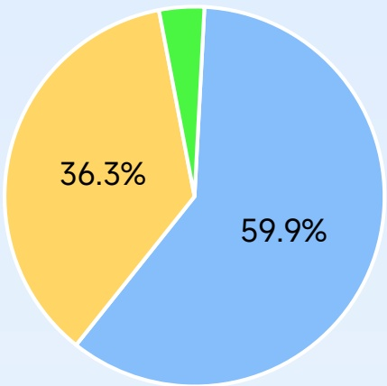
[image_caption]
这是一张饼图，展示了三个不同部分的百分比分布。具体数据如下：
- 蓝色部分占59.9%
- 黄色部分占36.3%
- 绿色部分占较小的比例，未明确标注具体数值

饼图通过不同颜色区分各个部分，直观地显示了各部分在整体中的占比情况。
[/image_caption]

2024年

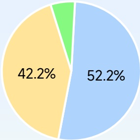
[image_caption]
这是一张饼图，展示了两个部分的百分比分布。黄色部分占42.2%，蓝色部分占52.2%。绿色小部分占比很小，未标注具体数值。
[/image_caption]

2023年

## 2025年 全球手游各系统广告主观察

2025年Android端广告主占比接近80%，中重度产品iOS端广告主占比在35%左右

## 手游广告主各系统占比

中重产品iOS端占比都在35%左右轻度产品Android端广告主占比超81%

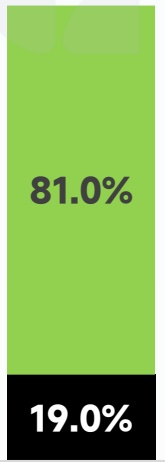
[image_caption]
该图像为一个垂直的柱状图，分为上下两部分。上部分为绿色，显示数值81.0%；下部分为黑色，显示数值19.0%。整体表示两个部分的比例关系。
[/image_caption]

轻度

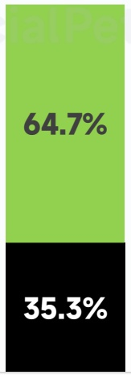
[image_caption]
该图像为一个垂直的柱状图，分为上下两部分。上部分为绿色，显示数值64.7%；下部分为黑色，显示数值35.3%。整体表示两个类别的比例分布。
[/image_caption]

中度

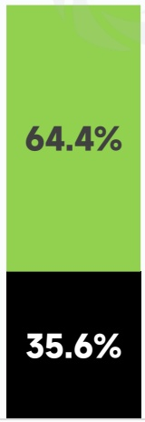
[image_caption]
该图像展示了一个垂直的双色条形图，分为上下两部分。上半部分为绿色，显示数值64.4%；下半部分为黑色，显示数值35.6%。这表示两个部分的比例关系，绿色部分占较大比例，黑色部分占较小比例。
[/image_caption]

重度

各系统手游广告主占比

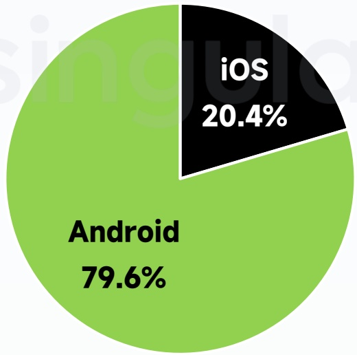
[image_caption]
这是一张饼图，展示了两个操作系统的市场份额。饼图分为两部分：绿色部分代表Android，占比79.6%；黑色部分代表iOS，占比20.4%。主要信息是Android占据了大部分市场份额，而iOS占据了较小的部分。
[/image_caption]

## 热门渠道各系统广告主占比

FB系渠道iOS端广告主占比在21%左右X（原Twitter）iOS端广告主占比最高为46.6%

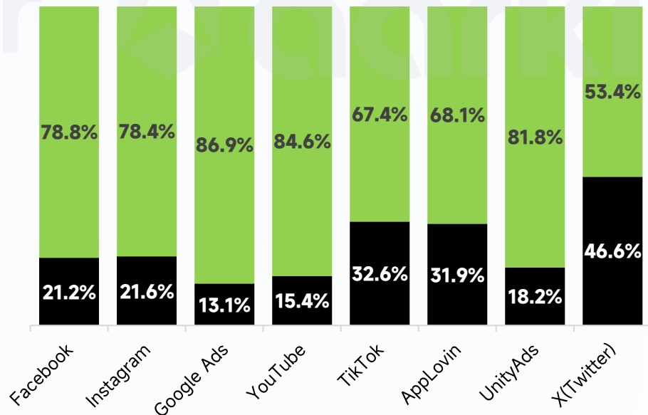
[image_caption]
这是一张柱状图，展示了不同平台的广告收入占比。具体数据如下：

- Facebook: 广告收入占比 78.8%，非广告收入占比 21.2%
- Instagram: 广告收入占比 78.4%，非广告收入占比 21.6%
- Google Ads: 广告收入占比 86.9%，非广告收入占比 13.1%
- YouTube: 广告收入占比 84.6%，非广告收入占比 15.4%
- TikTok: 广告收入占比 67.4%，非广告收入占比 32.6%
- AppLovin: 广告收入占比 68.1%，非广告收入占比 31.9%
- UnityAds: 广告收入占比 81.8%，非广告收入占比 18.2%
- X(Twitter): 广告收入占比 53.4%，非广告收入占比 46.6%

图表中，绿色部分代表广告收入占比，黑色部分代表非广告收入占比。从数据可以看出，Google Ads 和 UnityAds 的广告收入占比最高，而 X(Twitter) 的非广告收入占比最高。
[/image_caption]

## 2025年 全球手游各系统素材观察

游戏玩法越重度则iOS端素材创意占比越高，主流渠道Android素材占比大部分在70%以上

## 手游素材各系统占比

产品玩法也是重度则iOS端创意占比越高 重度产品iOS端素材占比超32%

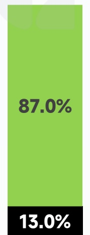
[image_caption]
该图像显示一个垂直的绿色条形图，顶部显示“87.0%”，底部显示“13.0%”。这表示两个部分的比例关系，其中87.0%占据大部分，13.0%占据剩余部分。图表类型为柱状图。
[/image_caption]

轻度

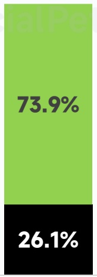
[image_caption]
该图是一个垂直的条形图，分为上下两部分。上部分为绿色，显示数值73.9%；下部分为黑色，显示数值26.1%。整体表示两个部分的比例关系。
[/image_caption]

中度

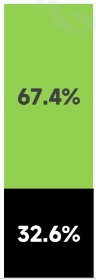
[image_caption]
该图像展示了一个垂直的双色条形图，分为上下两部分。上半部分为绿色，显示数值67.4%；下半部分为黑色，显示数值32.6%。整体表示两个部分的比例关系。
[/image_caption]

重度

各系统手游素材占比

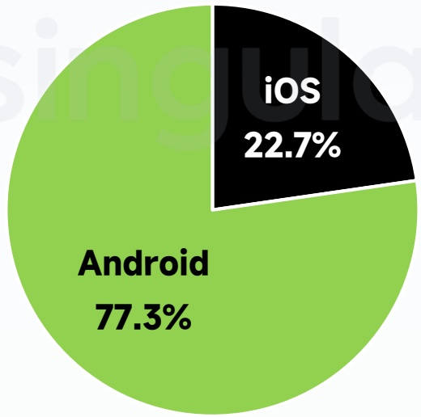
[image_caption]
这是一张饼图，展示了两个操作系统的市场份额。饼图的主要部分为绿色，代表Android系统，占据了77.3%的市场份额。另一小部分为黑色，代表iOS系统，占据了22.7%的市场份额。图表清晰地显示了Android系统在市场上的主导地位。
[/image_caption]

## 热门渠道各系统素材占比

FB系渠道iOS端创意占比在28%左右UnityAds渠道Android端广素材比最高为93.5%

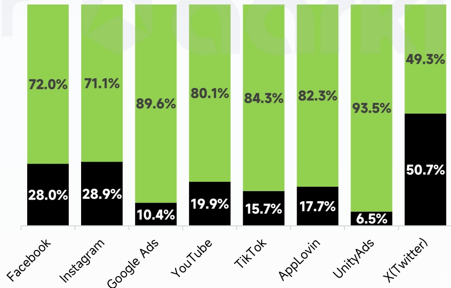
[image_caption]
这是一张柱状图，展示了不同平台的广告投放比例。具体数据如下：

- Facebook: 绿色部分占72.0%，黑色部分占28.0%
- Instagram: 绿色部分占71.1%，黑色部分占28.9%
- Google Ads: 绿色部分占89.6%，黑色部分占10.4%
- YouTube: 绿色部分占80.1%，黑色部分占19.9%
- TikTok: 绿色部分占84.3%，黑色部分占15.7%
- AppLovin: 绿色部分占82.3%，黑色部分占17.7%
- UnityAds: 绿色部分占93.5%，黑色部分占6.5%
- X(Twitter): 绿色部分占49.3%，黑色部分占50.7%

图表通过绿色和黑色的对比，清晰地展示了每个平台广告投放的主要和次要比例。
[/image_caption]

## 一线洞察

益世界、NEOCRAFT、英雄游戏、游艺春秋

## 益世界

获客成本高，用户流失率高，产品爆款率低，已成为行业常态。行业的竞争核心已从争夺增量转向经营存量，从“短跑”转向“马拉松”，未来增长倚赖两大趋势：

## 第一：从“流量消耗”到“用户滋养”，构建深度信任关系。

- 破解“获客贵、留存难”的困局，关键在于思维转变：将用户视为值得长期滋养的“伙伴”。这需要通过“品牌化”与“运营精细化”双重深耕：前者通过构建独特的世界观与持续的IP叙事，将产品升维为用户的情感寄托，建立“因为喜爱，所以留下”的深层认同；后者依托数据驱动，提供全生命周期的运营体验，将每次活动转化为长期信任的储蓄。最终目标是打造竞争壁垒，让用户心甘情愿地投入时间与情感，并转化为可持续的“商业投票”。

## 第二：玩法“轻融合”与商业“深平衡”，拓展增长新维度。

产品进化体现在玩法与商业模式的协同：玩法上做“轻融合”，趋势是在核心框架中融入副玩法或轻度目标体系（如SLG品类轻量化），以降低门槛、拓展用户，实现“轻装上阵”而“粘性倍增”。商业上做“深平衡”，即从单纯广告变现（IAA）加速转向混合变现（IAA+IAP），关键是通过精巧设计，让广告成为普惠的效率工具，让内购成为深度的价值体现，在保障体验的同时最大化收益能力。

未来的领军者，将是“用户深度运营”与“产品融合创新”相结合的长跑健将。益世界作为有十余年连续成功产品孵化经验的游戏企业，将助力合作伙伴一起赢得这场“价值马拉松”，共同实现持续的成功。

## NEOCRAFT

## 从流量博弈转向“效率革命”与“方法论迁移”

在全球游戏市场从“流量红利期”步入“存量竞争期”的背景下，出海发行的核心逻辑正在发生深刻变革：

- 赛道升维：IAP精品方法论对IAA赛道的向下兼容

当前欧美市场IAP（内购）下载量呈下滑趋势，而IAA（广告变现）及混合变现产品展现出极强的韧性，其收入已占据手游整体约 \(30\%\)

NEOCRAFT认为，未来的机会在于将成熟的MMO与卡牌类IAP发行体系（如精细化数值建模、长线运营）系统化地赋能于IAA赛道。这不仅是变现模式的改变，更是利用重度游戏的运营深度来提升轻度游戏的LTV上限。

- 品类蓝海：突破“舒适区”的渗透机会

目前中国厂商在海外消除、排序等品类已具优势，但在赛车、动作、射击等超大流量赛道的渗透率仍不足一成。这些“低渗透”领域代表了巨大的增量空间，关键在于如何结合本地化发行理念和高质素品类定制进行定点爆破。

数据基石：误差控制在10%以内的确定性发行

在欧美等成熟市场，风险控制的核心在于建立高精度的预测模型。通过自创的“流水半衰期”监控模型，将LTV模型误差控制在10%以内，能够为长达3-9个月不同的回本周期提供决策依据，确保买量投入的稳定性与安全性。

技术驱动：AI赋能的全链路增效

AI不再仅是辅助工具，而是发行效率的底座。NEOCRAFT主张将AI深度嵌入全链路：

- 营销侧：通过AIGC技术实现素材工业化，并将爆款素材的吸量看点反哺至游戏本体（如创角优化），实现“广告即内容”的体验闭环。

运营侧：依托如“鹰眼（AdEagleEye）”等监控系统，实现短期实时监控与长期收益预测的结合，利用AI算法最大化投放ROI。

NEOCRAFT始终坚持“数据驱动”与“技术驱动”双轮并行，旨在通过AI赋能与精品化运营，为全球玩家提供更高品质的游戏体验，助力合作伙伴在复杂的海外市场中实现商业与口碑的双重成功。

## 英雄游戏

## 从多赛道深耕到高品质突破：英雄游戏全球化战略的升维

英雄游戏在多年中重度手游出海实践中，已在SLG、卡牌、沙盒等多个细分领域构建了稳固的市场版图。随着全球玩家对内容品质要求的迭代，英雄游戏正通过高品质、跨平台、全球化的全新产品矩阵，实现从“赛道覆盖”到“内容驱动”的深度进化。

以2025年重点自研新作《二重螺旋》为例，该产品作为英雄游戏在动作RPG赛道的全球化旗舰作品，在立项之初便锚定全球市场：

- 内容升维：通过极具辨识度的美术风格与“多维武器组合×立体战斗”的高自由度战斗机制，打破传统动作游戏的品类边界，在多轮全球测试中展现了极高的玩家期待度。

- 多端布局：适配PC、移动端等多平台，顺应全球玩家跨设备交互趋势，通过高精度的技术实现与沉浸式叙事，塑造差异化的全球IP影响力。

在深耕高品质新作的同时，英雄游戏依然保持着对成熟产品的精细化运营。如《三国志》在日本市场的长线稳健，《Last Island of Survival》在东南亚及中东新兴市场的持续活跃，为公司积累了深厚的全球本地化运营底座。

总体而言，英雄游戏已形成“前置高品质研发 + 全球多端协同 + 精准本地化发行”的成熟方法论。我们将持续以创新内容为核心，为全球玩家提供超越预期的多元游戏体验。

## 游艺春秋

## 论前期玩法验证测试：存量博弈时代的产品突围之道

进入2025年，全球游戏市场的增长虽见回暖，但整体已步入一个高质量、高成本、高风险的“深水区”。

在版号发放趋稳、出海规模持续扩大的同时，市场对产品的品质要求也达到了前所未有的高度。过去依赖单一品类或买量策略的成功模式已难以为继，如何在激烈的存量博弈中突围，成为所有发行商与研发团队

的核心命题。我们认为，在产品立项的早期阶段，将资源集中于“前期玩法验证测试”，是当前市场环境下最为关键的决策。这不仅是为了节省后续高昂的美术与内容制作成本，更是为了在产品投入大规模开发前，以数据为依据，科学地确认核心玩法的商业化潜力与用户留存能力。

在当前“品类融合”与“题材差异化”成为主流趋势的背景下，游艺春秋认为，玩法验证的重要性被进一步放大。任何微创新或融合玩法的尝试，都必须尽快通过最小可行产品进行市场检验。我们需要回答的核心问题是：玩家是否会为这个“核心循环”买单？这要求我们将测试前置，在小范围内快速迭代，聚焦于留存等关键指标，并收集真实的用户反馈。面对动辄千万美金的研发成本，SLG、RPG等重度品类已放弃“闭门造车”。通过剥离核心逻辑，制作具备原生表现力的小游戏版本进行前期测试，已成为标准流程。

展望2025年，随着AI技术在游戏开发流程中的深度应用，游艺春秋判断产品的迭代速度将会加快，但同时也对产品的底层设计与核心乐趣提出了更高的要求。高效的前期玩法验证，将成为发行商在全球市场竞争中的新护城河。它不仅能有效降低产品的“暴死率”，更能确保有限的研发资源投入到真正具备爆款潜力的赛道上。在出海市场持续扩容、区域性机会不断涌现的当下，一个经过数据验证的强大核心玩法，是我们在全球市场稳健前行、实现可持续增长的基石，也希望新的一年，各位同行都能在业内取得好成绩。

## 02

## 2025年全球手游热门榜单

TOP GLOBAL MOBILE GAMES OF 2025

## 2025年iOS端投放TOP30

1

Vita Mahjong

乐信圣文

休闲

2

Block Blast!

Hungry Studio

休闲

3

Last War: Survival

FUNFLY PTE. LTD.

策略

4

Jigsawscapes®

乐信圣文

益智解谜

5

Zen Word®

乐信圣文

益智解谜

6

Zen Color

乐信圣文

益智解谜

7

Tile Explorer

乐信圣文

休闲

8

Lands of Jail

益世界

策略

9

Whiteout Survival

点点互动

策略

1C

MONOPOLY GO!

Scopely

桌面

11

Paint by Number Coloring Games乐信圣文

12

Mafia City

友塔网络

13

Mahjong Wonderss™

Nebula Studio

Wuthering Waves 库洛游戏

15

Kingshot

点点互动

The Grand Mafia

友塔网络

17

Coin Master

Moon Active

18

Archero 2

海彼游戏

19

Travel Town

Moon Active

20

Block Crush!

Wonderful Studio

益智

解谜

策略

休闲

RPG

策略

策略

冒险

动作

桌面

益智解谜

21

Braindom

Lahana Games

益智

解谜

22

Rise of Kingdoms

莉莉丝游戏

策略

策略

23

Evony

TOP GAMES

模拟

24

Idle Office Tycoon

成都瓦瑞尔

RPG

25

Emblem Assemble: Neo

ONG KONG LOME TRADING

策略

26

Top War

江娱互动

卡牌

27

Solitaire Clash

Aviagames

28

Bingo Voyage

VERTEX GAMES

吴乐场

29

MapleStory: Idle RPG

NEXON

RPG

30

Bible Word Puzzle

乐信圣文

文字

## 2025年AppStore下载收入TOP20

## 下载榜

<table><tr><td>1</td><td>Block Blast!</td><td>Hungry Studio</td><td>11</td><td>Goods Puzzle: Sort Challenge</td><td>ONESOFT</td></tr><tr><td>2</td><td>Roblox</td><td>Roblox</td><td>12</td><td>Royal Kingdom</td><td>Dream Games</td></tr><tr><td>3</td><td>Subway Surfers</td><td>Sybo Games</td><td>13</td><td>8 Ball Pool™</td><td>Miniclip</td></tr><tr><td>4</td><td>Township</td><td>Playrix</td><td>14</td><td>Pizza Ready</td><td>Supercent</td></tr><tr><td>5</td><td>Clash Royale</td><td>Supercell</td><td>15</td><td>Among Us!</td><td>InnerSloth</td></tr><tr><td>6</td><td>Color Block Jam</td><td>Rollic Games</td><td>16</td><td>Candy Crush Saga</td><td>King</td></tr><tr><td>7</td><td>Last War:Survival</td><td>FUNFLY</td><td>17</td><td>Free Fire</td><td>Garena</td></tr><tr><td>8</td><td>Magic Tiles 3</td><td>Amanotes</td><td>18</td><td>Royal Match</td><td>Dream Games</td></tr><tr><td>9</td><td>Vita Mahjong</td><td>乐信圣文</td><td>19</td><td>Gardenscapes</td><td>Playrix</td></tr><tr><td>10</td><td>Whiteout Survival</td><td>点点互动</td><td>20</td><td>Hole.io</td><td>Voodoo</td></tr></table>

## 收入榜

<table><tr><td>1</td><td>Royal Match</td><td>Dream Games</td><td>11</td><td>Pokémon GO</td><td>Niantic</td></tr><tr><td>2</td><td>Last War:Survival</td><td>FUNFLY</td><td>12</td><td>Gardenscapes</td><td>Playrix</td></tr><tr><td>3</td><td>MONOPOLY GO!</td><td>Scopely</td><td>13</td><td>Kingshot</td><td>点点互动</td></tr><tr><td>4</td><td>Candy Crush Saga</td><td>King</td><td>14</td><td>PUBG MOBILE</td><td>腾讯</td></tr><tr><td>5</td><td>Whiteout Survival</td><td>点点互动</td><td>15</td><td>eFootballTM</td><td>KONAMI</td></tr><tr><td>6</td><td>Pokémon TCG Pocket</td><td>Pokemon</td><td>16</td><td>Clash of Clans</td><td>Supercell</td></tr><tr><td>7</td><td>Clash Royale</td><td>Supercell</td><td>17</td><td>Call of Duty®: Mobile</td><td>腾讯&amp;动视</td></tr><tr><td>8</td><td>Gossip Harbor®</td><td>柠檬微趣</td><td>18</td><td>Toon Blast</td><td>Peak Games</td></tr><tr><td>9</td><td>Township</td><td>Playrix</td><td>19</td><td>Royal Kingdom</td><td>Dream Games</td></tr><tr><td>10</td><td>Coin Master</td><td>Moon Active</td><td>20</td><td>Brawl Stars</td><td>Supercell</td></tr></table>

## 2025年Android端投放TOP30

Vita Mahjong

乐信圣文

桌面

休闲

益智解谜

休闲

益智解谜

策略

益智解谜

益智解谜

策略

策略

Whiteout Survival

点点互动

Last War: Survival

FUNFLY PTE. LTD.

13

MONOPOLY GO!

Scopely

14

Evony

TOP GAMES

15

Lords Mobile

IGG

16

Mahjong Wonderss™

Nebula Studio

益智解谜

益智解谜

策略

策略

Bible Word Puzzle

乐信圣文

18

PUBG MOBILE

腾讯

19

Doomsday

IGG

20

Last Z: Survival

Flore Game

Total Battle: Strategy Games

Scorewarrior

## 2025年 GooglePlay下载收入TOP20

## 下载榜

<table><tr><td>1</td><td>Roblox</td><td>Roblox</td><td>11</td><td>Tile Explorer</td><td>乐信圣文</td></tr><tr><td>2</td><td>Block Blast!</td><td>Hungry Studio</td><td>12</td><td>Extreme Car Driving Simulator</td><td>AxesInMotion Racing</td></tr><tr><td>3</td><td>Ludo King</td><td>Gametion</td><td>13</td><td>Snake Calsh</td><td>Supercent</td></tr><tr><td>4</td><td>Subway Surfers</td><td>SYBO Games</td><td>14</td><td>Mini Games: Brainrot Challenge</td><td>Unicorn Studio Official</td></tr><tr><td>5</td><td>Pizza Ready</td><td>Supercent</td><td>15</td><td>8 Ball Pool</td><td>Minicip</td></tr><tr><td>6</td><td>Free Fire MAX</td><td>Garena</td><td>16</td><td>Candy Crush Saga</td><td>King</td></tr><tr><td>7</td><td>Free Fire</td><td>Garena</td><td>17</td><td>Tile Club</td><td>Gamo Vation</td></tr><tr><td>8</td><td>Hole.io</td><td>VOODOO</td><td>18</td><td>Subway Princess Runner</td><td>常春藤移动</td></tr><tr><td>9</td><td>Vita Mahjong</td><td>乐信圣文</td><td>19</td><td>Football League</td><td>MOBILE SOCCER</td></tr><tr><td>10</td><td>My Talking Tom 2</td><td>金科汤姆猫</td><td>20</td><td>Moto Race Go</td><td>XGAME STUDIO</td></tr></table>

## 收入榜

<table><tr><td>1</td><td>Last War:Survival Game</td><td>FUNFLY</td><td>11</td><td>Gardenscapes</td><td>Playrix</td></tr><tr><td>2</td><td>Roblox</td><td>Roblox</td><td>12</td><td>Free Fire</td><td>Garena</td></tr><tr><td>3</td><td>MONOPOLY GO!</td><td>Scopely</td><td>13</td><td>Last Z: Survival Shooter</td><td>Floreer Game</td></tr><tr><td>4</td><td>Coin Master</td><td>Moon Active</td><td>14</td><td>Township</td><td>Playrix</td></tr><tr><td>5</td><td>Royal Match</td><td>Dream Games</td><td>15</td><td>Kingshot</td><td>点点互动</td></tr><tr><td>6</td><td>Whiteout Survival</td><td>点点互动</td><td>16</td><td>RlNiJITM</td><td>NCSOFT</td></tr><tr><td>7</td><td>Candy Crush Saga</td><td>King</td><td>17</td><td>eFootballTM</td><td>KONAMI</td></tr><tr><td>8</td><td>Gossip Harbor®</td><td>柠檬微趣</td><td>18</td><td>PUBG MOBILE</td><td>腾讯</td></tr><tr><td>9</td><td>Pokémon GO</td><td>Niantic</td><td>19</td><td>Brawl Stars</td><td>Supercell</td></tr><tr><td>10</td><td>Pokémon TCG Pocket</td><td>Pokemon</td><td>20</td><td>Fishdom</td><td>Playrix</td></tr></table>

2025年 全球手游热投公司TOP20

<table><tr><td>#</td><td>公司名称</td><td>投放产品数</td><td>主投产品</td><td>#</td><td>公司名称</td><td>投放产品数</td><td>主投产品</td></tr><tr><td>1</td><td>乐信圣文</td><td>62</td><td></td><td>11</td><td>益世界</td><td>10</td><td></td></tr><tr><td>2</td><td>冰川网络</td><td>72</td><td></td><td>12</td><td>博乐游戏</td><td>17</td><td></td></tr><tr><td>3</td><td>FunPlus</td><td>46</td><td></td><td>13</td><td>VOODOO</td><td>232</td><td></td></tr><tr><td>4</td><td>友塔网络</td><td>21</td><td></td><td>14</td><td>Guru Puzzle Game</td><td>42</td><td></td></tr><tr><td>5</td><td>LoveColoring Game</td><td>23</td><td></td><td>15</td><td>CASUAL AZUR GAMES</td><td>197</td><td></td></tr><tr><td>6</td><td>Hungry Studio</td><td>14</td><td></td><td>16</td><td>君海游戏</td><td>33</td><td></td></tr><tr><td>7</td><td>Rollic Games</td><td>160</td><td></td><td>17</td><td>VERTEX GAMES PTE. LTD.</td><td>6</td><td></td></tr><tr><td>8</td><td>Florene Game</td><td>4</td><td></td><td>18</td><td>Supercent</td><td>139</td><td></td></tr><tr><td>9</td><td>IGG</td><td>33</td><td></td><td>19</td><td>乐牛游戏</td><td>16</td><td></td></tr><tr><td>10</td><td>腾讯 (Level Infinite)</td><td>89</td><td></td><td>20</td><td>HOMA</td><td>70</td><td></td></tr></table>

2025年手游出海品牌社媒影响力榜单

<table><tr><td>排名</td><td>品牌中文名</td><td>品牌英文名</td><td>OneSight评分</td><td>排名</td><td>品牌中文名</td><td>品牌英文名</td><td>OneSight评分</td></tr><tr><td>1</td><td>鸣潮</td><td>Wuthering Waves</td><td>486.3</td><td>11</td><td>第五人格</td><td>Identity V</td><td>404.3</td></tr><tr><td>2</td><td>原神</td><td>Genshin Impact</td><td>477.9</td><td>12</td><td>重返未来:1999</td><td>Reverse:1999</td><td>398.6</td></tr><tr><td>3</td><td>绝区零</td><td>Zenless Zone Zero</td><td>476.0</td><td>13</td><td>英雄联盟手游</td><td>League of Legends: Wild Rift</td><td>394.0</td></tr><tr><td>4</td><td>决胜巅峰</td><td>Mobile Legends: Bang Bang</td><td>461.7</td><td>14</td><td>胜利女神:妮姬</td><td>GODDESS OF VICTORY:NIKKE</td><td>392.7</td></tr><tr><td>5</td><td>崩坏:星穹铁道</td><td>Honkai: Star Rail</td><td>460.5</td><td>15</td><td>燕云十六声</td><td>Where Winds Meet</td><td>384.5</td></tr><tr><td>6</td><td>王者荣耀</td><td>Honor of Kings</td><td>446.5</td><td>16</td><td>碧蓝档案</td><td>Blue Archive</td><td>384.2</td></tr><tr><td>7</td><td>恋与深空</td><td>Love and Deepspace</td><td>441.8</td><td>17</td><td>明日方舟</td><td>Arkights</td><td>376.2</td></tr><tr><td>8</td><td>绝地求生:刺激战场</td><td>PUBG MOBILE</td><td>432.5</td><td>18</td><td>三角洲行动</td><td>Delta Force</td><td>372.7</td></tr><tr><td>9</td><td>使命召唤手游</td><td>Call of Duty Mobile</td><td>428.5</td><td>19</td><td>暗区突围</td><td>Arena Breakout</td><td>363.6</td></tr><tr><td>10</td><td>代号:血战</td><td>Blood Strike</td><td>407.3</td><td>20</td><td>传说对决</td><td>Arena of Valor</td><td>348.1</td></tr></table>

## 媒体声音

游戏葡萄 & GameLook

## 游戏葡萄

对中国手游行业来说，2025年是一个变化很大的年份。

全年出海收入依然稳定突破200亿美元，创下了新高，市场方面也有不少新的增长机会。比如传统重度游戏的统治力相对松动了一些，取而代之从诸多赛道里杀出来的，是SLG+X混合玩法、合成类及小游戏等赛道。

市场方面，欧美日韩仍然是中国手游出海的基本盘，但中东、拉美等新兴市场也在这一年展现出了惊人的爆发力。

在2026年，出海竞争或许会从单纯的卷内容、卷买量，更深度地转向玩法融合与题材洞察的竞争。与此同时，继续加深本地化的文化适配，并通过轻量化的外在和相对重度的内核吸引泛用户，也会是成功的关键。

## GameLook

2025年的出海游戏市场，全新的大作产品并不多，但却是“滚雪球”高手们表现十分突出的一年，体现了聚焦核心赛道、长青游戏战略的正确性。从结果来看，无论是SLG策略游戏、还是休闲合并消除游戏表现格外强势，目前出海TOP30中国手游产品中，常年有10款SLG游戏，而休闲内购型的手游也多达6款。

在长期买量投入、持续推高手游产品的马拉松营销大战中，休闲SLG以其具竞争力的买量方式、高ROI和高留存，抢到了更多的出海市场大盘，并在2025年诞生了《Kingshot》这样的休闲SLG全球爆款。而合并和消除类型，在2025年逐步成长为出海的巨无霸类型，已诞生单月流水收入超10亿的世界级休闲大厂--柠檬微趣，而点点互动在2025年也实现了合并休闲手游月流水破1.5亿的佳绩。

与休闲SLG、休闲合并游戏节节攀高形成鲜明对比的是，腾讯网易米哈游等传统大厂因为持续发力PC和主机平台、以及三方支付，手游带来的直接收入占比处于一个相对稳定态，大厂出海的增长点反而来自PC主机市场，旗舰游戏的3A化、跨平台化、全球化，成为了大厂的一致选择，无论是腾讯的《三角洲行动》、还是网易的《燕云十六声》均实现了PC和主机市场的海外突破。

放眼全球市场，越来越多的国内以及海外厂商开始调整发行策略，聚焦老产品或者长青游戏的经营，即反应了当下全球手游市场突破难度高、回本难的现实困境，但也提出了更多的有效改善老产品新用户增长、成本结构的措施，比如三方支付的普及，混变模式对老产品的改造，以及叠加AI能力的加持、为老游戏提供更丰富的新内容，成为了主要的手段。

在日益重视成本结构和长期回报的当下，与国内小游戏赛道继续保持高增长形成鲜明对比的是，2025年真正取得海外市场成功的出海IAP内购型小游戏却并不多、成绩并不突出，海外与国内市场反差较大的手游用户环境、平台发展状态，确实造成了国内小游戏赛道的过度拥挤，出海小游戏要取得成功已到了“万里挑一”的严苛状况，小游戏迫切需要产品品质升级和玩法和题材的本地化。

## 03

## 2025年游戏获客：真实变革何在

GAMING USER ACQUISITION IN 2025: WHAT ACTUALLY CHANGED

## 2025年游戏获客：真实变革何在

## 从动荡走向规范

时至2025年，移动游戏获客领域终于摆脱了持续的“紧急状态”。

经历了隐私政策变更、宏观经济压力及获客成本攀升等多重冲击，市场逐渐趋于稳定。但这并不意味着行业回归旧有运作模式，相反，游戏营销人员主动做出了调整，在预算分配、测试方式与效果评估上变得更加审慎。

因此，2025年的主题不再是波动与无序，而是自律与规范。

全球游戏广告支出在2025年实现小幅稳步增长，虽未呈现爆发式扩张，但意义重大。全年游戏广告支出同比呈现低个位数增幅，这标志着行业信心有所恢复，又避免了此前周期中的盲目扩张。

营销人员不再一味追求规模增长，而是致力于从每一笔增量投入中挖掘可持续的价值。

## 2025年游戏获客：真实变革何在

增长回归，但态势温和且不均衡

这一特征贯穿2025年全年，脉络清晰。

2025年初的第一季度开局审慎。由于多数团队将重心转向效率提升、测试验证与经验积累，而非激进扩张，游戏安装量环比小幅下降。第二季度，随着效果表现趋于稳定，市场预算逐步释放，尽管安装量仍略低于第一季度，环比下降中个位数，但复苏迹象已初步显现。

第三季度，在实时运营、内容迭代与创意素材持续优化的推动下，行业势头逐步积聚，游戏安装量显著回升，多个高下载量品类的环比增长达到中高个位数至低双位数。

进入第四季度，增长真正加速。假日季竞争加剧，但市场呈现突破性变化：对于创意流程成熟、衡量体系清晰的广告主而言，预算提升并未稀释效果，反而在多案例中实现了效能优化。尽管竞价压力攀升，许多游戏广告主的广告投入回报率仍保持稳定或小幅提升，与第三季度相比未出现明显波动——这彻底打破了以往旺季回报率走低的历史规律。

这一现象标志着市场逻辑的深刻转变：过往通过牺牲回报换取旺季规模扩张的模式，在2025年已被真正突破。理性增长路径，正引领行业走向更可持续的发展阶段。

## 2025年移动游戏发展势头：起步缓慢，强劲收尾

H2 Rebond

## 2025年游戏获客：真实变革何在

## 各游戏品类的规模与变现继续分化

从品类维度看，市场格局延续既有规律：2025年全年，休闲与混合休闲游戏仍占据下载量主导地位，而中核游戏与策略类游戏继续担当营收主力军——这类游戏虽需承担高出30%至50%的单次安装成本，却凭借更高的付费转化率与用户终身价值实现超额回报。

真正的变革发生在广告主连接获客与变现策略的方式上。头部团队日益聚焦早期价值信号进行优化，将创意策略、竞价模型与渠道组合全面对齐用户付费倾向，而非单纯追逐下载量。

这套以价值为核心的优化方法论在2025年加速普及，尤其在三、四季度表现显著：当行业普遍面临成本上涨时，基于价值信号的优化策略成功助力广告主在保障规模的同时实现可持续增长。

## 不同游戏品类的规模和盈利模式各不相同

High monetization

Casino

#

Midcore

Strategy

#

Puzzle

\( \therefore m = \frac{3}{11} \) ;

Casual

#

Hypercasual

#

\( \therefore m = \frac{3}{11} \) ;

\( \therefore m = \frac{3}{11} \)

1. 实验原理

1. 实验原理

1. 实验原理

Low monetization

Low scale

1. 实验原理

1. 实验原理

1. 实验原理

\( {12}/{14} \)

\( {12}/{14} \)

\( {12}/{14} \)

\( {12}/{14} \)

\( {12}/{12} \)

\( {12}/{14} \)

\( {13}/{14} \)

\( {12}/{14} \)

High scale

#

igh value

#

high volume

## 2025年游戏获客：究竟发生了哪些变化

市场周期性规律日益清晰，且更具落地价值

季节性因素历来影响游戏获客，但2025年其波动拐点变得更具可预测性。

第一季度趋于审慎，侧重效果优化；第二季度虽安装量增长有限，但随着效果可预测性信心增强，策略逐步转向扩张。第三季度延续增势，游戏安装量与投放支出环比持续上升。第四季度竞争与机遇并存：游戏营销支出在假日季大幅攀升，却未像往年那样伴随广告投入回报率的明显下滑。

这一趋势的启示不言自明：2025年的成功，并非在于避开高成本周期，而更取决于能否在关键时期做好运营准备、全力迎战。

从第一季度的谨慎到第四季度的果敢，这一对比贯穿全年。2025年的游戏获客市场，最终并非以收缩为标志，而是以精准、有度的增长为定义。

## 2025年广告预算流向解析

安卓以规模制胜，iOS以效率见长。

## 从全球市场来看，各移动平台的总体格局保持稳定。

- 安卓凭借其设备规模、更广泛的地域覆盖以及显著更低的平均用户获取成本（通常比iOS低40%至60%），持续贡献了大部分的安装量：

- iOS虽安装量较少，却创造了与其数量不成比例的高额收入，进一步巩固了其作为高效变现渠道的核心地位。

## Android 推动安装量增长, iOS 则带来价值提升

## 市场策略的关键演变在于，营销者对待两大平台的方式发生了转变：

顶尖品牌不再以相同逻辑优化安卓与iOS。他们将其视为截然不同的获客环境，针对各自特性量身定制创意方案、出价策略与效果评估体系。

[image_caption]
该图像展示了一个关于Android的特性描述图，属于结构化图形中的信息图表类型。图表的主要内容包括：

- 左上角有一个绿色的Android机器人图标。
- 标题为“Android”，字体较大且醒目。
- 列出了四个特性：
  - High volume（高容量）
  - Efficiency focused（效率导向）
  - Lower CPI（较低的每千次印象成本）
  - Broad scale（广泛规模）
- 每个特性前面有一个绿色的小圆点作为标记。
- 图表底部有一排逐渐增大的绿色矩形条，表示某种渐进或增长的趋势。

整体背景为深蓝色，设计简洁明了，突出Android的四大特点。
[/image_caption]

[image_caption]
该图像展示了一个与iOS相关的图表，背景为深蓝色，顶部有一个紫色的苹果标志和“aarki”字样。图表的主要内容包括以下几点：

- **标题**：iOS
- **列表项**：
  - Premium users（高级用户）
  - Higher monetization（更高的货币化）
  - Higher CPI（更高的每次点击成本）
  - Value driven（价值驱动）

底部有四个不同长度的蓝色矩形条，从左到右依次变长，可能表示各项指标的相对重要性或比例。

整体来看，这是一个信息图，用于说明iOS平台在用户、货币化、成本和价值方面的特点。
[/image_caption]

## 2025年广告预算流向解析

付费社交：保持主导地位，但集中度风险上升

2025年全年，付费社交平台仍是游戏获客的核心支柱，贡献了全球大部分广告支出和安装量。然而，季度数据显示，主流社媒渠道的边际收益在下半年加速下滑，第三、第四季度尤为明显。

竞价波动性加剧、创意疲劳以及竞争白热化，共同放大了“渠道过度集中”的弊端。相比之下，那些跳出核心渠道、实现渠道多元化的广告主，往往能获得更高的边际收益——部分广告主的广告投资回报率（ROAS）比“渠道单一”的同行高出中个位数。

到第四季度，渠道多元化已不仅是“增长杠杆”，更成为了一种“风险管理策略”。

## 多元化已成为一种必然要求而非一种策略

CONCENTRATION RISK

[image_caption]
该图像显示了一个蓝色背景上的白色轮廓图形，形状类似于一个倒置的梯形或漏斗。图形的顶部标有“2-3 channels”，底部标有“vulnerable”。图形内部有两个白色的圆点，分别位于图形的上部和下部。整体来看，这是一个简化的示意图，可能用于表示某种流程或状态的变化，其中“2-3 channels”表示初始状态，而“vulnerable”表示最终状态。
[/image_caption]

Policy exposure

Performance volatility

Limited optionality

Risk mitigation

Stable performance

\(\checkmark\) Strategic flexibility

DIVERSIFIED PORTFOLIO

## 2025年广告预算流向解析

## 创意：成为最可控的业绩驱动因素

2025年，无论在哪个平台或渠道，创意都成为最可控的业绩驱动因素。

短视频、受用户生成内容（UGC）启发的素材以及快速迭代的创意形式，其表现持续优于静态素材或过度打磨的内容。

创意迭代速度较快的广告主，能更长久地维持效果表现；而更新周期较慢的广告主，其广告投资回报率（ROAS）下滑速度会加快，在第四季度的竞争高峰期尤为明显。

## 衡量不完善信号下的增长

## 成熟的衡量能力，铸就竞争优势

- 2025年，精细化衡量能力，往往决定了企业是迈向自信扩张，还是陷于谨慎停滞。

- 拥有先进归因框架的广告主，能更果断地分配预算，优化方向也更清晰；而依赖简单模型的广告主，在日益复杂的市场环境中，难以准确解读绩效信号。

## 突破末次点击归因的局限

“末次点击归因”模式仍在低估漏斗上层和中层活动的价值。采用“多触点归因（Multi-Touch Attribution）的游戏广告主，能够清晰洞察“辅助价值”与“跨渠道影响”。

这一洞察助力广告主制定更均衡的媒体策略，减少了为追求短期效果而过度投入漏斗底层策略、进而损害长期增长潜力的倾向。

## 用模型填补信号缺失的空白

2025年，由隐私保护导致的信号缺失（尤其在iOS端）并未消失，但领先的广告主已找到应对之法。

“模型转化”（Modeled Conversions）与“混合绩效指标”让团队得以维持优化工作的连续性。围绕模型化产出结果凝聚各相关方共识，头部企业有效减少了内部摩擦，加速了决策进程。

## 2025年游戏营销者的启示：迈向2026年的关键洞察

三大核心要义：

1 稳扎稳打胜于激进扩张，体系化增长优于盲目追逐流量规模。

2 创意迭代比单纯拓宽渠道更能铸就持久优势。

尤为关键的是，信心成就智慧增长。信赖自身衡量体系的广告主，以更敏捷的步伐应对竞争，在2025年的征程中实现了实力跃升，以比年初更稳健的姿态迎接新程。

## 04

## 全球手游
全链路增长策略指南

2026 MOBILE GAMES FULL-FUNNEL FRAMEWORK

## 全链路增长策略指南

一套简单、可复制的盈利增长框架，助力移动应用在2026年破局盈利

获客成本持续上升、用户增长趋于停滞以及用户快速流失，正在暴露“效果至上”

(performance-first）的营销模式所面临的结构性瓶颈。随着早期用户流失逐渐成为增长的核心制约因素，2026年将成为一个关键拐点——未来的增长将不再依赖单纯的预算投入或割裂式的局部优化。

在本章节中，Aarki 提出了一套以留存为核心驱动的全链路增长框架，将用户获取、互动与再营销统一到一个持续演进的学习系统之中。在这一系统内，数据信号不断叠加，而智能化能力则随着每一次用户交互不断增强。

未来真正能够胜出的营销者，将是那些从“单一投放活动”转向“系统化增长体系”，并且从短期转化目标迈向长期价值创造的人。

## 移动增长，本质上就是全链路增长

## 可持续的增长路径

Aarki数据显示，用户获取（UA）成本同比上升 \(12\%\) ，而整体投放预算却增长了 \(26\%\).与此同时，用户规模增长几乎停滞，同比仅增长 \(2\%\).

投入与增长之间不断扩大的鸿沟，清晰地揭示了“效果至上”的增长思路已触及上限。

营销者亟需一套全新的增长框架——一套以构建真实用户连接为核心、而非仅追求短期转化结果的增长体系。

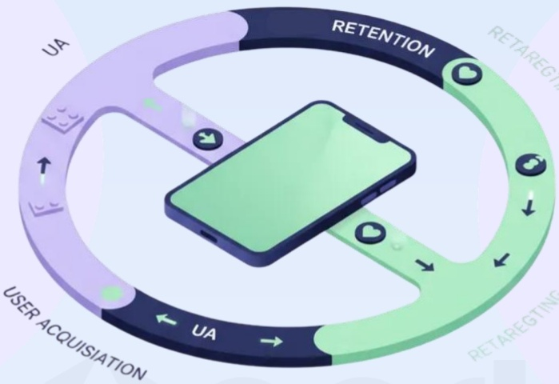
[image_caption]
该图像展示了一个流程图，描述了用户获取（User Acquisition, UA）和用户留存（Retention）的过程。图中包含以下部分：

1. **用户获取（User Acquisition, UA）**：
   - 位于图表的左侧，用紫色表示。
   - 包含一个积木图标，象征着构建或搭建用户基础。
   - 有一个向上箭头，表示用户数量的增加。

2. **用户留存（Retention）**：
   - 位于图表的右侧，用绿色表示。
   - 包含多个心形图标，象征着用户的忠诚度和满意度。
   - 有多个向下箭头，表示用户可能流失。

3. **循环过程**：
   - 图表整体形成一个闭环，表示用户获取和用户留存是一个持续的过程。
   - 中间有一个智能手机图标，象征着移动应用或服务的核心。

4. **标签**：
   - 左侧标签为“USER ACQUISITION”。
   - 右侧标签为“RETENTION”。
   - “UA”标签在两个部分中都有出现，表示用户获取在两个阶段都起作用。

该流程图清晰地展示了用户从获取到留存的整个生命周期管理过程。
[/image_caption]

## 关键变化

据 Business of Apps 数据显示，在iOS与Google Play平台上，超过 \(95\%\) 的移动游戏安装用户会在30天内流失3。

在如此规模化的用户流失背景下，2026年将成为可持续增长的关键拐点。

真正的可持续增长，要求以留存为核心驱动的全链路协同机制——在这一机制中，用户获取、互动与再营销不再各自为战，而是作为一个统一的学习系统协同运作。

“留存正在成为新的效果指标，而效果，正在成为新的品牌。”

Rajeev Ranjan,

Aarki产品副总裁

## 增长并非单向链路，而是持续循环

传统投放链路在「用户安装」时结束，而真正的增长机会恰恰从这里开始。

当下的增长路径并非一条直线，而是信号、内容与行为之间持续交换并随时间不断累积的过程。

## 左侧循环：用户获取（UA）

负责捕获用户注意力，并将其转化为初始行动。

## 右侧循环：再营销（RT）

通过持续互动重新激活用户，并不断强化留存。

## 核心引擎：Aarki的差异化能力

位于系统中央的是Aarki的核心优势——一个由监督式AI、创意智能与数据反馈闭环共同驱动的智能引擎，同时加速并强化左右两侧的增长循环。

「无限循环 (Infinity Loop)」是 Aarki 提出的、用于实现互联和可持续增长的模型。它以一个有生命力的系统取代了单向链路——在这个系统中，每一次用行为都会为下一次增长提供动能。

[image_caption]
该图像展示了一个流程图，中心是一个标有“AI Engine”的圆形模块，周围有两个环形路径。左侧路径上方标有“UA”，并配有一个手机图标，显示一个绿色的向下箭头，表示用户获取（User Acquisition）的过程。右侧路径上方标有“RT Retargeting”，并配有一个绿色的循环箭头图标，表示再营销（Retargeting）的过程。整个流程图通过箭头指示了数据或信息在AI引擎、用户获取和再营销之间的流动方向。
[/image_caption]

监督式 AI（Supervised AI）将人类洞察与机器级精度相结合：它能够从投放表现中进行实时学习，将这些经验跨渠道应用，并在数据信号衰减的环境下，依然保持优化过程的透明性与可控性。这种人类语境理解与算法速度之间的平衡，使自动化不再只是效率工具，而成为可持续竞争优势。

每一次循环都会强化下一次增长

认知转化为认同，认同进一步演变为主动传播

来自留存阶段的洞察，持续反向重塑获客策略

## 全链路增长框架——新一代移动增长的标准范式

在这里，Aarki 的「无限循环」进一步演进为一套完整的「全链路增长框架」。这是一个将用户获取（UA）、再营销（RT）与用户生命周期管理统一于同一增长引擎之中的持续运转系统，以实现可规模化、可盈利的增长。

这是一套简单、可复制的增长体系：在其中，每一个数据信号都会转化为决策，每一次创意投放都会沉淀为智能资产，每一轮投放都会反向强化下一轮增长。

## 当前现状：

## 增长循环正在演变为价值循环。

每一次创意选择、每一个信号反馈、每一次用户行为，都会成为提升用户生命周期价值（LTV）的关键洞察来源。

## 应用商店已不再是唯一的增长入口。

用户正以自己的方式进入你的产品生态——来自 Web、移动端，以及 Webshop、第三方应用商店等新兴触点。

## 分发渠道不断多元化。

设计并统筹「自有用户体验」的能力，将成为你最核心的竞争优势。

[image_caption]
该图是一个流程图，展示了一个由AI驱动的循环系统。图中有四个主要部分：UA（用户获取）、LTV（生命周期价值）、RT（转化率）和AI（人工智能）。这些部分通过箭头连接，形成一个无限符号（∞）的形状，表示一个持续的循环过程。

1. **UA（用户获取）**：位于左侧，绿色六边形，表示用户获取的过程。
2. **AI（人工智能）**：位于中心，深蓝色圆形，表示人工智能在系统中的核心作用。
3. **LTV（生命周期价值）**：位于顶部，深蓝色六边形，表示用户在整个生命周期中的价值。
4. **RT（转化率）**：位于右侧，紫色六边形，表示用户的转化率。

箭头从UA指向AI，从AI指向LTV，从LTV指向RT，从RT指向AI，形成一个闭环，表明这些环节相互关联，共同作用于整个系统。AI在中间起到连接和协调的作用，确保用户获取、生命周期价值和转化率之间的有效互动。
[/image_caption]

## 机遇所在：

开发者如今能够真正掌控用户关系，并承担随之而来的责任与主动权。

这意味着用户体验上的摩擦将减少，用户获取与再营销将更加紧密连接，并使得用户生命周期价值（LTV）成为增长的核心驱动力。

## 用户留存的「黄金五法则」

五条规则，一个目标：让用户留下来、提升付费率、持续提升全链路增长。

## 01

留存从第0天开始，而不是第30天

- 最有价值的用户并非只是“留下来”，他们从一开始就建立了强连接。

- 将用户参与设计进新手引导流程，在首次付费发生之前就清晰传递你的核心价值。

## 04

再营销,

本质上是研发 (R&D)

[image_caption]
该图是一个图标，显示了一个手指点击按钮的图案，按钮上有一个循环箭头符号。这通常表示刷新或加载的动作。图标整体为绿色轮廓，内部填充为白色。
[/image_caption]

\(\bullet\) 把每一次再营销活动都看成测试。

\(\bullet\) 有效的信息能够揭示哪些价值点最能打动即将流失的用户。将这些洞察反向应用于用户获取，可显著提升整体效率。

Aarki 观察发现：再营销用户带来的 LTV 显著高于同期新获取的用户。

## 02

衡量关系深度，而非触达广度

\(\bullet\) 追踪质量胜过数量。

- 互动频率、单次会话深度、再激活成本，共同构成对用户基础的 \(360^{\circ}\) 全景认知。

## 05

放大有效策略，暂停进入平台期的动作

[image_caption]
该图像为一个图标，显示了一个由四个逐渐增高的矩形组成的阶梯状图形，顶部有一个圆形图案。这通常表示增长、进步或提升的概念。
[/image_caption]

- 不要追逐短期势能，应维持可持续动能。

- 将预算持续投入到能够构建长期价值的用户群体与创意体系，而非短期速赢。

长期保持稳定再营销预算的团队，往往能获得更平滑的ROI曲线与更低的投放波动性。

## 03

在用户产生疲劳之前完成内容更新

[image_caption]
该图片是一个图标，显示了一个侧脸轮廓，头部内有一个电池符号，电池符号的电量指示条为满格状态。图标整体颜色为绿色。
[/image_caption]

\(\bullet\) 创意相关性往往在数天内快速衰减。

- 主动规划更新节奏，在注意力流失之前完成内容更新，确保在整个增长循环中保持连贯一致的叙事体验。

Aarki创意智能数据显示：若不进行刷新，CTR在4次曝光后可能下降约 \(45\%\) ；而结构化刷新周期可将表现稳定性提升约 \(30\%\) 。

## 留存并非一个阶段,

而是一套持续运转的效果系统。

当用户生命周期管理与创意体系实现协同，每一位被成功留存的用户，都会成为ROI的放大器，不仅增强用户忠诚度，也为下一轮增长循环持续提供动力。

## 66

留存并非营销链路中的某个环节，而是判断整体增长策略是否有效的关键标志。

Avi Das,

Aarki首席营收官

## 协同运作：用户获取、再营销与用户生命周期管理

打通数据、创意与反馈，构建持续运转效果循环

当团队各自为战时，洞察便会被困于孤岛，难以流通。

但当用户获取(UA)、再营销(RT)与用户生命周期管理共享同一套数据、创意资产与反馈机制时，增长便不再是一系列彼此割裂的投放活动，而演变成一个持续运转的效果循环体系。

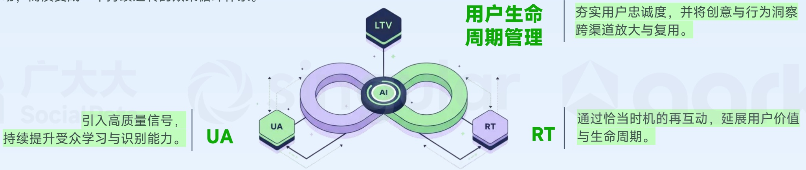
[image_caption]
该图片展示了一个关于用户生命周期管理的流程图。图中心是一个无限符号，内部标有“AI”，表示人工智能在其中的核心作用。无限符号的左侧和右侧分别有两个六边形，左侧为绿色，标有“UA”；右侧为紫色，标有“RT”。这两个六边形通过箭头与无限符号相连，表示数据或信息的流动。

在无限符号的上方，有一个深蓝色的六边形，标有“LTV”，表示用户生命周期价值。LTV通过箭头与无限符号相连，表明其与AI的关系。

图片左侧的文字说明：“引入高质量信号，持续提升受众学习与识别能力。”右侧的文字说明：“通过恰当时机的再互动，延展用户价值与生命周期。”

图片右侧的文字进一步解释：“夯实用户忠诚度，并将创意与行为洞察跨渠道放大与复用。”

整体来看，该图表描述了一个通过人工智能（AI）驱动的用户生命周期管理流程，涉及用户获取（UA）、用户转化（RT）和用户生命周期价值（LTV）三个关键环节，强调了高质量信号的引入和适时的再互动以提升用户价值和生命周期。
[/image_caption]

三者共同构成了Aarki所称的“协同优势”——一个由跨团队协作、创意智能与统一归因驱动的增长引擎。

在UA与RT之间共享创意洞察的团队，优化迭代速度最高可提升 \(30\%\)

UA + RT 协同投放相比割裂执行，用户生命周期价值（LTV）提升约 \(20\%\)

“未来的营销赢家，并不会去运行多套割裂的系统，而是去指挥一支统一、智能的「增长交响乐团」。”

Rajeev Ranjan,

Aarki产品副总裁

## 反之，当三者各自为战，投入的增长与浪费将成倍增加

Aarki 分析显示，重叠的受众细分会在竞价中引发自我竞争，推高千次展示成本并透支创意有效性。

这将导致——用户困惑，而非转化。

解决方案——将 UA 与留存环节打通，释放整体价值。

Aarki 首席营收官 Avi Das 提出，团队必须战胜阻碍协同增长的「四大挑战」：

## 创意瓶颈

在高频曝光场景下，广告疲劳往往在一周内迅速显现。然而，真正将数据转化为创意优化行动的营销者，仅占 \(10\% - 20\%\).

## 成本膨胀

几乎所有品类的全球CPI都在持续上升。真正实现变现的用户比例不足 \(5\%\) ，在休闲类应用中甚至低于 \(2\%^2\) 。当前的盈亏平衡周期，已被拉长至90天以上。

## 隐私约束

全球隐私法规持续收紧，对数据的采集、存储与共享方式提出更高限制。用户同意变得更难获取，而用户对侵入式广告的容忍度也在持续下降。

## 信号流失

Apple的ATT框架大幅削弱了用户级别的可见性。数据显示，全球用户选择同意追踪的比例约为 \(35\%\) ，这意味着大多数广告主只能在不完整信号基础上进行优化决策。

解决之道并非一味地加大投入，

而是重新设计 UA 与 RT 的协同方式，实现更智能、更有效的增长。

“盲目地投入不仅是在浪费预算，更是在与自己竞价。”

Avi Das,

Aarki首席营收官

## 掌控投放节奏，做出理性决策

可持续的全链路增长，并不意味着一味加码。

关键在于——在效果信号、创意反馈与留存数据之间取得平衡，从而做出更理性、更具前瞻性的增长决策。

#

明智的增长并非持续加速，而是对节奏的精

准控制——懂得何时发力，何时调整。

Avi Das, Aarki 首席营收官

[image_caption]
该图是一个图标，背景为绿色，前景为黄色线条绘制的图案。图案中包含一个带有美元符号的向上箭头，下方有三个大小不一的圆形，象征着金钱的增长或财富的积累。整体设计简洁明了，传达出积极的财务增长概念。
[/image_caption]

## 扩量 Scale

- 当留存表现显著优于中位水平，且RT ROI至少达到UA ROI的1.5倍时，应果断增加投入。

- 放大在跨渠道中持续带来稳定增量的高表现人群与创意组合。

## 暂停 Pause

- 当CPI上升速度快于LTV，或创意疲劳度超过\(40\%\)时，应主动放缓节奏。

- 重新评估人群细分、刷新创意内容，或在 UA 与 RT 之间重新平衡资源配置。

[image_caption]
该图是一个图标，显示了一个循环箭头的图案，其中包含一个人形符号。箭头呈绿色，形成一个逆时针方向的循环，表示一个过程或流程的循环往复。人形符号位于箭头的中心，可能代表用户、参与者或某个实体在流程中的角色。整体设计简洁明了，常用于表示反馈循环、持续改进或用户参与的过程。
[/image_caption]

## 再投入 Reinvest

- 当新的人群细分或创意洞察展现出早期潜力，应及时加大投入。

- 将预算从进入平台期的活动中转向哪些已被验证、能持续提升LTV的优质效果渠道。

掌控

节奏的力量

可持续增长，从来不是比拼速度。

而是在于时机、精准度，以及知道什么时候应该稳住阵脚。

Aarki 的分析显示：

基于留存与创意表现来调节投放节奏的营销者，能够实现 \(20\%\) 以上的ROI稳定性提升，并将季度环比波动性降低约 \(25\%\).

## 打造可持续的竞争优势

只有具备可持续性的增长，才能在未来真正建立竞争优势。

优秀的系统不仅能够响应信号，

更能够记住、迭代，并在每一次循环中持续放大价值。

这种持续学习的能力，

正是全链路增长体系的核心所在。

[image_caption]
该图是一个流程图，展示了一个以人工智能（AI）为核心的客户生命周期管理模型。图的中心是一个绿色的立方体，标有“AI”，周围环绕着四个主要阶段：Acquisition（获取）、Engagement（参与）、Reactivation（重新激活）和另一个未明确标注但与这些阶段相关的部分。每个阶段都用不同的图标表示，例如：

- Acquisition（获取）：包含手机、图表和硬币等图标，表示吸引新客户的过程。
- Engagement（参与）：包含对话气泡和手机等图标，表示与现有客户的互动。
- Reactivation（重新激活）：包含循环箭头和手机等图标，表示重新激活流失客户的策略。

这些阶段通过线条与中心的AI立方体相连，表明AI在每个阶段中发挥的作用。整个图表以圆形布局呈现，强调了客户生命周期的连续性和循环性。
[/image_caption]

## 每一次互动，都是下一次增长的起点

- 每一次曝光、每一次互动、每一条洞察，都会为下一轮增长提供动力

- 每一次用户行为，都会进一步校准与优化模型

- 每一次投放活动，都会让下一次决策更加智能

当团队将用户获取、互动和再营销协同编排为一个统一的学习引擎，AI便能够将行为模式转化为具备前瞻性的智能预测，持续释放未来的绩效增量。

进入2026年，真正有效的增长，将来自系统化、以学习与留存为核心的全链路增长框架。

现在，正是完成这一转变的关键时刻。

每一次循环，都会带来新的认知。真正拉开差距的，是将认知转化为行动的速度。

Aman Sareen,

Aarki首席执行官

## 成功案例

Aarki 帮助 ROVIO 打破增长天花板，持续超额达成 D90 ROI 目标

## 挑战与目标

重新激活《Angry Birds 2》的高价值流失用户，并最大化其长期投资回报（ROI）。

## Aarki 解决方案

基于监督式AI的再营销体系，持续提升LTV与ROI

\(\bullet\) 基于应用内行为分析构建高价值LTV用户分层

- 运用预测模型评估用户长期价值（LTV），并据此动态优化出价

通过Aarki Creative Studio，持续输出数据驱动、以效果为导向的创意素材

## 关键成果

Aarki 帮助 Rovio 成功重新激活高价值用户群体，在推动 ROI 持续增长的同时，通过 AI 驱动的定向能力与创意优化，进一步释放了长期用户价值。

D90 ROI平均超出目标1.7倍

D7 ROI 持续稳定达成（平均约 1.3 倍）

D365 LTV 目标在 3 个月内达成

在成功重新激活高价值用户的同时，实现预算的高效规模化

在Aarki团队的支持与专业能力帮助下，我们不仅达成了长期ROI目标，也看到了整体投放表现的持续提升。

——Rovio 用户获取负责人

## 05

## 2025年手游

## 热门品类营销洞察

2025 GLOBAL MOBILE GAME MARKETING TREND INSIGHTS

## 4X策略游戏：竞争力评分卡

## 视角：Funtap Games I 早期指标分析

为何早期指标至关重要？若你采用“以小游戏作为钩子”的运营策略，则必须验证该“钩子”是否被玩家真正接受。

## 我们将分析哪些内容？

D1留存率：首日钩子与漏斗过滤机制

D7留存率：核心玩法挑战与社交过滤机制

首周游戏时长行为分析：包括日均活跃游戏时长与会话结构

## 究竟是什么真正决定一款产品能否全球发行？

## D1与D7留存率：竞争水平

- 这是用户获取（UA）的最低可行阈值。在此水平下，若长期用户生命周期价值（LTV）强劲，游戏即可实现盈亏平衡。绝大多数中端4X策略游戏均处于此区间。

- 在此阈值下，社交生态运转良好，公会战等社群活动具备充足的玩家参与度。

- 若你的游戏为纯经典SLG，且D1留存率仅为 \(25\% - 30\%\) ，你将输掉“用户竞价战”，因为竞争对手拥有更宽广、更高效的用户漏斗。

- 联盟加入率:Funtap Games的深度报告显示，4X游戏的D7留存率几乎完全取决于联盟加入率。

- 玩家在D3前加入联盟的比例必须超过 \(60\%\) ，方能构建健康的生态体系。

- 那些加入联盟并参与“协助”互动（缩短建造时间）或参与“集结”活动（Boss突袭）的玩家，其D7留存率是单人玩家的3至4倍。

<table><tr><td>游戏品类</td><td>D1留存率
(Android)</td><td>D1留存率
(iOS)</td></tr><tr><td>行业中位数</td><td>20%-25%</td><td>25%-28%</td></tr><tr><td>竞争力水平</td><td>30%-35%</td><td>35%-40%</td></tr><tr><td>市场领导者</td><td>40%-45%</td><td>45%-55%</td></tr></table>

<table><tr><td>游戏品类</td><td>D7留存率</td></tr><tr><td>行业中位数</td><td>10%-15%</td></tr><tr><td>竞争力水平</td><td>15%-18%</td></tr><tr><td>市场领导者</td><td>18%-25%(或更高)</td></tr></table>

## 首周游戏时长行为分析

## 日活跃游戏时长与会话结构

- 蜜月期：首周内，活跃玩家日均游戏时长为40-60分钟，核心付费用户（“鲸鱼用户”）可达1.5至3小时。首日峰值约90分钟，源于快速升级与教程完成带来的“初始满足感”。

- 高频低时长模式（心智占用模型）：与MOBA或RPG不同，4X策略游戏依赖“高频、时长可变”的会话模式，日均会话8-12次。其中70%为短时检查（3-5分钟），用于资源维护；30%为深度参与（20-45分钟），聚焦活动与事件，持续占据玩家心智。

- 社交分水岭（第7天分化）：至第7天，游戏时长的持续性完全取决于社交整合。加入联盟的玩家因参与集结、PvP等活动，日均时长维持在45分钟以上；而单人玩家因建造冷却延长至4-8小时，时长骤降至20分钟以下，构成关键留存风险。

## 真正决定全球上线成败的关键是什么？

- 软启动数据偏差：软启竞争力，Beta阶段需达成45%的D1留存率，方可支撑30%的全球目标。

- 10小时规则：首周累计游戏时长达600分钟（10小时）的玩家，转化为付费用户的概率提升5倍。应抓住D1或D2的时长高峰，及时触发限时优惠，最大化转化效率。

<table><tr><td>指标</td><td>第一天</td><td>第七天</td></tr><tr><td>总游戏时长</td><td>高(60-90分钟)</td><td>可变(取决于活动/战争)</td></tr><tr><td>会话次数</td><td>低(2-3次长会话)</td><td>高(8-12次短会话)</td></tr><tr><td>计时器时长</td><td>秒级到分钟级</td><td>小时级(4-8小时)</td></tr><tr><td>核心驱动因素</td><td>即时成长反馈</td><td>联盟压力与活动驱动</td></tr><tr><td>关键风险</td><td>计时器过早变长易导致无聊</td><td>若在D4前未加入联盟,易产生孤立感</td></tr></table>

## Funtap Games建议

4X策略游戏：竞争力评分卡

<table><tr><td>KPI指标</td><td>测试阶段</td><td>软启动阶段</td><td>全球上线</td></tr><tr><td>D1留存率</td><td>35%</td><td>35%-40%</td><td>&gt;45%</td></tr><tr><td>D7留存率</td><td>12%</td><td>15%-18%</td><td>&gt;18%</td></tr><tr><td>D1游戏时长</td><td>&gt;30分钟</td><td>&gt;60分钟</td><td>&gt;90分钟</td></tr><tr><td>会话频率</td><td>4次/天</td><td>8-10次/天</td><td>12+次/天</td></tr><tr><td>联盟加入率(D3)</td><td>40%</td><td>&gt;65%</td><td>&gt;80%</td></tr></table>

以上仅为最低达标指标；若要具备规模化增长的条件，这些数据必须显著高于该水平。

## 早期留存与规模化准备关键建议

## 1. 通过混合式引导提升D1留存率>40%

传统城市建造类游戏易导致早期流失。首次用户体验（FTUE）应在前15分钟内通过整合操作、解谜或电影化时刻来提供强参与感，遵循经验证的4X游戏基准。

## 2. 通过强制社交化稳固D7留存

加入联盟应成为前24小时内的一项必做主线任务。核心事件必须强制要求组队游玩，因为4X游戏的D7留存由公会参与驱动。

## 3. 通过早期时间压缩培养习惯

使用大量加速道具来加快第一周进度。避免早期长时间等待；在第二周收紧经济前，优先建立每日约60分钟的游戏习惯。

## 4. 付费流量验证规模化能力

不要依赖自然流量指标。应尽早用付费用户获取（UA）进行测试。若付费D1留存率低于 \(35\%\) 则产品尚未准备好进行全球规模化。

## 策略手游投放趋势观察

轻度减负+错位社交成为策略手游常态，海量副玩法买量中跑酷副玩法成为多数厂商首选

各类型素材带来展现占比

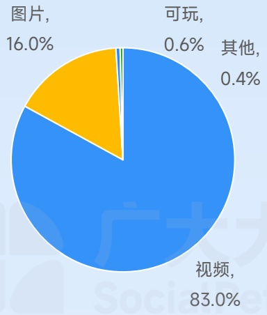
[image_caption]
这是一张饼图，展示了不同类型内容的占比情况。具体数据如下：

- 视频：83.0%
- 图片：16.0%
- 可玩：0.6%
- 其他：0.4%

饼图中，视频占据了最大的比例，用蓝色表示；图片次之，用黄色表示；可玩和其他分别用较小的区域表示。
[/image_caption]

视频素材时长分布

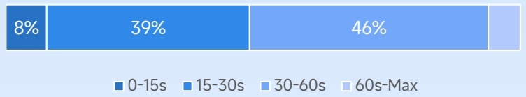
[image_caption]
该图是一个水平条形图，展示了不同年龄段的人群占比。具体数据如下：
- 0-15s：8%
- 15-30s：39%
- 30-60s：46%
- 60s-Max：7%

图表使用不同深浅的蓝色来区分各个年龄段，从左到右依次为最深蓝、中蓝、浅蓝和极浅蓝。每个年龄段的百分比清晰标注在对应的条形上方。
[/image_caption]

图片素材形式分布

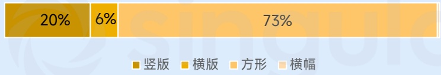
[image_caption]
该图是一个水平条形图，展示了四种不同类型的图片比例。具体数据如下：
- 竖版：20%
- 横版：6%
- 方形：73%
- 横幅：未显示具体数值

图表下方有图例，分别用不同颜色的方块表示四种类型：
- 深黄色：竖版
- 浅黄色：横版
- 中黄色：方形
- 浅橙色：横幅

整体来看，方形图片占比最大，达到73%，其次是竖版图片占20%，横版图片占6%，横幅图片未显示具体数值。
[/image_caption]

不同系统策略素材占比

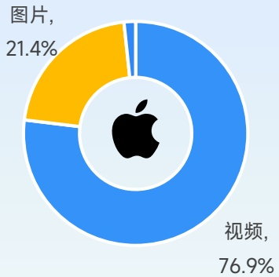
[image_caption]
这是一张饼图，显示了两种类型的占比情况。饼图的中心有一个苹果的标志。饼图分为两个部分：黄色部分占21.4%，标注为“图片”；蓝色部分占76.9%，标注为“视频”。整体背景为浅蓝色。
[/image_caption]

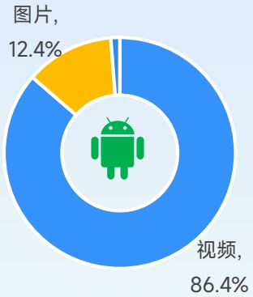
[image_caption]
这是一张饼图，显示了两种类型的占比。蓝色部分占86.4%，标注为“视频”；黄色部分占12.4%，标注为“图片”。图表中央有一个绿色的Android机器人图标。
[/image_caption]

TOP100广告主出海厂商占比

广告主数量月度变化趋势

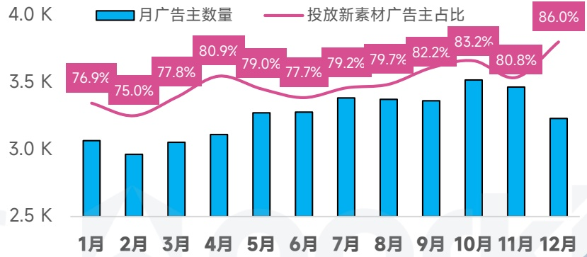
[image_caption]
该图表为柱状图和折线图的组合，展示了月广告主数量和投放新素材广告主占比的变化趋势。

- **柱状图**（蓝色）表示月广告主数量，单位为千（K）。具体数值如下：
  - 1月：3.0K
  - 2月：2.9K
  - 3月：3.0K
  - 4月：3.1K
  - 5月：3.2K
  - 6月：3.2K
  - 7月：3.3K
  - 8月：3.3K
  - 9月：3.4K
  - 10月：3.5K
  - 11月：3.5K
  - 12月：3.3K

- **折线图**（粉色）表示投放新素材广告主占比，单位为百分比（%）。具体数值如下：
  - 1月：76.9%
  - 2月：75.0%
  - 3月：77.8%
  - 4月：80.9%
  - 5月：79.0%
  - 6月：77.7%
  - 7月：79.2%
  - 8月：79.7%
  - 9月：82.2%
  - 10月：83.2%
  - 11月：80.8%
  - 12月：86.0%

整体来看，月广告主数量在年初有所波动，随后逐渐上升并在10月达到最高点，之后略有下降。投放新素材广告主占比则呈现出较为平稳的上升趋势，尤其是在下半年增长明显。
[/image_caption]

月均在投素材量变化趋势

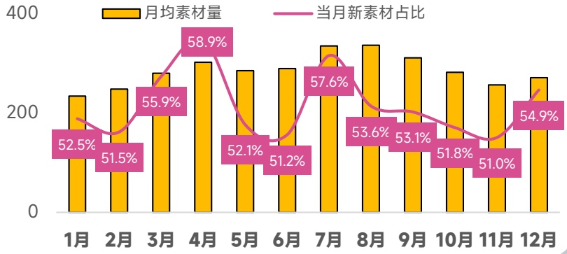
[image_caption]
这是一张柱状图和折线图结合的图表，展示了月均素材量和当月新素材占比的数据。图表的横轴表示月份，从1月到12月；纵轴表示数值，范围从0到400。

### 图表描述：

#### 1. 柱状图（黄色）
- **标题**：月均素材量
- **数据**：
  - 1月：约230
  - 2月：约230
  - 3月：约250
  - 4月：约280
  - 5月：约260
  - 6月：约260
  - 7月：约300
  - 8月：约300
  - 9月：约290
  - 10月：约270
  - 11月：约260
  - 12月：约260

#### 2. 折线图（粉色）
- **标题**：当月新素材占比
- **数据**：
  - 1月：52.5%
  - 2月：51.5%
  - 3月：55.9%
  - 4月：58.9%
  - 5月：52.1%
  - 6月：51.2%
  - 7月：57.6%
  - 8月：53.6%
  - 9月：53.1%
  - 10月：51.8%
  - 11月：51.0%
  - 12月：54.9%

### 数据趋势分析：
- **月均素材量**：整体呈现波动上升的趋势，4月和7月达到峰值，分别为约280和300。
- **当月新素材占比**：在3月和7月达到高点，分别为55.9%和57.6%，其余月份则相对平稳，多数在50%至55%之间。

这张图表清晰地展示了每月素材量的变化及其新素材占比的波动情况，有助于分析素材生成和更新的规律。
[/image_caption]

## 策略手游 热门创意策略

选择门跑酷副玩法+AI 3D模拟+故意失败引导下载

点击图片播放完整创意

## 热门玩法：

SLG、RTS、塔防、建造

## 常用素材套路：

高空跌落 \(\rightarrow\) 数字成长/选择门跑酷 \(\rightarrow\) 中途顺利闯关 \(\rightarrow\) 结尾故意失败

## 未来创意趋势：

数字门跑酷成为休闲SLG买量首选，原本传统的数字变量赛道逐渐被三赛道、新道具、移动选择门等新玩法迭代替换。

## RPG手游投放趋势观察

传统数值养成加IP联动养成新式放置、肉鸽RPG，武侠、微恐MMO占据视听宣传优势成为目前主流

各类型素材带来展现占比

[image_caption]
这是一张饼图，展示了不同类型内容的占比情况。具体数据如下：

- 视频：70.1%
- 图片：29.0%
- 可玩：0.4%
- 其他：0.5%

饼图中，视频部分占据了最大的比例，用蓝色表示；图片部分次之，用黄色表示；可玩和其他部分分别用绿色和浅蓝色表示，所占比例较小。
[/image_caption]

视频素材时长分布

[image_caption]
该图是一个水平条形图，展示了不同年龄段的百分比分布。具体数据如下：

- 0-15s：11%
- 15-30s：44%
- 30-60s：42%
- 60s-Max：3%

图表使用不同深浅的蓝色来区分各个年龄段，从左到右依次为：深蓝色（0-15s）、中蓝色（15-30s）、浅蓝色（30-60s）和极浅蓝色（60s-Max）。每个年龄段的百分比值清晰地标记在对应的条形上方。
[/image_caption]

图片素材形式分布

[image_caption]
该图是一个水平条形图，展示了四种不同类型的图片占比。具体数据如下：
- 竖版：16%
- 横版：6%
- 方形：77%
- 横幅：0%

图表下方有对应的颜色标识，分别为：
- 竖版：深黄色
- 横版：浅黄色
- 方形：橙色
- 横幅：浅橙色

主要信息显示方形图片占比最高，达到77%，其次是竖版图片占16%，横版图片占6%，横幅图片占比为0%。
[/image_caption]

广告主数量月度变化趋势

[image_caption]
该图是一个组合图表，包含柱状图和折线图。

1. **图表类型**：
   - 柱状图（蓝色）：表示“月广告主数量”。
   - 折线图（粉色）：表示“投放新素材广告主占比”。

2. **数据趋势**：
   - **月广告主数量**（蓝色柱状图）：
     - 1月：约4.6K
     - 2月：约4.5K
     - 3月：约4.5K
     - 4月：约4.6K
     - 5月：约4.7K
     - 6月：约4.8K
     - 7月：约4.9K
     - 8月：约4.7K
     - 9月：约5.0K
     - 10月：约5.1K
     - 11月：约5.0K
     - 12月：约4.4K

   - **投放新素材广告主占比**（粉色折线图）：
     - 1月：77.2%
     - 2月：74.2%
     - 3月：77.4%
     - 4月：81.1%
     - 5月：78.7%
     - 6月：78.9%
     - 7月：79.3%
     - 8月：79.4%
     - 9月：82.7%
     - 10月：82.9%
     - 11月：81.2%
     - 12月：89.3%

3. **主要信息**：
   - 月广告主数量在年初有所波动，从1月的约4.6K逐渐上升至10月的约5.1K，随后在11月和12月略有下降，12月降至约4.4K。
   - 投放新素材广告主占比在年初较低，从1月的77.2%逐渐上升至12月的89.3%，显示出显著的增长趋势。

总结：该图表展示了月广告主数量和投放新素材广告主占比随时间的变化趋势，其中投放新素材广告主占比有明显的上升趋势。
[/image_caption]

不同系统策略素材占比

[image_caption]
这是一张饼图，显示了两种类型的媒体内容占比。饼图的中心有一个苹果公司的标志。饼图分为两部分：黄色部分代表“图片”，占比31.0%；蓝色部分代表“视频”，占比68.0%。
[/image_caption]

[image_caption]
这是一张饼图，显示了两种类型的占比情况。饼图的主体部分被分为两个颜色区域：蓝色区域占74.3%，标签为“视频”；黄色区域占24.6%，标签为“图片”。饼图的中心有一个绿色的Android机器人图标。整体背景为浅蓝色。
[/image_caption]

TOP100广告主出海厂商占比

71%

月均在投素材量变化趋势

[image_caption]
这是一张柱状图和折线图结合的图表，展示了某时间段内的数据变化情况。图表的主要信息如下：

1. **图表类型**：柱状图和折线图结合。
2. **X轴**：表示月份，从1月到12月。
3. **Y轴**：表示数值，范围从0到400。
4. **黄色柱状图**：表示“月均素材量”，每个柱子的高度代表每个月的平均素材量。
5. **粉色折线图**：表示“当月新素材占比”，折线上的点连接起来形成一条曲线，表示每个月新素材占总素材的比例。

具体数据如下：
- **1月**：月均素材量约为250，新素材占比57.2%。
- **2月**：月均素材量约为260，新素材占比53.0%。
- **3月**：月均素材量约为270，新素材占比54.0%。
- **4月**：月均素材量约为280，新素材占比60.0%。
- **5月**：月均素材量约为290，新素材占比58.4%。
- **6月**：月均素材量约为280，新素材占比59.4%。
- **7月**：月均素材量约为300，新素材占比62.6%。
- **8月**：月均素材量约为290，新素材占比59.0%。
- **9月**：月均素材量约为250，新素材占比60.5%。
- **10月**：月均素材量约为220，新素材占比56.8%。
- **11月**：月均素材量约为230，新素材占比60.7%。
- **12月**：月均素材量约为240，新素材占比65.8%。

从图表中可以看出，月均素材量在不同月份之间有波动，而新素材占比则在60%左右波动，最高达到65.8%，最低为53.0%。
[/image_caption]

## RPG手游热门创意策略

夸张/诡异AI+玩法展示+角色魅力渲染

点击图片播放完整创意

## 热门玩法：

放置、肉鸽、MMO、回合制、开放世界、二次元、漫改

## 常用素材套路：

AI角色抢镜→奇特肉鸽道具展示→多次交战、转换地图→故意失败捏脸展示→地图展示→职业展示→连击大数字通关

## 未来创意趋势：

夸张技能特效和丰富美术素材是RPG产品集中展示特色，武侠、怪谈等“小众”题材热度逐渐升温。

## 模拟手游投放趋势观察

模拟玩法中写实经营表现亮眼，经典买量素材复用率高于其他品类

各类型素材带来展现占比

[image_caption]
这是一张饼图，展示了不同类型内容的占比情况。具体数据如下：

- 视频：81.2%
- 图片：16.0%
- 可玩：2.1%
- 其他：0.7%

饼图中，视频占据了最大的比例，用蓝色表示；图片次之，用黄色表示；可玩内容用橙色表示；其他内容用绿色表示，占比最小。
[/image_caption]

视频素材时长分布

[image_caption]
这是一张柱状图，展示了不同年龄段的分布情况。图表分为四个部分，分别代表0-15s、15-30s、30-60s和60s-Max四个年龄段。每个部分的宽度和颜色不同，具体数据如下：

- 0-15s：11%
- 15-30s：45%
- 30-60s：39%
- 60s-Max：（未显示具体百分比）

图表底部有颜色对应的图例，蓝色深浅表示不同的年龄段。整体来看，15-30s年龄段占比最高，其次是30-60s，0-15s占比最低。
[/image_caption]

图片素材形式分布

[image_caption]
这是一张柱状图，展示了四种不同类型的图片占比。具体数据如下：
- 竖版：21%
- 横版：6%
- 方形：72%
- 横幅：0%

图表下方有图例，分别用不同颜色的方块表示四种类型：
- 深棕色：竖版
- 浅棕色：横版
- 橙色：方形
- 浅橙色：横幅

整体来看，方形图片占比最大，达到72%，其次是竖版图片，占比21%，横版图片占比最小，仅为6%。
[/image_caption]

不同系统策略素材占比

[image_caption]
这是一张饼图，显示了不同类型内容的占比。饼图分为两部分：蓝色部分占75.6%，标注为“视频”；黄色部分占19.6%，标注为“图片”。饼图中央有一个苹果公司的标志。
[/image_caption]

[image_caption]
这是一张饼图，显示了不同类型内容的占比。饼图分为两个部分：蓝色部分占77.8%，标签为“视频”；黄色部分占14.1%，标签为“图片”。饼图中央有一个绿色的Android机器人图标。
[/image_caption]

TOP100广告主出海厂商占比

广告主数量月度变化趋势

[image_caption]
这是一张柱状图和折线图结合的图表，展示了1月至12月期间的月广告主数量和投放新素材广告主占比。

### 图表类型
- **柱状图**：表示每月的广告主数量。
- **折线图**：表示每月投放新素材广告主的占比。

### 主要信息和数据趋势
1. **月广告主数量**（蓝色柱状图）：
   - 1月：约6.7K
   - 2月：约6.4K
   - 3月：约6.7K
   - 4月：约6.6K
   - 5月：约7.0K
   - 6月：约7.0K
   - 7月：约7.0K
   - 8月：约6.9K
   - 9月：约7.1K
   - 10月：约7.1K
   - 11月：约7.0K
   - 12月：约7.0K

2. **投放新素材广告主占比**（粉色折线图）：
   - 1月：76.9%
   - 2月：74.3%
   - 3月：77.3%
   - 4月：82.3%
   - 5月：81.3%
   - 6月：78.9%
   - 7月：79.8%
   - 8月：78.9%
   - 9月：82.7%
   - 10月：84.6%
   - 11月：82.7%
   - 12月：87.0%

### 数据趋势分析
- **月广告主数量**：整体呈上升趋势，从1月的约6.7K增加到12月的约7.0K，中间有小幅波动。
- **投放新素材广告主占比**：总体呈上升趋势，从1月的76.9%增加到12月的87.0%，中间有小幅波动，但总体上升明显。

这张图表清晰地展示了广告主数量和投放新素材广告主占比的变化趋势，反映了市场对新素材广告的接受度和使用率在逐年增加。
[/image_caption]

月均在投素材量变化趋势

[image_caption]
这是一张柱状图和折线图结合的图表，展示了月均素材量和当月新素材占比的变化情况。

**图表类型**：柱状图 + 折线图

**X轴**：表示月份，从1月到12月。
**Y轴**：表示数值，范围从0到200。

**柱状图**（黄色）：表示月均素材量。
- 1月：约130
- 2月：约130
- 3月：约140
- 4月：约140
- 5月：约150
- 6月：约140
- 7月：约140
- 8月：约140
- 9月：约130
- 10月：约130
- 11月：约130
- 12月：约130

**折线图**（粉色）：表示当月新素材占比。
- 1月：42.6%
- 2月：42.5%
- 3月：47.8%
- 4月：48.2%
- 5月：40.1%
- 6月：48.2%
- 7月：50.8%
- 8月：48.7%
- 9月：48.0%
- 10月：47.5%
- 11月：50.3%
- 12月：51.9%

**主要信息**：
- 月均素材量在5月达到最高点，约为150，之后略有下降。
- 当月新素材占比在7月达到最高点，为50.8%，随后有所波动，但在12月再次上升至51.9%。

这张图表清晰地展示了月均素材量和当月新素材占比随时间的变化趋势。
[/image_caption]

## 模拟手游 热门创意策略

合成/连线小游戏+AI美女诱惑+3D还原现实

点击图片播放完整创意

## 热门玩法：

模拟经营、写实模拟器、沙盒、化妆/换装、互动小说

## 常用素材套路：

互动选择 \(\rightarrow\) 剧情发展 \(\rightarrow\) 故意失败 \(\rightarrow\) 悲惨结局

偷情/绿帽剧情 \(\rightarrow\) 问题解决 \(\rightarrow\) 选项拉扯 \(\rightarrow\) 故意失败

## 未来创意趋势：

小游戏副玩法同样成为模拟经营手游中的引流方法，小众题材更容易获得玩家关注。

## 休闲手游投放趋势观察

混合休闲手游头部实现下载收入双制霸，小游戏合集平台类产品弯道超车，快速跟风迭代成为休闲游戏出圈关键

各类型素材带来展现占比

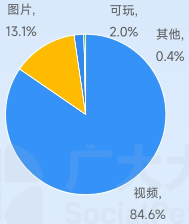
[image_caption]
这是一张饼图，展示了不同类型内容的占比情况。具体数据如下：

- 视频：84.6%
- 图片：13.1%
- 可玩：2.0%
- 其他：0.4%

饼图中，视频占据了最大的比例，用蓝色表示；图片次之，用黄色表示；可玩内容用浅蓝色表示；其他内容用非常小的白色部分表示。
[/image_caption]

视频素材时长分布

[image_caption]
这是一张柱状图，展示了不同年龄段的分布情况。图表分为四个部分，分别代表0-15岁、15-30岁、30-60岁和60岁及以上的人群比例。

- 0-15岁：9%
- 15-30岁：43%
- 30-60岁：42%
- 60岁及以上：约6%（根据剩余空间估算）

图表的颜色从深蓝到浅蓝渐变，分别对应不同的年龄段。整体来看，15-30岁和30-60岁的人群比例较高，接近一半，而0-15岁和60岁及以上的人群比例较低。
[/image_caption]

图片素材形式分布

[image_caption]
这是一张柱状图，展示了不同类型图片的比例分布。图表分为四个部分，分别用不同的颜色表示：

- 竖版：23%，用深棕色表示。
- 横版：3%，用浅棕色表示。
- 方形：73%，用橙色表示。
- 横幅：未显示具体数值，用浅橙色表示。

图表下方的图例说明了每种颜色对应的图片类型：
- 深棕色：竖版
- 浅棕色：横版
- 橙色：方形
- 浅橙色：横幅

主要信息显示，方形图片占比最大，为73%，其次是竖版图片，占比23%，横版图片占比最小，为3%。横幅图片的具体比例未在图中显示。
[/image_caption]

广告主数量月度变化趋势

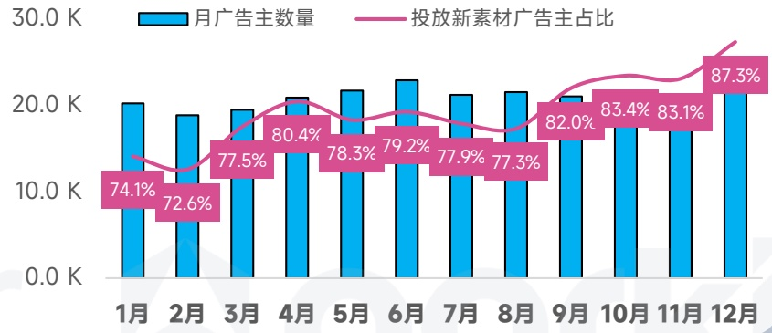
[image_caption]
该图是一张柱状图和折线图结合的图表，展示了月广告主数量和投放新素材广告主占比的变化趋势。

**图表描述：**

- **X轴**：表示月份，从1月到12月。
- **Y轴**：表示数量，范围从0.0K到30.0K。
- **蓝色柱状图**：表示每月的广告主数量，具体数值如下：
  - 1月：约20.0K
  - 2月：约20.0K
  - 3月：约20.0K
  - 4月：约20.0K
  - 5月：约20.0K
  - 6月：约20.0K
  - 7月：约20.0K
  - 8月：约20.0K
  - 9月：约20.0K
  - 10月：约20.0K
  - 11月：约20.0K
  - 12月：约20.0K

- **粉色折线图**：表示投放新素材广告主的占比，具体百分比如下：
  - 1月：74.1%
  - 2月：72.6%
  - 3月：77.5%
  - 4月：80.4%
  - 5月：78.3%
  - 6月：79.2%
  - 7月：77.9%
  - 8月：77.3%
  - 9月：82.0%
  - 10月：83.4%
  - 11月：83.1%
  - 12月：87.3%

**主要信息和趋势：**
- 蓝色柱状图显示每月的广告主数量基本保持在20.0K左右，没有显著变化。
- 粉色折线图显示投放新素材广告主的占比在不同月份间有波动，但总体呈上升趋势，从1月的74.1%上升到12月的87.3%。其中，4月和9月的占比有明显的上升，分别为80.4%和82.0%。
[/image_caption]

不同系统策略素材占比

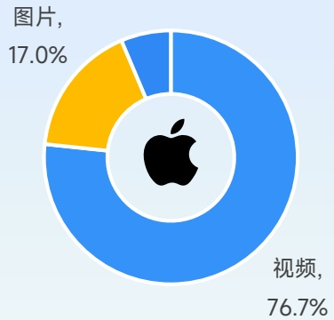
[image_caption]
这是一张饼图，显示了不同类型内容的占比。图表的主要信息如下：

- 图片（图片）：占17.0%
- 视频：占76.7%

饼图中央有一个苹果公司的标志。
[/image_caption]

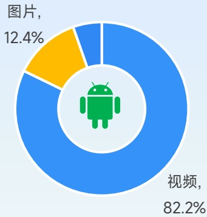
[image_caption]
这是一张饼图，显示了两种类型的媒体内容占比。饼图的主体部分为蓝色，占据了82.2%，标注为“视频”；另一部分为黄色，占据了12.4%，标注为“图片”。饼图的中心有一个绿色的安卓机器人图标。
[/image_caption]

TOP100广告主出海厂商占比

[image_caption]
图像显示了一个粉色的数字和符号组合，内容为“39%”。这是一个简单的百分比表示，没有其他图表元素或数据。
[/image_caption]

月均在投素材量变化趋势

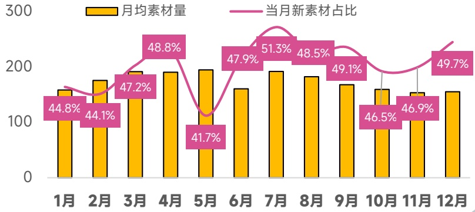
[image_caption]
这是一张柱状图和折线图结合的图表，展示了月均素材量和当月新素材占比的变化情况。

1. **图表类型**：
   - 柱状图：表示月均素材量。
   - 折线图：表示当月新素材占比。

2. **主要信息**：
   - **月均素材量**（黄色柱状）：
     - 1月：约150
     - 2月：约180
     - 3月：约200
     - 4月：约200
     - 5月：约160
     - 6月：约170
     - 7月：约200
     - 8月：约190
     - 9月：约180
     - 10月：约150
     - 11月：约160
     - 12月：约160

   - **当月新素材占比**（粉色折线）：
     - 1月：44.8%
     - 2月：44.1%
     - 3月：47.2%
     - 4月：48.8%
     - 5月：41.7%
     - 6月：47.9%
     - 7月：51.3%
     - 8月：48.5%
     - 9月：49.1%
     - 10月：46.5%
     - 11月：46.9%
     - 12月：49.7%

3. **数据趋势**：
   - **月均素材量**：整体呈波动趋势，3月和4月达到最高点，分别为约200；5月和10月最低，分别为约160和150。
   - **当月新素材占比**：整体在40%到50%之间波动，7月达到最高点，为51.3%；5月最低，为41.7%。

这张图表清晰地展示了月均素材量和当月新素材占比随时间的变化趋势。
[/image_caption]

## 休闲手游 热门创意策略

AI搞怪开头+短视频病毒 meme+热梗化用

点击图片播放完整创意

## 热门玩法：

跑酷、跳跃、消除、水排序

## 常用素材套路：

AI开头 \(\rightarrow\) 切入游戏实机画面 \(\rightarrow\) 玩法展示

热门短视频开头 \(\rightarrow\) 游戏内还原 \(\rightarrow\) 玩法展示

## 未来创意趋势：

更多休闲创意取材于TikTok热热门视频，甚至于直接用博主视频作推广用，搞怪有趣成为买量素材开头的核心标准，

## 益智解谜手游投放趋势观察

- 麻将连连看、数独、字谜、接龙横扫投放总榜TOP20，视频素材展现占比远高于其他品类

各类型素材带来展现占比

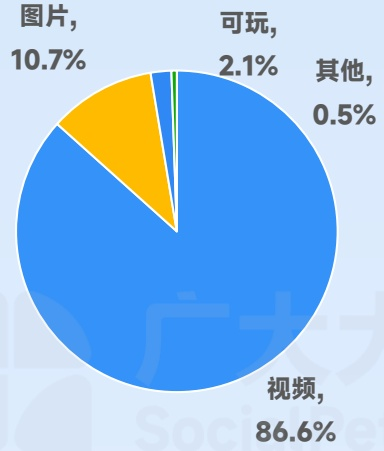
[image_caption]
这是一张饼图，展示了不同类型内容的占比情况。具体数据如下：

- 视频：86.6%
- 图片：10.7%
- 可玩：2.1%
- 其他：0.5%

饼图中，视频占据了最大的比例，用蓝色表示；图片次之，用黄色表示；可玩内容用绿色表示；其他内容用浅蓝色表示。
[/image_caption]

视频素材时长分布

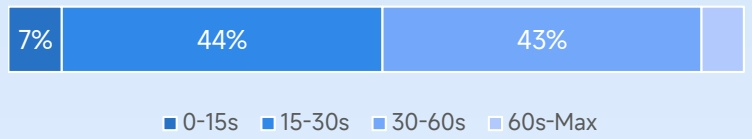
[image_caption]
这是一张柱状图，展示了不同年龄段的人群比例。图表分为四个部分，分别对应以下年龄段：

- 0-15岁：7%
- 15-30岁：44%
- 30-60岁：43%
- 60岁及以上：没有显示具体数值

每个年龄段用不同深浅的蓝色表示，从左到右依次为：深蓝色、中蓝色、浅蓝色和最浅蓝色。图表下方有图例，标明了每个颜色对应的年龄段。整体来看，15-30岁和30-60岁的人群比例较高，分别为44%和43%，而0-15岁的人群比例较低，为7%。
[/image_caption]

图片素材形式分布

[image_caption]
该图是一个水平条形图，展示了四种不同类型的图片占比。具体数据如下：
- 竖版：21%
- 横版：3%
- 方形：75%
- 横幅：0%

图表下方有颜色对应的图例，分别是：
- 竖版：棕色
- 横版：橙色
- 方形：浅橙色
- 横幅：浅黄色

主要信息显示方形图片占比最高，为75%，其次是竖版图片，占比21%，横版图片占比最低，仅为3%。
[/image_caption]

广告主数量月度变化趋势

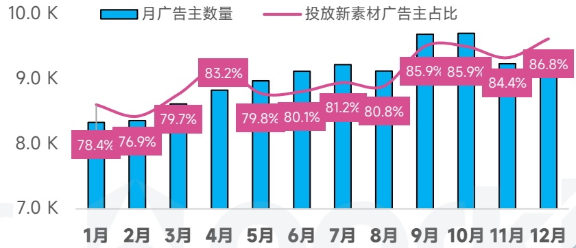
[image_caption]
这是一张柱状图和折线图结合的图表，展示了月广告主数量和投放新素材广告主占比的变化趋势。

1. **图表类型**：
   - 柱状图：表示月广告主数量。
   - 折线图：表示投放新素材广告主占比。

2. **主要信息**：
   - **月广告主数量**（蓝色柱状图）：
     - 1月：约8.3K
     - 2月：约8.2K
     - 3月：约8.4K
     - 4月：约9.0K
     - 5月：约9.0K
     - 6月：约9.0K
     - 7月：约9.0K
     - 8月：约9.0K
     - 9月：约10.0K
     - 10月：约10.0K
     - 11月：约9.0K
     - 12月：约9.0K

   - **投放新素材广告主占比**（粉色折线图）：
     - 1月：78.4%
     - 2月：76.9%
     - 3月：79.7%
     - 4月：83.2%
     - 5月：79.8%
     - 6月：80.1%
     - 7月：81.2%
     - 8月：80.8%
     - 9月：85.9%
     - 10月：85.9%
     - 11月：84.4%
     - 12月：86.8%

3. **数据趋势**：
   - 月广告主数量在年初相对较低，从3月开始显著增加，并在9月和10月达到最高值（约10.0K），之后有所下降。
   - 投放新素材广告主占比在年初波动较大，从3月开始趋于稳定并逐渐上升，9月和10月达到最高值（85.9%），11月略有下降，12月再次上升至86.8%。

这张图表清晰地展示了月广告主数量和投放新素材广告主占比随时间的变化趋势，反映了广告市场的动态变化。
[/image_caption]

不同系统策略素材占比

图片,

14.0%

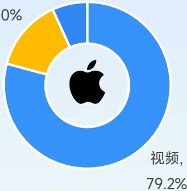
[image_caption]
这是一张饼图，中心有一个苹果的标志。饼图分为三个部分：一个黄色的部分占10%，一个蓝色的部分占79.2%，还有一个未标注百分比的小部分。右侧标注“视频, 79.2%”。
[/image_caption]

图片,

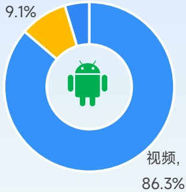
[image_caption]
这是一张饼图，显示了不同类型的占比。饼图的主要部分为蓝色，占据了86.3%，标注为“视频”。另一小部分为黄色，占据了9.1%。饼图的中心有一个绿色的Android机器人图标。
[/image_caption]

TOP100广告主出海厂商占比

41%

月均在投素材量变化趋势

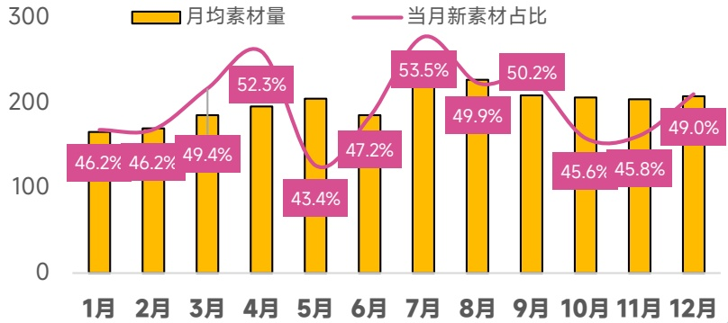
[image_caption]
该图是一张柱状图和折线图结合的图表，展示了月均素材量和当月新素材占比的变化情况。

**图表类型**：
- 柱状图（黄色）：表示月均素材量。
- 折线图（粉色）：表示当月新素材占比。

**数据趋势**：
1. **月均素材量**：
   - 1月：约180
   - 2月：约190
   - 3月：约200
   - 4月：约220
   - 5月：约160
   - 6月：约180
   - 7月：约240
   - 8月：约220
   - 9月：约200
   - 10月：约180
   - 11月：约190
   - 12月：约200

2. **当月新素材占比**：
   - 1月：46.2%
   - 2月：46.2%
   - 3月：49.4%
   - 4月：52.3%
   - 5月：43.4%
   - 6月：47.2%
   - 7月：53.5%
   - 8月：49.9%
   - 9月：50.2%
   - 10月：45.6%
   - 11月：45.8%
   - 12月：49.0%

**主要信息**：
- 月均素材量在7月达到最高点，为约240。
- 当月新素材占比在7月达到最高点，为53.5%。
- 5月的当月新素材占比最低，为43.4%。
- 整体来看，月均素材量和当月新素材占比在不同月份有波动，但总体保持在较高水平。
[/image_caption]

## 益智解谜手游热门创意策略

恶作剧短视频+微恐/无厘头脑洞+现实还原游戏

点击图片播放完整创意

## 热门玩法：

麻将消除、数独、涂色、脑洞、连线

## 常用素材套路：

微恐+诡异BGM→奇特道具展示→故意失败

现实道具还原 \(\rightarrow\) 游戏玩法展示 \(\rightarrow\) 下载引导

## 未来创意趋势：

基于玩法特性，益智解谜素材可以直接取材于游戏关卡，同时将短视频恶搞作为开头引流素材成为常规引流手法。

## 娱乐场手游投放趋势观察

> 娱乐场手游的同比涨幅和图片素材展现占比居全品类之首，黄金、美金、现金钞票成为素材最吸睛元素

各类型素材带来展现占比

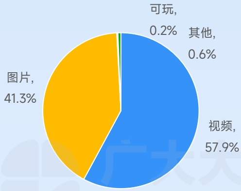
[image_caption]
这是一张饼图，展示了不同类型内容的占比情况。具体数据如下：

- 图片：41.3%
- 视频：57.9%
- 可玩：0.2%
- 其他：0.6%

饼图中，蓝色部分代表视频，占比最大；橙色部分代表图片，占比次之；绿色和浅蓝色部分分别代表可玩和其他，占比最小。
[/image_caption]

视频素材时长分布

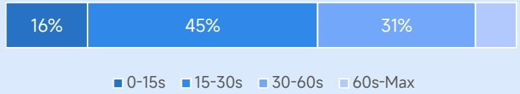
[image_caption]
该图是一个水平条形图，展示了不同年龄段的百分比分布。具体数据如下：
- 0-15s：16%
- 15-30s：45%
- 30-60s：31%
- 60s-Max：（未显示具体数值）

图表使用不同深浅的蓝色来区分各个年龄段，从左到右依次为最深蓝、中蓝、浅蓝和极浅蓝。每个年龄段的百分比清晰地标记在对应的条形区域内。
[/image_caption]

图片素材形式分布

[image_caption]
该图是一个水平条形图，展示了不同类型图片的比例分布。具体数据如下：
- 竖版：12%
- 横版：1%
- 方形：86%
- 横幅：0%

图表下方有图例，分别用不同颜色的方块表示四种类型：竖版（深黄色）、横版（浅黄色）、方形（橙色）和横幅（浅橙色）。
[/image_caption]

广告主数量月度变化趋势

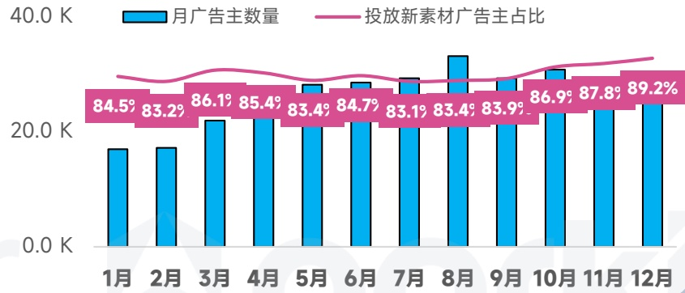
[image_caption]
这是一张柱状图，展示了每个月的广告主数量和投放新素材广告主的占比。图表的左侧纵轴表示广告主数量，范围从0.0K到40.0K；底部横轴表示月份，从1月到12月。

- **蓝色柱状图**：表示每月的广告主数量，具体数值如下：
  - 1月：约18.5K
  - 2月：约18.3K
  - 3月：约20.6K
  - 4月：约20.5K
  - 5月：约20.4K
  - 6月：约20.7K
  - 7月：约20.3K
  - 8月：约20.4K
  - 9月：约20.6K
  - 10月：约20.7K
  - 11月：约20.8K
  - 12月：约20.9K

- **粉色折线图**：表示投放新素材广告主的占比，具体百分比如下：
  - 1月：84.5%
  - 2月：83.2%
  - 3月：86.1%
  - 4月：85.4%
  - 5月：83.4%
  - 6月：84.7%
  - 7月：83.1%
  - 8月：83.4%
  - 9月：83.9%
  - 10月：86.9%
  - 11月：87.8%
  - 12月：89.2%

整体来看，广告主数量在各个月份间波动不大，而投放新素材广告主的占比则有较为明显的上升趋势，尤其是在下半年。
[/image_caption]

不同系统策略素材占比

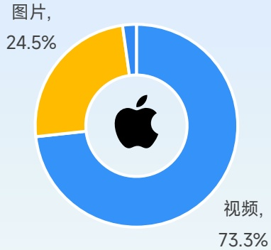
[image_caption]
这是一张饼图，显示了两种类型的占比情况。图表的主要信息如下：

- 图片部分占24.5%，用黄色表示。
- 视频部分占73.3%，用蓝色表示。

图表中央有一个苹果公司的标志。
[/image_caption]

TOP100广告主出海厂商占比

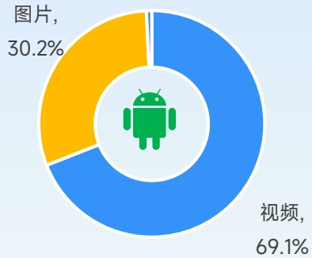
[image_caption]
这是一张饼图，显示了两种类型的媒体内容的比例。饼图分为两部分：黄色部分代表“图片”，占比30.2%；蓝色部分代表“视频”，占比69.1%。饼图的中心有一个绿色的Android机器人图标。
[/image_caption]

月均在投素材量变化趋势

45%

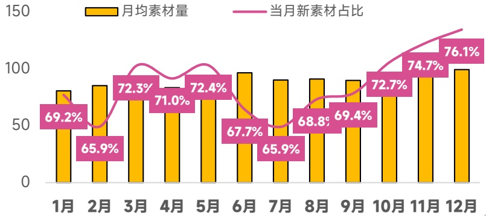
[image_caption]
这是一张柱状图和折线图结合的图表，展示了某时间段内月均素材量和当月新素材占比的变化情况。

### 图表类型
- **柱状图**：表示每个月的月均素材量。
- **折线图**：表示每个月当月新素材占总素材量的百分比。

### 数据描述
#### 月均素材量（黄色柱状图）
- 1月：约80
- 2月：约90
- 3月：约95
- 4月：约90
- 5月：约100
- 6月：约100
- 7月：约95
- 8月：约95
- 9月：约90
- 10月：约95
- 11月：约100
- 12月：约100

#### 当月新素材占比（粉色折线图及标签）
- 1月：69.2%
- 2月：65.9%
- 3月：72.3%
- 4月：71.0%
- 5月：72.4%
- 6月：67.7%
- 7月：65.9%
- 8月：68.8%
- 9月：69.4%
- 10月：72.7%
- 11月：74.7%
- 12月：76.1%

### 趋势分析
- **月均素材量**：整体呈波动上升趋势，从1月的约80增长到12月的约100。
- **当月新素材占比**：总体呈现上升趋势，从1月的69.2%增长到12月的76.1%，尽管中间有小幅波动。

这张图表清晰地展示了月均素材量和当月新素材占比的变化趋势，有助于分析素材的增长和新素材的贡献比例。
[/image_caption]

## 娱乐场手游热门创意策略

真金诱惑+真人演出+金色夸张特效

点击图片播放完整创意

## 热门玩法：

Slots、Looters、老虎机、扑克、宾果

## 常用素材套路：

玩家发飙 \(\rightarrow\) 员工道歉 \(\rightarrow\) 下载假游戏 \(\rightarrow\) 引导下载

美女吸睛 \(\rightarrow\) 真金炫耀 \(\rightarrow\) 游戏展示

## 未来创意趋势：

真人剧情类素材展现突出，AI一键替换配音、文案让素材能够应用于更多市场。

## 媒体声音

白鲸出海、独立出海联合体、扬帆出海

## 白鲸出海

2025年，中游戏在海外市场的两大增长动力，来自SLG和以合成（Merge）为代表的休闲品类。

SLG方面，出海厂商延续了【Whiteout Survival】等头部产品去年创下的辉煌，在2025年又有【Kingshot】以及【Last Z】等新产品跑出千万美元月流水，赛道腰部也有包括【Land of Prison】在内的新品。在第一批爆款诞生后，国内厂商不断尝试新题材和玩法，将主机和Steam端买断制游戏的创新机制通过适当改造引入移动端。

耳目一新的题材和玩法，不仅能争取更多新用户；还能让游戏在副玩法和SLG主玩法之间的衔接变得更加丝滑，从而拉高游戏的长期留存和LTV。目前SLG已经成为2025年规模最大的游戏子类。

合成游戏方面，出海厂商则开始更加注重运营以及内容供给。一方面头部厂商开始在常态化运营方面持续发力，有消息显示头部产品【Gossip Harbor】的单月活动数量已经接近100个；另一方面玩家对合成游戏的剧情需求也逐渐加强，许多主攻短剧赛道的厂商入场，尝试将更激烈、反转更多的剧情加入到游戏中，提高长线吸引力。有数据显示在以上两个因素的共同促进下，合成游戏市场的总规模同比增长超 \(50\%\) ，已经达到三消的1/3。

在2026年，出海厂商无疑会在这两大优势赛道上继续发力，同时值得注意的还有最先由土耳其厂商跑出成绩的混合休闲。目前许多出海产品也已经通过学习头部厂商经验和创新迭代方法等方式跻身混休下载榜前列，其中也有许多中小团队的身影。相信在新的一年中，国内厂商将进一步攻克更多品类，寻找到更加广阔的市场空间。

## 独立出海联合体

年末回顾我在最近三年的时候提到中国游戏出海都提到了一个词叫做“调整”。从2023年到2025年，调整之年的说法提了不止一次。但非常遗憾的是，2025年中国游戏仍然未从这种调整的状况中走出来。

但是，同样是调整：2023年和2025年的调整是不一样的——这主要是因为2023年中国游戏产业处于上一轮产品探索周期的尾声，或者说是结果之年。大量于2020年末兴起的产品模型升级探索产品在这一年开始经受市场的考验。但2025年则多少有些不同，基于2023年这种对于产品模型探索的大规模失败，使得各家厂商开始重拾自己所擅长的流量型打法，并且围绕此找出新的打法。因此，2025虽可被视为是头几年的延续，但调整却有所不同。

是矣，2025年相对于海外市场相对的沉寂，国内小游戏市场的风云起涌则成为了行业关注的焦点。这种焦点到年末以腾讯宣布小游戏扶持政策由开发者与平台7：3分成变为8：2分成到了一个高点。我们在这一年见到了多个小游戏爆款，包括《抓大鹅》、《永远的蔚蓝海岸》、《生存33天》等。但问题在于，相较于国内市场流量聚合形成的优势，海外市场没有同样的市场状况。而各家期待的TikTok海外小游戏平台带来的新一轮红利显然也需要一些时间，因此小游戏在海外尚未能掀起新一轮的风暴。拿《永远的蔚蓝海岸》来讲，产品质量不可不谓不好，买量也不可谓不凶猛。但在中国港澳台地区位居榜单前列的情况下最终收入却未能达到人们的期待。

而在传统的移动游戏出海方面。2025年的亮点似乎也仅仅聚焦于少数几个大厂之上，《三角洲行动》、《少女前线2》等等。仿佛游戏出海变成了少数大厂的游戏，这种情况绝非是我们愿意看到的。但事实显然是残酷的，伴随着腰部市场在海外的进一步紧缩，不但使得大批B+产品直接退出竞争，甚至许多A级产品也无有一战之力。中国游戏厂商过往所擅长的数值导向模型辅以买量的打法带来的优势在被削弱。而从各个区域市场的情况来看，这一年带来新增长的除了《三角洲行动》等少数大厂新品外，更多的是上线几年后的老产品如沐瞳的《无尽对决》等在不同区域市场的交叉发力。

到是STEAM与主机游戏市场出现了一些亮点。在2024年的《黑神话：悟空》之后，国内的STEAM游戏开发者又在2025年拿出了《明末：渊墟之羽》、《饿殍：明末千里行》等作品。而除此之外，包括《峰火十四》等作品在年末发布的PV，似乎也预示着下一个市场亮点的存在。

## 扬帆出海

2025年中国企业出海整体迈入“质量跃升”新阶段，游戏与非游领域均呈现稳健增长态势，同时依托技术创新与模式升级构建核心竞争力。

游戏出海持续高歌猛进，规模与质量双提升。数据显示，2025年自研游戏海外市场实际销售收入达204.55亿美元，同比增长 \(10.23\%\) ，连续六年超千亿元人民币，其中移动游戏贡献184.78亿美元，同比增长 \(13.16\%\) 。

市场布局上，美、日、韩仍是核心市场，欧洲市场稳步拓展。品类方面，策略类（含SLG）占海外收入前100款自研手游营收的 \(49.96\%\) 稳居首位，玩法融合成为增长关键。

总体而言，2025年中国出海企业以创新为核心驱动力，在复杂国际环境中实现稳健发展，游戏出海靠品类深耕与文化赋能突破，非游出海凭产业升级与模式创新拓宽空间。

## 06

## 2025年全球热门地区手游营销观察

2025 GLOBAL MOBILE GAME MARKETING TREND INSIGHTS

## 北美地区 手游投放趋势观察

广告主、创意素材同比增长幅度处于全球中等水平，视频为核心创意形式、创意迭代节奏加快，休闲游戏是当前热投品类

## 手游广告主数

同比增长 \(31\%\)

13.6W↑

## 手游素材去重创意

同比增长 \(40\%\)

27.5M↑

## 视频创意占比

76.7%

## 各系统占比

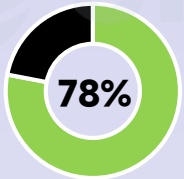
[image_caption]
这是一张饼图，显示了78%的数据。饼图分为两部分：一部分为黑色，另一部分为绿色，绿色部分占据了大部分面积，代表78%的比例。
[/image_caption]

广告主

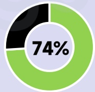
[image_caption]
这是一张饼图，显示了74%的数据占比。饼图由绿色和黑色两部分组成，其中绿色部分占据了大部分面积，黑色部分为剩余部分。中心位置标有“74%”的字样。
[/image_caption]

素材数

## 热投产品

Vita Mahjong

Block Blast!

Dark War Survival

## 爆款新品

Solitaire Associations Journey

Tiles Survive!

Sand Crush

广告主数量月度变化趋势

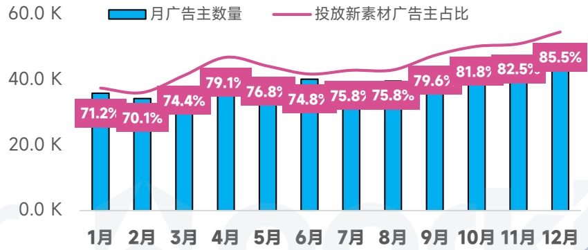
[image_caption]
该图像为一个柱状图，展示了月广告主数量和投放新素材广告主占比的数据。图表的横轴表示月份，从1月到12月；纵轴表示数量，范围从0.0K到60.0K。

- **蓝色柱状图**：表示月广告主数量，具体数值如下：
  - 1月：约35K
  - 2月：约34K
  - 3月：约36K
  - 4月：约38K
  - 5月：约37K
  - 6月：约37K
  - 7月：约36K
  - 8月：约36K
  - 9月：约38K
  - 10月：约39K
  - 11月：约40K
  - 12月：约41K

- **粉色折线图**：表示投放新素材广告主占比，具体百分比如下：
  - 1月：71.2%
  - 2月：70.1%
  - 3月：74.4%
  - 4月：79.1%
  - 5月：76.8%
  - 6月：74.8%
  - 7月：75.8%
  - 8月：75.8%
  - 9月：79.6%
  - 10月：81.8%
  - 11月：82.5%
  - 12月：85.5%

整体趋势显示，月广告主数量在年初相对稳定，随后逐渐增加，特别是在下半年增长明显。投放新素材广告主占比在年初略有波动，但在下半年持续上升，显示出较高的增长趋势。
[/image_caption]

在投素材月度变化趋势

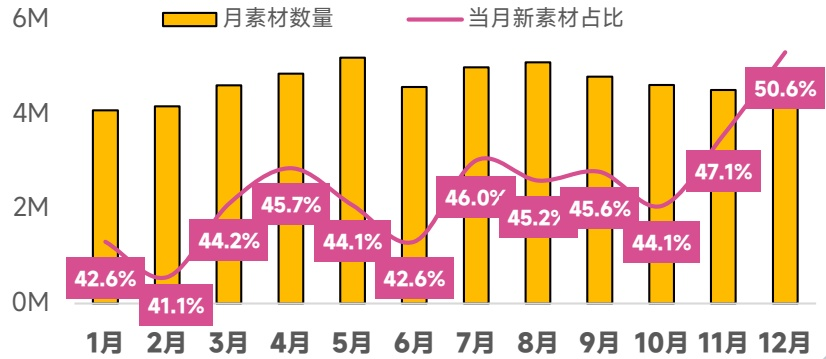
[image_caption]
该图是一张柱状图和折线图结合的图表，展示了1月至12月期间的月素材数量和当月新素材占比。

- **图表类型**：柱状图和折线图
- **X轴**：表示月份，从1月到12月。
- **Y轴**：表示数量，范围从0M到6M。
- **黄色柱状图**：表示每月的素材数量。
  - 1月：约4.2M
  - 2月：约4.1M
  - 3月：约4.5M
  - 4月：约4.5M
  - 5月：约4.7M
  - 6月：约4.2M
  - 7月：约4.6M
  - 8月：约4.6M
  - 9月：约4.5M
  - 10月：约4.4M
  - 11月：约4.7M
  - 12月：约5.1M
- **粉色折线图**：表示当月新素材占比。
  - 1月：42.6%
  - 2月：41.1%
  - 3月：44.2%
  - 4月：45.7%
  - 5月：44.1%
  - 6月：42.6%
  - 7月：46.0%
  - 8月：45.2%
  - 9月：45.6%
  - 10月：44.1%
  - 11月：47.1%
  - 12月：50.6%

整体来看，月素材数量在5月达到最高点，为约4.7M；当月新素材占比在12月达到最高点，为50.6%。
[/image_caption]

## 日韩地区 手游投放趋势观察

日韩地区广告主、素材数量综合增幅居全球第一梯队，营销素材与游戏类型明显偏IP化、多元化、轻度化，日韩也成为小游戏出海主要市场

## 手游广告主数

同比增长 \(56\%\)

7.1W↑

## 手游素材去重创意

同比增长67%

14.2M↑

## 视频创意占比

77.2%

## 各系统占比

[image_caption]
这是一张饼图，显示了79%的数据。饼图由两部分组成：一部分为黑色，另一部分为绿色，绿色部分占据了大部分面积，表示79%的比例。
[/image_caption]

广告主

[image_caption]
该图是一个饼图，显示了76%的数据占比。饼图分为两部分：一部分为绿色，占据76%；另一部分为黑色，占据剩余的24%。中心位置标有“76%”的字样。
[/image_caption]

素材数

## 热投产品

X-Clash

Tile Explorer

MapleStory

## 爆款新品

TopTop(

金不格大霸道

RAVEN2

广告主数量月度变化趋势

[image_caption]
这是一张柱状图和折线图结合的图表，展示了月广告主数量和投放新素材广告主占比的变化趋势。

### 图表类型
- **柱状图**：表示每月的广告主数量。
- **折线图**：表示每月投放新素材广告主的占比。

### 数据描述
#### 月广告主数量（蓝色柱状图）
- 1月：约20.0K
- 2月：约20.0K
- 3月：约20.0K
- 4月：约25.0K
- 5月：约25.0K
- 6月：约25.0K
- 7月：约25.0K
- 8月：约25.0K
- 9月：约25.0K
- 10月：约25.0K
- 11月：约25.0K
- 12月：约25.0K

#### 投放新素材广告主占比（粉色折线图）
- 1月：68.3%
- 2月：64.6%
- 3月：68.1%
- 4月：74.2%
- 5月：71.6%
- 6月：73.0%
- 7月：73.0%
- 8月：70.8%
- 9月：73.1%
- 10月：76.9%
- 11月：79.3%
- 12月：82.0%

### 趋势分析
- **月广告主数量**：从1月到4月有显著增长，之后保持稳定在约25.0K。
- **投放新素材广告主占比**：整体呈上升趋势，从1月的68.3%逐渐增加到12月的82.0%。尽管中间有小幅波动，但总体趋势向上。

这张图表清晰地展示了广告主数量和新素材投放比例的变化情况，反映了市场对新素材广告的接受度和使用率在逐步提高。
[/image_caption]

在投素材月度变化趋势

[image_caption]
这是一张柱状图和折线图结合的图表，展示了1月至12月的数据变化情况。

**图表类型**：
- 柱状图（黄色）：表示每月素材数量。
- 折线图（粉色）：表示当月新素材占比。

**主要信息和数据趋势**：
1. **每月素材数量（黄色柱状图）**：
   - 1月：约38.7M
   - 2月：约37.1M
   - 3月：约37.0M
   - 4月：约39.3M
   - 5月：约39.5M
   - 6月：约41.6M
   - 7月：约43.8M
   - 8月：约39.8M
   - 9月：约40.4M
   - 10月：约38.3M
   - 11月：约41.0M
   - 12月：约42.4M

2. **当月新素材占比（粉色折线图）**：
   - 1月：38.7%
   - 2月：37.1%
   - 3月：37.0%
   - 4月：39.3%
   - 5月：39.5%
   - 6月：41.6%
   - 7月：43.8%
   - 8月：39.8%
   - 9月：40.4%
   - 10月：38.3%
   - 11月：41.0%
   - 12月：42.4%

**趋势分析**：
- 每月素材数量在1月至12月间有波动，总体呈上升趋势，特别是在6月和7月达到峰值。
- 当月新素材占比在1月至12月间也有所波动，但整体保持在38%至43%之间，7月达到最高点43.8%，随后略有下降，但在12月回升至42.4%。
[/image_caption]

## 中国港澳台 手游投放趋势观察

视频创意占比略超日韩、北美，成为区域投放的绝对主流形式，热门品类涵盖RPG、模拟经营等中轻度游戏

## 手游广告主数

同比增长 \(51\%\)

6.1W↑

## 手游素材去重创意

同比增长 \(55\%\)

13.4M↑

## 视频创意占比

77.3%

## 各系统占比

[image_caption]
这是一张饼图，显示了77%的数据。饼图分为两部分：一部分为黑色，另一部分为绿色，绿色部分占据了大部分面积，代表77%的比例。
[/image_caption]

广告主

[image_caption]
这是一张饼图，显示了72%的数据。饼图由一个绿色的部分和一个黑色的部分组成，绿色部分占据了大部分面积，表示72%的比例，而黑色部分则占据了剩余的28%。
[/image_caption]

素材数

## 热投产品

奇蹟MU

Mahjong Wonders

江湖有詭

## 爆款新品

杖剑传说

蔚藍星球國王很忙

我的花園世界

广告主数量月度变化趋势

[image_caption]
这是一张柱状图，展示了每个月的广告主数量（蓝色柱状）和投放新素材广告主的占比（粉色折线）。图表的时间范围从1月到12月。

- **蓝色柱状**：表示每月广告主的数量，单位为千（K）。
  - 1月：约20K
  - 2月：约20K
  - 3月：约20K
  - 4月：约20K
  - 5月：约20K
  - 6月：约20K
  - 7月：约20K
  - 8月：约20K
  - 9月：约20K
  - 10月：约20K
  - 11月：约20K
  - 12月：约20K

- **粉色折线**：表示投放新素材广告主的占比，单位为百分比（%）。
  - 1月：64.7%
  - 2月：61.4%
  - 3月：64.3%
  - 4月：70.8%
  - 5月：67.6%
  - 6月：68.9%
  - 7月：73.3%
  - 8月：68.8%
  - 9月：70.8%
  - 10月：78.2%
  - 11月：77.4%
  - 12月：80.6%

整体趋势显示，广告主数量在各个月份间保持相对稳定，而投放新素材广告主的占比则有波动，总体呈上升趋势。
[/image_caption]

在投素材月度变化趋势

[image_caption]
这是一张柱状图，展示了每个月的素材数量（黄色柱状）和当月新素材占比（粉色折线）。图表的横轴表示月份，从1月到12月；纵轴表示素材数量，范围从0M到4M。

具体数据如下：
- 1月：素材数量约为2.5M，新素材占比40.3%
- 2月：素材数量约为2.3M，新素材占比37.3%
- 3月：素材数量约为2.6M，新素材占比38.7%
- 4月：素材数量约为2.7M，新素材占比39.9%
- 5月：素材数量约为2.8M，新素材占比40.4%
- 6月：素材数量约为2.7M，新素材占比39.8%
- 7月：素材数量约为2.8M，新素材占比41.6%
- 8月：素材数量约为2.7M，新素材占比41.1%
- 9月：素材数量约为2.6M，新素材占比39.5%
- 10月：素材数量约为2.5M，新素材占比38.6%
- 11月：素材数量约为2.6M，新素材占比39.9%
- 12月：素材数量约为2.6M，新素材占比41.0%

从图表中可以看出，每月的素材数量大致在2.5M到2.8M之间波动，而新素材占比在37.3%到41.6%之间变化。7月的新素材占比达到最高点41.6%，而2月的新素材占比最低，为37.3%。
[/image_caption]

## 东南亚地区 手游投放趋势观察

视频创意占比70.2%居全球最低，流行题材广泛、对中日韩本土IP接受度高，RPG产品表现突出

## 手游广告主数

同比增长 \(26\%\)

11.1W↑

## 手游素材去重创意

同比增长 \(42\%\)

19.7M↑

## 视频创意占比

70.2%

## 各系统占比

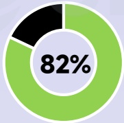
[image_caption]
这是一张饼图，显示了82%的数据占比。饼图由三个部分组成：一个黑色部分、一个绿色部分和一个白色中心区域，其中心区域标有“82%”。绿色部分占据了大部分面积，黑色部分较小，白色中心区域包含百分比数值。
[/image_caption]

广告主

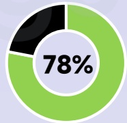
[image_caption]
这是一张饼图，显示了78%的数据占比。饼图由一个绿色的扇形区域和一个黑色的扇形区域组成，绿色区域占据了大部分，黑色区域较小。饼图的中心有一个白色圆圈，里面标有“78%”的字样。
[/image_caption]

素材数

## 热投产品

Lands of Jail

Top Heroes

Emblem
Assemble: Neo

## 爆款新品

Seven Knights Re:BIRTH

Chaos Zero Nightmare

HAIKYU!!FLY HIGH

广告主数量月度变化趋势

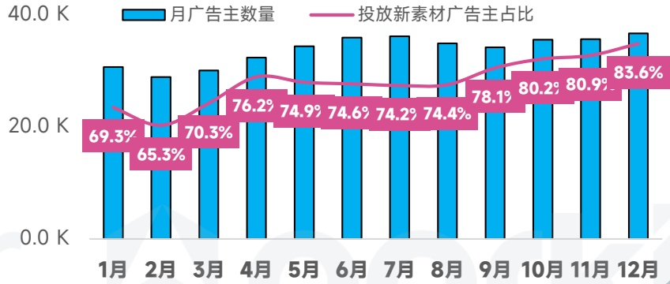
[image_caption]
这是一张柱状图和折线图结合的图表，展示了月广告主数量和投放新素材广告主占比的变化趋势。

1. **图表类型**：
   - 柱状图：表示月广告主数量。
   - 折线图：表示投放新素材广告主占比。

2. **主要信息**：
   - **月广告主数量**（蓝色柱状图）：
     - 1月：约35K
     - 2月：约30K
     - 3月：约32K
     - 4月：约36K
     - 5月：约38K
     - 6月：约39K
     - 7月：约39K
     - 8月：约38K
     - 9月：约37K
     - 10月：约38K
     - 11月：约39K
     - 12月：约40K

   - **投放新素材广告主占比**（粉色折线图）：
     - 1月：69.3%
     - 2月：65.3%
     - 3月：70.3%
     - 4月：76.2%
     - 5月：74.9%
     - 6月：74.6%
     - 7月：74.2%
     - 8月：74.4%
     - 9月：78.1%
     - 10月：80.2%
     - 11月：80.9%
     - 12月：83.6%

3. **数据趋势**：
   - 月广告主数量总体呈上升趋势，从1月的约35K增长到12月的约40K。
   - 投放新素材广告主占比在年初有波动，随后逐渐上升，从1月的69.3%增长到12月的83.6%。

这张图表清晰地展示了月广告主数量和投放新素材广告主占比的变化趋势，反映了广告主在不同月份对新素材广告的投入比例。
[/image_caption]

在投素材月度变化趋势

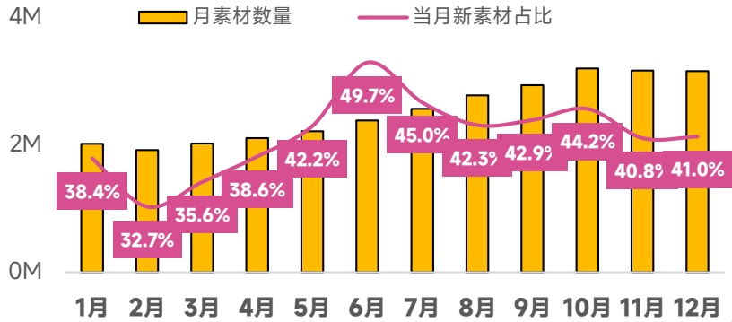
[image_caption]
这是一张柱状图，展示了每个月的素材数量（黄色柱状）和当月新素材占比（粉色折线）。图表的横轴表示月份，从1月到12月；纵轴表示素材数量，范围从0M到4M。具体数据如下：

- 1月：素材数量约2M，新素材占比38.4%
- 2月：素材数量约2M，新素材占比32.7%
- 3月：素材数量约2M，新素材占比35.6%
- 4月：素材数量约2M，新素材占比38.6%
- 5月：素材数量约2M，新素材占比42.2%
- 6月：素材数量约2.5M，新素材占比49.7%
- 7月：素材数量约2.5M，新素材占比45.0%
- 8月：素材数量约2.5M，新素材占比42.3%
- 9月：素材数量约2.5M，新素材占比42.9%
- 10月：素材数量约2.5M，新素材占比44.2%
- 11月：素材数量约2.5M，新素材占比40.8%
- 12月：素材数量约2.5M，新素材占比41.0%

从图表中可以看出，每月的素材数量在2M到2.5M之间波动，而新素材占比在32.7%到49.7%之间变化，其中6月的新素材占比最高，为49.7%。
[/image_caption]

## 中东地区 手游投放趋势观察

中东游戏于5、6月达到投放巅峰，经典素材反复投放引流、素材迭代速度较慢，每月新素材占比始终低于40%

## 手游广告主数

同比增长 \(52\%\)

6.8W↑

## 手游素材去重创意

同比增长 \(69\%\)

11.7M↑

## 视频创意占比

77.7%

## 各系统占比

[image_caption]
这是一张饼图，显示了79%的数据。饼图由三个部分组成：一个黑色部分、一个绿色部分和一个白色中心区域，其中心区域标有“79%”。绿色部分占据了大部分面积，黑色部分较小，白色中心区域包含百分比数值。
[/image_caption]

广告主

[image_caption]
该图是一个饼图，显示了77%的数据占比。饼图分为两部分：一部分为绿色，占据77%；另一部分为黑色，占据剩余的23%。中心位置标有“77%”的字样。
[/image_caption]

素材数

## 热投产品

Kingshot

Mafia City

Logicus

## 爆款新品

Fate War

Legend of YMIR

Water Match

广告主数量月度变化趋势

[image_caption]
这是一张柱状图和折线图结合的图表，展示了月广告主数量和投放新素材广告主占比的变化趋势。

**图表类型**：柱状图 + 折线图

**主要信息**：
- **蓝色柱状图**：表示每月的广告主数量，单位为千（K）。
- **粉色折线图**：表示每月投放新素材的广告主占比，以百分比形式显示。

**数据趋势**：
1. **1月**：广告主数量约为20K，投放新素材广告主占比为59.2%。
2. **2月**：广告主数量约为20K，投放新素材广告主占比为59.5%。
3. **3月**：广告主数量约为20K，投放新素材广告主占比为62.6%。
4. **4月**：广告主数量约为22K，投放新素材广告主占比为68.8%。
5. **5月**：广告主数量约为22K，投放新素材广告主占比为69.2%。
6. **6月**：广告主数量约为22K，投放新素材广告主占比为67.7%。
7. **7月**：广告主数量约为22K，投放新素材广告主占比为67.3%。
8. **8月**：广告主数量约为21K，投放新素材广告主占比为65.6%。
9. **9月**：广告主数量约为21K，投放新素材广告主占比为71.3%。
10. **10月**：广告主数量约为22K，投放新素材广告主占比为75.2%。
11. **11月**：广告主数量约为22K，投放新素材广告主占比为76.2%。
12. **12月**：广告主数量约为22K，投放新素材广告主占比为78.8%。

**总结**：
- 广告主数量在1月至12月间总体保持在20K至22K之间，略有波动。
- 投放新素材广告主占比从1月的59.2%逐渐上升至12月的78.8%，显示出明显的增长趋势。
[/image_caption]

在投素材月度变化趋势

[image_caption]
这是一张柱状图和折线图结合的图表，展示了某时间段内月素材数量和当月新素材占比的变化情况。

1. **图表类型**：
   - 柱状图（黄色）：表示每月的素材数量。
   - 折线图（粉色）：表示当月新素材在总素材中的占比。

2. **数据趋势**：
   - **月素材数量**（黄色柱状图）：
     - 1月：约200万
     - 2月：约200万
     - 3月：约250万
     - 4月：约280万
     - 5月：约300万（最高）
     - 6月：约270万
     - 7月：约290万
     - 8月：约290万
     - 9月：约280万
     - 10月：约270万
     - 11月：约270万
     - 12月：约260万

   - **当月新素材占比**（粉色折线图）：
     - 1月：33.5%
     - 2月：31.7%
     - 3月：33.9%
     - 4月：35.4%
     - 5月：37.2%
     - 6月：37.6%
     - 7月：39.4%
     - 8月：37.8%
     - 9月：39.1%
     - 10月：35.7%
     - 11月：37.3%
     - 12月：36.4%

3. **主要信息**：
   - 月素材数量在5月达到最高点，为约300万。
   - 当月新素材占比在7月达到最高点，为39.4%。
   - 整体来看，月素材数量在年初较为稳定，随后逐渐增加并在5月达到峰值，之后有所波动但总体保持在较高水平。
   - 当月新素材占比在年初相对较低，随后逐渐上升并在7月达到峰值，之后有所下降但仍保持在较高水平。

这张图表清晰地展示了月素材数量和当月新素材占比的变化趋势，有助于分析素材生成和更新的规律。
[/image_caption]

## 欧洲地区 手游投放趋势观察

作为益智休闲产品主要市场，欧洲每月投放新素材广告主占比接近80%，并在2025Q2达到投放巅峰

## 手游广告主数

同比增长 \(58\%\)

21.1W↑

## 手游素材去重创意

同比增长 \(54\%\)

29.9M↑

## 视频创意占比

77.7%

## 各系统占比

[image_caption]
该图片展示了一个饼图，其中一部分被标记为77%，颜色为绿色，另一部分为黑色。绿色部分占据了饼图的大部分，而黑色部分占据了较小的部分。
[/image_caption]

广告主

[image_caption]
该图是一个饼图，显示了77%的数据占比。饼图分为两部分：一部分为绿色，占据大部分区域，表示77%；另一部分为黑色，占据剩余的小部分区域。
[/image_caption]

素材数

## 热投产品

Vita Mahjong

Zen Color

Bingo Voyage

## 爆款新品

Legend of Elements

Top Tycoon:

Umamusume: Pretty Derby

广告主数量月度变化趋势

[image_caption]
这是一张柱状图，展示了每个月的广告主数量和投放新素材广告主的占比。图表的横轴表示月份，从1月到12月；纵轴表示广告主数量，单位为千（K），范围从0到60K。

- **蓝色柱状图**：表示每月的广告主数量。
  - 1月：约40K
  - 2月：约40K
  - 3月：约45K
  - 4月：约50K
  - 5月：约50K
  - 6月：约50K
  - 7月：约45K
  - 8月：约45K
  - 9月：约50K
  - 10月：约50K
  - 11月：约50K
  - 12月：约55K

- **粉色折线图**：表示投放新素材广告主的占比。
  - 1月：73.0%
  - 2月：71.3%
  - 3月：77.4%
  - 4月：80.0%
  - 5月：79.6%
  - 6月：78.7%
  - 7月：78.7%
  - 8月：77.3%
  - 9月：80.8%
  - 10月：81.7%
  - 11月：82.2%
  - 12月：84.5%

整体来看，广告主数量在1月至12月间有波动，但总体呈上升趋势，尤其是在下半年增长明显。投放新素材广告主的占比在年初有所下降后逐渐上升，并在年末达到最高值84.5%。
[/image_caption]

在投素材月度变化趋势

[image_caption]
该图是一张柱状图和折线图结合的图表，展示了六个月（1月至12月）的数据。

**图表类型**：柱状图 + 折线图

**主要信息**：
- **黄色柱状图**：表示每个月的素材数量，单位为百万（M）。
- **粉色折线图**：表示当月新素材在总素材中的占比，以百分比（%）表示。

**数据趋势**：
1. **素材数量（黄色柱状图）**：
   - 1月：约450万
   - 2月：约430万
   - 3月：约450万
   - 4月：约470万
   - 5月：约480万
   - 6月：约480万
   - 7月：约530万
   - 8月：约510万
   - 9月：约500万
   - 10月：约470万
   - 11月：约500万
   - 12月：约510万

2. **当月新素材占比（粉色折线图）**：
   - 1月：45.4%
   - 2月：42.8%
   - 3月：44.7%
   - 4月：47.1%
   - 5月：47.5%
   - 6月：48.0%
   - 7月：53.3%
   - 8月：49.4%
   - 9月：51.6%
   - 10月：46.8%
   - 11月：50.0%
   - 12月：50.9%

**总结**：
- 素材数量在7月达到最高点，为约530万。
- 当月新素材占比在7月达到最高点，为53.3%。
- 整体来看，素材数量和当月新素材占比在下半年有上升趋势。
[/image_caption]

## 大洋洲地区 手游投放趋势观察

投放规模呈缓慢增长趋势，热门产品布局聚焦益智休闲赛道并叠加细分IP进行精细化买量

## 手游广告主数

同比增长 \(22\%\)

6.7W↑

## 手游素材去重创意

同比增长 \(34\%\)

12.8M↑

## 视频创意占比

76.8%

## 各系统占比

[image_caption]
该图像为一个饼图，显示了77%的数据。饼图分为两部分：一部分为黑色，另一部分为绿色，绿色部分占据了大部分面积，表示77%的比例。
[/image_caption]

广告主

[image_caption]
这是一张饼图，显示了72%的数据占比。饼图分为两部分：一部分为黑色，另一部分为绿色，绿色部分占据了大部分面积，表示72%的比例。
[/image_caption]

素材数

## 热投产品

Block Crush!

Paint by Number Coloring Games

Match Villains

## 爆款新品

Umamusume: Pretty Derby

Pixel Rumble

Dream Raiders

广告主数量月度变化趋势

[image_caption]
该图像为柱状图，展示了月广告主数量和投放新素材广告主占比的变化趋势。

- **图表类型**：柱状图
- **数据系列**：
  - 蓝色柱状表示“月广告主数量”，单位为K（千）。
  - 粉色折线表示“投放新素材广告主占比”，单位为百分比（%）。

- **数据趋势**：
  - **月广告主数量**：
    - 1月：20.4K
    - 2月：20.0K
    - 3月：20.5K
    - 4月：22.0K
    - 5月：22.5K
    - 6月：23.0K
    - 7月：23.5K
    - 8月：22.5K
    - 9月：21.0K
    - 10月：22.0K
    - 11月：22.5K
    - 12月：24.0K
  - **投放新素材广告主占比**：
    - 1月：63.9%
    - 2月：61.3%
    - 3月：64.6%
    - 4月：68.5%
    - 5月：66.9%
    - 6月：68.7%
    - 7月：69.3%
    - 8月：66.9%
    - 9月：71.0%
    - 10月：76.9%
    - 11月：77.9%
    - 12月：81.2%

- **主要信息**：
  - 月广告主数量在全年中总体呈上升趋势，从1月的20.4K增长到12月的24.0K。
  - 投放新素材广告主占比也呈现上升趋势，从1月的63.9%增长到12月的81.2%。
[/image_caption]

在投素材月度变化趋势

[image_caption]
这是一张柱状图和折线图结合的图表，展示了1月至12月的数据变化情况。

**图表类型**：柱状图与折线图结合

**主要信息**：
- **黄色柱状图**：表示每月的素材数量（单位：M）。
- **粉色折线图**：表示当月新素材占总素材的比例（百分比）。

**数据趋势**：
- **每月素材数量**：
  - 1月：约2.3M
  - 2月：约2.2M
  - 3月：约2.4M
  - 4月：约2.5M
  - 5月：约2.7M
  - 6月：约2.3M
  - 7月：约2.5M
  - 8月：约2.5M
  - 9月：约2.5M
  - 10月：约2.2M
  - 11月：约2.1M
  - 12月：约2.2M

- **当月新素材占比**：
  - 1月：36.9%
  - 2月：34.3%
  - 3月：35.6%
  - 4月：36.3%
  - 5月：37.3%
  - 6月：36.5%
  - 7月：40.3%
  - 8月：38.2%
  - 9月：38.9%
  - 10月：35.7%
  - 11月：39.4%
  - 12月：39.8%

**总结**：
- 每月素材数量在2M到2.7M之间波动，5月达到最高点。
- 当月新素材占比在34.3%到40.3%之间波动，7月达到最高点，随后有所下降，但整体保持在35%以上。
[/image_caption]

## 南美地区 手游投放趋势观察

安卓系统广告主、素材数量占比居全球之首，创意数量涨幅高达76%，投放峰值出现在5月、8月，新素材占比也呈稳定上升趋势

## 手游广告主数

同比增长 \(40\%\)

11.8W↑

## 手游素材去重创意

同比增长 \(76\%\)

19.6M↑

## 视频创意占比

74.2%

## 各系统占比

[image_caption]
该图是一个饼图，显示了83%的数据。饼图由绿色和黑色两部分组成，其中绿色部分占据了大部分，黑色部分较小。中心位置标有“83%”的字样。
[/image_caption]

广告主

[image_caption]
这是一张饼图，显示了82%的数据。饼图由绿色和黑色两部分组成，其中绿色部分占据了大部分，标记为82%，而黑色部分则占据了剩余的18%。
[/image_caption]

素材数

## 热投产品

Bible Word Puzzle

Beast's Creed

Rise of Kingdoms

## 爆款新品

ACECRAFT

Huntopia

Street Motor Rider Racing

广告主数量月度变化趋势

[image_caption]
这是一张柱状图，展示了1月至12月期间的月广告主数量和投放新素材广告主占比的数据。

### 图表类型
- **柱状图**

### 主要信息与数据趋势
- **蓝色柱状图**：表示每月的广告主数量（单位：千，K）。
  - 1月：约25K
  - 2月：约24K
  - 3月：约26K
  - 4月：约28K
  - 5月：约30K
  - 6月：约30K
  - 7月：约29K
  - 8月：约31K
  - 9月：约32K
  - 10月：约33K
  - 11月：约34K
  - 12月：约35K

- **粉色折线图**：表示每月投放新素材广告主的占比（单位：%）。
  - 1月：66.0%
  - 2月：63.1%
  - 3月：68.8%
  - 4月：74.3%
  - 5月：73.3%
  - 6月：74.0%
  - 7月：72.4%
  - 8月：74.0%
  - 9月：77.1%
  - 10月：79.9%
  - 11月：81.4%
  - 12月：83.8%

### 数据趋势
- **广告主数量**：整体呈上升趋势，从1月的约25K增长到12月的约35K。
- **投放新素材广告主占比**：也呈现上升趋势，从1月的66.0%增长到12月的83.8%。

这张图表清晰地展示了广告主数量和投放新素材广告主占比随时间的变化趋势，表明广告市场在这一年中逐渐增长，并且越来越多的广告主开始使用新素材。
[/image_caption]

在投素材月度变化趋势

[image_caption]
该图表为柱状图与折线图的组合，展示了每月素材数量（黄色柱状）和当月新素材占比（粉色折线）的变化趋势。

- **横轴**：表示月份，从1月到12月。
- **纵轴**：表示数量，范围从0M到4M。
- **黄色柱状**：代表每月素材数量，具体数值如下：
  - 1月：约2.5M
  - 2月：约2.6M
  - 3月：约2.8M
  - 4月：约3.0M
  - 5月：约3.2M
  - 6月：约2.9M
  - 7月：约2.9M
  - 8月：约3.1M
  - 9月：约3.0M
  - 10月：约3.0M
  - 11月：约3.0M
  - 12月：约3.0M

- **粉色折线**：代表当月新素材占比，具体百分比如下：
  - 1月：40.2%
  - 2月：39.2%
  - 3月：42.3%
  - 4月：45.3%
  - 5月：45.2%
  - 6月：45.6%
  - 7月：44.8%
  - 8月：47.7%
  - 9月：47.9%
  - 10月：47.4%
  - 11月：49.2%
  - 12月：50.8%

整体趋势显示，每月素材数量在波动中总体呈上升趋势，而当月新素材占比则持续上升，从1月的40.2%增长至12月的50.8%。
[/image_caption]

## 媒体声音

罗斯基、龙虾游戏推荐、急速行走的小U盘、一枚游戏干饭人

## 罗斯基

当下，出海仍是行业大势所趋，但入局者增多让多品类竞争愈发激烈。除游戏外，短剧、社交工具、金融产品等赛道崛起，正成为出海赛道的新参与者。

移动游戏虽在海外移动产品下载量中占据半壁江山，但社交工具短剧类应用增长迅猛，未来或与游戏在营销端正面碰撞，推高获客成本。同时，AI技术的深度渗透重塑行业格局，AI在提升运营效率的同时，也催生“AI对抗AI”的买量新态势。

产品方向上，大公司锚定重度SLG赛道，而越南、土耳其等新兴团队的崛起，让轻度休闲品类成全球开发者新焦点，益智、模拟类产品关注度走高。融合性轻度产品凭借较低竞争度，仍是潜在机会点。

此外，PC游戏的热度攀升，Steam平台成为PC团队出海分发的重点渠道，3A大作的发展潜力被持续看好。小程序游戏出海同样值得关注，海外小程序生态虽缓慢发展，但仍越来越受到关注。另外国内小游戏团队正加速从小程序端向APP端、出海方向延伸，有望成为出海新增力量。

整体来看，自研自发、多端发行、融合创新的产品模式，正成为海内外团队布局的核心方向。

## 龙虾游戏推荐

## 2025年我观察到海外的几个点：

1、国内IAA游戏改IAAP出海：国内厂商的打龙玩法，在小游戏平台验证，借由国内出海厂商发行，达到了二三十万美金的日耗，比肩一些IAP产品。

2、国内IAA游戏出海：还是以北京厂商的休闲益智产品为标杆，但也观察到长沙、广州地区等厂商的休闲IAA游戏频繁曝光。

3、国内IAP游戏出海：与往年类似，个人观察到国内微恐题材产品在海外取得了不错的成绩。

4、海外游戏引进：仍有不少国内厂商在引入海外休闲游戏正版上线小游戏平台。

5、海外游戏借鉴：箭头、词语接龙，是我关注到比较代表的海外休闲旗舰。

6、平台侧：了解到TikTok CEO有在tiktok平台试玩国内厂商的游戏，加速了TikTok小游戏在国内开发者心中的地位。

7、国家&地区：越南和土耳其的休闲厂商增长势头很猛。越南厂商较土耳其厂商更关注中国市场。

## 急速行走的小U盘

## 2025游戏工业化明显！SLG蜂拥而上！2026展望Tiktok小游戏

2025年可以说是SLG的元年，“玩法融合”与“副玩法买量”已成为工业化方法论，通过“A+B”模式（如SLG融合休闲玩法）降低门槛、扩大用户圈层。年初的Kingshot开响了X+SLG的第一枪，通过爆款玩法+SLG的框架打造全新的产品，形成盈利的黄金公式。

混合变现（IAA+IAP）超越纯内购或纯广告模式，成为主流选择，以应对买量成本高企并优化用户终身价值。在整个海外市场中，轻者突围的现象逐渐凸显。尤其冰川的《X-Hero》靠着“狗头”重新杀回免费榜首位，创下不俗的佳绩。

对于2026年，游戏出海的成功将更依赖于对人性需求的精准把握、玩法的微创新融合以及高效的智能化运营。尤其值得关注的是，依托庞大流量与“内容+社交”生态的TikTok小游戏平台，有望在海外复制抖音小游戏在国内的增长奇迹，成为中轻度、混合变现产品获取增量用户的新蓝海市场，进一步推动“小游戏出海”模式的规模化发展。

## 一枚游戏干饭人

行业的变革很快，AI正深度重构手游行业，从前期立项到后期运营全链路覆盖。

尤其在美术创作和产品设计中，AI可快速产出2D/3D角色立绘、场景原画、UI图标及动态特效，支持多风格迁移，将产品筹备周期缩短\(70\%\)。

现宣发端，AI可以通过玩家行为画像生成个性化广告素材，预判流失节点推送召回内容，实时监测效果动态调整投放策略。

未来游戏行业的工种将会逐渐模糊，真正的破局在于AI赋能的人文表达——用技术解放重复劳动，AI将成为放大创意与温度的效率杠杆。

## 07

## 2025年手游

## 热门广告主营销洞察

2025 GLOBAL MOBILE GAME MARKETING TREND INSIGHTS

## 热门新品RPG手游营销观察

首发东南亚市场，45天营收破1亿美元，下载300万，登顶2025年全球新放置RPG销量TOP

## MapleStory : Idle RPG

放置RPG NEXON

## 广告主投放数据

产品首次投放：2025年5月

双端累计去重后创意：3.87万

2025年广告主双端投放素材堆积图

[image_caption]
这是一张折线图，展示了iOS和Android两个平台的数据变化趋势。图表的横轴表示时间，从5月1日到12月27日，纵轴表示数值，范围从0.0 K到15.0 K。

- **iOS**：用黑色实线表示，数据在大部分时间里保持在较低水平，接近0.0 K，但在10月28日之后开始显著上升，到12月27日达到约4.0 K。
- **Android**：用绿色虚线表示，数据在大部分时间里也保持在较低水平，接近0.0 K，但在10月28日之后开始显著上升，到12月27日达到约12.0 K。

整体来看，iOS和Android的数据在10月28日之前几乎持平且较低，之后Android的数据增长速度明显快于iOS，最终Android的数据远高于iOS。
[/image_caption]

各类型素材占比

图片， \(16.3\%\)

[image_caption]
这是一张饼图，显示了两个部分的占比。蓝色部分占据了大部分，黄色部分较小。蓝色部分的占比为90.3%，黄色部分的占比为9.7%。
[/image_caption]

视频， \(83.7\%\)

投放国家/地区TOP10

[image_caption]
该图片展示了一张水平条形图，用于比较不同国家或地区的某个指标（可能是经济、教育、科技等领域的排名或数据）。图表从上到下依次列出了以下国家或地区，并用黄色条形表示其对应的数值：

1. 新加坡
2. 中国台湾
3. 韩国
4. 美国
5. 澳大利亚
6. 泰国
7. 马来西亚
8. 德国
9. 中国香港
10. 加拿大

每个条形的长度代表了相应国家或地区的数值大小，新加坡的条形最长，表示其数值最高；加拿大和中国香港的条形较短，表示其数值较低。整体来看，新加坡、中国台湾、韩国和美国的数值较高，而加拿大和中国香港的数值较低。
[/image_caption]

受众性别分布

[image_caption]
这是一张饼图，显示了两个类别的比例分布。具体信息如下：

- 粉色部分代表女性，占比23.7%。
- 蓝色部分代表男性，占比75.1%。
- 图表中间有一个白色圆环，背景为浅蓝色。

主要信息是男性在总人数中占较大比例，女性占较小比例。
[/image_caption]

游戏受众年龄分布

[image_caption]
该图是一个柱状图，展示了不同年龄段（18-24、25-34、35-44、45-54、55-64、65+）中男性、女性和未知性别的分布情况。图表使用三种颜色分别表示：蓝色代表男性，粉色代表女性，黄色代表未知性别。

- **18-24年龄段**：
  - 男性：蓝色部分较长，女性：粉色部分较短，未知：黄色部分非常短。
  
- **25-34年龄段**：
  - 男性：蓝色部分显著长于其他两部分，女性：粉色部分次之，未知：黄色部分最短。

- **35-44年龄段**：
  - 男性：蓝色部分较长，女性：粉色部分次之，未知：黄色部分最短。

- **45-54年龄段**：
  - 男性：蓝色部分较长，女性：粉色部分次之，未知：黄色部分最短。

- **55-64年龄段**：
  - 男性：蓝色部分较短，女性：粉色部分次之，未知：黄色部分最短。

- **65+年龄段**：
  - 男性：蓝色部分较短，女性：粉色部分次之，未知：黄色部分最短。

总体来看，25-34年龄段的男性比例最高，而随着年龄增长，各年龄段的男性比例逐渐减少，女性比例相对稳定，未知性别比例在整个图表中均较低。
[/image_caption]

## MapleStory: Idle RPG 2025优质在投创意

投放渠道：YouTube

素材数据：横版；640*360；39s

## 素材特点：

作为经典端游IP的移动端放置游戏产品，很显然游戏投放营销时主打“怀旧牌”就能收获海量玩家关注。该素材在画面风格上就十分还原了《冒险岛》的像素风。

素材还是采用洗脑BGM+游戏介绍的形式，让这条创意更能呈现病毒性的传播。

2378万

展现估算

4.4万

总人气值

点击图片播放完整素材

## 热门新品休闲益智手游营销观察

6月上线7月开投，2025年麻将连连看赛道最强黑马，稳居美国桌面游戏免费榜前10

## Mahjong Wonderss™

麻将连连看 Nebula Studio

## 广告主投放数据

产品首次投放：2025年7月

双端累计去重后创意：13.7万

各类型素材占比

[image_caption]
这是一张饼图，显示了两种类型的媒体内容占比。蓝色部分占94.8%，代表视频；黄色部分占4.1%，代表图片。图表的背景为浅蓝色，饼图的分割线清晰，数据标注明确。
[/image_caption]

2025年广告主双端投放素材堆积图

[image_caption]
这是一张折线图，展示了iOS和Android两个平台在不同时间点的数值变化。图表的横轴表示时间，从7月1日到12月30日，纵轴表示数值，范围从0.0 K到30.0 K。

- 黑色线条代表iOS平台，绿色线条代表Android平台。
- iOS平台的数值在整个时间段内保持相对稳定，数值在0.0 K到2.0 K之间波动。
- Android平台的数值从7月1日的接近0.0 K开始，逐渐上升，在10月7日左右达到一个小高峰，随后有所下降，但在12月30日达到最高点，接近20.0 K。

整体来看，Android平台的数值增长趋势明显，而iOS平台的数值变化较小。
[/image_caption]

投放国家/地区TOP10

[image_caption]
这是一张柱状图，展示了不同国家的某种数据对比。图表从上到下依次为美国、巴西、英国、法国、德国、意大利、墨西哥、加拿大、西班牙和菲律宾。每个国家对应一条水平的黄色柱状条，柱状条的长度表示该国的数据值。美国的柱状条最长，表明其数据值最高；随后是巴西、英国、法国和德国，这些国家的柱状条长度相近且较长；意大利、墨西哥、加拿大、西班牙和菲律宾的柱状条较短，长度依次递减。整体来看，美国的数据值显著高于其他国家，而其他国家之间的数据差异相对较小。
[/image_caption]

受众性别分布

[image_caption]
这是一张饼图，显示了性别分布的数据。饼图分为两部分：女性占68.0%，用粉色表示；男性占32.0%，用蓝色表示。图表的背景为浅蓝色，饼图中央有一个白色圆环。
[/image_caption]

游戏受众年龄分布

男性 \(31.3\%\)

[image_caption]
这是一张柱状图，展示了不同年龄段（18-24、25-34、35-44、45-54、55-64、65+）的男性、女性和未知性别的分布情况。图表中使用了三种颜色来区分性别：蓝色代表男性，粉色代表女性，黄色代表未知。

- **18-24岁**：只有少量的未知性别数据，男性和女性的数据几乎为零。
- **25-34岁**：男性和女性的数据都有一定的比例，但男性略多于女性。
- **35-44岁**：男性和女性的数据比例较为接近，女性略多于男性。
- **45-54岁**：女性的数据显著高于男性，女性占据了大部分比例。
- **55-64岁**：女性的数据继续占据主导地位，男性数据较少。
- **65+岁**：女性的数据仍然占主导，男性数据较少。

总体来看，随着年龄的增长，女性在各个年龄段中的比例逐渐增加，尤其是在45-54岁和55-64岁年龄段中，女性的比例远高于男性。18-24岁年龄段中，主要是未知性别数据。
[/image_caption]

## MapleStory: Idle RPG 2025优质在投创意

## 投放渠道：facebook

素材数据：竖版；720*1280；29s

## 素材特点：

这条素材使用一个剧情冲突极强的剧情作为开场，吸引用户观看完整创意，随后跳转到游戏口播介绍。

该游戏受众主要为中老年用户和女性玩家，我们发现其素材口播语速都很慢，同时BGM选择也会更佳柔和。

125万

展现估算

9.2万

总人气值

匹伯北舞名明

## 热门模拟类手游营销观察

凭借极佳的游戏质量和优质营销节奏，成为2025出海收入亚军产品，凭一己之力提升整个中国厂商对于“二合”赛道的关注

## Gossip Harbor

剧情二合 柠檬微趣

## 广告主投放数据

产品首次投放：2022年6月

双端累计去重后创意：3.9万

各类型素材占比

[image_caption]
这是一张饼图，显示了两种类型的占比情况。蓝色部分占79.5%，代表视频；黄色部分占14.5%，代表图片。绿色部分非常小，未标注具体数值。整体图表背景为浅蓝色。
[/image_caption]

2025年广告主双端投放素材堆积图

[image_caption]
这是一张折线图，展示了iOS和Android两个平台的数据变化趋势。图表的背景为浅蓝色，带有网格线，便于读取数据。

- **X轴**：表示时间，从1月1日到12月1日，每个月的1号标记在X轴上。
- **Y轴**：表示数值，范围从0.0K到6.0K，每隔1.0K有一个刻度标记。
- **图例**：右上角有两个图例，黑色线条代表iOS，绿色线条代表Android。

**数据趋势**：
- **iOS（黑色线条）**：整体趋势较为平稳，数值在0.5K到1.0K之间波动，没有明显的上升或下降趋势。
- **Android（绿色线条）**：从1月1日的约1.5K开始，逐渐上升，到12月1日达到约4.5K。中间有几次小幅波动，但总体呈现上升趋势。

总结：Android的数据在一年内显著增长，而iOS的数据保持相对稳定。
[/image_caption]

投放国家/地区TOP10

[image_caption]
这是一张柱状图，展示了不同国家的某种数据对比。图表的左侧列出了国家名称，右侧是对应的黄色柱状条，表示各国家的数据值。具体国家及其数据趋势如下：

- 美国：数据最高，柱状条最长。
- 中国台湾：数据次高，柱状条较长。
- 加拿大：数据较高，柱状条较长。
- 德国：数据中等，柱状条较短。
- 英国：数据中等，柱状条较短。
- 法国：数据中等，柱状条较短。
- 新加坡：数据较低，柱状条较短。
- 澳大利亚：数据较低，柱状条较短。
- 日本：数据较低，柱状条较短。
- 韩国：数据最低，柱状条最短。

图表背景为浅蓝色，柱状条为黄色，整体风格简洁明了，便于比较各国之间的数据差异。
[/image_caption]

受众性别分布

[image_caption]
这是一张饼图，显示了两个类别的比例分布。女性占比81.4%，用粉色表示；男性占比17.3%，用蓝色表示。图表的背景为浅蓝色，中心有一个白色圆环。
[/image_caption]

游戏受众年龄分布

[image_caption]
这是一张柱状图，展示了不同年龄段（18-24、25-34、35-44、45-54、55-64、65+）中男性、女性和未知性别的分布情况。图表的左侧是年龄段，右侧是对应的性别分布条形图。蓝色代表男性，粉色代表女性，黄色代表未知性别。

- 18-24年龄段：男性和女性的数量相近，男性略多于女性。
- 25-34年龄段：女性数量明显多于男性。
- 35-44年龄段：女性数量显著多于男性。
- 45-54年龄段：女性数量多于男性。
- 55-64年龄段：女性数量多于男性。
- 65+年龄段：女性数量远多于男性。

整体来看，女性在各个年龄段中都占据较大比例，尤其是在35-44和65+年龄段，女性的比例远高于男性。男性在18-24年龄段中相对较多，而在其他年龄段中逐渐减少。未知性别的数据在所有年龄段中都非常少，几乎可以忽略不计。
[/image_caption]

## Gossip Harbor 2025优质在投创意

投放渠道：YouTube

素材数据：竖版；720*1280；29s

## 素材特点：

广告主优质素材都为剧情类，主要展示母女两人在冬天破房中如何生存下去。结合欧美国家“斩杀线”情况，这类型的创意更容易让玩家“感同身受”。

创意中还会加入宠物、家庭冲突等催泪元素，让用户想下载游戏来拯救创意中的“母女”俩。

475万

展现估算

5.3万

总人气值

甲田北鹏名明翻

## 热门新品策略手游营销观察

2025新上线表现最为亮眼的手游，一举开创“thronefall”热门细分赛道，优秀的营销手段让诸多厂商跟进学习

## Kingshot

策略SLG 点点互动

## 广告主投放数据

产品首次投放：2025年2月

双端累计去重后创意：6.3万

各类型素材占比

图片， \(15.7\%\)

[image_caption]
这是一张饼图，主要由三个部分组成：一个大的蓝色区域占据了大部分面积，一个较小的黄色区域，以及一个更小的绿色区域。蓝色区域明显大于其他两个区域，黄色区域次之，绿色区域最小。图表左上角有一个百分比符号（%），但没有具体的数值标注。
[/image_caption]

视频， \(82.2\%\)

2025年广告主双端投放素材堆积图

[image_caption]
这是一张折线图，展示了iOS和Android两个平台的数据变化趋势。图表的横轴表示时间，从2月1日到12月1日，纵轴表示数值，范围从0.0 K到10.0 K。

- 黑色折线代表iOS平台的数据，整体呈上升趋势，但在9月1日左右达到峰值后略有下降。
- 绿色折线代表Android平台的数据，同样呈上升趋势，且在9月1日左右达到峰值后也略有下降。

两条折线在大部分时间里Android的数据高于iOS，但在某些时间段（如3月1日左右）iOS的数据有短暂的上升。总体来看，Android的数据波动较大，而iOS的数据相对平稳。
[/image_caption]

投放国家/地区TOP10

[image_caption]
这是一张柱状图，展示了不同国家或地区的数据对比。图表的左侧列出了国家或地区名称，右侧是对应的黄色条形图，表示各自的数据值。具体如下：

- 美国
- 中国台湾
- 新加坡
- 韩国
- 奥地利
- 法国
- 德国
- 日本
- 澳大利亚
- 中国香港

每个国家或地区的条形图长度代表其数据值，从左到右依次递减。美国的数据值最高，中国香港的数据值最低。图表背景为浅蓝色，条形图为黄色，文字为黑色。
[/image_caption]

受众性别分布

[image_caption]
这是一张饼图，显示了两个类别的比例分布。蓝色部分代表男性，占92.9%；粉色和橙色部分分别代表女性和其他类别，女性占5.0%，其他类别占2.1%。图表的背景为浅蓝色，整体设计简洁明了。
[/image_caption]

游戏受众年龄分布

[image_caption]
这是一张柱状图，展示了不同年龄段（18-24、25-34、35-44、45-54、55-64、65+）中男性、女性和未知性别的分布情况。图表的横轴表示不同年龄段，纵轴表示各年龄段的人数比例。蓝色代表男性，粉色代表女性，黄色代表未知性别。

- 在18-24年龄段，男性占绝大多数，女性和未知性别占比很小。
- 在25-34年龄段，男性同样占绝大多数，女性和未知性别占比也很小。
- 在35-44年龄段，男性仍然占主导地位，女性和未知性别占比较小。
- 在45-54年龄段，男性占比相对较少，女性和未知性别占比有所增加。
- 在55-64年龄段，男性占比非常少，女性和未知性别占比显著增加。
- 在65+年龄段，男性占比几乎为零，女性和未知性别占比接近100%。

总体来看，随着年龄的增长，男性的占比逐渐减少，而女性和未知性别的占比逐渐增加。
[/image_caption]

## Kingshot 2025优质在投创意

投放渠道：

Google Ads

素材数据：竖版；360*240；51s

## 素材特点：

使用AI制作素材在SLG类产品营销中已经十分常见，下面这条爆款素材的开头就是使用AI制作的：情侣因为玩游戏忘记生日而陷入争吵，虽然看起来会有点奇怪，但是却很吸睛。配合素材第二段展示“国王塔防”的副玩法，让这条创意最终展现超1000万。

1656万

展现估算

96万

总人气值

匝相北瓣名翻

## 独家视角

Youdao Ads、OneSight、ToBid、Joyce游戏运营

## Youdao Ads

AI技术的应用速度，将决定未来的营销格局。作为游戏营销的国际化玩家，Youdao Ads将主力聚焦四大关键场景的AI营销应用：

## 1、内容营销更加依赖于数据洞察：

AI可分析目标市场及爆款游戏的营销逻辑、了解用户偏好，其洞察输出的精准度和反应速度，将成为内容营销的角力点；

## 2、投放数据优化，引导高LTV的用户获取：

实现投放策略的实时迭代，提升高价值用户的捕捉精度，改变以往“拼渠道、拼预算”的传统营销竞争逻辑；

## 3、KOL营销将更加高效和智能：

AI可从海量达人中更高效地筛选匹配度高、性价比优的本地化KOL，优化“洞察一筛选一建联一复盘”全流程；

## 4、创意素材环节的AIGC革命持续火热：

AI在极大提效素材生产的同时，借助数据优化的强大本土化优势，生成贴合目标市场文化偏好的爆款素材。

值得注意的是，AI技术产出的高质量营销内容，能优化大模型产品对品牌的分析判断，最终对品牌GEO产生长期的、正向的影响。

Youdao Ads 致力于成为数字营销的造浪者和变革者，正在将单一的AI营销功能，升级整合成为覆盖“内容创作—素材投放—运营优化—项目管理”的全链路AI智能营销平台。期待2026与君，携手AI共行共赢。

## OneSight

2025年，中国游戏出海品牌立足技术与文化布局，借叙事锚点和社区运营的差异化探索，推动全球化升级。各品类锚定用户连接逻辑，构建精准品牌心智。

## 一、“重角色”VS“重故事”: 游戏品牌的叙事锚点分化与心智占领

全球化叙事分化两大路径：

1、重角色路径：以《鸣潮》《原神》为代表，将角色作为核心互动触点，深耕角色IP，借版本更新、角色纪念日策划UGC活动，深化用户情感绑定。

2、重故事路径：以《燕云十六声》为代表，绑定文化与剧情核心资产，通过海外社媒解析游戏历史文化背景，推动用户成为世界观共建者。

## 二、和社区玩在一起：竞技类游戏的“玩家共创式”品牌运营新范式

1、搭建双向沟通桥梁：在社媒搭建玩家共创阵地，收集优化反馈，邀请核心玩家参与共创，同步建议落地成效，推动玩家转为品牌共建者。

2、打通社区与赛事生态联动：联动社媒发起玩法创作赛事，将优质UGC纳入官方矩阵与赛事，吸纳高玩参与二创传播，强化玩家认同与社群粘性。

## ToBid

## 效率重构周期：2025走向理性，2026走向结构红利

2025年，移动广告变现行业正从“规模优先”迈入“效率优先”的新阶段。流量增速放缓、广告主预算趋紧，开发者已逐步意识到，单纯追求高eCPM或短期峰值收益难以支撑可持续的商业增长，变现体系的系统能力与稳定性开始成为核心竞争因素。

展望2026年，行业增量将更多来自存量流量价值的再挖掘与结构性释放。不同应用类型、用户阶段与广告位之间的价值差异持续扩大，变现优化不再是简单的价格排序，而是围绕整体收益进行的全局判断。广告变现正从“单点eCPM最优”，走向“整体收益最优”，填充率、频控、用户体验与长期ARPDAU被纳入同一决策框架。

在这一变化中，通用化方案的有效性正在下降，真正的效率提升既依赖系统能力，也依赖对垂类业务的深度理解。

ToBid在持续打磨变现系统的同时，通过专业团队深耕垂类场景，帮助开发者制定更匹配业务阶段的变现策略，在效率重构周期中实现稳定、可持续的增长。

## Joyce游戏运营

## Joyce独家观点2026用户运营范式：告别“流量思维”，重构“信任资产”

2025年，“暴力买量”的ROI归零，游戏0-1阶段的核心不再是CPI，而是“种子用户密度”。作为前Zynga/腾讯PM，我认为2026年的冷启动必须完成从“管理玩家”到“经营共识”的跃迁：

## 一、0-1破局：DTC社区驱动，把玩家变成“合伙人”

在产品立项期（Demo阶段），就要建立私域阵地。0-1的运营不是做客服，而是做“共创（Co-creation）”。通过测试验证核心玩法，让种子用户参与数值调优与内容生产。我们服务的Web3/Sims项目证明，高共识的1000人社区，其传播势能远超10万泛用户买量。

## 二、运营升维：AI情感基建，用“高维心力”对抗内卷

当AI成为标配，运营的壁垒在于“情感颗粒度”。我们利用自研AI工具链，不仅实现了7x24h的降本增效，更通过“AI角色化（Persona）”赋予运营号以“身心灵”般的疗愈感与陪伴感。在0-1阶段，AI不是冷冰冰的回复机器，而是能够提供高情绪价值的“虚拟伴侣”，以此大幅提升次留。综上，2026年的游戏0-1，是拼“社区信任度”与“AI情感力”的战场。谁能用最低成本建立核心信任圈，谁就拥有了穿越周期的Alpha资产。

## 致谢&报告说明

SPECIAL THANKS & REPORT DESCRIPTION

## About ONESIGHT

## 品牌全球化大数据营销技术服务商

OneSight是一家致力于为中国企业全球化提供营销策略的平台型技术服务商；其核心产品「OneSight 营销云」为出海企业提供包括多账号管理、审批协同、竞品监控、舆情监测、粉丝交互管理等一站式的产品服务。

OneSight凭借独创的OneAI智能系统，通过全球社交媒体大数据与AI+战略相结合，助力中国品牌在全球市场实现高效传播与用户增长。

OneSight目前在北京、上海、深圳、香港、新加坡均设有本地“专家式顾问”团队，以更及时、专业、系统化、本土化的方式向中国出海品牌提供便捷化的SaaS产品服务及以数据驱动为基础的全球社交媒体营销策略建议，提升中国出海品牌的全球竞争实力。

5,000+

全球社媒平台对接 API

200+

覆盖全球国家及地区

5,000,000,000+

触达全球社媒用户

100,000,000+/Day

全网监测更新数据量

[image_caption]
该图像展示了一个流程图或架构图，包含三个主要部分，通过箭头连接，表示它们之间的关系和流程。具体描述如下：

1. **顶部节点**：一个绿色圆形节点，内含文字“OneSight 营销云”。这是整个流程的中心或核心部分。
2. **左侧节点**：一个绿色圆形节点，内含文字“AI+大数据”。通过一条虚线箭头指向顶部节点“OneSight 营销云”，表示AI+大数据是OneSight营销云的一个输入或支持部分。
3. **右侧节点**：一个绿色圆形节点，内含文字“整合营销全案服务”。通过一条虚线箭头指向顶部节点“OneSight 营销云”，表示整合营销全案服务也是OneSight营销云的一个输入或支持部分。

整个图表展示了OneSight营销云如何结合AI+大数据和整合营销全案服务来提供其服务。没有具体的数值或数据趋势展示。
[/image_caption]

官网：www.onesight.com

## About @funtap games

## 关于Funtap Games：东南亚领先发行商之一

Funtap Games是东南亚领先的移动游戏发行商之一，深耕行业十余年，持有越南最多游戏版号，并主导着越南国内的策略游戏（SLG）市场。

Funtap 联合发行多款全球热门游戏，如《原神》《决胜巅峰》《明日方舟：终末地》《最后的战争：生存》《王国之歌：英雄与征服》《黑暗战争：生存》《精灵盛典》等；并与 150 余个全球合作伙伴展开合作，月活跃用户数达 940 万。

320款游戏发布

150家服务企业

2900万+年下载量

## 特别鸣谢 (按照首字母顺序排序)

白鲸出海

独立出海联合体

Enjoy出海

GAMELOOK

GGC

游戏出海

急速行走的小U盘

龙虾游戏

罗斯基

Mobikok

NEORAFT

NEW THINGS ON STAGE!

ToBid

扬帆出海

一枚游戏干饭人

经验·知识·资讯·创意

[image_caption]
该图是一个图标，由四个不同颜色的几何图形组成。顶部的两个图形为蓝色和紫色渐变，底部的两个图形为粉色和紫色渐变。每个图形都呈倾斜的矩形形状，整体设计简洁现代，常用于表示科技、创新或连接的概念。
[/image_caption]

益世界

E W O R L D

英雄游戏

HERO GAMES

[image_caption]
该图像为一个图标，包含蓝色和黑色的图形元素。蓝色部分由两个不规则形状组成，其中一个形状类似于一个倾斜的矩形，另一个形状则像是从下方延伸出的曲线。黑色部分是一个竖直的矩形，形状简洁，整体设计现代且具有动感。
[/image_caption]

游艺春秋

游戏莓莹

有判断 有前瞻

youdao Ads

## 报告说明

## 1、数据来源

借助于全球最大的广告情报分析工具，广大大数据团队为您呈现全球游戏市场移动广告数据透视。我们在全球范围内通过抽样的方式采集广告数据，目前我们覆盖超70个国家/地区，80+全球广告渠道，积累超16亿条广告数据，每天小时级更新的广告数据超百万。在如此庞大的数据基础上我们可以洞察广告行业的大盘趋势。

## 2、数据周期及指标说明

报告整体时间段：2025.1- 2025.12；具体数据指标请参考各页标注

## 3、版权声明

报告中所有的文字、图片、表格均受有关商标和著作权的法律保护，部分文字和数据采集于公开信息，所有权为原作者所有。没有经过本公司新媒体许可，任何组织和个人不得以任何形式复制或传递，报告中所涉及的所有素材版权均归广告主所有。任何未经授权使用本报告的相关商业行为都将违反《中华人民共和国著作权法》和其他法律法规以及有关国际公约的规定。

## 4、免责条款

本报告中行业数据及市场预测主要为分析师采用桌面研究、行业访谈及其他研究方法，并且结合广大大数据团队监测产品数据，通过统计预测模型估算获得，仅供参考。受研究方法和数据获取资源的限制，本报告只提供给用户作为市场参考资料，本公司对该报告的数据和观点不承担法律责任。任何机构或个人援引或基于上述数据信息所采取的任何行动所造成的法律后果均与广大无关，由此引发的相关争议或法律责任皆由行为人承担。

5. 涉及国家地区说明（按照广大大产品地区标注，并不代表实际地理分布）

北美：美国、加拿大、墨西哥、巴拿马

欧洲：土耳其、法国、德国、英国、意大利、西班牙、荷兰、挪威、波兰、葡萄牙、比利时、瑞士、奥地利、罗马尼亚、瑞典、希腊、丹麦、卢森堡、爱尔兰、芬兰

日韩：日本、韩国

中国港澳台：中国香港、中国澳门、中国台湾

东南亚：泰国、印度尼西亚、新加坡、马来西亚、越南、菲律宾、柬埔寨

报告制作：李磊 & 胡小璐- 广大大数据研究院；Singular；Aarki

设计：李磊

大洋洲：澳大利亚、新西兰

南亚：印度、巴基斯坦

中东：巴林、卡塔尔、沙特阿拉伯、阿联酋、阿塞拜疆、黎巴嫩、科威特、以色列、阿曼、伊拉克、摩洛哥

南美：巴西、智利、阿根廷、哥伦比亚、秘鲁、委内瑞拉、巴拉圭

非洲：埃及、肯尼亚、尼日利亚、安哥拉、南非、阿尔及利亚、利比亚、塞内加尔、科特迪瓦

## 获取每日免费报告

每日微信群分享

最新行业报告

## 高端社群

所有行业报告均为公开合规版，知识产权属于发布机构，使用场景限于小范围内部学习。