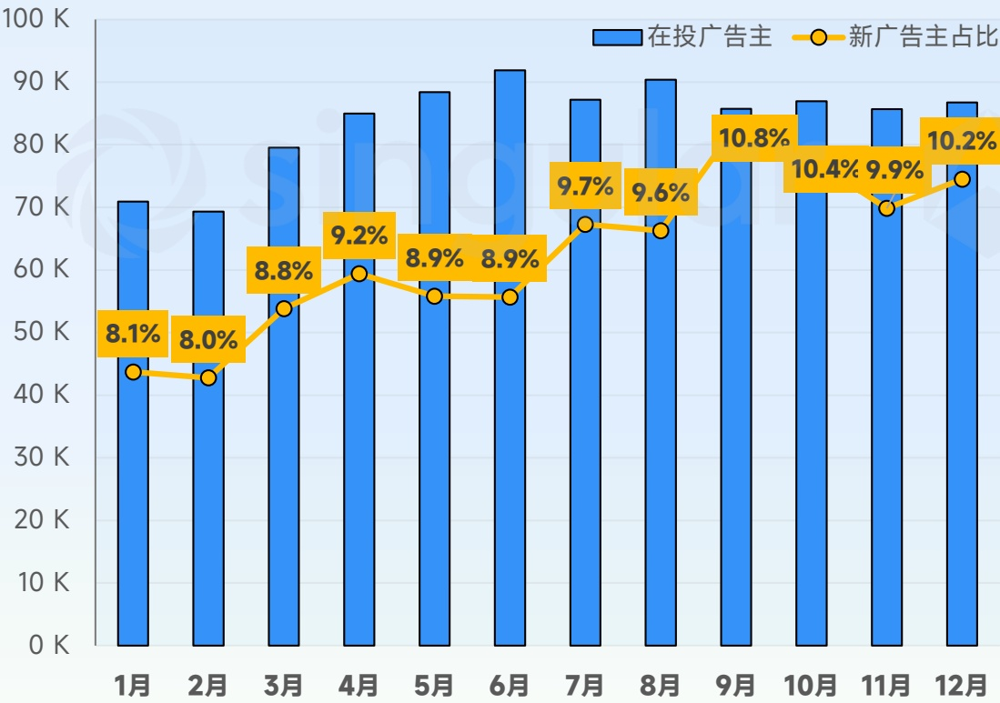
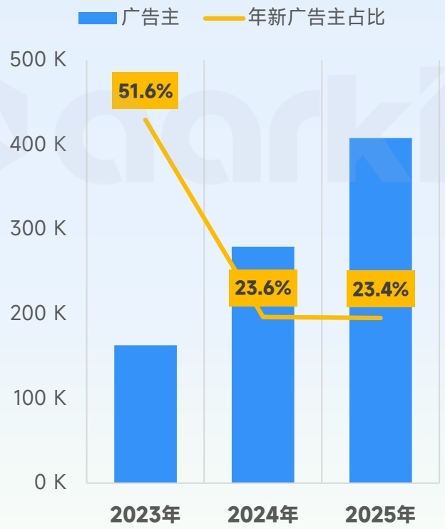

<!-- page 7 -->

## 2025年 全球手游投放趋势观察

## 2025年6月份在投手游广告主超过9万，每月新投手游均值接近8000

- 2025年月均手游广告主超8.4万名，同比增长了 \(21.9\%\) ，在6月份达到峰值超过9万名，全年手游广告主超40万；

- 每月平均新增近8000名手游广告主，月均占比 \(9.4\%\) ，其中9、10、12这3个月占比超 \(10\%\) ，全年新广告主占比 \(23.4\%\) ，与去年占比几乎持平。

## 2025年 月均在投广告主

84.0K

同比 \(21.9\%\)

## 2025年 月均新投广告主占比

9.4%

月均新广告主：7.9K

2025年全球手游各月广告主趋势

[image_caption]
该图像为一个柱状图，展示了每月在投广告主的数量及其新广告主占比的变化趋势。

### 图表描述：

- **图表类型**：柱状图 + 折线图
- **X轴**：表示月份，从1月到12月。
- **Y轴**：表示在投广告主的数量，单位为千（K），范围从0到100K。
- **蓝色柱状图**：代表每月的在投广告主数量。
- **黄色折线图**：代表每月新广告主占总广告主的比例，以百分比形式标注在折线上方。

### 数据趋势与具体数值：

#### 在投广告主数量（蓝色柱状图）：
- 1月：约70K
- 2月：约70K
- 3月：约80K
- 4月：约85K
- 5月：约90K
- 6月：约90K
- 7月：约85K
- 8月：约90K
- 9月：约85K
- 10月：约85K
- 11月：约85K
- 12月：约85K

#### 新广告主占比（黄色折线图）：
- 1月：8.1%
- 2月：8.0%
- 3月：8.8%
- 4月：9.2%
- 5月：8.9%
- 6月：8.9%
- 7月：9.7%
- 8月：9.6%
- 9月：10.8%
- 10月：10.4%
- 11月：9.9%
- 12月：10.2%

### 主要信息：
- 在投广告主数量在3月至6月期间达到峰值，分别为约80K、85K、90K和90K，随后略有下降，但在7月至12月期间保持相对稳定，约为85K。
- 新广告主占比在3月至6月期间波动较小，均在8.8%至8.9%之间。7月开始显著上升，8月达到9.7%，9月进一步上升至10.8%，之后略有下降，但仍保持在较高水平，12月为10.2%。

整体来看，广告主数量在上半年增长较快，下半年趋于稳定，而新广告主的占比则在下半年显著提升，表明市场中新增广告主的比例逐渐增加。
[/image_caption]

近3年手游广告主趋势

[image_caption]
这是一张柱状图，展示了2023年至2025年广告主的数量及其年新广告主的占比。

1. **图表类型**：柱状图
2. **主要信息**：
   - **蓝色柱状**：表示广告主的数量，单位为千（K）。
     - 2023年：约170K
     - 2024年：约270K
     - 2025年：约400K
   - **黄色折线**：表示年新广告主的占比。
     - 2023年：51.6%
     - 2024年：23.6%
     - 2025年：23.4%

3. **数据趋势**：
   - 广告主数量逐年增加，从2023年的约170K增长到2025年的约400K。
   - 年新广告主的占比在2023年达到最高点51.6%，随后在2024年和2025年分别下降至23.6%和23.4%。

这张图表清晰地展示了广告主数量的增长趋势以及年新广告主占比的变化情况。
[/image_caption]