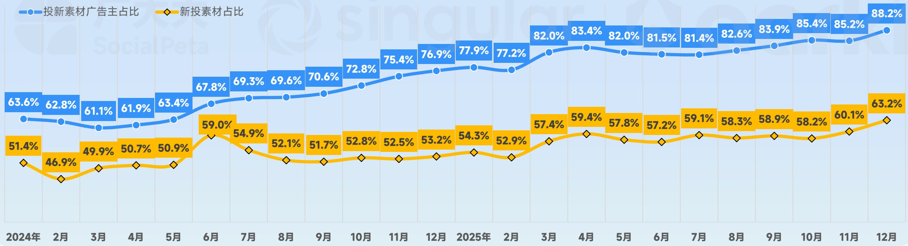

<!-- page 8 -->

## 2025年 全球手游新投放趋势观察

## 每月投新素材广告主已经稳超8成，新素材占比在11月份突破 \(60\%\)

- 2025年每月投放新素材广告主平均占比超过 \(82\%\) ，对比去年同期提升了 \(14.6\%\) 。且投新素材广告主占比稳定攀升，在12月份达到峰值 \(88.2\%\)

- 每月新素材占比在11月份超过 \(60\%\) 于12月份达到峰值 \(63.2\%\) ，新素材占比趋势逐步提升，2025年月均新素材占比为 \(58.1\%\) ，比去年高出5.9个百分点。

82.5% 同比：14.6%↑

2025年 月均投新广告主占比

58.1% 同比：5.9%↑

2025年 每月新素材占比

2024&2025 每月投新素材和新素材占比趋势

[image_caption]
这是一张折线图，展示了2024年1月至2025年12月期间两个指标的变化趋势：投新素材广告主占比（蓝色折线）和新投素材占比（黄色折线）。图表的横轴表示时间，从2024年1月到2025年12月，纵轴表示百分比。

### 投新素材广告主占比（蓝色折线）
- 2024年1月：63.6%
- 2024年2月：62.8%
- 2024年3月：61.1%
- 2024年4月：61.9%
- 2024年5月：63.4%
- 2024年6月：67.8%
- 2024年7月：69.3%
- 2024年8月：69.6%
- 2024年9月：70.6%
- 2024年10月：72.8%
- 2024年11月：75.4%
- 2024年12月：76.9%
- 2025年1月：77.9%
- 2025年2月：77.2%
- 2025年3月：82.0%
- 2025年4月：83.4%
- 2025年5月：82.0%
- 2025年6月：81.5%
- 2025年7月：81.4%
- 2025年8月：82.6%
- 2025年9月：83.9%
- 2025年10月：85.4%
- 2025年11月：85.2%
- 2025年12月：88.2%

### 新投素材占比（黄色折线）
- 2024年1月：51.4%
- 2024年2月：46.9%
- 2024年3月：49.9%
- 2024年4月：50.7%
- 2024年5月：50.9%
- 2024年6月：59.0%
- 2024年7月：54.9%
- 2024年8月：52.1%
- 2024年9月：51.7%
- 2024年10月：52.8%
- 2024年11月：52.5%
- 2024年12月：53.2%
- 2025年1月：54.3%
- 2025年2月：52.9%
- 2025年3月：57.4%
- 2025年4月：59.4%
- 2025年5月：57.8%
- 2025年6月：57.2%
- 2025年7月：59.1%
- 2025年8月：58.3%
- 2025年9月：58.9%
- 2025年10月：58.2%
- 2025年11月：60.1%
- 2025年12月：63.2%

### 主要信息
- **投新素材广告主占比**：整体呈上升趋势，从2024年1月的63.6%逐渐增加到2025年12月的88.2%。
- **新投素材占比**：波动较大，但在2025年有明显的上升趋势，从2024年1月的51.4%增加到2025年12月的63.2%。

这张图表清晰地展示了两个指标随时间变化的趋势，投新素材广告主占比持续上升，而新投素材占比在经历波动后也呈现上升趋势。
[/image_caption]