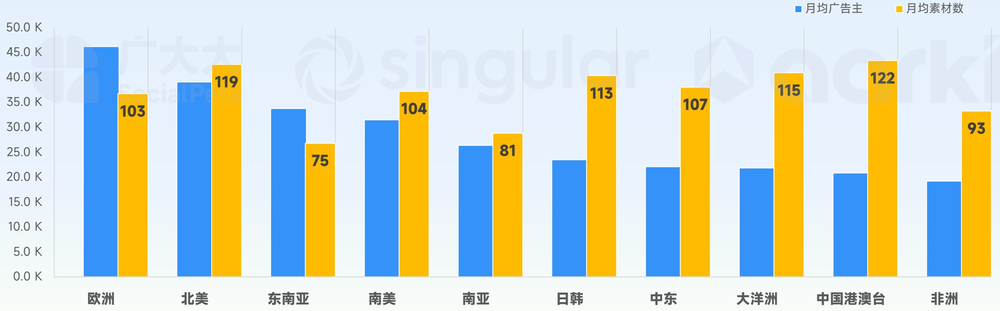

<!-- page 10 -->

## 2025年 热门地区手游营销观察

## 欧洲成今年唯一月均广告主超4万地区；港澳台月均素材投放TOP1，北美、大洋洲紧随其后

- 欧洲地区2025年月均手游广告主数量已经超过4.6万名，比第二名北美地区高出6000多，是唯一月均手游广告主超4万的地区。此外东南亚和南美月均手游广告主均超过3万名；

- 中国港澳台地区以月均投放122条素材成为2025年营销竞争最卷地区，北美地区以月均119条创意紧随其后，此外大洋洲和日韩市场月均素材都超过110条。

## 月均广告主最高：

## 欧洲地区46.2K

## 月均素材量最大：

## 港澳台地区 122条

[image_caption]
这是一张柱状图，展示了不同地区月均广告主数量和月均素材数的对比。图表的横轴表示不同的地区，包括欧洲、北美、东南亚、南美、南亚、日韩、中东、大洋洲、中国港澳台和非洲。纵轴表示数量，单位为千（K）。

具体数据如下：
- 欧洲：月均广告主45.0K，月均素材数103
- 北美：月均广告主38.0K，月均素材数119
- 东南亚：月均广告主33.0K，月均素材数75
- 南美：月均广告主31.0K，月均素材数104
- 南亚：月均广告主26.0K，月均素材数81
- 日韩：月均广告主23.0K，月均素材数113
- 中东：月均广告主22.0K，月均素材数107
- 大洋洲：月均广告主21.0K，月均素材数115
- 中国港澳台：月均广告主20.0K，月均素材数122
- 非洲：月均广告主19.0K，月均素材数93

蓝色柱状表示月均广告主数量，黄色柱状表示月均素材数。从图中可以看出，北美和中国港澳台地区的月均素材数较高，而东南亚地区的月均广告主数量相对较低。整体来看，月均素材数普遍高于月均广告主数量。
[/image_caption]