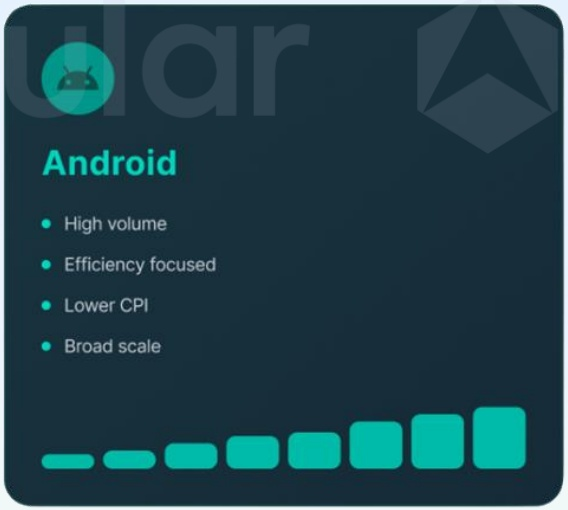
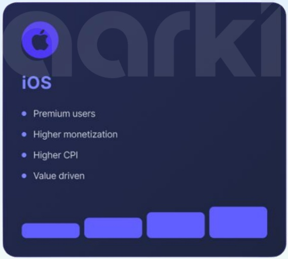

<!-- page 34 -->

## 2025年广告预算流向解析

安卓以规模制胜，iOS以效率见长。

## 从全球市场来看，各移动平台的总体格局保持稳定。

- 安卓凭借其设备规模、更广泛的地域覆盖以及显著更低的平均用户获取成本（通常比iOS低40%至60%），持续贡献了大部分的安装量：

- iOS虽安装量较少，却创造了与其数量不成比例的高额收入，进一步巩固了其作为高效变现渠道的核心地位。

## Android 推动安装量增长, iOS 则带来价值提升

## 市场策略的关键演变在于，营销者对待两大平台的方式发生了转变：

顶尖品牌不再以相同逻辑优化安卓与iOS。他们将其视为截然不同的获客环境，针对各自特性量身定制创意方案、出价策略与效果评估体系。

[image_caption]
该图像展示了一个关于Android的特性描述图，属于结构化图形中的信息图表类型。图表的主要内容包括：

- 左上角有一个绿色的Android机器人图标。
- 标题为“Android”，字体较大且醒目。
- 列出了四个特性：
  - High volume（高容量）
  - Efficiency focused（效率导向）
  - Lower CPI（较低的每千次印象成本）
  - Broad scale（广泛规模）
- 每个特性前面有一个绿色的小圆点作为标记。
- 图表底部有一排逐渐增大的绿色矩形条，表示某种渐进或增长的趋势。

整体背景为深蓝色，设计简洁明了，突出Android的四大特点。
[/image_caption]

[image_caption]
该图像展示了一个与iOS相关的图表，背景为深蓝色，顶部有一个紫色的苹果标志和“aarki”字样。图表的主要内容包括以下几点：

- **标题**：iOS
- **列表项**：
  - Premium users（高级用户）
  - Higher monetization（更高的货币化）
  - Higher CPI（更高的每次点击成本）
  - Value driven（价值驱动）

底部有四个不同长度的蓝色矩形条，从左到右依次变长，可能表示各项指标的相对重要性或比例。

整体来看，这是一个信息图，用于说明iOS平台在用户、货币化、成本和价值方面的特点。
[/image_caption]