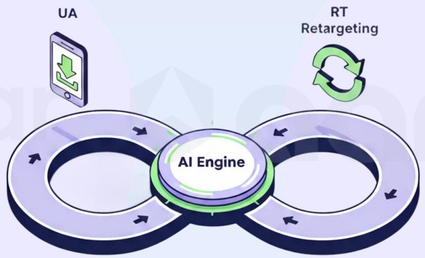

<!-- page 42 -->

## 增长并非单向链路，而是持续循环

传统投放链路在「用户安装」时结束，而真正的增长机会恰恰从这里开始。

当下的增长路径并非一条直线，而是信号、内容与行为之间持续交换并随时间不断累积的过程。

## 左侧循环：用户获取（UA）

负责捕获用户注意力，并将其转化为初始行动。

## 右侧循环：再营销（RT）

通过持续互动重新激活用户，并不断强化留存。

## 核心引擎：Aarki的差异化能力

位于系统中央的是Aarki的核心优势——一个由监督式AI、创意智能与数据反馈闭环共同驱动的智能引擎，同时加速并强化左右两侧的增长循环。

「无限循环 (Infinity Loop)」是 Aarki 提出的、用于实现互联和可持续增长的模型。它以一个有生命力的系统取代了单向链路——在这个系统中，每一次用行为都会为下一次增长提供动能。

[image_caption]
该图像展示了一个流程图，中心是一个标有“AI Engine”的圆形模块，周围有两个环形路径。左侧路径上方标有“UA”，并配有一个手机图标，显示一个绿色的向下箭头，表示用户获取（User Acquisition）的过程。右侧路径上方标有“RT Retargeting”，并配有一个绿色的循环箭头图标，表示再营销（Retargeting）的过程。整个流程图通过箭头指示了数据或信息在AI引擎、用户获取和再营销之间的流动方向。
[/image_caption]

监督式 AI（Supervised AI）将人类洞察与机器级精度相结合：它能够从投放表现中进行实时学习，将这些经验跨渠道应用，并在数据信号衰减的环境下，依然保持优化过程的透明性与可控性。这种人类语境理解与算法速度之间的平衡，使自动化不再只是效率工具，而成为可持续竞争优势。

每一次循环都会强化下一次增长

认知转化为认同，认同进一步演变为主动传播

来自留存阶段的洞察，持续反向重塑获客策略