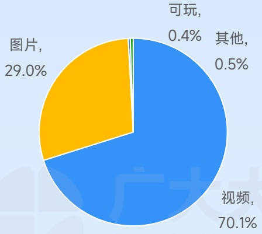
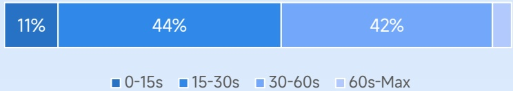
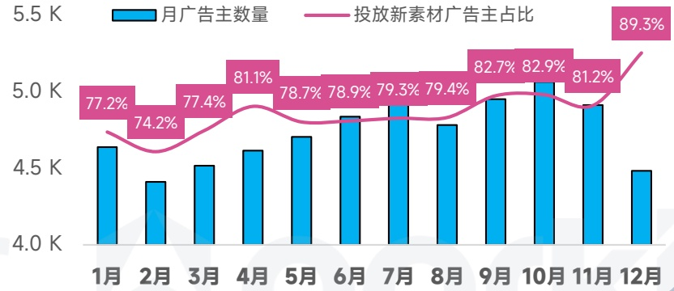
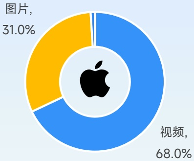
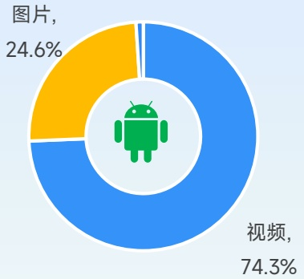
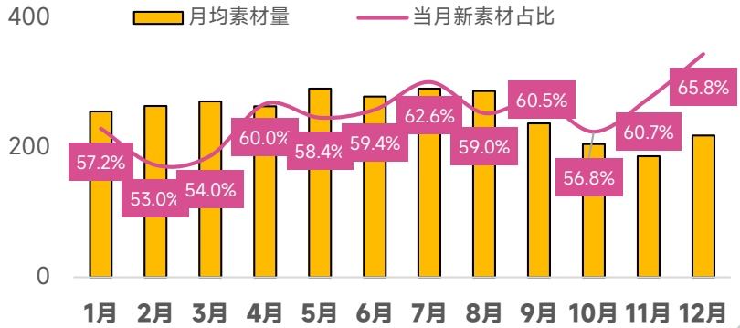

<!-- page 56 -->

## RPG手游投放趋势观察

传统数值养成加IP联动养成新式放置、肉鸽RPG，武侠、微恐MMO占据视听宣传优势成为目前主流

各类型素材带来展现占比

[image_caption]
这是一张饼图，展示了不同类型内容的占比情况。具体数据如下：

- 视频：70.1%
- 图片：29.0%
- 可玩：0.4%
- 其他：0.5%

饼图中，视频部分占据了最大的比例，用蓝色表示；图片部分次之，用黄色表示；可玩和其他部分分别用绿色和浅蓝色表示，所占比例较小。
[/image_caption]

视频素材时长分布

[image_caption]
该图是一个水平条形图，展示了不同年龄段的百分比分布。具体数据如下：

- 0-15s：11%
- 15-30s：44%
- 30-60s：42%
- 60s-Max：3%

图表使用不同深浅的蓝色来区分各个年龄段，从左到右依次为：深蓝色（0-15s）、中蓝色（15-30s）、浅蓝色（30-60s）和极浅蓝色（60s-Max）。每个年龄段的百分比值清晰地标记在对应的条形上方。
[/image_caption]

图片素材形式分布

[image_caption]
该图是一个水平条形图，展示了四种不同类型的图片占比。具体数据如下：
- 竖版：16%
- 横版：6%
- 方形：77%
- 横幅：0%

图表下方有对应的颜色标识，分别为：
- 竖版：深黄色
- 横版：浅黄色
- 方形：橙色
- 横幅：浅橙色

主要信息显示方形图片占比最高，达到77%，其次是竖版图片占16%，横版图片占6%，横幅图片占比为0%。
[/image_caption]

广告主数量月度变化趋势

[image_caption]
该图是一个组合图表，包含柱状图和折线图。

1. **图表类型**：
   - 柱状图（蓝色）：表示“月广告主数量”。
   - 折线图（粉色）：表示“投放新素材广告主占比”。

2. **数据趋势**：
   - **月广告主数量**（蓝色柱状图）：
     - 1月：约4.6K
     - 2月：约4.5K
     - 3月：约4.5K
     - 4月：约4.6K
     - 5月：约4.7K
     - 6月：约4.8K
     - 7月：约4.9K
     - 8月：约4.7K
     - 9月：约5.0K
     - 10月：约5.1K
     - 11月：约5.0K
     - 12月：约4.4K

   - **投放新素材广告主占比**（粉色折线图）：
     - 1月：77.2%
     - 2月：74.2%
     - 3月：77.4%
     - 4月：81.1%
     - 5月：78.7%
     - 6月：78.9%
     - 7月：79.3%
     - 8月：79.4%
     - 9月：82.7%
     - 10月：82.9%
     - 11月：81.2%
     - 12月：89.3%

3. **主要信息**：
   - 月广告主数量在年初有所波动，从1月的约4.6K逐渐上升至10月的约5.1K，随后在11月和12月略有下降，12月降至约4.4K。
   - 投放新素材广告主占比在年初较低，从1月的77.2%逐渐上升至12月的89.3%，显示出显著的增长趋势。

总结：该图表展示了月广告主数量和投放新素材广告主占比随时间的变化趋势，其中投放新素材广告主占比有明显的上升趋势。
[/image_caption]

不同系统策略素材占比

[image_caption]
这是一张饼图，显示了两种类型的媒体内容占比。饼图的中心有一个苹果公司的标志。饼图分为两部分：黄色部分代表“图片”，占比31.0%；蓝色部分代表“视频”，占比68.0%。
[/image_caption]

[image_caption]
这是一张饼图，显示了两种类型的占比情况。饼图的主体部分被分为两个颜色区域：蓝色区域占74.3%，标签为“视频”；黄色区域占24.6%，标签为“图片”。饼图的中心有一个绿色的Android机器人图标。整体背景为浅蓝色。
[/image_caption]

TOP100广告主出海厂商占比

71%

月均在投素材量变化趋势

[image_caption]
这是一张柱状图和折线图结合的图表，展示了某时间段内的数据变化情况。图表的主要信息如下：

1. **图表类型**：柱状图和折线图结合。
2. **X轴**：表示月份，从1月到12月。
3. **Y轴**：表示数值，范围从0到400。
4. **黄色柱状图**：表示“月均素材量”，每个柱子的高度代表每个月的平均素材量。
5. **粉色折线图**：表示“当月新素材占比”，折线上的点连接起来形成一条曲线，表示每个月新素材占总素材的比例。

具体数据如下：
- **1月**：月均素材量约为250，新素材占比57.2%。
- **2月**：月均素材量约为260，新素材占比53.0%。
- **3月**：月均素材量约为270，新素材占比54.0%。
- **4月**：月均素材量约为280，新素材占比60.0%。
- **5月**：月均素材量约为290，新素材占比58.4%。
- **6月**：月均素材量约为280，新素材占比59.4%。
- **7月**：月均素材量约为300，新素材占比62.6%。
- **8月**：月均素材量约为290，新素材占比59.0%。
- **9月**：月均素材量约为250，新素材占比60.5%。
- **10月**：月均素材量约为220，新素材占比56.8%。
- **11月**：月均素材量约为230，新素材占比60.7%。
- **12月**：月均素材量约为240，新素材占比65.8%。

从图表中可以看出，月均素材量在不同月份之间有波动，而新素材占比则在60%左右波动，最高达到65.8%，最低为53.0%。
[/image_caption]