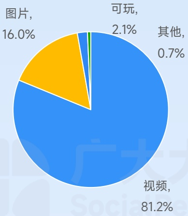
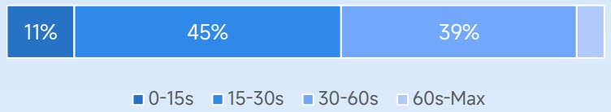
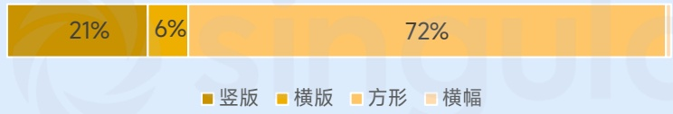
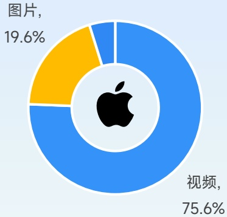
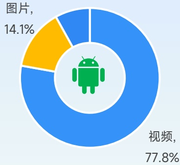
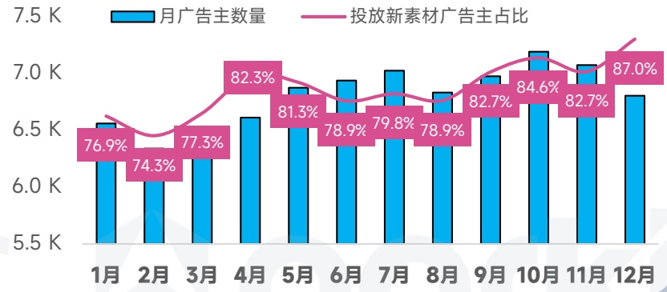
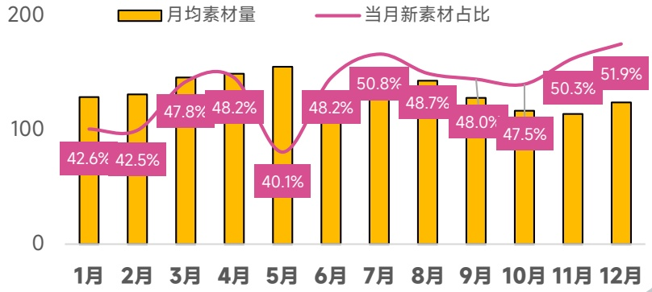

<!-- page 58 -->

## 模拟手游投放趋势观察

模拟玩法中写实经营表现亮眼，经典买量素材复用率高于其他品类

各类型素材带来展现占比

[image_caption]
这是一张饼图，展示了不同类型内容的占比情况。具体数据如下：

- 视频：81.2%
- 图片：16.0%
- 可玩：2.1%
- 其他：0.7%

饼图中，视频占据了最大的比例，用蓝色表示；图片次之，用黄色表示；可玩内容用橙色表示；其他内容用绿色表示，占比最小。
[/image_caption]

视频素材时长分布

[image_caption]
这是一张柱状图，展示了不同年龄段的分布情况。图表分为四个部分，分别代表0-15s、15-30s、30-60s和60s-Max四个年龄段。每个部分的宽度和颜色不同，具体数据如下：

- 0-15s：11%
- 15-30s：45%
- 30-60s：39%
- 60s-Max：（未显示具体百分比）

图表底部有颜色对应的图例，蓝色深浅表示不同的年龄段。整体来看，15-30s年龄段占比最高，其次是30-60s，0-15s占比最低。
[/image_caption]

图片素材形式分布

[image_caption]
这是一张柱状图，展示了四种不同类型的图片占比。具体数据如下：
- 竖版：21%
- 横版：6%
- 方形：72%
- 横幅：0%

图表下方有图例，分别用不同颜色的方块表示四种类型：
- 深棕色：竖版
- 浅棕色：横版
- 橙色：方形
- 浅橙色：横幅

整体来看，方形图片占比最大，达到72%，其次是竖版图片，占比21%，横版图片占比最小，仅为6%。
[/image_caption]

不同系统策略素材占比

[image_caption]
这是一张饼图，显示了不同类型内容的占比。饼图分为两部分：蓝色部分占75.6%，标注为“视频”；黄色部分占19.6%，标注为“图片”。饼图中央有一个苹果公司的标志。
[/image_caption]

[image_caption]
这是一张饼图，显示了不同类型内容的占比。饼图分为两个部分：蓝色部分占77.8%，标签为“视频”；黄色部分占14.1%，标签为“图片”。饼图中央有一个绿色的Android机器人图标。
[/image_caption]

TOP100广告主出海厂商占比

广告主数量月度变化趋势

[image_caption]
这是一张柱状图和折线图结合的图表，展示了1月至12月期间的月广告主数量和投放新素材广告主占比。

### 图表类型
- **柱状图**：表示每月的广告主数量。
- **折线图**：表示每月投放新素材广告主的占比。

### 主要信息和数据趋势
1. **月广告主数量**（蓝色柱状图）：
   - 1月：约6.7K
   - 2月：约6.4K
   - 3月：约6.7K
   - 4月：约6.6K
   - 5月：约7.0K
   - 6月：约7.0K
   - 7月：约7.0K
   - 8月：约6.9K
   - 9月：约7.1K
   - 10月：约7.1K
   - 11月：约7.0K
   - 12月：约7.0K

2. **投放新素材广告主占比**（粉色折线图）：
   - 1月：76.9%
   - 2月：74.3%
   - 3月：77.3%
   - 4月：82.3%
   - 5月：81.3%
   - 6月：78.9%
   - 7月：79.8%
   - 8月：78.9%
   - 9月：82.7%
   - 10月：84.6%
   - 11月：82.7%
   - 12月：87.0%

### 数据趋势分析
- **月广告主数量**：整体呈上升趋势，从1月的约6.7K增加到12月的约7.0K，中间有小幅波动。
- **投放新素材广告主占比**：总体呈上升趋势，从1月的76.9%增加到12月的87.0%，中间有小幅波动，但总体上升明显。

这张图表清晰地展示了广告主数量和投放新素材广告主占比的变化趋势，反映了市场对新素材广告的接受度和使用率在逐年增加。
[/image_caption]

月均在投素材量变化趋势

[image_caption]
这是一张柱状图和折线图结合的图表，展示了月均素材量和当月新素材占比的变化情况。

**图表类型**：柱状图 + 折线图

**X轴**：表示月份，从1月到12月。
**Y轴**：表示数值，范围从0到200。

**柱状图**（黄色）：表示月均素材量。
- 1月：约130
- 2月：约130
- 3月：约140
- 4月：约140
- 5月：约150
- 6月：约140
- 7月：约140
- 8月：约140
- 9月：约130
- 10月：约130
- 11月：约130
- 12月：约130

**折线图**（粉色）：表示当月新素材占比。
- 1月：42.6%
- 2月：42.5%
- 3月：47.8%
- 4月：48.2%
- 5月：40.1%
- 6月：48.2%
- 7月：50.8%
- 8月：48.7%
- 9月：48.0%
- 10月：47.5%
- 11月：50.3%
- 12月：51.9%

**主要信息**：
- 月均素材量在5月达到最高点，约为150，之后略有下降。
- 当月新素材占比在7月达到最高点，为50.8%，随后有所波动，但在12月再次上升至51.9%。

这张图表清晰地展示了月均素材量和当月新素材占比随时间的变化趋势。
[/image_caption]