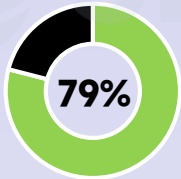
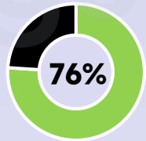
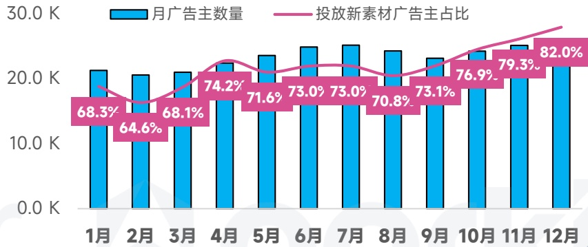
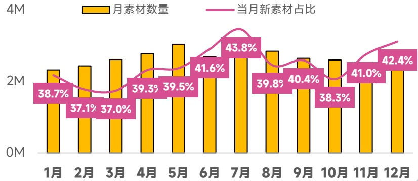

<!-- page 72 -->

## 日韩地区 手游投放趋势观察

日韩地区广告主、素材数量综合增幅居全球第一梯队，营销素材与游戏类型明显偏IP化、多元化、轻度化，日韩也成为小游戏出海主要市场

## 手游广告主数

同比增长 \(56\%\)

7.1W↑

## 手游素材去重创意

同比增长67%

14.2M↑

## 视频创意占比

77.2%

## 各系统占比

[image_caption]
这是一张饼图，显示了79%的数据。饼图由两部分组成：一部分为黑色，另一部分为绿色，绿色部分占据了大部分面积，表示79%的比例。
[/image_caption]

广告主

[image_caption]
该图是一个饼图，显示了76%的数据占比。饼图分为两部分：一部分为绿色，占据76%；另一部分为黑色，占据剩余的24%。中心位置标有“76%”的字样。
[/image_caption]

素材数

## 热投产品

X-Clash

Tile Explorer

MapleStory

## 爆款新品

TopTop(

金不格大霸道

RAVEN2

广告主数量月度变化趋势

[image_caption]
这是一张柱状图和折线图结合的图表，展示了月广告主数量和投放新素材广告主占比的变化趋势。

### 图表类型
- **柱状图**：表示每月的广告主数量。
- **折线图**：表示每月投放新素材广告主的占比。

### 数据描述
#### 月广告主数量（蓝色柱状图）
- 1月：约20.0K
- 2月：约20.0K
- 3月：约20.0K
- 4月：约25.0K
- 5月：约25.0K
- 6月：约25.0K
- 7月：约25.0K
- 8月：约25.0K
- 9月：约25.0K
- 10月：约25.0K
- 11月：约25.0K
- 12月：约25.0K

#### 投放新素材广告主占比（粉色折线图）
- 1月：68.3%
- 2月：64.6%
- 3月：68.1%
- 4月：74.2%
- 5月：71.6%
- 6月：73.0%
- 7月：73.0%
- 8月：70.8%
- 9月：73.1%
- 10月：76.9%
- 11月：79.3%
- 12月：82.0%

### 趋势分析
- **月广告主数量**：从1月到4月有显著增长，之后保持稳定在约25.0K。
- **投放新素材广告主占比**：整体呈上升趋势，从1月的68.3%逐渐增加到12月的82.0%。尽管中间有小幅波动，但总体趋势向上。

这张图表清晰地展示了广告主数量和新素材投放比例的变化情况，反映了市场对新素材广告的接受度和使用率在逐步提高。
[/image_caption]

在投素材月度变化趋势

[image_caption]
这是一张柱状图和折线图结合的图表，展示了1月至12月的数据变化情况。

**图表类型**：
- 柱状图（黄色）：表示每月素材数量。
- 折线图（粉色）：表示当月新素材占比。

**主要信息和数据趋势**：
1. **每月素材数量（黄色柱状图）**：
   - 1月：约38.7M
   - 2月：约37.1M
   - 3月：约37.0M
   - 4月：约39.3M
   - 5月：约39.5M
   - 6月：约41.6M
   - 7月：约43.8M
   - 8月：约39.8M
   - 9月：约40.4M
   - 10月：约38.3M
   - 11月：约41.0M
   - 12月：约42.4M

2. **当月新素材占比（粉色折线图）**：
   - 1月：38.7%
   - 2月：37.1%
   - 3月：37.0%
   - 4月：39.3%
   - 5月：39.5%
   - 6月：41.6%
   - 7月：43.8%
   - 8月：39.8%
   - 9月：40.4%
   - 10月：38.3%
   - 11月：41.0%
   - 12月：42.4%

**趋势分析**：
- 每月素材数量在1月至12月间有波动，总体呈上升趋势，特别是在6月和7月达到峰值。
- 当月新素材占比在1月至12月间也有所波动，但整体保持在38%至43%之间，7月达到最高点43.8%，随后略有下降，但在12月回升至42.4%。
[/image_caption]