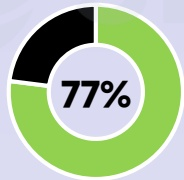
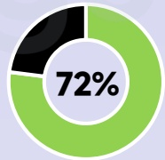
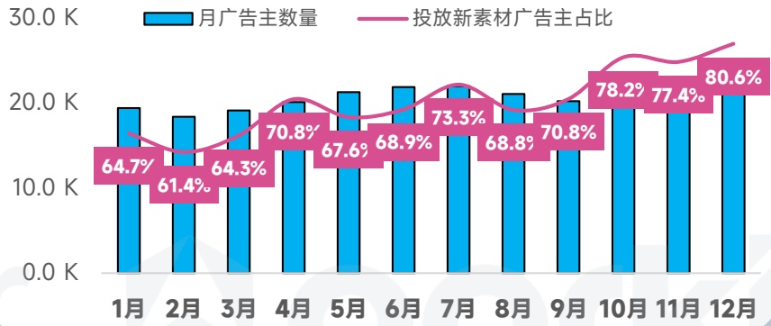
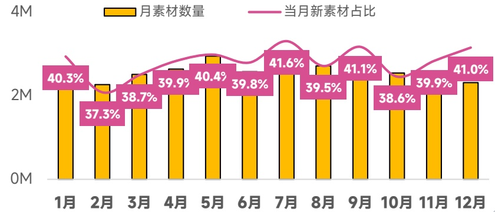

<!-- page 73 -->

## 中国港澳台 手游投放趋势观察

视频创意占比略超日韩、北美，成为区域投放的绝对主流形式，热门品类涵盖RPG、模拟经营等中轻度游戏

## 手游广告主数

同比增长 \(51\%\)

6.1W↑

## 手游素材去重创意

同比增长 \(55\%\)

13.4M↑

## 视频创意占比

77.3%

## 各系统占比

[image_caption]
这是一张饼图，显示了77%的数据。饼图分为两部分：一部分为黑色，另一部分为绿色，绿色部分占据了大部分面积，代表77%的比例。
[/image_caption]

广告主

[image_caption]
这是一张饼图，显示了72%的数据。饼图由一个绿色的部分和一个黑色的部分组成，绿色部分占据了大部分面积，表示72%的比例，而黑色部分则占据了剩余的28%。
[/image_caption]

素材数

## 热投产品

奇蹟MU

Mahjong Wonders

江湖有詭

## 爆款新品

杖剑传说

蔚藍星球國王很忙

我的花園世界

广告主数量月度变化趋势

[image_caption]
这是一张柱状图，展示了每个月的广告主数量（蓝色柱状）和投放新素材广告主的占比（粉色折线）。图表的时间范围从1月到12月。

- **蓝色柱状**：表示每月广告主的数量，单位为千（K）。
  - 1月：约20K
  - 2月：约20K
  - 3月：约20K
  - 4月：约20K
  - 5月：约20K
  - 6月：约20K
  - 7月：约20K
  - 8月：约20K
  - 9月：约20K
  - 10月：约20K
  - 11月：约20K
  - 12月：约20K

- **粉色折线**：表示投放新素材广告主的占比，单位为百分比（%）。
  - 1月：64.7%
  - 2月：61.4%
  - 3月：64.3%
  - 4月：70.8%
  - 5月：67.6%
  - 6月：68.9%
  - 7月：73.3%
  - 8月：68.8%
  - 9月：70.8%
  - 10月：78.2%
  - 11月：77.4%
  - 12月：80.6%

整体趋势显示，广告主数量在各个月份间保持相对稳定，而投放新素材广告主的占比则有波动，总体呈上升趋势。
[/image_caption]

在投素材月度变化趋势

[image_caption]
这是一张柱状图，展示了每个月的素材数量（黄色柱状）和当月新素材占比（粉色折线）。图表的横轴表示月份，从1月到12月；纵轴表示素材数量，范围从0M到4M。

具体数据如下：
- 1月：素材数量约为2.5M，新素材占比40.3%
- 2月：素材数量约为2.3M，新素材占比37.3%
- 3月：素材数量约为2.6M，新素材占比38.7%
- 4月：素材数量约为2.7M，新素材占比39.9%
- 5月：素材数量约为2.8M，新素材占比40.4%
- 6月：素材数量约为2.7M，新素材占比39.8%
- 7月：素材数量约为2.8M，新素材占比41.6%
- 8月：素材数量约为2.7M，新素材占比41.1%
- 9月：素材数量约为2.6M，新素材占比39.5%
- 10月：素材数量约为2.5M，新素材占比38.6%
- 11月：素材数量约为2.6M，新素材占比39.9%
- 12月：素材数量约为2.6M，新素材占比41.0%

从图表中可以看出，每月的素材数量大致在2.5M到2.8M之间波动，而新素材占比在37.3%到41.6%之间变化。7月的新素材占比达到最高点41.6%，而2月的新素材占比最低，为37.3%。
[/image_caption]