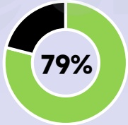
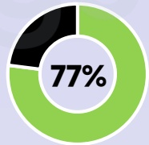
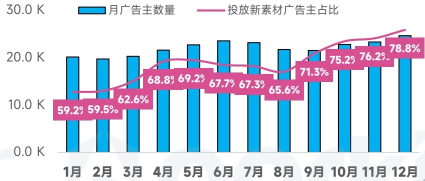
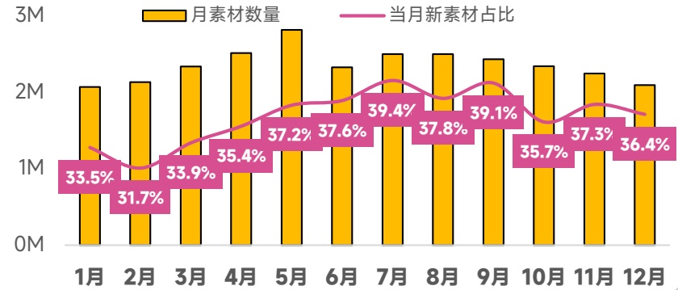

<!-- page 75 -->

## 中东地区 手游投放趋势观察

中东游戏于5、6月达到投放巅峰，经典素材反复投放引流、素材迭代速度较慢，每月新素材占比始终低于40%

## 手游广告主数

同比增长 \(52\%\)

6.8W↑

## 手游素材去重创意

同比增长 \(69\%\)

11.7M↑

## 视频创意占比

77.7%

## 各系统占比

[image_caption]
这是一张饼图，显示了79%的数据。饼图由三个部分组成：一个黑色部分、一个绿色部分和一个白色中心区域，其中心区域标有“79%”。绿色部分占据了大部分面积，黑色部分较小，白色中心区域包含百分比数值。
[/image_caption]

广告主

[image_caption]
该图是一个饼图，显示了77%的数据占比。饼图分为两部分：一部分为绿色，占据77%；另一部分为黑色，占据剩余的23%。中心位置标有“77%”的字样。
[/image_caption]

素材数

## 热投产品

Kingshot

Mafia City

Logicus

## 爆款新品

Fate War

Legend of YMIR

Water Match

广告主数量月度变化趋势

[image_caption]
这是一张柱状图和折线图结合的图表，展示了月广告主数量和投放新素材广告主占比的变化趋势。

**图表类型**：柱状图 + 折线图

**主要信息**：
- **蓝色柱状图**：表示每月的广告主数量，单位为千（K）。
- **粉色折线图**：表示每月投放新素材的广告主占比，以百分比形式显示。

**数据趋势**：
1. **1月**：广告主数量约为20K，投放新素材广告主占比为59.2%。
2. **2月**：广告主数量约为20K，投放新素材广告主占比为59.5%。
3. **3月**：广告主数量约为20K，投放新素材广告主占比为62.6%。
4. **4月**：广告主数量约为22K，投放新素材广告主占比为68.8%。
5. **5月**：广告主数量约为22K，投放新素材广告主占比为69.2%。
6. **6月**：广告主数量约为22K，投放新素材广告主占比为67.7%。
7. **7月**：广告主数量约为22K，投放新素材广告主占比为67.3%。
8. **8月**：广告主数量约为21K，投放新素材广告主占比为65.6%。
9. **9月**：广告主数量约为21K，投放新素材广告主占比为71.3%。
10. **10月**：广告主数量约为22K，投放新素材广告主占比为75.2%。
11. **11月**：广告主数量约为22K，投放新素材广告主占比为76.2%。
12. **12月**：广告主数量约为22K，投放新素材广告主占比为78.8%。

**总结**：
- 广告主数量在1月至12月间总体保持在20K至22K之间，略有波动。
- 投放新素材广告主占比从1月的59.2%逐渐上升至12月的78.8%，显示出明显的增长趋势。
[/image_caption]

在投素材月度变化趋势

[image_caption]
这是一张柱状图和折线图结合的图表，展示了某时间段内月素材数量和当月新素材占比的变化情况。

1. **图表类型**：
   - 柱状图（黄色）：表示每月的素材数量。
   - 折线图（粉色）：表示当月新素材在总素材中的占比。

2. **数据趋势**：
   - **月素材数量**（黄色柱状图）：
     - 1月：约200万
     - 2月：约200万
     - 3月：约250万
     - 4月：约280万
     - 5月：约300万（最高）
     - 6月：约270万
     - 7月：约290万
     - 8月：约290万
     - 9月：约280万
     - 10月：约270万
     - 11月：约270万
     - 12月：约260万

   - **当月新素材占比**（粉色折线图）：
     - 1月：33.5%
     - 2月：31.7%
     - 3月：33.9%
     - 4月：35.4%
     - 5月：37.2%
     - 6月：37.6%
     - 7月：39.4%
     - 8月：37.8%
     - 9月：39.1%
     - 10月：35.7%
     - 11月：37.3%
     - 12月：36.4%

3. **主要信息**：
   - 月素材数量在5月达到最高点，为约300万。
   - 当月新素材占比在7月达到最高点，为39.4%。
   - 整体来看，月素材数量在年初较为稳定，随后逐渐增加并在5月达到峰值，之后有所波动但总体保持在较高水平。
   - 当月新素材占比在年初相对较低，随后逐渐上升并在7月达到峰值，之后有所下降但仍保持在较高水平。

这张图表清晰地展示了月素材数量和当月新素材占比的变化趋势，有助于分析素材生成和更新的规律。
[/image_caption]