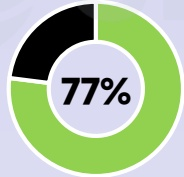
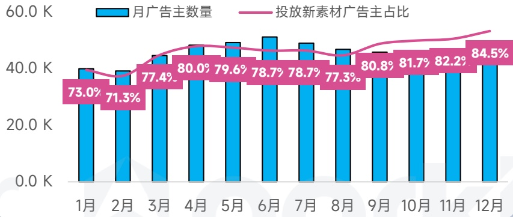
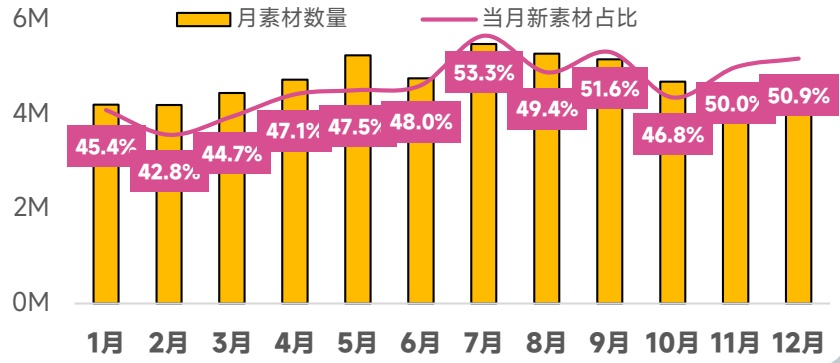

<!-- page 76 -->

## 欧洲地区 手游投放趋势观察

作为益智休闲产品主要市场，欧洲每月投放新素材广告主占比接近80%，并在2025Q2达到投放巅峰

## 手游广告主数

同比增长 \(58\%\)

21.1W↑

## 手游素材去重创意

同比增长 \(54\%\)

29.9M↑

## 视频创意占比

77.7%

## 各系统占比

[image_caption]
该图片展示了一个饼图，其中一部分被标记为77%，颜色为绿色，另一部分为黑色。绿色部分占据了饼图的大部分，而黑色部分占据了较小的部分。
[/image_caption]

广告主

[image_caption]
该图是一个饼图，显示了77%的数据占比。饼图分为两部分：一部分为绿色，占据大部分区域，表示77%；另一部分为黑色，占据剩余的小部分区域。
[/image_caption]

素材数

## 热投产品

Vita Mahjong

Zen Color

Bingo Voyage

## 爆款新品

Legend of Elements

Top Tycoon:

Umamusume: Pretty Derby

广告主数量月度变化趋势

[image_caption]
这是一张柱状图，展示了每个月的广告主数量和投放新素材广告主的占比。图表的横轴表示月份，从1月到12月；纵轴表示广告主数量，单位为千（K），范围从0到60K。

- **蓝色柱状图**：表示每月的广告主数量。
  - 1月：约40K
  - 2月：约40K
  - 3月：约45K
  - 4月：约50K
  - 5月：约50K
  - 6月：约50K
  - 7月：约45K
  - 8月：约45K
  - 9月：约50K
  - 10月：约50K
  - 11月：约50K
  - 12月：约55K

- **粉色折线图**：表示投放新素材广告主的占比。
  - 1月：73.0%
  - 2月：71.3%
  - 3月：77.4%
  - 4月：80.0%
  - 5月：79.6%
  - 6月：78.7%
  - 7月：78.7%
  - 8月：77.3%
  - 9月：80.8%
  - 10月：81.7%
  - 11月：82.2%
  - 12月：84.5%

整体来看，广告主数量在1月至12月间有波动，但总体呈上升趋势，尤其是在下半年增长明显。投放新素材广告主的占比在年初有所下降后逐渐上升，并在年末达到最高值84.5%。
[/image_caption]

在投素材月度变化趋势

[image_caption]
该图是一张柱状图和折线图结合的图表，展示了六个月（1月至12月）的数据。

**图表类型**：柱状图 + 折线图

**主要信息**：
- **黄色柱状图**：表示每个月的素材数量，单位为百万（M）。
- **粉色折线图**：表示当月新素材在总素材中的占比，以百分比（%）表示。

**数据趋势**：
1. **素材数量（黄色柱状图）**：
   - 1月：约450万
   - 2月：约430万
   - 3月：约450万
   - 4月：约470万
   - 5月：约480万
   - 6月：约480万
   - 7月：约530万
   - 8月：约510万
   - 9月：约500万
   - 10月：约470万
   - 11月：约500万
   - 12月：约510万

2. **当月新素材占比（粉色折线图）**：
   - 1月：45.4%
   - 2月：42.8%
   - 3月：44.7%
   - 4月：47.1%
   - 5月：47.5%
   - 6月：48.0%
   - 7月：53.3%
   - 8月：49.4%
   - 9月：51.6%
   - 10月：46.8%
   - 11月：50.0%
   - 12月：50.9%

**总结**：
- 素材数量在7月达到最高点，为约530万。
- 当月新素材占比在7月达到最高点，为53.3%。
- 整体来看，素材数量和当月新素材占比在下半年有上升趋势。
[/image_caption]