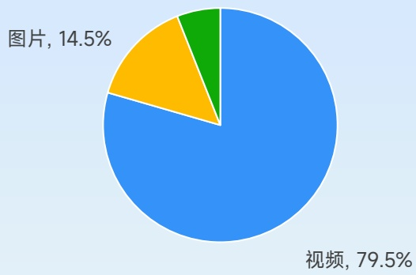
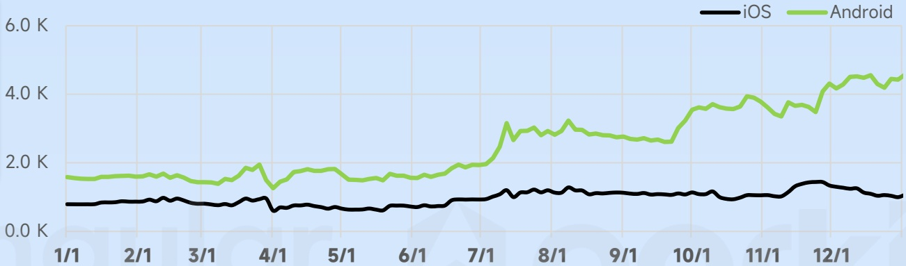
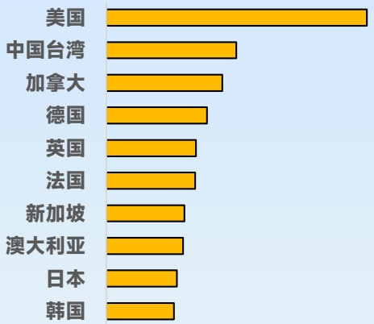
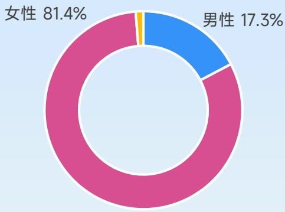
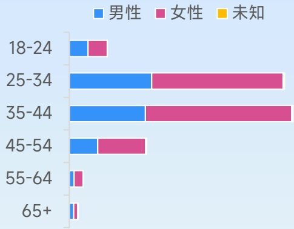

<!-- page 89 -->

## 热门模拟类手游营销观察

凭借极佳的游戏质量和优质营销节奏，成为2025出海收入亚军产品，凭一己之力提升整个中国厂商对于“二合”赛道的关注

## Gossip Harbor

剧情二合 柠檬微趣

## 广告主投放数据

产品首次投放：2022年6月

双端累计去重后创意：3.9万

各类型素材占比

[image_caption]
这是一张饼图，显示了两种类型的占比情况。蓝色部分占79.5%，代表视频；黄色部分占14.5%，代表图片。绿色部分非常小，未标注具体数值。整体图表背景为浅蓝色。
[/image_caption]

2025年广告主双端投放素材堆积图

[image_caption]
这是一张折线图，展示了iOS和Android两个平台的数据变化趋势。图表的背景为浅蓝色，带有网格线，便于读取数据。

- **X轴**：表示时间，从1月1日到12月1日，每个月的1号标记在X轴上。
- **Y轴**：表示数值，范围从0.0K到6.0K，每隔1.0K有一个刻度标记。
- **图例**：右上角有两个图例，黑色线条代表iOS，绿色线条代表Android。

**数据趋势**：
- **iOS（黑色线条）**：整体趋势较为平稳，数值在0.5K到1.0K之间波动，没有明显的上升或下降趋势。
- **Android（绿色线条）**：从1月1日的约1.5K开始，逐渐上升，到12月1日达到约4.5K。中间有几次小幅波动，但总体呈现上升趋势。

总结：Android的数据在一年内显著增长，而iOS的数据保持相对稳定。
[/image_caption]

投放国家/地区TOP10

[image_caption]
这是一张柱状图，展示了不同国家的某种数据对比。图表的左侧列出了国家名称，右侧是对应的黄色柱状条，表示各国家的数据值。具体国家及其数据趋势如下：

- 美国：数据最高，柱状条最长。
- 中国台湾：数据次高，柱状条较长。
- 加拿大：数据较高，柱状条较长。
- 德国：数据中等，柱状条较短。
- 英国：数据中等，柱状条较短。
- 法国：数据中等，柱状条较短。
- 新加坡：数据较低，柱状条较短。
- 澳大利亚：数据较低，柱状条较短。
- 日本：数据较低，柱状条较短。
- 韩国：数据最低，柱状条最短。

图表背景为浅蓝色，柱状条为黄色，整体风格简洁明了，便于比较各国之间的数据差异。
[/image_caption]

受众性别分布

[image_caption]
这是一张饼图，显示了两个类别的比例分布。女性占比81.4%，用粉色表示；男性占比17.3%，用蓝色表示。图表的背景为浅蓝色，中心有一个白色圆环。
[/image_caption]

游戏受众年龄分布

[image_caption]
这是一张柱状图，展示了不同年龄段（18-24、25-34、35-44、45-54、55-64、65+）中男性、女性和未知性别的分布情况。图表的左侧是年龄段，右侧是对应的性别分布条形图。蓝色代表男性，粉色代表女性，黄色代表未知性别。

- 18-24年龄段：男性和女性的数量相近，男性略多于女性。
- 25-34年龄段：女性数量明显多于男性。
- 35-44年龄段：女性数量显著多于男性。
- 45-54年龄段：女性数量多于男性。
- 55-64年龄段：女性数量多于男性。
- 65+年龄段：女性数量远多于男性。

整体来看，女性在各个年龄段中都占据较大比例，尤其是在35-44和65+年龄段，女性的比例远高于男性。男性在18-24年龄段中相对较多，而在其他年龄段中逐渐减少。未知性别的数据在所有年龄段中都非常少，几乎可以忽略不计。
[/image_caption]