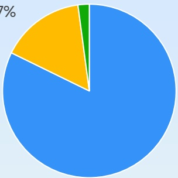
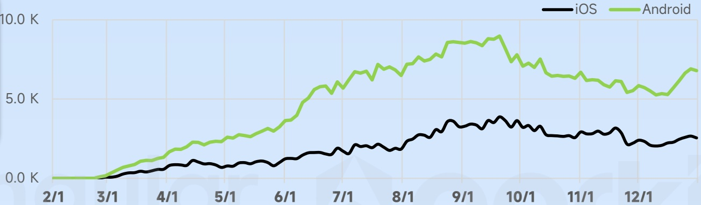
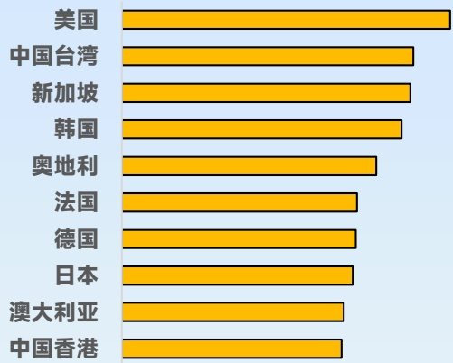
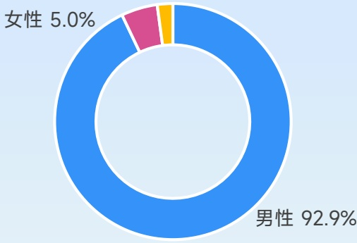
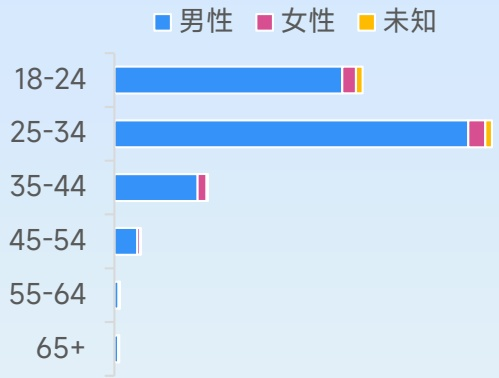

<!-- page 91 -->

## 热门新品策略手游营销观察

2025新上线表现最为亮眼的手游，一举开创“thronefall”热门细分赛道，优秀的营销手段让诸多厂商跟进学习

## Kingshot

策略SLG 点点互动

## 广告主投放数据

产品首次投放：2025年2月

双端累计去重后创意：6.3万

各类型素材占比

图片， \(15.7\%\)

[image_caption]
这是一张饼图，主要由三个部分组成：一个大的蓝色区域占据了大部分面积，一个较小的黄色区域，以及一个更小的绿色区域。蓝色区域明显大于其他两个区域，黄色区域次之，绿色区域最小。图表左上角有一个百分比符号（%），但没有具体的数值标注。
[/image_caption]

视频， \(82.2\%\)

2025年广告主双端投放素材堆积图

[image_caption]
这是一张折线图，展示了iOS和Android两个平台的数据变化趋势。图表的横轴表示时间，从2月1日到12月1日，纵轴表示数值，范围从0.0 K到10.0 K。

- 黑色折线代表iOS平台的数据，整体呈上升趋势，但在9月1日左右达到峰值后略有下降。
- 绿色折线代表Android平台的数据，同样呈上升趋势，且在9月1日左右达到峰值后也略有下降。

两条折线在大部分时间里Android的数据高于iOS，但在某些时间段（如3月1日左右）iOS的数据有短暂的上升。总体来看，Android的数据波动较大，而iOS的数据相对平稳。
[/image_caption]

投放国家/地区TOP10

[image_caption]
这是一张柱状图，展示了不同国家或地区的数据对比。图表的左侧列出了国家或地区名称，右侧是对应的黄色条形图，表示各自的数据值。具体如下：

- 美国
- 中国台湾
- 新加坡
- 韩国
- 奥地利
- 法国
- 德国
- 日本
- 澳大利亚
- 中国香港

每个国家或地区的条形图长度代表其数据值，从左到右依次递减。美国的数据值最高，中国香港的数据值最低。图表背景为浅蓝色，条形图为黄色，文字为黑色。
[/image_caption]

受众性别分布

[image_caption]
这是一张饼图，显示了两个类别的比例分布。蓝色部分代表男性，占92.9%；粉色和橙色部分分别代表女性和其他类别，女性占5.0%，其他类别占2.1%。图表的背景为浅蓝色，整体设计简洁明了。
[/image_caption]

游戏受众年龄分布

[image_caption]
这是一张柱状图，展示了不同年龄段（18-24、25-34、35-44、45-54、55-64、65+）中男性、女性和未知性别的分布情况。图表的横轴表示不同年龄段，纵轴表示各年龄段的人数比例。蓝色代表男性，粉色代表女性，黄色代表未知性别。

- 在18-24年龄段，男性占绝大多数，女性和未知性别占比很小。
- 在25-34年龄段，男性同样占绝大多数，女性和未知性别占比也很小。
- 在35-44年龄段，男性仍然占主导地位，女性和未知性别占比较小。
- 在45-54年龄段，男性占比相对较少，女性和未知性别占比有所增加。
- 在55-64年龄段，男性占比非常少，女性和未知性别占比显著增加。
- 在65+年龄段，男性占比几乎为零，女性和未知性别占比接近100%。

总体来看，随着年龄的增长，男性的占比逐渐减少，而女性和未知性别的占比逐渐增加。
[/image_caption]