## THE GLOBAL STATE OF GAME PUBLISHING & MARKETING 2025

INDUSTRY REPORT

## 获取每日免费报告

每日微信群分享

最新行业报告

## 高端社群

所有行业报告均为公开合规版，知识产权属于发布机构，使用场景限于小范围内部学习。

## Contents

2 Foreword

Table of Contents

3 List of Tables

3 List of Figures

4 Introduction

## 7 SECTION 1: Game Publishing Strategies

7 Publisher-Developer Relationships

Cross-Platform Publishing

10 Self-Publishing

## 14 SECTION 2: Marketing and User Acquisition

Digital Channels and Decline of Traditional Retail

16 Partnerships as Marketing Channels

Influencer Marketing

## 20 SECTION 3: Community

20 Importance of Community in Gaming

22 Community Safety

## 24 SECTION 4: Data-Driven Success

24 The Role of Data in Publishing and Marketing

## 27 SECTION 5: Revenue Streams and Business Models

Live Service Games

28 Boxed Games/One-time Purchase Model

30 Subscription Models

32 Esports

36 Hybrid Models

## 38 SECTION 6: Software and Services

38 Publishing as a Service

39 Design Studios

40 Conclusion

43 Bibliography

## Foreword

Ahead of the Game Publishing and Marketing Summit, we commissioned this report to deliver an in-depth overview of how, and why, game publishing and marketing experts are reimagining their core strategies. The aim of this report is to outline key topics that may enable studios, regardless of size, to make internal improvements to their business models and games that will keep them not just relevant, but essential.

The findings reflect an increased interest, investment and dependence on user research, player and platform data and analytics, third-party services, personalised events and engagement, and multi-platform retail strategies. However, solely relying on access to research and digital tools will not help studios navigate ever-growing player expectations, modern technology, or regulations.

This report is designed to highlight the latest opportunities and challenges in the gaming industry. We hope it serves as a practical resource for decision makers seeking to stay a step ahead of the curve in a rapidly changing and customer dependant industry.

Jade Tierney

GPMSummit Director

## Tables

Table 1: Benefits of Developing Cross-Platform Games

Table 2: Popular Cross-Platform Games

Table 3: Top Cross-Platform Game Engines

Table 4: Top-10 Self-published Games during 2019-2024

Table 5: Examples of Successful Collaborations in Games

Table 6: The Role of Influencers in Shaping Gaming Trends

19 Table 7: Benefits of Gaming Influencers in Marketing Over Traditional Advertising

Table 8: Community Management Tools/ Platforms by Leading Companies (Selected)

23 Table 9: Safety Rules and Regulations in Gaming Industry

Table 10: Data Analytics: Leading Providers (Selected)

Table 11: Comparisons of Leading Subscription Service Providers

37 Table 12: Hybrid Models Used in Selected Games and Platforms

39 Table 13: Design Studios: Leading Companies (Selected)

## Figures

Figure 1: Global Game Publishing Market in US$ billions, 2025-2030

Figure 2: Share of Players & Time Spent on Playing

Figure 3: Number of Self-Published Hit Games Between 2019 and 2023

Figure 4: Number of Games Released on Steam Worldwide from 2018 to 2023, by Developer Type

Figure 5: Indie Developers Market in US$ Billions, 2025-2030

Figure 6: Physical vs. Digital Game Revenue Share in 2024

Figure 7: Physical vs. Digital Revenue of Major Video Game Publishers as of November 2024

27 Figure 8: Global Live Service Gaming Market in US$ billions, 2025-2030

29 Figure 9: Global Boxed Games Market in US$ billions, 2025-2030

Figure 10: Global Game Subscription Market in US$ billions, 2025-2030

Figure 11:PlayStation vs.Xbox:Installed Base and Revenue Share

Figure 12: Esports Monetization Models

Figure 13: Global Esports Market in US$ billions, 2025-2030

Figure 14: Prize Money for Leading eSports Games Worldwide in US$ millions

Figure 15: Video Streaming Quarterly Hours Watched, 2020-2024

Figure 16: Revenue Streams for Game Publishing Industry

## Introduction

The global game publishing market is expected to increase from US\(117.4 billion in 2025 to US\)150.5 billion by 2030, at a modest CAGR of \(5.1\%\). The gaming industry which has enjoyed exponential growth over the last two decades, especially during the pandemic, now finds itself at a crossroads. The return of gamers to schools and offices in the post-pandemic era, rising interest rates, high costs, market saturation, and the failure of a few high-profile games, are some of the factors responsible for this tepid growth forecast. As game development and publishing budgets rise along with breakeven thresholds, the publishers' dependency on each game increases resulting in a lesser margin for errors (game failures).

Historically, there has been a clear division of roles between video game developers and publishers, with the former taking care of the creative and technical aspects of building

a game. In contrast, publishers handle the financing, marketing, distribution, and at times, the legal aspects. This model has given a few large publishers significant power, allowing them to control distribution channels, marketing, and monetisation strategies. These publishers often act as gatekeepers, determining which games reach the market and at what scale. Even though this has resulted in the creation and launch of many iconic titles, it has allowed larger studios to corner a significant share of the market, often at the cost of smaller indie developers.

However, the industry's evolution characterised by digital distribution channels, self-publishing platforms, changing consumer expectations, and alternative business models, has rapidly democratised the game development and publishing landscape, allowing indie developers to reach a global audience.

FIGURE1

Global Game Publishing Market in US$ billions, 2025-2030

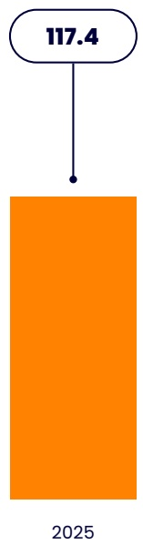
[image_caption]
该图像展示了一个流程图的一部分，包含一个椭圆形节点和一个矩形节点。椭圆形节点内标有数值“117.4”，通过一条垂直的线条连接到下方的橙色矩形节点。矩形节点底部标有年份“2025”。整体结构表示一个从数值“117.4”到年份“2025”的流程或关联。
[/image_caption]

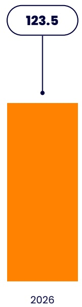
[image_caption]
该图像展示了一个流程图的一部分，包含一个带有数值“123.5”的椭圆形节点，通过一条线连接到一个橙色的矩形区域，矩形下方标注有年份“2026”。
[/image_caption]

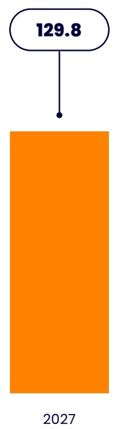
[image_caption]
该图像展示了一个简单的图表，包含一个橙色的矩形柱状图和一个位于其上方的椭圆形框。椭圆形框内显示数值“129.8”，并通过一条垂直线与矩形柱状图的顶部中心相连。矩形柱状图的底部标注有年份“2027”。整体结构表明这是一个表示特定年份（2027）数据（129.8）的柱状图。
[/image_caption]

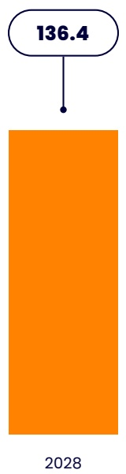
[image_caption]
该图像展示了一个简单的图表结构，包含一个顶部的椭圆形框和一个下方的橙色矩形。椭圆形框内标有数值“136.4”，并通过一条垂直线连接到下方的橙色矩形。橙色矩形底部标有年份“2028”。整体布局简洁，可能表示某个指标在2028年的预测值为136.4。

【图表类型：流程图/信息图】
- 顶部椭圆形框：136.4
- 连接线
- 底部橙色矩形：2028
[/image_caption]

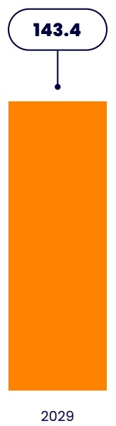
[image_caption]
该图像展示了一个简单的图表结构，包含一个顶部的椭圆形框和一个下方的橙色矩形。椭圆形框内标有数值“143.4”，并通过一条垂直线连接到下方的橙色矩形。橙色矩形底部标有年份“2029”。整体布局简洁，可能表示某个指标在2029年的预期值为143.4。

主要信息：
- 顶部椭圆形框：数值“143.4”
- 下方橙色矩形：年份“2029”
- 连接线：表示数值与年份之间的关联

数据：
- 数值：143.4
- 年份：2029
[/image_caption]

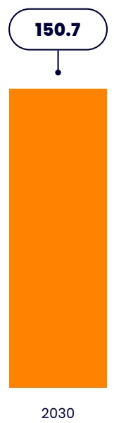
[image_caption]
该图像展示了一个柱状图，顶部有一个椭圆形标签，内含数值150.7，通过一条线连接到下方的橙色矩形柱体。柱体底部标注有年份2030。整体设计简洁，用于表示特定年份（2030）的某个指标值（150.7）。
[/image_caption]

Source: AgileIntel

## The rise of self-publishing has levelled the playing field

Self-publishing platforms such as Steam, itch.io, Epic Games Store, Unreal Editor for Fortnite (UEFN), and Roblox, have lowered the entry barriers for indie game developers who can independently develop and publish their games without relying on large publishers.

What makes this relatively novel concept particularly interesting, is that some of the self-published games by indie developers have already witnessed resounding success, often surpassing

the revenues of large-scale publications. In early 2024, Palworld, developed and published by Pocketpair, became the biggest third-party game launch ever on Xbox Game Pass, dominated the Steam charts, and gained an almost cult-like following in the monster taming category, not witnessed since Pokémon Go. Till January 2024, the game had garnered sales of over US$440 million, which is exceptional considering that it wasn't backed by a large publisher and was created by Takuro Mizobe, a self-taught artist with no prior industry experience. Other notable successes are Baldur's Gate 3, Phasmophobia, Squad, Ready or Not, and Lethal Company.

The democratisation of game publishing is among the most notable trends in the gaming industry. Platforms such as Steam, itch.io, Epic Games Store, Unreal Editor for Fortnite (UEFN), and Roblox, have lowered the entry barriers for indie game developers who can independently develop and publish their games without relying on large publishers.

## Marketing and PR companies branching out into publishing

Historically, the multi-faceted expertise of publishers made it difficult for developers to bypass them and self-publish their games. However, the growing stature of PR and marketing agencies dedicated to the gaming industry and their move into publishing, is proving to be a game changer for indie developers. A good example is UK-based Neonhive which branched out into game publishing after being a solely PR and marketing agency for many years. By leveraging its experience and relationships with the press, influencers, events, and bringing over 130 titles to market, Neonhive is gradually building a supportive publishing ecosystem for indie developers. Another example is the Canadian boutique agency Popagenda which has moved on from handling PR for games such as Cuphead, Grindstone, Landfall, and Ooblets, to functions such as marketing strategy, release management, social media handling, and trailer editing. What is particularly noteworthy here is release management, which includes coordinating with quality assurance teams and porting studios to ship on console and other platforms, areas that have historically been the unique selling points of large publishers.

## The growth of user-generated content (UGC) is challenging traditional publishing models

User-generated content (UGC) is gradually transforming the game publishing landscape. Games such as Minecraft and Fortnite, and platforms such as Roblox have already shown the positive impact that UGC can have on game engagement, longevity, and revenue diversification opportunities. Technologies such as voxels and signed distance fields have made content creation more intuitive and scalable, letting users remix and expand upon existing creations. This player-creator dynamic is challenging conventional publishing models by pushing modern-day publishers to integrate UGC in their marketing and monetisation strategies. A good example is Grand Theft Auto (GTA) VI which is expected to be launched in September 2025. The game is expected to build on GTA V's thriving UGC scene. In fact, its infrastructure is powered by FiveM, a third-party modding framework capable of supporting immersive role-playing servers where over 200,000 players engage daily. Another example is The Sims 5 made by Electronic Arts (EA). Even though the game was shelved towards the end of 2024, its makers had already hired a head of monetisation and marketplace to manage in-game content pricing and UGC, both free and paid.

## Game Publishing Strategies

## Publisher-Developer Relationships

Game developers and publishers have been at odds for many decades. The former typically focuses on the creative side such as building reliable frameworks, new technology integration, refining gameplay based on user feedback, and creating the overall gameplay experience. Publishers focus on the financial, marketing, and at times on the technical side including distribution, user acquisition, live ops, monetization, and community engagement. These functions have historically functioned independently, ensuring the heavy reliance of both parties on each other.

Digital distribution through online platforms such as Steam and Epic Games Store has lowered or outright obliterated the barriers for developers to selfpublish their games. Steam sold over 718 million games in 2024 alone, while Epic Games Store boasted annual PC user spending of US$950 million in 2023.

However, over the years their relationship has become increasingly complex with developers acquiring more independence due to alternative funding avenues, rapid technological disruptions, and new distribution platforms. Indie developers now often bootstrap their games or raise money through options such as crowdfunding sites like Kickstarter and Fig. Game engines like Unity and Unreal Engine 5 which are intuitive and increasingly simple to use, have also made the development process easier. Moreover, digital distribution through online platforms such as Steam and Epic Games

Store has lowered or outright obliterated the barriers for developers to self-publish their games. Steam sold over 718 million games in 2024 alone, while Epic Games Store boasted annual PC user spending of US$950 million in 2023.

Palworld and Lethal Company are two of the most popular games of 2024, with the former made by a small development team, and the latter by just one individual (a developer known as Zeekerss). It is no longer essential for indie teams to have large development budgets to deliver a hit title, as long as they bet on gameplay innovation.

On the other hand, this growing ease of development and self-publishing has resulted in a crowded gaming market with titles struggling to be discovered and stand out. Therefore, the capabilities of the modern publisher including advanced analytics, support for live-service models, post-launch content planning, and of course large financial resources, make them invaluable, especially for developers with globally recognised IPs. This is because as competition increases, marketing familiar game worlds and characters is emerging as an effective strategy for such titles to stand out. Overall, game titles backed by large budgets remain in an advantageous position in terms of user acquisition.

## Cross-Platform Publishing

According to a 2024 U.S.-focused study by Bain & Co., as many as \(70\%\) of the gamers surveyed said they played on multiple devices and asked for more ubiquity in the future. Another American market study by the Consumer Technology Association (CTA) involving over 2,700 adults and teens, found this number to stand at \(61\%\). The last few years have witnessed robust growth in the number of multiplatform game launches, with gaming company Unity pegging this at around \(40\%\) between 2021 and 2023.

Cross-platform development and publishing involves designing games in a way that they can provide a consistent user experience across various devices such as PCs, consoles, and mobile phones, with minimal to no adjustments. Even though hardware limitations could affect the graphics and overall gameplay smoothness, the architecture and overall experience remain consistent.

This strategy allows gamers to connect and play with others regardless of their device, fostering a unified player base that drives engagement, long-term player retention, and consequently higher revenues, with estimates pegging it at around \(40\%\). There are over three billion active gamers worldwide, and the market is expected to value almost US$151 billion by 2030. Cross-platform games allow developers access to this vast, multi-platform pool of potential gamers. Modern players frequently switch between devices, and cross-platform

compatibility enables them to purchase a game on one system and seamlessly access it across multiple platforms.

There are over three billion active gamers worldwide, and the market is expected to value US$151 billion by 2030. Cross-platform games allow developers access to this vast, multi-platform pool of potential gamers. Modern players frequently switch between devices, and cross-platform compatibility enables them to purchase a game on one system and seamlessly access it across multiple platforms.

FIGURE 2

Share of Players and Time Spent on Playing

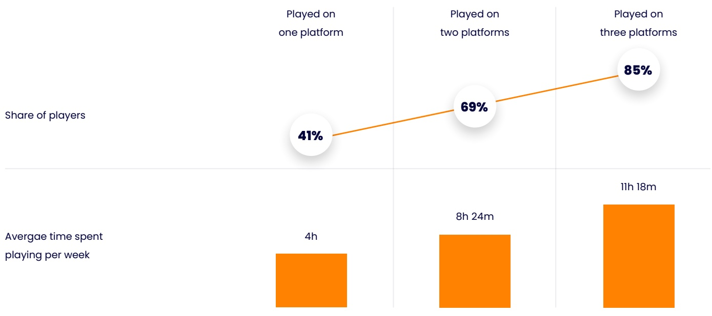
[image_caption]
该图像展示了一个数据图表，包含两个主要部分：玩家占比和每周平均游戏时间。

1. **玩家占比**：
   - ** Played on one platform（在单一平台上玩）**：41% 的玩家。
   - ** Played on two platforms（在两个平台上玩）**：69% 的玩家。
   - ** Played on three platforms（在三个平台上玩）**：85% 的玩家。

2. **每周平均游戏时间**：
   - ** Played on one platform**：4小时。
   - ** Played on two platforms**：8小时24分钟。
   - ** Played on three platforms**：11小时18分钟。

图表通过橙色线条连接不同平台的玩家占比，并用橙色矩形表示每周平均游戏时间。整体来看，随着玩家使用平台数量的增加，玩家占比和每周平均游戏时间均呈上升趋势。
[/image_caption]

Note: Total number of players in the survey, n=58,040

Source: Newzoo

From a developer's perspective, it is more cost-efficient to create cross-platform games due to a reduction in the need for multiple specialised teams, resources required to develop and test on different platforms, and the creation of a single codebase. Cross-platform gaming also gives developers and publishers a better understanding of players and greater coherency for advertising, promotions, and analytics.

Moreover, players who utilize multiple platforms also tend to exhibit higher levels of engagement. A study by gaming data provider Newzoo found that gamers who play on three platforms average 11 hours and 18 minutes of gameplay per week,

compared to just 4 hours for those restricted to a single platform.

Therefore, even companies like Sony and Microsoft, which have traditionally developed single-platform games only, are now shifting their focus away from exclusivity in favour of broader cross-platform strategies. The economic advantages of reaching a larger audience often outweigh the opportunity costs of hardware sales (of PlayStations and Xbox), especially as rising development costs make it increasingly challenging to achieve profitability on a single platform.

Key benefits of developing a cross-platform game include:

TABLE1 Benefits of Developing Cross-Platform Games

<table><tr><td>Benefits</td><td>Descriptions</td></tr><tr><td>Wider audience reach</td><td>Accessible to more players which increases revenue potential for developers and publishers.</td></tr><tr><td>Cost and time efficiency</td><td>&gt; Allows studios to develop games faster and at lower costs. Instead of building a separate version of the game for each platform, developers can use a single codebase with minor tweaks for platform-specific requirements.
&gt; Reduces the time spent in development and testing, allowing studios to allocate resources to other critical areas.</td></tr><tr><td>Easier maintenance and updates</td><td>&gt; With a unified codebase, managing updates and bug fixes becomes simpler.
&gt; Updates can be deployed across all platforms simultaneously.
&gt; Keeps the gaming experience consistent for all players and simplifies post-launch maintenance.</td></tr><tr><td>Better player engagement</td><td>&gt; Cross-platform games allow players to interact and compete with others regardless of their device.
&gt; Fosters a more engaging and unified gaming community.</td></tr></table>

Source: Agilentel

TABLE 2

Popular Cross-Platform Games

Source: Company Websites

<table><tr><td>Game</td><td>Publishers</td><td>Genre</td><td>Platform Support</td></tr><tr><td>Among Us</td><td>InnerSloth</td><td>InnerSloth</td><td>Android, iOS, Windows, Nintendo Switch, PlayStation 4/5, Xbox One/X/S</td></tr><tr><td>Call of Duty: Modern Warfare</td><td>Infinity Ward</td><td>First-person shooter</td><td>PlayStation 3/4, Windows, Xbox 360, Mac OS, Xbox One</td></tr><tr><td>Cuphead</td><td>Studio MDHR</td><td>Run and gun</td><td>PC, Xbox, Console, and Nintendo Switch</td></tr><tr><td>Dead by Daylight</td><td>Behaviour Interactive</td><td>Asymmetric survival horror</td><td>Windows, PlayStation 4, Xbox One, Nintendo Switch, Android, iOS, Stadia, Xbox Series X/S, PlayStation 5</td></tr><tr><td>Fortnite</td><td>Epic Games</td><td>Battle royale game, Shooting gameplay</td><td>PC, consoles (PlayStation, Xbox, Nintendo Switch), and mobile devices.</td></tr><tr><td>Forza Horizon 4</td><td>Microsoft Studios</td><td>Open-world racing game</td><td>PC and Xbox</td></tr><tr><td>Hollow Knight</td><td>Team Cherry</td><td>Metroidvana</td><td>Windows, Linux, macOS, Nintendo Switch, PlayStation 4, Xbox One</td></tr><tr><td>Minecraft</td><td>Microsoft</td><td>Sandbox, survival</td><td>PC, Console, Mobile, and VR platforms</td></tr><tr><td>PUBG</td><td>PUBG Studios (Krafton)</td><td>Battle royale</td><td>PC, Xbox, Console, mobile versions like PUBG Mobile and BGMI (Battlegrounds Mobile India)</td></tr><tr><td>Rocket League</td><td>Psyonix</td><td>Sports</td><td>PlayStation 4, Windows, Xbox One, macOS, Linux, Nintendo Switch</td></tr><tr><td>Undertale</td><td>Toby Fox</td><td>Role-playing</td><td>Mac OS, Windows, Linux, PlayStation 4, PlayStation Vita, Nintendo Switch, Xbox One</td></tr></table>

Game engines are central to cross-platform development, as the right engine can streamline the process and ensure consistent performance across devices. Technologies like Unreal Engine and Unity are leading the charge, empowering developers to create high-quality games that seamlessly run on multiple platforms. Below are the top game engines commonly used to develop cross-platform games.

## Self-Publishing

In June 2012, Dr. Richard Wilson, CEO of the UK trade association TIGA, declared that self-publishing was the future of gaming. Over a decade later, in January 2024, the launch of Palworld, made by Japanese developer Pocketpair, shook the gaming

world by becoming the biggest third-party launch ever on Xbox Game Pass. It spawned a craze for monster taming not witnessed since Pokémon Go, hitting the 25 million player mark in just one month, with 15 million copies selling on Steam alone. It also recouped a huge \(2,300 \%\)of its US\(7 million development budget in just a few weeks after its release and has generated over US\)400 million in overall sales till now. In fact, such is its popularity, that The Pokémon Company said that it would investigate allegations of copyright infringement. Even though these statistics are remarkable independently, what makes the game’s success even more noteworthy is that it was self- published by Pocketpair, an independent studio without a big marketing budget.

TABLE 3

Top Cross-Platform Game Engines

Source: Artstation.com

<table><tr><td>Game Engine</td><td>Key features</td><td>Platforms Support</td></tr><tr><td>Unity</td><td>Cross-platform support, User-friendly C# language, Advanced Rendering Pipelines, Asset Store Integration, AR/VR Support, Built-In Analytics, Monetization Tools</td><td>iOS, Android, Windows, macOS, Linux, WebGL, consoles (like PlayStation, Xbox, and Nintendo Switch), and AR/VR platforms.</td></tr><tr><td>Unreal Engine</td><td>Cross-platform support, high-quality graphics, advanced rendering capabilities, and excellent toolset, Blueprint Visual Scripting, Free Access to Source Code, Multiplayer Networking</td><td>iOS, Android, Windows, macOS, Linux, Google Stadia, Xbox Cloud Gaming, consoles (like PlayStation, Xbox, and Nintendo Switch), AMD, and AR/VR platforms.</td></tr><tr><td>Godot Engine</td><td>Cross-platform support, visual scripting, GDScript (Python-like), 2D and 3D Game Development, Open-Source &amp; Free, Node-based Architecture</td><td>iOS, Android, Windows, macOS, Linux, WebGL, consoles (like PlayStation, Xbox, and Nintendo Switch), and AR/VR (Oculus, HTC Vive, ARCore, ARKit), Raspberry Pi, UWP, Haiku platforms.</td></tr><tr><td>Cocos2d</td><td>Cross-platform support, C++ and JavaScript Scripting, Free and Open-Source, Physics Engine Integration, 2D Game Development, Multiplayer Support</td><td>Android iOS, macOS, Windows, Linux, Steam, Epic Games Store, itch.io, HTML5, WebAssembly, Nintendo Switch, PlayStation, Xbox, HTC Vive, Valve Index, Oculus Go, Oculus Quest</td></tr><tr><td>CryEngine</td><td>Powerful and flexible open-source game framework, cross-platform games, C# programming, Visual Scripting (Flow Graph), Real-Time Rendering, Free to Use</td><td>Windows, Consoles (PlayStation, Xbox), iOS, Android, VR/AR (Oculus Rift, HTC Vive, PlayStation VR), WebGL, Linux, macOS</td></tr><tr><td>Gamemaker Studio</td><td>Cross-platform support, user-friendly drag-and-drop interface, GML (GameMaker Language), 2D Game Development, Multiplayer Support</td><td>Windows, macOS, iOS, Android, Consoles (PlayStation, Xbox, Nintendo Switch), HTML5, WebAssembly, Android TV, Apple TV, Other (UWP, Fire OS)</td></tr><tr><td>Monogame</td><td>Cross-Platform Support, C# Scripting, 2D and 3D Game Development, Open-Source &amp; Free, Multiplayer Support, XNA Compatibility, Extensive API</td><td>Windows, macOS, Linux, iOS, Android, Consoles (PlayStation, Xbox, Nintendo Switch), HTML5, WebAssembly, Other (Windows Phone, UWP, Raspberry Pi)</td></tr></table>

Another example is Lethal Company which was nominated for the Game of the Year award on Steam in 2023. While it lost out to Baldur's Gate

3, it managed to generate much publicity due to the fact that it was designed, programmed, and published by a single developer called Zeekers.

Gate 3 on the other hand was created on a budget of over US\(100 million, by Larian Studios which has over 450 employees in many locations globally. Yet another is Undertale. Created by Toby Fox at a mere cost of US\)50,000 raised on Kickstarter, the game eventually sold 500,000 copies on Steam just three months after launch.

Many indie developers are now choosing to selfpublish their titles to keep more creative control and

ownership of their work, get more of the profits, have direct access to players through popular platforms, work only with select partners, and leverage the popularity of platforms such as Steam, Epic Games Store, Itch.io, Humble Bundle, Game Jolt, and GOG, for higher discoverability.

According to Finnish studio Remedy's CFO Santtu Kallionpää, who plans on self-publishing many titles in the near term, moving away from the traditional publisher-funded model isn't only about securing a bigger piece of the revenue but changing the approach towards development. The studio now prioritizes building a game with a huge target audience in mind, instead of just creating a compelling concept from an investor standpoint.

According to a study released by gaming analytics company Gamalytic, there has been a stark increase in the number of self-published hits over

the last five years (2019- 2023), which has translated into a thriving indie-gaming market despite a broader industry slowdown.

FIGURE 3

Number of Self-Published Hit Games Between 2019 and 2023

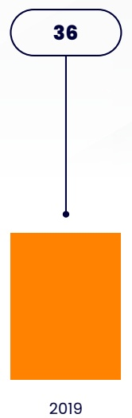
[image_caption]
该图像展示了一个流程图的一部分，包含一个椭圆形节点和一个矩形节点。椭圆形节点内标有数字“36”，通过一条垂直的黑色线条连接到下方的橙色矩形节点，矩形节点内标有年份“2019”。这表示从36到2019的一个流程或步骤。
[/image_caption]

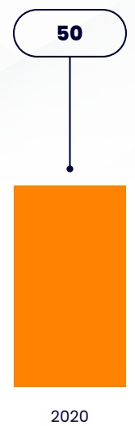
[image_caption]
该图像展示了一个流程图的一部分，包含一个椭圆形节点和一个矩形节点。椭圆形节点内标有数字“50”，通过一条垂直的线条连接到下方的橙色矩形节点，矩形节点下方标有年份“2020”。这表示一个从数值“50”到2020年的流程或步骤。
[/image_caption]

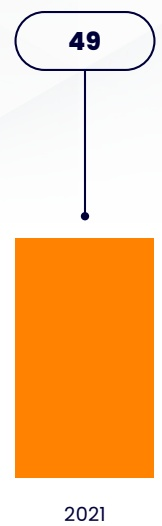
[image_caption]
该图像展示了一个流程图的一部分，包含一个椭圆形节点和一个矩形节点。椭圆形节点内标有数字“49”，通过一条垂直的黑色线条连接到下方的橙色矩形节点，矩形节点底部标有年份“2021”。整体布局简洁，表示一个从“49”到“2021”的流程或关联。
[/image_caption]

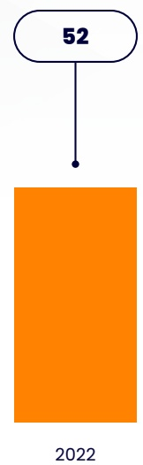
[image_caption]
该图像展示了一个流程图的一部分。顶部是一个带有数字“52”的椭圆形节点，通过一条垂直的线条连接到一个橙色的矩形区域，矩形区域下方标注有数字“2022”。整体结构表明从一个编号为52的步骤或状态流向一个标记为2022的阶段或结果。
[/image_caption]

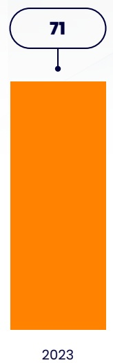
[image_caption]
该图像展示了一个流程图的一部分，包含一个椭圆形节点和一个矩形节点。椭圆形节点内标有数字“71”，通过一条线连接到下方的橙色矩形节点。矩形节点底部标有年份“2023”。整体布局简洁，表示一个从“71”到“2023”的流程或步骤。
[/image_caption]

Note: Game with revenue more than US\(3M in the first year is considered as "hit" game

Source: Gamalytic, Naavik

TABLE 4

Top-10 Self-published Games during 2019-2024

Note: Data till June 2024

Source: Gamalytic, Naavik

<table><tr><td>Game</td><td>Developer / Publisher</td><td>Year</td><td>Revenue in US$ 
Mn (Till Jun 2024)</td><td>Copies Sold 
(millions)</td></tr><tr><td>Baldur&#x27;s Gate 3</td><td>Larian Studios</td><td>Aug 2023</td><td>809.9</td><td>15.5</td></tr><tr><td>Palworld</td><td>Pocketpair</td><td>Jan 2024</td><td>386.4</td><td>14.8</td></tr><tr><td>Phasmophobia</td><td>Kinetic games</td><td>Sep 2020</td><td>156.8</td><td>14.3</td></tr><tr><td>Mount &amp; Blade II: Bannerlord</td><td>TaleWorlds Entertainment</td><td>Oct 2022</td><td>133.7</td><td>3.7</td></tr><tr><td>Squad</td><td>Offworld</td><td>Sep 2020</td><td>122.8</td><td>4.7</td></tr><tr><td>Ready or Not</td><td>VOID Interactive</td><td>Dec 2023</td><td>121.4</td><td>4.3</td></tr><tr><td>Lethal Company</td><td>Zeekeress</td><td>Oct 2023</td><td>120.1</td><td>13.1</td></tr><tr><td>Dying Light 2 Stay Human: Reloaded</td><td>Techland</td><td>Feb 2022</td><td>116.8</td><td>3.6</td></tr><tr><td>Factorio</td><td>Wube Software</td><td>Aug 2020</td><td>106.3</td><td>4.0</td></tr><tr><td>Hades</td><td>Supergiant Games</td><td>Sep 2020</td><td>101.4</td><td>6.5</td></tr></table>

According to Remedy's CFO Santtu Kallionpää, who plans on self-publishing many titles in the near term, moving away from the traditional publisher-funded model isn't only about securing a bigger piece of the revenue but changing the approach towards development. The studio now prioritizes building a game with a huge target audience in mind, instead of just creating a compelling concept.

FIGURE 4

Number of Games Released on Steam Worldwide from 2018 to 2023, by Developer Type

- Indie games
- AAA games

[image_caption]
这是一张柱状图，展示了从2018年到2023年每年的数据变化。每个柱子分为两部分：橙色部分表示较大的数值，紫色部分表示较小的数值。

- 2018年：总值为8,142，其中橙色部分为8,142，紫色部分为182。
- 2019年：总值为8,048，其中橙色部分为8,048，紫色部分为177。
- 2020年：总值为9,715，其中橙色部分为9,715，紫色部分为192。
- 2021年：总值为11,188，其中橙色部分为11,188，紫色部分为151。
- 2022年：总值为12,241，其中橙色部分为12,241，紫色部分为166。
- 2023年：总值为13,790，其中橙色部分为13,790，紫色部分为181。

从图中可以看出，橙色部分的数值逐年增加，而紫色部分的数值在不同年份间有所波动。
[/image_caption]

Source:VG Insights

FIGURE 5

Indie Developers Market in US$ Billions, 2025-2030

[image_caption]
这是一张柱状图，展示了从2025年到2030年的数据变化。每个柱子代表一个年份，柱子的高度表示相应的数值。具体数值如下：

- 2025年：5.3
- 2026年：6.1
- 2027年：7.0
- 2028年：8.0
- 2029年：9.2
- 2030年：10.5

图表显示了一个逐年增长的趋势，数值从2025年的5.3逐渐增加到2030年的10.5。
[/image_caption]

Source:AgileIntel

## Marketing and User Acquisition

## Digital Channels and Decline of Traditional Retail

In the early days of video game distribution, publishers undertook the responsibilities of producing physical media, securing shelf space in retail stores, and executing marketing campaigns, making them irreplaceable partners for game developers. This process required expertise in market analysis, branding, and promotional campaigns, to navigate the retail landscape effectively. Marketing strategies relied heavily on press releases, trade publications, and scheduled media events.

With the dawn of the digital era, the role of publishers shifted to managing digital rights and securing premium placements on digital storefronts like Steam. The advent of social media and streaming platforms such as YouTube and Twitch has further changed how games are marketed. Influencers and content creators now play a pivotal role in shaping public perception, and marketers are developing strategies to leverage these platforms.

However, with the dawn of the digital era, the role of publishers shifted to managing digital rights, securing premium placements on digital storefronts like Steam, and developing other digital marketing strategies. The advent of social media and streaming platforms such as YouTube and Twitch

has further changed how games are marketed. Influencers and content creators now play a pivotal role in shaping public perception, and marketers are developing strategies to leverage these platforms and create partnerships with influencers. A good example is Innersloth's social deduction game Among Us which experienced a surge in popularity as influencers played (and streamed) and reacted to the game's unexpected twists and turns. The game's unpredictable nature and focus on social deduction made it ideal for creating memorable moments and engaging interactions.

Celebrity endorsement is another strategy being deployed by game marketers. Norman Reedus, who rose to prominence for his portrayal of Daryl Dixon in The Walking Dead, and Mads Mikkelsen who won Cannes' Best Actor for his performance in The Hunt, both starred in Death Stranding, a game conceived by Hideo Kojima. Interestingly, the game is now being converted into a live-action film by indie studio A24. More recently, Keanu Reeves played a central character in Cyberpunk 2077, one of the most popular games released over the last few years.

From a technological standpoint, marketers are focusing on closed-loop marketing (CLM) where developers and publishers aim to build up a richer segmentation of players, associated behaviours, and the value they generate. This is done by analysing data related to browsing, play, and purchases, that happen in a connected environment. The findings are then used to pinpoint areas of the game that are more heavily utilised, identify retention issues, and determine additional avenues of monetisation.

With games now being accessed anytime from any device with an internet connection (including smart watches and mixed reality glasses), marketing

strategies are increasingly focused on points of access, to get a deeper understanding of the platforms best placed to acquire gamers and keep them engaged.

## FIGURE 6

Physical vs. Digital Game Revenue Share in 2024

Physical sales Digital sales

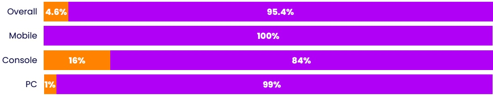
[image_caption]
该图是一个水平条形图，展示了不同平台类型的占比情况。具体数据如下：

- **Overall（总体）**：橙色部分占4.6%，紫色部分占95.4%。
- **Mobile（移动设备）**：全部为紫色，占比100%。
- **Console（游戏主机）**：橙色部分占16%，紫色部分占84%。
- **PC**：橙色部分占1%，紫色部分占99%。

图表通过颜色区分了不同部分的占比，橙色表示较小的比例，紫色表示较大的比例。
[/image_caption]

Source:Thinglabs

## FIGURE 7

Physical vs. Digital Revenue of Major Video Game Publishers as of November 2024

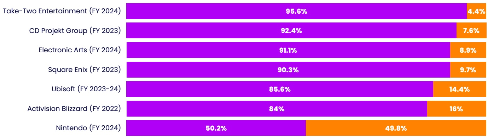
[image_caption]
该图像为一个水平条形图，展示了不同公司在特定财年（FY）的市场份额百分比。图表中的每个公司名称左侧标注了其对应的财年，右侧则以紫色和橙色两种颜色的条形表示其市场份额的具体数值。

具体数据如下：
- Take-Two Entertainment (FY 2024)：95.6%（紫色部分），4.4%（橙色部分）
- CD Projekt Group (FY 2023)：92.4%（紫色部分），7.6%（橙色部分）
- Electronic Arts (FY 2024)：91.1%（紫色部分），8.9%（橙色部分）
- Square Enix (FY 2023)：90.3%（紫色部分），9.7%（橙色部分）
- Ubisoft (FY 2023-24)：85.6%（紫色部分），14.4%（橙色部分）
- Activision Blizzard (FY 2022)：84%（紫色部分），16%（橙色部分）
- Nintendo (FY 2024)：50.2%（紫色部分），49.8%（橙色部分）

从图表中可以看出，Take-Two Entertainment在FY 2024的市场份额最高，接近96%，而Nintendo在FY 2024的市场份额相对较低，约为50%。其他公司的市场份额介于这两者之间，呈现出不同的市场表现。紫色部分代表主要市场份额，橙色部分代表次要或补充市场份额。
[/image_caption]

Source: Activision Blizzard; Take-Two Interactive; Electronic Arts; Ubisoft; Square Enix; CD Projekt; Nintendo

## Partnerships as Marketing Channels

Gaming studios are increasingly forging alliances with technology companies, brands, and other gaming companies, to strengthen their offerings, reduce development costs, attract new players, and enhance visibility.

A common type of partnership is co-development where two developers or publishers collaborate with each other or with an external vendor, to conceive, develop, and launch a game title. The pooling of resources and expertise results in reduced costs, innovative gaming experiences, and access to other markets.

A common type of partnership is co-development where two developers or publishers collaborate with each other or with an external vendor, to conceive, develop, and launch a game title. The pooling of resources and expertise results in reduced costs, innovative gaming experiences, and access to other markets. The sheer scale of modern big-budget gaming and market saturation has necessitated co-development, even among big studios. A great example of successful co-development is The Witcher 3: Wild Hunt which was produced by CD Projekt Red and Warner Bros. Interactive. The partnership was not only responsible for the game's stunning visuals but also its successful distribution in North America.

Another type is a licensing agreement, typically with a brand, where one company gives the studio the rights to use its intellectual property (IP) or characters, helping it to expand its reach to a non-

endemic audience and monetise its assets. This partnering strategy is particularly useful to combat the stark increase in user acquisition and game development costs. Scopely's Monopoly Go which is based on Hasbro's iconic board game is a fine example of this strategy, generating US\(2 billion in revenue just 10 months after launch.

In 2023, some of the largest and most successful film and TV franchises began as video games. These include The Last of Us, Castlevania: Nocturne, The Super Mario Bros. Movie, Twisted Metal, and Captain Laserhawk: A Blood Dragon Remix. According to a study by Deloitte, the share of theatrical box office revenues from video game IP is expected to double over the period 2023-2025, with most major video streaming services including shows based on games by 2025.

Yet another collaboration type is technology partnerships where studios collaborate with large technology companies such as Amazon, Google, and Microsoft, or smaller gaming technology (Gametech) companies, to integrate cutting-edge solutions into their games. The acquisition of Naughty Dog by Sony in 2001 is probably one the first of such partnerships, giving the former access to Sony's powerful gaming consoles. The 2016 collaboration between game developer Valve and technology company HTC, resulted in the creation of the HTC Vive, a groundbreaking virtual reality (VR) headset that was instrumental in bringing high-quality VR gaming to the masses.

TABLE 5

Examples of Successful Collaborations in Games

Source: Mainleaf.com

<table><tr><td>Game/Collaboration 
Theme</td><td>Type of Collaboration</td><td>Collaboration details</td></tr><tr><td>Fortnite</td><td>Celebrity appearances and events</td><td>Hosted a “March Through Time” collaboration with TIME Magazine, allowing players to visit the site of Martin Luther King Jr.&#x27;s “I Have a Dream” speech.</td></tr><tr><td>EverQuest II</td><td>Unique in-game functionality</td><td>Collaboration with Pizza Hut, allowing players to order pizza directly through an in-game command (/pizza)</td></tr><tr><td>The Sims</td><td>Product placement and themed content</td><td>H&amp;M, IKEA, Diesel, Star Wars, Moschino</td></tr><tr><td>Cloud Solutions</td><td>Tech Partnership</td><td>Sony and Microsoft announced a partnership to explore cloud gaming and streaming solutions built in the Microsoft cloud, Azure.</td></tr><tr><td>Avengers: Infinity War limited-time event</td><td>Publisher Collaboration</td><td>In 2018, Epic Games partnered with Marvel for an Avengers: Infinity War event in Fortnite, allowing players to play as iconic Marvel characters. The crossover boosted engagement for both brands.</td></tr><tr><td>Fortnite</td><td>Licensing arrangement</td><td>Gearbox and 2K Games licensed their Borderlands properties to Epic Games and Warner Bros.</td></tr><tr><td>Animal Crossing: New Horizons</td><td>User-generated content and brand promotion</td><td>Hellman&#x27;s Canada, KFC, and IKEA through user-created content</td></tr><tr><td>Pokemon</td><td>Music collaborations</td><td>Katy Perry (“Electric”), Post Malone (“Only Wanna Be With You”), and Ed Sheeran (“Celestial”)</td></tr><tr><td>The Sims 4</td><td>User-generated content and brand promotion</td><td>Gucci and Stella Artois</td></tr><tr><td>Football Manager</td><td>Sponsorship &amp; in-game ads</td><td>Mastercard and betting sites</td></tr><tr><td>Grand Theft Auto (GTA)</td><td>Billboards and in-game integration</td><td>Brands: Validé 
Artists: Dixon, Solomun, and The Blessed Madonna</td></tr><tr><td>Roblox</td><td>Celebrity appearances and events</td><td>Collaborated with celebrities like Miley Cyrus and Paris Hilton for virtual concerts and brand partnerships with luxury brands like Gucci, Ralph Lauren, and Tommy Hilfiger.</td></tr><tr><td>Fall Guys: Ultimate Knockout</td><td>Crossovers and character costumes</td><td>Features a vast array of crossover costumes based on other video games (Sonic, Untitled Goose Game), movies (Godzilla, Ghostbusters), TV shows (Doctor Who), and even celebrities (Jinkx Monsoon from RuPaul&#x27;s Drag Race).</td></tr></table>

## Influencer Marketing

Influencer marketing is rapidly emerging as

a powerful tool to engage a diverse

spectrum of audiences, communities, subcultures, and cross-over interest groups, both endemic and non-endemic to the gaming industry.

Through pre-recorded videos-on-demand (VOD)

and live-streamed broadcasts, gaming

influencers can amplify announcements, provide early development consultations, preview gameplay, showcase finished games, and even carry out long-term brand ambassadorial duties. Therefore, influencers have gathered trust within the gaming community, shaping perceptions and driving engagement.

Social media platforms are the main drivers of this burgeoning trend – the hashtag #TikTokMadeMePlayIt, where users share games they've discovered through TikTok, garnered over 161 million views. In terms of short, medium, and long-form gameplay content, YouTube and Twitch are the prime locations. YouTube enables content creators to create gameplay demos; cinematic, live-action productions, documentary content, in-game storytelling series, and creative critique. On the other hand, Twitch offers various options for direct live audience interaction, community involvement and engagement, virtual events, tournaments, panels, collaborations, and presentations.

In the UK, around \(10.7\%\) of the gaming audience finds brands through influencers, while \(25.7\%\) actively

follow them. Facebook is the most popular platform with \(16.9\%\) of gamers in the country naming it their favourite social media platform. In the U.S., \(12.6\%\) of the gaming audience discovers brands through influencers, with \(28.4\%\) actively following them. Facebook is again the most popular platform, favoured by \(22.1\%\) of the gamers.

TABLE 6

The Role of Influencers in Shaping Gaming Trends

Source: Theinfluencermarketingfactory.com

<table><tr><td>Aspect</td><td>Influencer Contributions</td></tr><tr><td>Game Reviews</td><td>Influencers deliver immersive reviews through engaging videos and interactive live streams, offering a personal touch beyond traditional written critiques.</td></tr><tr><td>Gameplay Demonstrations</td><td>They showcase games in action, helping viewers understand gameplay, visuals, and mechanics for informed decisions.</td></tr><tr><td>Hype Generation</td><td>Collaborating with developers, influencers share sneak peeks and early access, boosting excitement and early sales.</td></tr><tr><td>Community Engagement</td><td>These personalities build vibrant gaming communities, sparking discussions, strategy sharing, and connections.</td></tr><tr><td>Feedback Channel</td><td>Influencers connect players and developers, sharing feedback to improve game design and features.</td></tr><tr><td>Content Monetization</td><td>Sponsorships and merchandise fund influencers, ensuring consistent, high-quality content.</td></tr></table>

Overall, creator endorsements play a significant role in driving purchases with as many as \(32 \%\)of consumers globally having bought a product in the past year due to a creator’s recommendation. This figure rises to \(40 \%\)among gaming enthusiasts, with \(32 \%\)of UK and \(41 \%\)of U.S. gamers making purchases due to recommendations made by creators.

Overall, creator endorsements play a significant role in driving purchases with as many as \(32 \%\)of consumers globally having bought a product in the past year due to a creator’s recommendation. This figure rises to \(40 \%\)among gaming enthusiasts, with \(32 \%\)of UK and \(41 \%\)of U.S. gamers making purchases due to recommendations made by creators. Moreover, gaming ranks as the top category for products purchased after seeing an influencer’s recommendation.

One of the best examples of successful influencer marketing in the gaming industry is the partnership between popular influencer Tyler "Ninja" Blevins and Fortnite. Tyler's engaging streams and charismatic personality played a crucial role in Fortnite getting rapid traction just after its launch. Another is the

launch of Apex Legends by EA in 2019. The game was launched with a unique marketing strategy that included no announcements across any social media platforms. Instead, EA utilised Twitch influencers like Shroud to announce the game's release on launch day through live streams of them simply playing the game. This tactic proved instrumental in the game's success, garnering around 25 million players within the first week of release.

TABLE7

Benefits of Gaming Influencers in Marketing Over Traditional Advertising

<table><tr><td>Factor</td><td>Gaming Influencers</td><td>Traditional Advertising</td></tr><tr><td>Authenticity</td><td>Share genuine experiences and opinions, making their content feel more authentic and trustworthy.</td><td>Often perceived as scripted and less personal, leading to a lower level of trust.</td></tr><tr><td>Engagement</td><td>Direct interaction with audiences through comments, live streams, and social media.</td><td>Limited interaction, with a one-way communication flow.</td></tr><tr><td>Expertise</td><td>Specialize in specific gaming genres, offering in-depth knowledge and insights.</td><td>Broad focus, often lacking niche expertise.</td></tr><tr><td>Personalization</td><td>Tailor content to audience preferences, making it more relevant and engaging.</td><td>Generic content aimed at a wide audience, often lacking a personal touch.</td></tr><tr><td>Transparency</td><td>Disclose sponsorships and partnerships, adding to credibility.</td><td>Promotional content can be less obvious, affecting perceived honesty.</td></tr><tr><td>Product Demonstration</td><td>Showcase games in real-time, providing practical demonstrations of the product.</td><td>Lack of hands-on demonstrations, offering less practical insight.</td></tr><tr><td>Peer Influence</td><td>Recommendations feel like advice from a friend or peer, which is generally more trusted.</td><td>Seen as corporate-driven and less personal, impacting the level of trust in recommendations.</td></tr><tr><td>Purchasing Influence</td><td>Directly impacts the audience’s purchasing decisions due to the established trust and credibility.</td><td>Influence on purchasing decisions is less direct, often relying on repeated exposure.</td></tr></table>

Source: Theinfluencermarketingfactory.com

## Community

## Importance of Community in Gaming

In the gaming sector where technology evolves rapidly and player expectations change regularly, community building has emerged as a potent force for gaming companies looking to compete effectively. As gamers connect across various platforms and devices, developers and publishers are focusing not only on selling products but also on curating immersive experiences that build a community culture and transcend conventional transactional relationships. An active community is essential for organizing and sustaining competition, significantly boosting a game's visibility and popularity.

According to a recent study by game development company Amber Studio, community-related touchpoints account for around \(54.5\%\) of players' motivation (competitiveness, close recommendations & community engagement) to continue gameplay. Social media has emerged as the predominant channel for effective

community building, with Facebook, YouTube, and TikTok being the primary platforms used by gamers to discuss different facets of gaming and seek recommendations. Additionally, in-game community building which happens through guilds and alliances where players collaborate on quests and social activities is also playing a pivotal role. Features such as group chat and shared resources increase camaraderie and competition, creating a unique social fabric within the game.

One of the best examples that testify to the efficacy of this strategy is the success of Monopoly Go! which became the fastest game ever to hit US\(3 billion in revenue, taking only 15 months to reach that figure. Its publisher Scopely based its live service strategy around a continuous flow of simultaneous and often smaller-scale community-focused events. Particularly noteworthy were the Partner Events which encouraged collaboration and teamwork among friends, delivering high value retention on the back of low cost per installs (CPIs). Monopoly Go! generated around US\)340 million in revenues through in-app purchases (IAP) in the first quarter of 2024.

As gamers connect across various platforms and devices, developers and publishers are focusing not only on selling products but also on curating immersive experiences that build a community culture and transcend conventional transactional relationships.

Another example is PUBG Mobile which capitalised on the success of its large-scale, long-form events such as the PUBG Mobile x Dragon Ball Super Z event launched in July 2024. Not only did it have the already familiar engagement models such as a battle pass and new cosmetic items, but also a completely new mode that provided a Dragon Ball IP, while adjusting gameplay to reflect new partner material. This played a big role in PUBG Mobile experiencing a \(30 \%\)and \(40 \%\)upside in paying users and daily active users (DAUs) respectively through the first half of 2024. Game owner Krafton was able to generate US\(\$ 4\) billion in revenues for the same period, a \(55 \%\)increase compared to the same period in 2023.

The rise of eSports has proven to be another effective community engagement strategy, significantly improving a game's discoverability

and popularity. Many popular games now organise competitive tournaments with the global market expected to value around US\(7.7 billion by 2030.

TABLE 8

Community Management Tools/Platforms by Leading Companies (Selected)

<table><tr><td>Community Tool</td><td>Provider Company</td><td>Services Offered</td><td>Users</td></tr><tr><td>Discord</td><td>Discord, Inc.</td><td>Chat, voice, video communication, community management</td><td>Epic Games, Riot Games, Roblox, Bungie, Mojang</td></tr><tr><td>Twitch</td><td>Amazon</td><td>Live streaming, community interaction, monetization</td><td>Blizzard, Ubisoft, CD Projekt Red, Rockstar Games, Activision</td></tr><tr><td>Steam Community</td><td>Valve Corporation</td><td>Forums, reviews, workshop, achievements</td><td>Bethesda, FromSoftware, Capcom, Electronic Arts, Square Enix</td></tr><tr><td>Guilded</td><td>Guilded, Inc.</td><td>Team management, event scheduling, chat, forums</td><td>Garena, Hi-Rez Studios, PUBG Corp, Bandai Namco, Respawn Entertainment</td></tr><tr><td>Reddit (Gaming Subreddits)</td><td>Reddit, Inc.</td><td>Forums, discussions, fan engagement</td><td>Valve, Bungie, Square Enix, Rockstar Games, CD Projekt Red</td></tr><tr><td>Game Jolt</td><td>Game Jolt, Inc.</td><td>Community building, indie game hosting, fan interaction</td><td>Innersloth, Chucklefish, Yacht Club Games, Devolver Digital, Team Cherry</td></tr><tr><td>Discourse</td><td>Civilized Discourse Const.</td><td>Forums, community discussions, moderation tools</td><td>Paradox Interactive, Larian Studios, Obsidian Entertainment, Gearbox, Bungie</td></tr><tr><td>Mobalytics</td><td>Mobalytics, Inc.</td><td>Player analytics, coaching, competitive gaming tools</td><td>Riot Games, TSM, Cloud9, G2 Esports, Fnatic</td></tr></table>

Source: Company Websites

As online games started to become more socially integrated and community-oriented, violations such as bullying, child safety, cheating, and fraud became commonplace, which resulted in the adoption of advanced automated moderation tools which were often powered by artificial intelligence (AI).

## Community Safety

In the 1990s video games moved online from offline, and games such as Massively Multiplayer Online Role-Playing Games (MMORPGs) and First-Person Shooters (FPS), laid the platform for community interaction. Moderation was largely left to the players and in-game administrators, who monitored a few instances of cheating and toxicity.

However, as the scale of these games grew, so did the instances of misconduct and by the late 1990s community managers were hired to manage player behaviour and enforce rules. By the 2000s the emergence of social games and mobile gaming resulted in a sharp increase in rule-breaking, harassment, and other toxic behaviours and studios were forced to implement advanced safety systems such as in-game reporting tools and dedicated moderation teams. By the end of the decade, the moderation function began to be outsourced to Business Process Outsourcing (BPO) providers, which meant only companies with large user bases could afford it.

As online games started to become more socially integrated and community-oriented, violations such as bullying, child safety, cheating, and fraud

became commonplace, which resulted in the adoption of advanced automated moderation tools which were often powered by artificial intelligence (AI).

The emergence of large gaming platforms with millions of players led to the formation of dedicated Player Experience Teams, who act as trust and safety gatekeepers by handling player complaints and enforcing community guidelines. They use AI and machine learning (ML) to analyse large amounts of data, identify issues proactively, recognize patterns of disruptive behaviour in real time, and flag offenders or take automated actions to mitigate harm. Interestingly, these teams also promote prosocial behaviour by rewarding positive acts.

With more games having live multiplayer modes with multimodal inputs, gaming companies are developing automated detection and actioning solutions that minimise latency to offer real-time or near real-time response to violations. These solutions use technologies such as natural language processing (text), image recognition (visuals), and speech-to-text (audio) to create unified systems that regulate not only in-game events but also those taking place in related off-platform communities.

TABLE 9

Safety Rules and Regulations in Gaming Industry

<table><tr><td>Rules</td><td>Authority</td><td>Objective</td><td>Coverage</td></tr><tr><td>Digital Services Act (DSA)</td><td>European Union (EU)</td><td>Enhancing user safety, ensuring transparent content moderation and establishing clear responsibilities for online platforms</td><td>&gt;Marketplaces, social networks, content-sharing platforms, internet service providers, app stores, and Online gaming platforms and multiplayer video games
&gt;Countries in the EU region</td></tr><tr><td>Online Safety Act (OSA)</td><td>UK&#x27;s Office of Communications (Ofcom)</td><td>To protect children and adults from online fraud and abuse</td><td>&gt; Websites, apps, social media services, consumer file cloud storage and sharing sites, video-sharing platforms, online forums, dating services, and online instant messaging services
&gt; Mostly in the UK</td></tr><tr><td>Children&#x27;s Online Privacy Protection Act (COPPA)</td><td>U.S. Federal Government</td><td>Protects the privacy of children under 13 by regulating the collection and use of their personal information online.</td><td>&gt; Game developers and platforms must ensure compliance when creating games or services that target younger audiences.
&gt; Any website or services based in the U.S.</td></tr><tr><td>ESRB Ratings</td><td>Entertainment Software Rating Board</td><td>To help distinguish what games are suitable for different ages</td><td>&gt; All formats of electronic games
&gt; U.S., Canada and Mexico</td></tr><tr><td>PEGI Ratings</td><td>Pan European Games Information Board</td><td>To help distinguish what games are suitable for different ages</td><td>&gt; All formats of electronic games
&gt; The UK, and most of the countries in the European region</td></tr><tr><td>Safe Internet Practices Initiatives</td><td>Entertainment Software Association (ESA)</td><td>Educates players on avoiding scams, phishing, and harmful interactions in gaming communities.</td><td>&gt; All formats of electronic games
&gt; Global</td></tr></table>

Platform Specific Rules

<table><tr><td>Rules</td><td>Platform</td><td>Objective</td><td>Coverage</td></tr><tr><td>Community Standards</td><td>Xbox</td><td>Enforces rules for respectful behaviour and provides tools to block/report harmful interactions.</td><td>&gt; All games released in the Xbox platform
&gt; Global</td></tr><tr><td>Code of Conduct</td><td>PlayStation</td><td>Enforces rules for respectful behaviour and provides tools to block/report harmful interactions.</td><td>&gt; All games released in PlayStation platform
&gt; Global</td></tr><tr><td>Parental Controls</td><td>Nintendo</td><td>Enforces rules for respectful behaviour and provides tools to block/report harmful interactions.</td><td>&gt; All games released in the Nintendo platform
&gt; Global</td></tr></table>

Source:Kingston,Company/Organization websites

## Data-Driven Success

## The Role of Data in Publishing and Marketing

One of the first challenges PeopleFun faced after launching their game Wordscapes was converting free users to paying users and dealing with low Average Revenue Per Paying User (ARPPU). The use of advanced data science techniques revealed that although the game had a large player base, most of the revenue was generated by a small group of players who needed paid assistance to get through the game stages. PeopleFun used this information to increase the difficulty curve in different stages which resulted in more paying customers across varying levels of difficulty.

The company also used data analytics to make incremental changes in pricing for popular items resulting in an increase in in-app Average Revenue per Daily Active User (ARPDAU) from 2c to 10c, a \(400 \%\)increase in daily game revenue. The publisher re- invested this money back in the game to increase the monthly active user base from 10 thousand to 2 million while increasing the average transaction size from US\(2.20 to US\)4.10.

Another example is Electronic Arts (EA) which uses telemetry data, tracking every button press, movement and decision made by players, to generate insights related to player engagement, identifying bugs and optimising game balance. The resultant prediction of player behaviour drives the development of new game modes and features that are likely to resonate with players.

The gaming industry is evolving at a rapid pace, with experiences becoming more complicated, multi-platform, and immersive than ever before. The ability to create seamless and real-time personalized experiences will give companies an advantage over their competitors. AI-powered data analytics have emerged as game changers for publishers,

especially the smaller ones with legacy systems, looking to track player behaviour, consolidate data across platforms, provide high-quality customer support, automate certain processes, and even detect fraud.

The gaming industry is evolving at a rapid pace, with experiences becoming more complicated, multi-platform, and immersive than ever before. The ability to create seamless and real-time personalized experiences will give companies an advantage over their competitors.

Interestingly, the traditional method of batch processing game data is inadequate in today's ultra-competitive gaming industry, with the delay in data collection and analysis leading to missed opportunities. Therefore, gaming companies are resorting to real-time big data analytics which enables them to optimize gameplay, make quick LiveOps decisions, and adopt an overall proactive approach towards retaining players.

These real-time tools also allow non-player characters (NPCs) to evolve and react based on player actions and preferences, thus creating unique experiences. A good example of this is the experimental, narrative-driven game "EcoEcho", which deploys AI-powered NPCs that can interpret the player's input in real-time. Below are other few examples of game developers and publishers using gaming analytics:

## EA

## Electronic Arts

Uses telemetry data which involves tracking every button press, movement, and player decision, to enable a deeper understanding of player engagement, identifying bugs, and optimize game balance. The company also uses machine

learning (ML) algorithms to predict player behaviour, laying the foundation for new game modes and features that are likely to attract new and existing players.

## VALVE

## Valve

The parent company of gaming platform Steam, uses data analytics (gameplay data) to power its Anti-Cheat (VAC) system. The VAC system uses ML models to identify cheating patterns and automatically ban guilty players. Additionally, it also protects player accounts and financial transactions by tracking login patterns, purchase behaviour, and other account activities.

## UBISOFT

## Ubisoft

The producer of games such asassin's Creed and Far Cry, Ubisoft uses clustering algorithms to identify players that are at risk of leaving and target them with personalized retention campaigns. These include exclusive in-game rewards, personalized communication, and special events for high-value players. Moreover, the company uses A/B testing and other analytical techniques to measure the effectiveness of its player retention strategies.

## King Digital Entertainment

Makers of the famous Candy Crush Saga, King Digital Entertainment used data analytics to pinpoint the reason behind players dropping off the game at level 65. The team found the gameplay element responsible for users dropping out and eliminated it to improve player retention rates.

## CRYSTAL DYNAMICS

## Crystal Dynamics

The developers of Tomb Raider: Underworld analysed telemetry data from over 1.5 million players, identifying four player archetypes: runners, solvers, pacifists, and veterans. Other key findings included predicting game completion with \(76.7\%\) accuracy based on early behaviour, identifying

in-game locations predictive of performance and retention, and deciphering player archetype evolution during gameplay.

## Epic Games (Fortnite)

The popularity of Fortnite has resulted in the parent company Epic Games processing 92 million events a minute, with its data growing by 2 petabytes a month. To optimize the use of this amount of data, the company has built its analytics system entirely on the AWS platform and uses ML tools such as Amazon SageMaker. This enables them to analyze player behaviour and game performance in real time and undertake tasks such as balancing weapons and gameplay mechanics and identifying and fixing bugs.

TABLE 10

Data Analytics: Leading Providers (Selected)

<table><tr><td>Tool Name</td><td>Provider Company</td><td>Services Offered</td><td>Users</td></tr><tr><td>Adjust</td><td>Adjust</td><td>Mobile app analytics, user acquisition tracking, Fraud prevention, cohort analysis, real-time reporting</td><td>Supercell, Zynga, EA</td></tr><tr><td>Flurry Analytics</td><td>Yahoo</td><td>Mobile app analytics, user engagement tracking, User segmentation, retention analysis, funnel tracking</td><td>Gameloft, King, Rovio</td></tr><tr><td>GameAnalytics</td><td>GameAnalytics</td><td>Game performance analytics, user behaviour tracking, Real-time insights, A/B testing, custom dashboards</td><td>Supercell, Rovio, King, Ubisoft, Playtika</td></tr><tr><td>GameSparks</td><td>Amazon Web Services</td><td>Backend services, analytics, social features, Custom cloud code, real-time multiplayer features</td><td>Square Enix, Bandai Namco, Ubisoft, Konami, Sega</td></tr><tr><td>Kochava</td><td>Kochava</td><td>Mobile attribution, analytics, and audience insights, Real-time data, fraud detection, audience segmentation</td><td>Zynga, Glu Mobile, EA, King, Ubisoft</td></tr><tr><td>Mixpanel</td><td>Mixpanel</td><td>Product analytics, user engagement tracking, Funnel analysis, cohort analysis, A/B testing</td><td>Uber, Airbnb, Instacart, Slack, DoorDash</td></tr><tr><td>PlayFab</td><td>Microsoft</td><td>LiveOps, player data management, monetization tools, Real-time analytics, economy management, matchmaking</td><td>Wizards of the Coast, Rare, Bandai Namco, Capcom, Square Enix</td></tr><tr><td>Unity Analytics</td><td>Unity Technologies</td><td>Player engagement analytics, monetization insights, Cross-platform support, real-time data, funnel analysis</td><td>Tencent, Zynga, EA, Ubisoft, Square Enix</td></tr></table>

Source: Company Websites

## Revenue Streams and Business Models

## Live Service Games

The gaming industry is currently witnessing a large-scale strategic shift from AAA game development to LSG, also known as Games-as-a-Service (GaaS) gaming. Unlike conventional game models that generate revenues through one-time sales and paid downloadable content (DLC), LSG focuses on player engagement and retention through additional content releases, feature updates, and gameplay enhancements. According to a 2023 study by Griffin Gaming Partners and Rendered VC, around \(95\%\) of the studios are currently either working on or intend to release a live-services title.

The global live service gaming (LSG) market is expected to value US\(12.3 billion in 2025 and increase at a compound annual growth rate (CAGR) of \(8.8\%\), to reach around US\)18.7 billion by 2030. The success of live service games is intrinsically tied to the platforms and marketplaces that enable them. Valve's Steam revolutionized the industry by providing a one-stop platform for purchasing, playing, and discussing games, fostering a robust

community of players and modders. However, competitors like GOG and the Epic Games Store have emerged to challenge its dominance.

Epic Games Store, in particular, has focused on retaining as much of the commercial marketplace as possible, bypassing traditional third-party publishing platforms. With over 270 million users, 75 million monthly active users, and US$950 million in player spending in 2023, Epic demonstrates how marketplaces can evolve to meet the demands of live service gaming by providing developers with better revenue splits and exclusivity incentives.

The industry's growth has also attracted major technology and media companies, highlighting the potential of IP collaborations and transmedia opportunities in live service gaming. For instance, Microsoft's US$70 billion acquisition of Activision Blizzard underscores the value of gaming as a strategic priority, with the deal outpacing the valuations of major Hollywood players like Lionsgate, Warner Bros. Discovery, and Paramount Global.

FIGURE 8

Global Live Service Gaming Market in US$ billions, 2025-2030

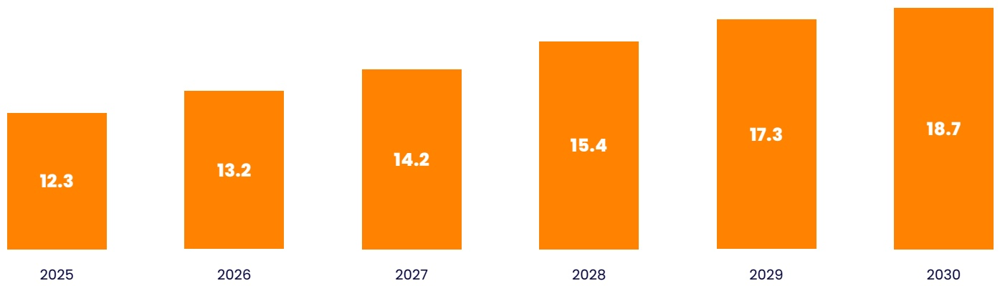
[image_caption]
这是一张柱状图，展示了从2025年到2030年的数据变化。每个橙色柱子代表一个年份的数据值，具体数值如下：

- 2025年：12.3
- 2026年：13.2
- 2027年：14.2
- 2028年：15.4
- 2029年：17.3
- 2030年：18.7

图表显示了数据随时间逐年增加的趋势。
[/image_caption]

Source:AgileIntel

Live service games like Fortnite have leveraged transmedia opportunities to integrate popular franchises such as Marvel and Star Wars, creating immersive, cross-platform experiences that appeal to both gamers and fans of other entertainment mediums. These partnerships not only enhance player engagement but also serve as powerful tools for cross-media storytelling and revenue generation, making them a critical component of the future of LSG.

Live service games like Fortnite have leveraged transmedia opportunities to integrate popular franchises such as Marvel and Star Wars, creating immersive, cross-platform experiences that appeal to both gamers and fans of other entertainment mediums.

For game studios, live service games represent an opportunity to create enduring franchises that drive recurring revenue, foster long-term player loyalty, and extend the lifecycle of their products. However, achieving success requires navigating rising development costs, delivering seamless gameplay experiences, and standing out in an increasingly saturated market. The path forward lies in expanding player demographics, embracing new monetization models, and leveraging technologies like AI to improve efficiencies. Studios that can innovate in these areas, while continuing to build partnerships with IP holders and media companies, will be well-positioned to thrive in this competitive yet rewarding landscape.

## Boxed Games/One-time Purchase Model

The one-time purchase model, where consumers pay upfront for a game without ongoing fees or microtransactions, remains relevant in the gaming industry despite the rise of subscription services, live-service games, and microtransaction-based

models. The narrative-driven titles such as The Last of Us Part II, God of War, and Red Dead Redemption 2 emphasize storytelling, immersion, and worldbuilding, offering complete and self-contained experiences that justify their one-time cost.

These games reflect the artistic vision of developers, free from monetization mechanics like loot boxes or pay-to-win elements while delivering significant replay value through expansive worlds and deep storylines. The one-time purchase model appeals to players seeking full, uninterrupted experiences, avoiding monetization fatigue and fostering trust. Studios like Naughty Dog, Santa Monica Studio, and Rockstar Games have built strong brand loyalty by consistently delivering premium, high-quality titles.

## Economics of the one-time purchase model

One-time purchase games often involve high development costs, with titles like Red Dead Redemption 2 reportedly costing around US\(500 million, including marketing. Revenues primarily rely on strong launch sales: Red Dead Redemption 2 clocked US\)725 million in revenues within the first three days of release, The Last of Us Part II sold over 4 million copies in three days, and God of War sold over 5 million in its first month.

These games maintain relevance through word-of-mouth and critical acclaim, remastered ("Game of the Year" editions), discounted re-releases, or inclusion in subscription services like PlayStation Plus or Xbox Game Pass long after the initial release.

However, a failed one-time purchase game can lead to significant financial losses. Unlike live-service games, there's no ongoing revenue to offset a poor launch. In addition, increasing competition from subscription services like Xbox Game Pass, challenges the model by offering numerous games for a low monthly fee. Therefore, the global market for boxed games is expected to grow only marginally from US\(11.1 billion in 2025 to US\)11.4 billion by 2030.

## Sustainability

The one-time purchase model remains sustainable for studios that can consistently deliver high-quality blockbuster titles. However, studios are finding ways to adapt and supplement their revenue streams.

## Downloadable Content (DLC) and Expansions:

Games like The Witcher 3 and Horizon Zero Dawn use one-time purchase pricing but offer optional DLC expansions post-launch to extend revenue.

Remasters and Sequels: Titles like The Last of Us Part I (Remake) and God of War Ragnarök build on the success of their predecessors to launch sequels and remastered versions, leveraging existing fan bases and assets.

Subscription Services: Studios can release their games on platforms like PlayStation Plus or Xbox Game Pass after the initial sales window passes, ensuring upfront revenues aren't cannibalized while still benefiting from recurring subscription payments.

Transmedia Opportunities: Franchises like The Last of Us have expanded into TV adaptations further increasing the profitability and relevance of their one-time purchase games.

The global boxed games market is expected to value US\(11.1 billion in 2025 and increase at a compound annual growth rate (CAGR) of \(0.5\%\), to reach around US\)11.4 billion by 2030.

## FIGURE 9

Global Live Service Gaming Market in US$ billions, 2025-2030

Source:AgileIntel

The one-time purchase model, where consumers pay upfront for a game without ongoing fees or microtransactions, remains relevant in the gaming industry despite the rise of subscription services, live-service games, and microtransaction-based models. The narrative-driven titles such as The Last of Us Part II, God of War, and Red Dead Redemption 2 emphasize storytelling, immersion, and world-building, offering complete and self-contained experiences that justify their one-time cost.

## Subscription Models

According to a study by data insights company MiDIA Research, there were over 180 million active game subscriptions globally in 2023, up from about 171 million in 2022 – this number is expected to increase to over 318 million by 2030. Another study by consulting company Simon-Kucher found that more than 70 percent of gamers report playing more when buying a gaming subscription. Despite the growing popularity of free-to-play titles that operate on a games-as-a-service (GaaS) model, the subscription model is holding its own in a highly competitive gaming industry.

For players, a subscription model provides a cost-effective way to access a large library of games. This is especially true for casual gamers who enjoy sampling different titles without a large commitment. Additionally, subscriptions are often accompanied by additional perks such as exclusive content, early access to new releases, and discounts on in-game purchase, making the model attractive to gamers. The growth of cloud gaming has proved to be a game changer for this model, as it mitigates the need for expensive hardware upgrades, reducing the barrier to entry for high-end gaming.

For developers, this model provides a steady and predictable source of revenue, and fosters player engagement and loyalty, as gamers are more likely to continue playing and spending within a subscription-based ecosystem. It also allows them to monetise older or lesser-played titles by packaging them into bundles for a monthly fee. Even though, this particular offering remains a small proportion of the industry's revenue, studios are looking to capture a larger share of the market by going all-in on subscriptions. According to an article published in the BBC online portal, the rise of subscription packages has reduced the monthly subscription charges from a range of US\(50 - US\)70 to between US$10 and US$20.

The global subscription-based gaming market is expected to value US$12.1 billion in 2025 and increase at a compound annual growth rate (CAGR) of 12.2%, to reach around US$21.6 billion by 2030. It is dominated by Microsoft's Xbox and Sony's PlayStation. In 2024, the combined installed base for the Xbox Series S and X, along with the PlayStation 5 exceeded 110 million units, with PlayStation contributing 67.3 million units to this total.

FIGURE 10

Global Game Subscription Market in US$ billions, 2025-2030

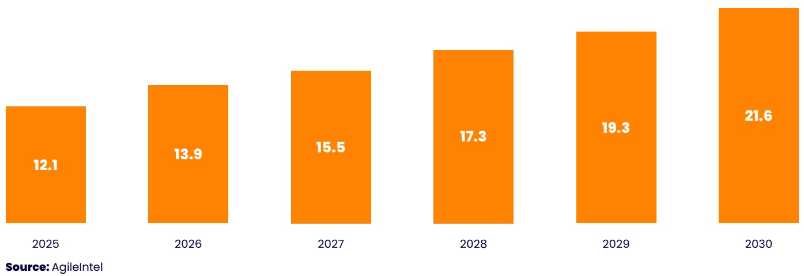
[image_caption]
这是一张柱状图，展示了从2025年到2030年每年的数值变化。每个橙色柱子代表一个年份的数据，具体数值如下：

- 2025年：12.1
- 2026年：13.9
- 2027年：15.5
- 2028年：17.3
- 2029年：19.3
- 2030年：21.6

数据呈现逐年上升的趋势，表明所测量的指标在这段时间内持续增长。图表的来源标注为AgileIntel。
[/image_caption]

FIGURE 11

## PlayStation vs. Xbox: Installed Base and Revenue Share

Xbox

Playstation

Installed base in million units

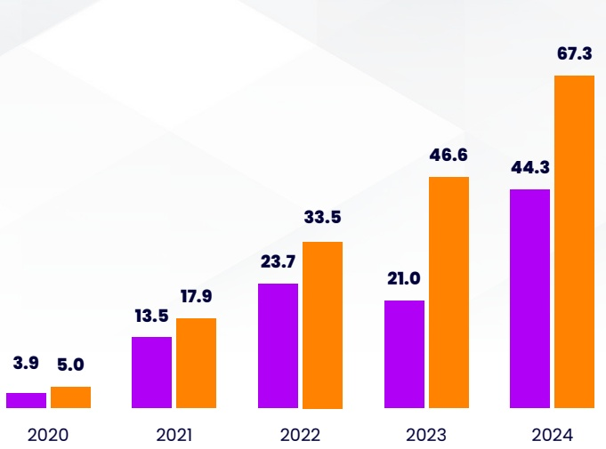
[image_caption]
这是一张柱状图，展示了从2020年到2024年每年的两个不同数值的变化情况。图表中的数据如下：

- 2020年：3.9 和 5.0
- 2021年：13.5 和 17.9
- 2022年：23.7 和 33.5
- 2023年：21.0 和 46.6
- 2024年：44.3 和 67.3

柱状图中，紫色和橙色分别代表不同的数据系列，每个年份对应两个柱子，表示两个不同的数值。整体趋势显示，两个数据系列在2020年至2024年间都有显著的增长，尤其是在2024年达到最高值。
[/image_caption]

Revenue share, 2023-2024

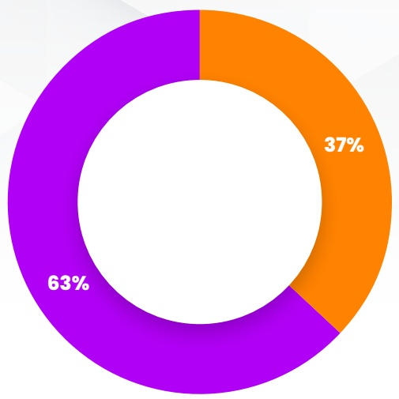
[image_caption]
这是一张饼图，显示了两个部分的百分比分布。紫色部分占63%，橙色部分占37%。图表中心有一个白色圆环，整体背景为浅灰色渐变。
[/image_caption]

Source: Ampere Analysis, Push Square, DFC Intelligence

TABLE 11

## Comparisons of Leading Subscription Service Providers

<table><tr><td>Parameters</td><td>Xbox Game Pass</td><td>PlayStation Now</td></tr><tr><td>Key features</td><td>Offers a rotating catalogue of games, including first-party releases on launch day.
It spans console, PC, and cloud gaming.</td><td>Initially focused on streaming, later allowing downloads for select titles.
Includes classic games and modern releases under its revamped offering.</td></tr><tr><td>Strengths</td><td>Microsoft&#x27;s strategy of including major titles like Halo Infinite and Starfield on day one enhances value for subscribers.
Cloud compatibility expands access to gamers without high-end hardware.</td><td>Sony leverages its vast library of iconic exclusives (e.g., God of War, The Last of Us).
The inclusion of older titles appeals to long-time PlayStation fans.</td></tr><tr><td>Challenges</td><td>The service&#x27;s profitability depends on maintaining a high subscriber base, which requires continuous investment in exclusive, high-quality content.</td><td>Unlike Game Pass, Sony does not typically offer first-party games on release day, which may limit its appeal to some players.</td></tr><tr><td>Tiers/Pricing</td><td>Xbox Network (Free)
Xbox Game Pass Core (US$10/month or US$60/year)
Xbox Game Pass Standard (US$15/month)
Xbox Game Pass for PC (US$12/month)
Xbox Game Pass Ultimate (US$20/month)</td><td>PlayStation Plus Essential (US$10/month or US$80/year)
PlayStation Plus Extra (US$15/month or US$135 per year)
PlayStation Plus Premium (US$18/month or US$160year)</td></tr><tr><td>Partner Memberships</td><td>Riot Games and EA Play (Game Pass Ultimate or PC)</td><td>Ubisoft+ Classics (PS Plus Extra or Premium)</td></tr></table>

Source: Company Websites

## Esports

The global Esports market has transformed from niche gaming competitions in just a few pockets, to a globally thriving industry, attracting significant viewership and revenues. Global revenues are expected to increase from US\(3 billion in 2025 to US\)7.7 billion in 2030. Sponsorships account for the largest share, followed by streaming and media rights, ticket sales, and merchandise. This diversity of revenue opportunities reflects the innovative, agile infrastructure and passionate user base underpinning the eSports market - strengths that are coupled with a frontier mindset and a relative lack of industry regulation.

The League of Legends World Championship is a good example of a successful eSports tournament generating large revenues. In 2023, the event witnessed over 140 million viewers and generated around US$33 million in revenues from ticket sales, merchandise, and sponsorships.

## FIGURE 12

Esports Monetization Models

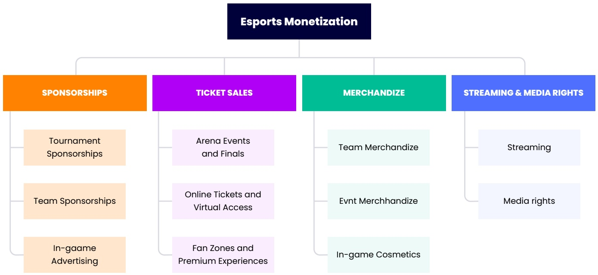
[image_caption]
该图表是一个关于“Esports Monetization”（电子竞技商业化）的结构化思维导图。图表从顶部的主标题“Esports Monetization”开始，向下分支为四个主要类别：SPONSORSHIPS（赞助）、TICKET SALES（门票销售）、MERCHANDIZE（商品）和STREAMING & MEDIA RIGHTS（流媒体与媒体权利）。

1. **SPONSORSHIPS（赞助）**：
   - Tournament Sponsorships（赛事赞助）
   - Team Sponsorships（队伍赞助）
   - In-game Advertising（游戏内广告）

2. **TICKET SALES（门票销售）**：
   - Arena Events and Finals（场馆赛事和决赛）
   - Online Tickets and Virtual Access（在线门票和虚拟访问）
   - Fan Zones and Premium Experiences（粉丝区和高端体验）

3. **MERCHANDIZE（商品）**：
   - Team Merchandise（队伍商品）
   - Evnt Merchandise（活动商品）
   - In-game Cosmetics（游戏内装饰品）

4. **STREAMING & MEDIA RIGHTS（流媒体与媒体权利）**：
   - Streaming（流媒体）
   - Media rights（媒体权利）

每个主要类别下都有具体的子类别，展示了电子竞技商业化的主要收入来源和方式。图表使用了不同颜色来区分各个主要类别，使得信息一目了然。
[/image_caption]

Source:AgileIntel

FIGURE 13

Global Esports Market in US$ billions, 2025-2030

Sponsorships

- Streaming & media rights

Ticket Sales

Merchandise

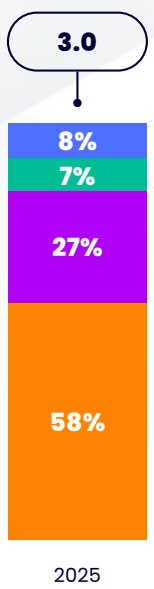
[image_caption]
该图像为一个垂直堆叠的柱状图，展示不同类别的百分比分布。从上到下，各部分的数值分别为：

- 最上方：3.0（位于一个椭圆形框内）
- 第二层：8%
- 第三层：7%
- 第四层：27%
- 最底层：58%

图表底部标注年份为2025。
[/image_caption]

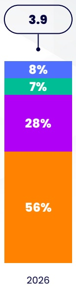
[image_caption]
该图像为一个垂直堆叠的柱状图，展示不同类别的百分比分布。从上到下，各部分的数值分别为：

- 最上方：3.9（未标注百分比，可能为总值或基准值）
- 第二部分：8%
- 第三部分：7%
- 第四部分：28%
- 最下方：56%

图表底部标注年份“2026”。整体颜色从上到下依次为浅蓝色、绿色、紫色和橙色。
[/image_caption]

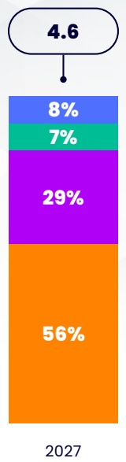
[image_caption]
该图像为一个垂直堆叠的柱状图，展示不同类别的百分比分布。从上到下，各部分的数值分别为：

- 最上方：4.6（未标注百分比）
- 第二层：8%
- 第三层：7%
- 第四层：29%
- 最下方：56%

图表底部标注年份为2027。
[/image_caption]

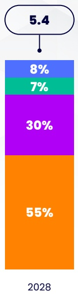
[image_caption]
该图是一个垂直堆叠的柱状图，展示不同类别的百分比分布。从上到下，各部分的数值分别为：顶部为5.4（未标注百分比），蓝色部分为8%，绿色部分为7%，紫色部分为30%，橙色部分为55%。底部标注年份为2028。
[/image_caption]

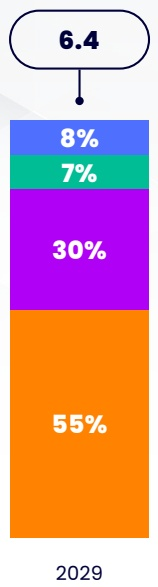
[image_caption]
该图像为一个垂直堆叠的柱状图，展示不同类别的百分比分布。从上到下，各部分的数值分别为：

- 最上方：6.4（未标注百分比，可能为总计值）
- 第二层：8%
- 第三层：7%
- 第四层：30%
- 最底层：55%

图表底部标注年份“2029”。
[/image_caption]

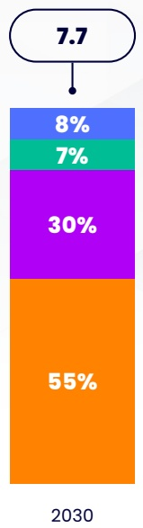
[image_caption]
该图像为一个垂直堆叠的柱状图，展示不同类别的百分比分布。从上到下，各部分的数值和颜色如下：

1. 最上方是一个椭圆形，内含数值“7.7”。
2. 紧接着下方是一个蓝色区域，标注“8%”。
3. 再往下是一个绿色区域，标注“7%”。
4. 接着是一个紫色区域，标注“30%”。
5. 最下方是一个橙色区域，标注“55%”。

在柱状图的底部，标注有年份“2030”。

整体来看，该图表展示了2030年不同类别所占的百分比，其中橙色区域（55%）占比最大，其次是紫色区域（30%），蓝色区域（8%）和绿色区域（7%）占比相对较小。
[/image_caption]

Note: The rest of the World includes Countries from South America, the Middle East, and Africa

Source:AgileIntel

FIGURE 14

Prize Money for Leading eSports Games Worldwide in US$ millions

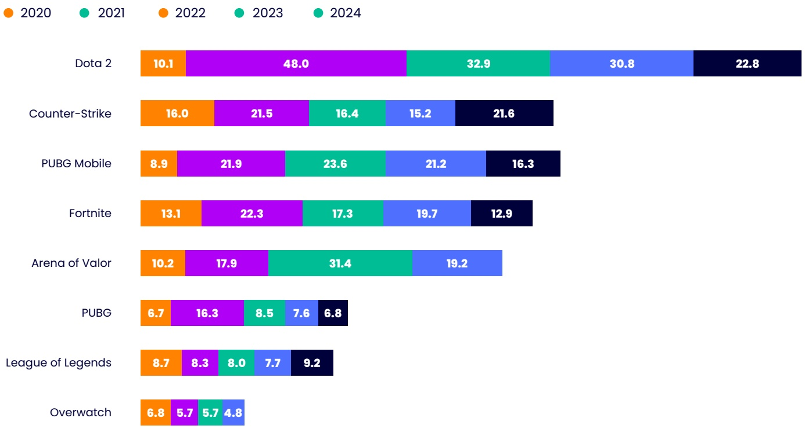
[image_caption]
这是一张柱状图，展示了从2020年到2024年不同电子游戏的市场份额或用户数量。图表中的每个条形代表一个游戏，颜色区分了不同年份的数据：

- **Dota 2**:
  - 2020: 10.1
  - 2021: 48.0
  - 2022: 32.9
  - 2023: 30.8
  - 2024: 22.8

- **Counter-Strike**:
  - 2020: 16.0
  - 2021: 21.5
  - 2022: 16.4
  - 2023: 15.2
  - 2024: 21.6

- **PUBG Mobile**:
  - 2020: 8.9
  - 2021: 21.9
  - 2022: 23.6
  - 2023: 21.2
  - 2024: 16.3

- **Fortnite**:
  - 2020: 13.1
  - 2021: 22.3
  - 2022: 17.3
  - 2023: 19.7
  - 2024: 12.9

- **Arena of Valor**:
  - 2020: 10.2
  - 2021: 17.9
  - 2022: 31.4
  - 2023: 19.2

- **PUBG**:
  - 2020: 6.7
  - 2021: 16.3
  - 2022: 8.5
  - 2023: 7.6
  - 2024: 6.8

- **League of Legends**:
  - 2020: 8.7
  - 2021: 8.3
  - 2022: 8.0
  - 2023: 7.7
  - 2024: 9.2

- **Overwatch**:
  - 2020: 6.8
  - 2021: 5.7
  - 2022: 5.7
  - 2023: 4.8

图表显示了各游戏在不同年份的市场表现，其中Dota 2在2021年达到峰值48.0，而Arena of Valor在2022年达到最高值31.4。Overwatch的市场份额相对较低，且在2023年和2024年有所下降。
[/image_caption]

Source: Company Websites

## Sponsorships remain the most lucrative monetisation strategy

Brands are increasingly recognising the value of collaborating with eSports tournaments to connect with the young and tech-savvy demographic they attract. The inaugural 2024 Esports World Cup held in Saudi Arabia attracted sponsorships from 27 brands including those endemic to the gaming industry and those that are not. The list included Huawei, LG UltraGear, Bayes Esports, Grid Esports, Sportfive, Level Infinite (owned by Tencent), Adidas, KitKat, Pepsi, TikTok, Amazon, and Son. Another good example of this burgeoning trend is Red Bull's US\(100 million (now defunct) partnership with TSM eSports which allowed the latter company to invest in player development and content creation while giving the energy drink maker access to TSM's large fanbase. Auto major Mercedes-Benz has been involved in eSports since 2022, and has sponsored teams such

as TI and SK Telecom, and the Intel Extreme Masters, one of the longest-running eSports tournaments. Global revenues from eSports sponsorships are expected to increase from US$1.8 billion in 2025 to US$4.2 billion in 2030.

FIGURE 15

Video Streaming Quarterly Hours Watched, 2020-2024

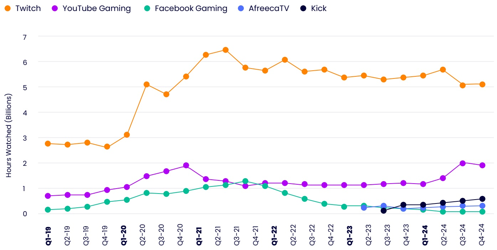
[image_caption]
这是一张折线图，展示了从2019年第一季度（Q1-19）到2024年第四季度（Q4-24）期间，四个不同平台（Twitch、YouTube Gaming、Facebook Gaming、AfreecaTV 和 Kick）的观看小时数（以十亿为单位）的变化趋势。

### 图表描述：

#### 1. **图表类型**：
   - 这是一张**折线图**，用于展示随时间变化的数据趋势。横轴表示时间（按季度），纵轴表示观看小时数（单位：十亿）。

#### 2. **图例**：
   - 图例位于图表顶部，标明了四个平台及其对应的颜色：
     - **Twitch**：橙色
     - **YouTube Gaming**：紫色
     - **Facebook Gaming**：绿色
     - **AfreecaTV**：蓝色
     - **Kick**：黑色

#### 3. **数据趋势**：

   - **Twitch**：
     - 观看小时数在2019年第一季度约为28亿小时。
     - 在2020年第一季度显著上升至约50亿小时，并在2021年第一季度达到峰值65亿小时。
     - 随后略有波动，但总体保持在55亿至65亿小时之间，2024年第四季度降至约50亿小时。

   - **YouTube Gaming**：
     - 观看小时数在2019年第一季度约为7亿小时。
     - 在2020年第一季度升至约12亿小时，并在2021年第一季度达到约20亿小时的峰值。
     - 随后有所下降，但在2024年第四季度回升至约20亿小时。

   - **Facebook Gaming**：
     - 观看小时数在2019年第一季度约为2亿小时。
     - 在2020年第一季度升至约7亿小时，并在2021年第一季度达到约12亿小时的峰值。
     - 随后逐渐下降，2024年第四季度降至约2亿小时。

   - **AfreecaTV**：
     - 观看小时数在2019年第一季度约为2亿小时。
     - 在2023年第二季度升至约3亿小时，并在2024年第四季度降至约2亿小时。

   - **Kick**：
     - 观看小时数在2023年第一季度首次出现，约为1亿小时。
     - 在2024年第四季度升至约6亿小时。

#### 4. **总结**：
   - Twitch 是观看小时数最高的平台，始终保持领先地位，尽管在2021年后有所波动。
   - YouTube Gaming 的观看小时数在2021年达到峰值后有所下降，但在2024年第四季度回升。
   - Facebook Gaming 和 AfreecaTV 的观看小时数相对较低，且在2021年后呈现下降趋势。
   - Kick 是新出现的平台，虽然起步较晚，但在2024年第四季度表现出较快的增长势头。
[/image_caption]

Source: StreamLabs, StreamHatchet

## Streaming and media rights is expected to be the fastest growing category

Just as is the case for traditional sports, media rights are a substantial source of revenue for eSports. This category is estimated to be the fastest-growing between 2025 and 2030, with the global market increasing from US\(0.8 billion to US\)2.3 billion, at a CAGR of \(22.6\%\). Platforms such as Twitch, YouTube, and Huya Live allow gaming fans to forge a deeper connection to teams, players and influencers, thereby creating a sense of ownership that is unique compared to other entertainment and sports sectors. Interestingly, traditional media companies are looking to make inroads in the market, as eSports publishers look for audience growth and higher income from rights licensing. For now, though, Twitch and YouTube have capitalized on network effects, built and optimized their infrastructure and ecosystem, and elbowed out most of the competition.

## Merchandising

Merchandise offerings for eSports companies typically fall under two categories: drops and clothing lines. Drops include limited edition pieces that create high-revenue opportunities due to collaborations with well-established brands. For example, American eSports company FazeClan earned US\(2.5 million in 24 hours from just two fashion 'drops' in 2020, and over US\)40 million from overall merchandise sales alone in 2023. Other examples of successful 'drops' are a Fnatic x Gucci watch, a Mkers x Armani Exchange jersey, a Team Liquid x Tokidoki collection, and a Cloud9 x PUMA collection. On the other hand clothing lines in the form of apparel, collectibles, and digital products are fast becoming a vital revenue stream for eSports companies. The top eSports clothing brands include mainstream sportswear companies such as Adidas, Nike, Puma, Hummel, H&M, Under Armour, JD Sports, Champion, FILA, and Kappa. High-end luxury brands such as Louis Vuitton, Gucci, Burberry, Ralph Lauren, Armani Exchange, Dior, and Bulgari, are also making a foray into this market.

## Ticket Sales

Ticket sales from live events represent a small but growing revenue stream in eSports, with major tournaments attracting thousands of fans to iconic venues. The ESL One Hamburg Dota 2 tournament exemplified the earning potential of such events, generating over US$5 million in 2023 from ticket sales, merchandise, and streaming rights, with 15,000 on-site attendees and millions of online viewers. Another example is the national invitation eSports tournament that was held at the Hangzhou Esports Centre in China in May 2023. The venue was filled to 98 percent capacity. According to Newzoo, the global eSports audience is projected to exceed 640 million by 2025, underscoring the growing significance of the industry.

## FIGURE 16

## Revenue Streams for Game Publishing Industry

## Upfront Payment Model

One-Time purchase

Charge a flat fee to download/purchase this game Used by big games like Grand Theft Auto (GTA)

## Subscription

Games charge a periodic small fee

Used mostly by video games which are

multiplayer and played online

## Upfront Payment Model

Season passes, cosmetic microtransactions, in-app advertising

Gameplay enhancements

## Hybrid Model

Free-to-Play or One-time Purchase

Subscriptions

Live Service Gaming

## plus

In-app advertising

In-game purchases /

microtransactions

Buy coins or flat fee for ads free

experience

Source:AgileIntel

## Hybrid Models

The adoption of hybrid revenue models has become a key strategy in the gaming industry, allowing publishers to maximize their earnings while catering to diverse player preferences. By blending various monetization methods such as free-to-play, in-game purchases, subscriptions, premium cosmetic items, events, and sponsorships, game publishers can create sustainable revenue streams that appeal to different segments of their audience. Games like

Warframe, Path of Exile, and Brawlhalla are good examples of how combining multiple revenue models can optimize earnings.

AI is playing an increasingly vital role in optimizing monetization strategies within the gaming industry. By analysing player behaviour and engagement patterns, AI can predict the most effective times to display ads or present in-app purchase opportunities. This approach not only boosts revenue generation but also ensures a smoother, more tailored user experience.

A good example of a successful hybrid monetisation strategy is Archero, a game developed by Singapore-based Habby. The game's in-app purchases (IAP) strategy focuses on gems – its hard currency that allows players to use them for various purposes such as revival, more energy, buying coins, daily packs, loot boxes, and outfits. Interestingly, the purchase options get more diverse depending on how long the players play the game. To be less intrusive, the game uses occasional IAP pop-ups at times when players are not in gameplay, but are just exploring and upgrading. Moreover, the company has ensured that these pop-ups always bring more value than standard offers.

Archero also offers six unique rewarded video ad placements, giving the players the smallest pack of coins (in-game store), opening a loot box (in-game store), more energy (in-game store), the smallest daily pack (in-game store), extra spin on a lucky wheel (gameplay), and the revive option (gameplay).

Lastly, the game offers a battle pass subscription in two versions: free and paid. According to data released by Sensor Tower, this subscription is currently Archero's best-selling offer among iOS players in the U.S. What makes it particularly valuable is that even though the paid version is priced at US\(4.99, it delivers value to the tune of US\)150. Players are able to access the battle pass as soon as they reach chapter 2, stage 26, which drives player engagement over the long term.

TABLE12

Hybrid Models Used in Selected Games and Platforms

<table><tr><td>Hybrid Model</td><td>Game</td><td>Description</td></tr><tr><td>One-Time Purchase + Live Service + In-game purchase</td><td>Destiny 2 (Bungie)</td><td>➢Initially launched as a one-time purchase but transitioned to a live service model, offering expansions and seasonal content, and in-game purchases to keep players engaged and spending.</td></tr><tr><td>Free-to-play access + In-game purchase</td><td>Fortnite (Epic Games)</td><td>➢Epic Games combined free-to-play access for its Fortnite game with in-game purchases and seasonal events, creating a highly profitable hybrid model</td></tr><tr><td>One-Time Purchase + Live Service + In-game purchase</td><td>Rainbow Six Siege (Ubisoft)</td><td>➢Rainbow Six Siege employs a hybrid approach by offering a base game for purchase while continuously releasing new content and operators through seasonal updates and in-game purchases.</td></tr><tr><td>Esports + Live Service</td><td>League of Legends (Riot Games)</td><td>➢Offers free access to the game while generating revenue through in-game purchases and sponsorships from esports events. 
➢Successful in driving player engagement and also attracts significant sponsorship revenue.</td></tr><tr><td>Subscription + Live Service</td><td>Xbox Game Pass (Microsoft)</td><td>➢Combines a subscription model with access to a library of games, including live service titles that receive regular updates. 
➢Encourages players to subscribe for ongoing content while also allowing publishers to monetize individual games through in-game purchases.</td></tr></table>

Source: Company Websites

## Software and Services

## Publishing as a Service

Over the last few years, the gaming industry has faced many challenges such as high development costs, increasing interest rates, growing consumer expectations, modest growth in overall consumer spending, and a more cautious approach by investors. All these factors mean that developers and publishers are now focusing on optimising production costs while maintaining quality levels. This has required them to adopt a flexible approach, which has made room for companies that operate on a publishing-as-a-service model. These vendors are typically marketing and PR firms that have broadened their scope of offerings to include release management, store-page setup, business development, social media handling, trailer editing, and strategic marketing in addition to the basic functions of marketing and PR. They typically make use of video-game distribution platforms such as Steam, Epic Games Store, and Itch.io, and usually display loyalty towards one of these.

Canadian company Popagenda is a good example of this burgeoning trend. The company is well positioned to offer end-to-end publishing services by virtue of its existing PR-focused

relationships with games such as Cuphead, Grindstone, Landfall, Ooblets, and the Playdate. What stands out in Popagenda's offerings is its focus on release management in which it coordinates with quality assurance teams and porting studios to ship on console and other platforms. Therefore, it takes on a lot of the heavy lifting tasks that were previously dominated by large-scale publishers, without the aggressive cuts that have previously been a part of many developer-publisher deals. This means that developers can get their games published at more or less the same standard as large publishers, and also get to keep a large portion of the revenue pie.

Scotland-based Neonhive is another PR and marketing company that decided to pivot to a publishing-as-a-service model in early 2024. Its first assignments were Villainous Games Studio's Harvest Hunt and Byteparrot's Slopecrashers. According to the agency's founder Korina Abbott, the company is looking to work on all titles except the ones that involve non-fungible tokens (NFTs), web3, or cryptocurrency, along with games that use AI for art, voice work, or sound design. Neonhive also prefers using Steam to distribute games, simply because of its vast experience with the platform.

## Design Studios

The significance of visual elements in the modern gaming industry cannot be overstressed. Not only do well-crafted graphics that include sound effects, motion graphics, music, and animation, have a positive first impact, they also go a long way in creating a gratifying and immersive gaming experience. They also enhance a game's navigational aspects, making menus, icons, and controls intuitive

and fun. This results in a fluid gaming experience saving gamers from unnecessary time wasted in handing operational mechanics.

Therefore, developers are now prioritising the creation of easily navigable, and aesthetically pleasing game interfaces. Interestingly, a big part of a developer's graphical refinement strategy includes collaborations with players across various disciplines such as typography, photography, and illustration.

TABLE13

Design Studios: Leading Companies (Selected)

<table><tr><td>Tool Name</td><td>Provider Company</td><td>Services Offered</td><td>Services Offered</td></tr><tr><td>AdobeAnimate</td><td>Adobe</td><td>Animation software, interactive content creation, Vector graphics, timeline-based animation, HTML5 export</td><td>Angry Birds, The Simpsons, Disney games, Flash games</td></tr><tr><td>Amazon Lumberyard</td><td>Amazon</td><td>Game engine, cloud integration, Twitch integration, Free to use, deep Twitch integration, multiplayer support</td><td>New World, Breakaway, The Grand Tour Game</td></tr><tr><td>Blender</td><td>Blender Foundation</td><td>3D modeling, animation, rendering, Open-source, extensive community, real-time rendering</td><td>Yo Frankie!, Sintel, Spring, Agent 327, Tears of Steel</td></tr><tr><td>Cocos2d-x</td><td>Cocos Technologies</td><td>2D game engine, cross-platform development, Lightweight, open-source, easy-to-use</td><td>Angry Birds 2, Clash of Kings, Dragon City, Plants vs. Zombies, 2048</td></tr><tr><td>Construct 3</td><td>Scirra</td><td>2D game development, HTML5 support, Visual scripting, real-time preview, multiplayer support</td><td>The Next Penelope, Treadnauts, 2048, The Escapists, A Short Hike</td></tr><tr><td>CryEngine</td><td>Crytek</td><td>Game engine, 3D rendering, physics simulation, Real-time lighting, advanced AI, terrain editing</td><td>Crysis, Warface, Hunt: Showdown, Kingdom Come, Evolve</td></tr><tr><td>GameMaker Studio 2</td><td>YoYo Games</td><td>2D game development, drag-and-drop interface, User-friendly, built-in physics, cross-platform export</td><td>Hyper Light Drifter, Katana Zero, Spelunky, Risk of Rain, Axiom Verge</td></tr><tr><td>Godot Engine</td><td>Community-driven</td><td>Open-source game engine, 2D/3D support, Lightweight, flexible scene system, visual scripting</td><td>Deponia, RPG in a Box, 3D Game Kit, The Interactive Adventures of Dog Mendonça</td></tr><tr><td>Unity</td><td>Unity Technologies</td><td>Game engine, 2D/3D development, AR/VR support, Cross-platform support, asset store, real-time rendering</td><td>EA, Ubisoft, Nintendo, Square Enix, Tencent</td></tr><tr><td>Unreal Engine</td><td>Epic Games</td><td>Game engine, photorealistic rendering, VR support, High-fidelity graphics, Blueprint visual scripting</td><td>Fortnite, PUBG, Street Fighter, Final Fantasy, Gears of War</td></tr></table>

Source: Company Websites

## Conclusion

The gaming industry is at an inflection point marked by rapid technological advancements, evolving consumer expectations, and an increasingly democratised development and publishing landscape. This report has highlighted several critical aspects shaping the future of game publishing and development and underscores the importance of adaptability and innovation for sustained success.

## The developer-publisher relationship is shifting from dependence to collaboration

The relationship between game developers and publishers is evolving rapidly. Traditionally, developers have taken care of the creative side of game development, while publishers have focused on the finance and distribution side. However, the rise of alternative funding avenues, technological disruptions, and new distribution platforms, are blurring the boundaries. Developers now have more independence and creative freedom to create and publish games without the interference of large publishers. On the other hand, publishers are trying to carve a niche for themselves in an increasingly crowded market by focusing on big-budget titles and those with globally recognised IPs.

## The rapid digitalisation of gaming is impacting marketing strategies

With the dawn of the digital era, the role of publishers has shifted to managing digital rights, securing premium placements on digital storefronts like Steam, and developing other digital marketing strategies. Social media platforms, streaming services, and influencer-driven content have become central to marketing efforts, enabling real-time engagement with players. Partnerships with influencers and streamers have proven to be particularly impactful. Moreover, gaming studios are increasingly forging alliances with technology

companies, brands, and other gaming companies, to strengthen their offerings, reduce development costs, attract new players, and enhance visibility.

## Fostering communities: the key to extending a game's lifecycle

Community engagement has become a cornerstone of gaming success, fostering loyalty and extending a game's lifecycle. Active communities, whether through in-game guilds, alliances, or social media interactions, encourage collaboration, competition, and camaraderie. However, this burgeoning trend necessitates robust measures to ensure safety and inclusivity. Publishers are prioritising the integration of moderation tools, inclusive environments, and proactive measures to address toxicity. Modern trust and safety systems powered by AI and machine learning are instrumental in mitigating toxicity, fraud, and harassment while promoting prosocial behaviour.

## Data analytics technologies are expected to drive the next wave of growth in the gaming industry

Data analytics has become a vital tool for refining game publishing and marketing strategies. By tracking player behaviours, preferences, and spending patterns, companies can make informed decisions on user acquisition, retention, and monetization. The integration of data analytics into every stage of game development and publishing ensures that companies remain agile and responsive to shifting market dynamics. The ability to harness data effectively is becoming a key differentiator in the competitive gaming landscape.

## Diversification of revenue streams emerging as a key sustenance and growth strategy in an ultra-competitive market

Diversifying revenue streams is essential for sustaining growth in a competitive gaming market. Live Service Games (LSGs) have revolutionized the industry by emphasizing ongoing content updates and player retention over one-time sales. Subscription services, such as Xbox Game Pass, offer steady income streams while broadening access to games for players. Meanwhile, eSports has emerged as a lucrative avenue, monetizing competitive gaming through sponsorships, merchandise sales, and ticketed events. Combining multiple revenue models—whether through in-app purchases, downloadable content, or subscriptions enables studios to optimize earnings while catering to diverse player segments.

## Software and services emerging as key enablers for smaller developers

Developers and publishers are now focusing on optimising production costs while maintaining quality levels. This has required them to adopt a flexible approach, which has made room for companies that operate on a publishing-as-a-service model. These vendors are typically

marketing and PR firms that have broadened their scope of offerings to include release management, store-page setup, business development, social media handling, trailer editing, and strategic marketing in addition to the basic functions of marketing and PR. Moreover, rising consumer expectations in an overcrowded market have highlighted the need for developers to stand out, with advanced visualisation emerging as a key differentiator. Therefore developers are prioritising the creation of easily navigable, and aesthetically pleasing game interfaces to create a fluid gaming experience.

## FINAL THOUGHT:

## The key to success lies in adaptability and innovation

The gaming industry's future lies in its ability to adapt and innovate. From empowering indie developers with selfpublishing tools to forging strategic partnerships and leveraging data-driven insights, the industry is undergoing a profound transformation. Success in this competitive landscape requires a delicate balance between creativity, technological prowess, and community-building. As gaming continues to blur the boundaries between entertainment, technology, and culture, its potential for growth and impact remains boundless. By embracing change and prioritizing player-centric strategies, the industry can chart a path toward sustainable, inclusive, and immersive gaming experiences for years to come.

## GAME PUBLISHING AND MARKETING

## SUMMIT

9 – 10 September 2025 Novotel London West, London, UK

Evgeniy Shukin

Publishing Director Wargaming

André Persson

Chief Marketing Officer Starbreeze Entertainment

Guillaume Rambourg

Head of European Publishing, Apex Legend, Electronic Arts (Respawn Entertainment)

Max Métral

Go-to-Market Analytics Director Activision Blizzard

Edd Newby-Robson

Head of Marketing, Avalanche Studios Group

On 9-10 September, in London at the Novotel London West, the Game Publishing and Marketing Summit makes its debut as the only event dedicated exclusively to tackling the multi-platform challenges of game publishing and marketing.

Bringing together experts from AAA studios, indie developers, and industry-leading publishers, this transformative summit offers you the opportunity to discover new strategies and advance your position in the industry. Explore best-practices for balancing publisher developer dynamics, cross-platform expansion, navigating self-publishing, and breaking through the noise in an overpopulated marketplace.

Don’t miss your chance to take part in the first-ever Game Publishing and Marketing Summit and help shape the next era of the industry. Register today!

## Bibliography

## Style followed:

Author's Last Name, First Name. "Page Title." Website Name. Month Day, Year. URL.

1.1D3 Digitech. "Video Game Distribution: From Physical Media to Self-Publishing Breakthrough." August 03, 2024. https://www.1d3.com/blog/video-game-distribution-revolution

2. Active Fence. "The State of Safety in Gaming 2025." https://go.activefence.com/state-of-safety-in-gaming-2025?utm_medium \(\equiv\) email&_hsenc \(\equiv\) p2ANqtz-99nzv9Fv2sknD_4EheT_qb BY8FiErvvXjMRqgBpW7BOiN8zrNznAl4-y1cmSNawAa_T5XkGOT 8iOGcjlrCx3gWZHSF17IPJnM0M4UkCqvv6byZbvA&_hsmi=4649 2580&utm_content \(\equiv\) 46492580&utm_source \(\equiv\) hsautomation.

3. Amber Studio. "The guide for successful Community building in Gaming." https://amberstudio.com/docs/The-Guide-for-Successful-Community-Building-in-Gaming.pdf.

4. Andrew, Keith. "Self-publishing is the 'future of gaming', declares TIGA." Pocket Gamer.biz. June 15, 2012. https://www.pocketgamer.biz/self-publishing-is-the-future-of-gaming-declares-tiga/.

5. Art Station. "What is cross-platform game development?". https://www.artstation.com/blogs/retrostylegames/n7LYM/ what-is-cross-platform-game-development.

6. Bain & Company. "Gaming Report 2024." https://www.bain.com/globalassets/noindex/2024/bain-report_gaming-report-2024.pdf.

7. Birch. "The Battle of games: A quick dive into video game marketing." February 16, 2024. https://bir.ch/blog/video-game-marketing.

8. Bodkhe, Nandini. "Exploring the Rise of Subscription Models in Console Gaming." Sdlc corp. September 30, 2024. https://sdlccorp.com/post/exploring-the-rise-of-subscription-models-in-conSOLE-gaming

9. Broadbent, Bruce. & Guerrieria, Paul. "6 key marketing trends changing the gaming industry." Think With Google. August, 2020. https://www.thinkwithgoogle.com/intl/en-emea/consumer-insights/consumer-trends/6-key-marketing-trends-changing-gaming-industry/.

10. Calvin, Alex. "PR agency Neonhive moves into publishing." PC Games Insider. February 21, 2024. https://www.pcgamesinsider.biz/news/74314/pr-agency-neonhive-moves-into-publishing/.

11. Carter, Justin. "Over 25 million people have played Palworld." Game Developer. February 22, 2024. https://www.gamedeveloper.com/business/palworld-evolves-to-25-million-players.

12. Chesalina, Kira. "How Influencers Impact the Gaming Industry." AAA Agency. August 06, 2024. https://aaagncy.com/blog/how-influencers-impact-the-gaming-industry/.

13. Chichmanov, Guillaume. "Maximizing Success With Co-Development in Game Production." Cominted labs. September 5, 2024. https://www.comintedlabs.io/news/maximizing-success-with-co-development-in-game-production.

14. Chichmanov, Guillaume. "Top 50 Leading Indie Game Publishers to Fund Your Indie Games." Cominted Labs. August 06, 2024. https://www.comintedlabs.io/news/top-50-leading-indie-game-publisher-to-fund-your-indie-games.

15. Christofferson, Anders. & Plantec, Yohann. "The Next Big Disruption in Video Games: Distribution." Bain & Company. https://www.bain.com/insights/next-big-disruption-in-video-games-distribution-gaming-report-2024/.

16. Clement, J. "Sports audience size worldwide from 2020 to 2025, by type of viewers." Statista. January 16, 2025. https://www.statista.com/statistics/490480/global-esports-audience-size-viewer-type/.

17. Collins, Emma. "Indie Games Market Reached Unprecedented Success in 2024." 80LV. October 18, 2024. https://80.lv/articles/indie-games-market-reached-unprecedented-success-in-2024.

18. Dealessandri, Marie. "Why Neonhive is taking the leap into publishing." Games Industry. February 20, 2024. https://www.gameindustry.biz/why-neonhive-is-taking-the-leap-intopublishing.

19. Deloitte. "Game Companies, Studios Come Together to Bring Biggest Stories to Life." https://deloitte.wsj.com/cmo/game-companies-studios-come-together-to-bring-biggest-stories-to-life-c9c30ce1.

20. Dharmadhikari, Swasti. "Game Developer Market Report 2025 (Global Edition)." Cognitive Market Research. October 25, 2024. https://www.cognitivemarketresearch.com/game-developermarket-report?srsltid=AfmBOoq3wIA36KIIKJDH0eTaoMKeqGDYOhLAKvhGn4AltKWGN5pZllsw.

21. Elait. "Data Analytics Fuelling Growth in the Gaming Industry." https://elait.com/data-analytics-fuelling-growth-in-the-gaming-industry/.

22. EOS intelligence. "Industry Game for Diversifying Monetization Pathways." August 05, 2021. https://www.eos-intelligence.com/perspectives/technology/industry-game-for-diversifying-monetization-pathways/.

23. Fourth Floor Creative. "Gaming influencers: working with them, doing it right, and succeeding." https://fourthfloorcreative.co/blog/gaming-influencer.

24. Fragen, Jordan. "These 27 brands are sponsoring the 2024 Esports World Cup." Venture Beat. July 5, 2024. https://venturebeat.com/games/these-27-brands-are-sponsoring-the-2024-earports-world-cup/.

25. Freeman, Will. "Community matters: How audience engagement in games is shaping other industries | Playable Futures." Games Industry.biz. December 23, 2024. https://www.gameindustry.biz/ community-matters-how-audience-engagement-in-games-is-shaping-other-industries-playable-futures.

26. Gamalytic. "Steam Analytics." https://gamalytic.com/steam-analytics.

27. Game-Ace. "Cross-Platform Game Development - What You Need For." January 18, 2023. https://game-ace.com/blog/make-cross-platform-game/.

28. Gordon, Whitson. & Hill, Simon. "The Ultimate Guide to Game Subscription Services." Wired. October 11, 2024. https://www.wired.com/story/best-game-subscriptions/.

29. GRYNOW. "Influencer Marketing in the Gaming Industry." August 23, 2024. https://www.grynow.in/blog/influencer-marketing-in-the-gaming-industry.html.

30. Hardy, Jean. "Mobile Game Developers vs Publishers: Key Differences Explained." TapNation. December 4, 2024. https://www.tap-nation.io/blog/mobile-game-developers-vs-publisherkey-differences-explained/.

31. Influencer. "The State Of Influencer Marketing In Gaming." October 25, 2024. https://www.influencer.com/knowledge-hub/the-state-of-influencer-marketing-in-gaming

32. Influencer. "The State Of Influencer Marketing In Gaming." October 25, 2024. https://www.thedrum.com/profile/influencer/article/the-state-of-influencer-marketing-in-gaming.

33. Islam, Arif. "2024 League of Legends World Championship becomes most-watched esports tournament ever." Sportspro. November 05, 2024. https://www.sportspro.com/news/league-of-legend-s-world-championship-final-viewership-t1-bilibili-november-2024/#:~text=World%20Championship%20 averaged%20around%201.73,from%20109%20hours%20of%20 airtime.

34. Jaeger, Lisa. "Global Gaming Study: The Future of Gaming is Subscription." Simon-Kucher. October 27, 2020. https://www.simon-kucher.com/en/insights/global-gaming-study-future-gaming-subscription.

35. Joel. "How Gaming Companies Build Partnerships for Mutual Success." Lyncconf. April 8, 2024. https://lynccconf.com/how-gaming-companies-build-partnerships-for-mutual-success/.

36. Juego Studio. "What makes Cross-platform game development popular in 2025?" January 23, 2024. https://www.juegostudio.com/blog/what-makes-cross-platform-game-development-popular-in-2024.

37. Juego Studio. "How Much Does Indie Game Development Cost in 2025?." December 14, 2024. https://www.juegosstudio.com/blog/indie-game-development-cost.

38. Kerr, Chris. "Remedy claims self-publishing model will help it 'think more commercially'." Game Developer. November 19, 2024. https://www.gamedeveloper.com/business/remedy-claims-self-publishing-model-will-help-it-think-more-commercially-.

39. Kofluence. "Unlocking Success: Why Influencer Marketing Matters for Gaming Companies." February 21, 2024. https://www.kofluence.com/why-influencer-marketing-matters-for-gaming/.

40. Konvoy. "The Era of the Indie Game." March 8, 2024. https://www.konvoy.vc/newsletters/the-era-of-the-indie-game.

41. Kozlova, Anna. "How a shifting games industry is affecting developers and publishers." Venture Beat. April 22, 2024. https://venturebeat.com/games/how-a-shifting-games-industry-is-affecting-developers-and-publishers/.

42. Lark. "Define subscription model and its relevance in the gaming industry." June 06, 2024. https://www.larksuite.com/en_us/topics/gaming-glossary/subscription-model.

43. Lindzon, Jared. "The gaming industry is aiming for subscribers. Will gamers play along?" BBC. January 31, 2024. https://www.bbc.com/worklife/article/20240130-the-gaming-industry-is-aiming-for-subscribers-will-gamers-play-along.

44. LinkedIn. "Ten Big Sponsors in Esports." August 17, 2023. https://www.linkedin.com/pulse/ten-big-sponsors-esports-tengg/.

45. Mahajan, Ketan. "Gaming Console Statistics 2025 By Games, Performance, Quality." Market.us News. January 13, 2025. https://www.news.market.us/gaming-conSOLE-statistics/.

46. Maher, Shannon. "8 Influencer Marketing Campaigns in Gaming Proving The Power Of The Influencer." Socially Powerful. November 27, 2024. https://sociallypowerful.com/post/influencer-marketing-for-gaming-brands

47. Main Leaf. "Brand collaborations in games: a win-win relationship." July 10, 2024. https://mainleaf.com/brand-collaborations-in-games/.

48. Mills, Terri. "Report: Palworld Made Almost $500 Million, While Helldivers 2 Surpassed a $200 Million Gross Mark." 80 lv. March 06, 2024. https://80.lv/articles/report-palworld-made-almost-usd500-million-while-helldivers-2-surpassed-a-usd200-million-gross-mark/.

49. Moldstud. "Gaming Industry Partnerships: Collaborating for Success." January 16, 2024. https://moldstud.com/articles/p-gaming-industry-partnerships-collaborating-for-success#:~text=Innovation%20in%20gaming%20is%20 driven,industries%20maximizes%20visibility%20and%20 engagement..

50. Newman, Harvey. "The Rise of Self-Publishing for Game Developers: Why It's Thriving in 2024." Harvey Newman. October 11, 2024. https://harveynewman.com/rise-of-self-publishing-for-game-developers-2024/#::text=Direct%20Access%20to%20Players%20Through,of%20players%20without%20a%20publisher..

51. Newzoo. "New free report: Meet the gamers of 2023 and see how they engage with video games." June 20, 2023. https://newzoo.com/resources/blog/how-consumers-engage-with-video-games-in-2023.

52. Nina. "UGC: The Driving Force Behind Community Engagement in Gaming." Game Influencer. https://gameinfluencer.com/UGC-the-driving-force-behind-community-engagement-in-gaming/.

53. Okur, Mine. "The art of graphic design in video games: beyond the visual." Amazonia Investiga. May 20, 2024. https://amazoniinvestiga.info/index.php/amazonia/article/view/2781/4282#:~text=ln%20the%20game%20industry%2C%20graphic,by%20providing%20feedback%20and%20ideas..

54. Palmer, Jarrod. "Is cross-platform the future of gaming?". Servers. https://www servers.com/news/blog/is-cross-platform-the-future-of-gaming.

55. Premortem Games. "The rise of Publisher-as-a-Service - the Popagenda way." May 3, 2022. https://premortemgames/2022/05/03/the-rise-of-publisher-as-a-service-the-popagenda-way/.

56. PwC. "Centre of the game: KSA emerges as a significant player in the global Esports market." https://www.pwc.com/m1/en/industries/documents/centre-of-the-game.pdf.

57. Ready Player Me. "How User-Generated Content is Shaping the Next Era of Gaming." September 03, 2024. https://readyplayer.me/blog/how-user-generated-content-is-shaping-the next-era-of-gaming.

58. Riendeau, Danielle. "The best places to publish your indie game." Game Developer. July 21, 2023. https://www.gamedeveloper.com/production/the-best-places-to-publish-your-indie-game.

59. Romano, Nick. "Death Stranding game is fulfilling its destiny by becoming a movie." Entertainment Weekly. December 14, 2023. https://ew.com/death-stranding-movie-hideo-kojima-norman-reedus-game-8415914.

60. Simonetta, Agostino. "Game publishing in the post-publishing era | Playable Futures." Games Industry. September 27, 2022. https://www/gamesindustry.biz/game-publishing-in-the-postpublishing-era-playable-futures.

61. SteamDB. "Steam Game Releases by Month." https://steamdb.info/stats/releases/.

62. Strickland, Derek. "Digital to make 95% of video game revenues in 2023, or $174.5 billion." TweakTown. January 08, 2024. https://www.tweaktown.com/news/95135/digital-to-make-95-of-video-game-revenues-in-2023-or-174-5-billion/index.html.

63. Subscription Flow. "How To Diversify Your Revenue Streams With Esports & Gaming Subscriptions." August 06, 2021. https://wwwsubscriptionflow.com/2021/08/diversify-your-revenue-streams-with-esports-gaming-subscriptions/.

64. Takahashi, Dean. "It's a cross-platform world - 61% of U.S. gamers play across multiple devices | exclusive CTA survey." Venture Beat. December 5, 2024. https://venturebeat.com/games/its-a-cross-platform-world-61-of-u-s-gamers-play-across-multiple-devices-cta-survey/.

## 获取每日免费报告

每日微信群分享

最新行业报告

## 高端社群

所有行业报告均为公开合规版，知识产权属于发布机构，使用场景限于小范围内部学习。