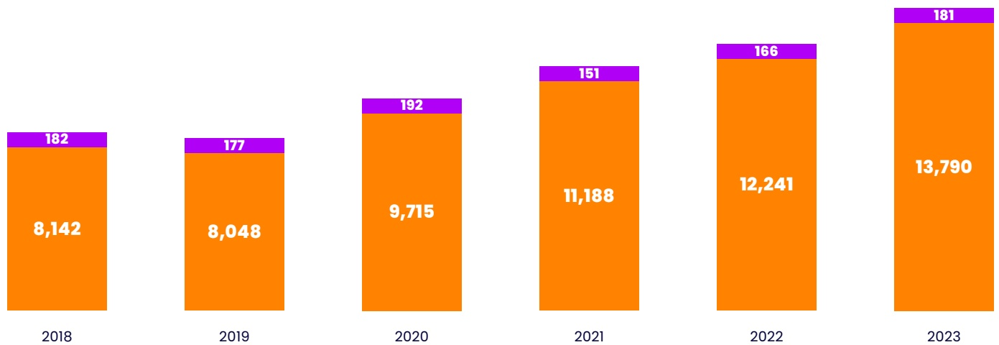
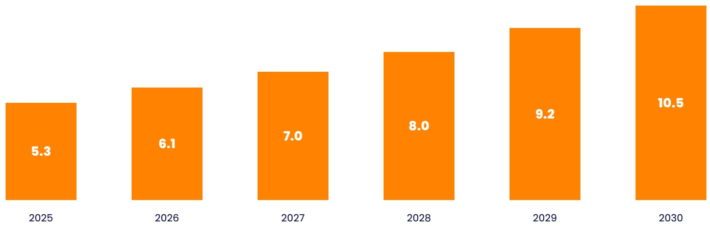

<!-- page 13 -->

According to Remedy's CFO Santtu Kallionpää, who plans on self-publishing many titles in the near term, moving away from the traditional publisher-funded model isn't only about securing a bigger piece of the revenue but changing the approach towards development. The studio now prioritizes building a game with a huge target audience in mind, instead of just creating a compelling concept.

FIGURE 4

Number of Games Released on Steam Worldwide from 2018 to 2023, by Developer Type

- Indie games
- AAA games

[image_caption]
这是一张柱状图，展示了从2018年到2023年每年的数据变化。每个柱子分为两部分：橙色部分表示较大的数值，紫色部分表示较小的数值。

- 2018年：总值为8,142，其中橙色部分为8,142，紫色部分为182。
- 2019年：总值为8,048，其中橙色部分为8,048，紫色部分为177。
- 2020年：总值为9,715，其中橙色部分为9,715，紫色部分为192。
- 2021年：总值为11,188，其中橙色部分为11,188，紫色部分为151。
- 2022年：总值为12,241，其中橙色部分为12,241，紫色部分为166。
- 2023年：总值为13,790，其中橙色部分为13,790，紫色部分为181。

从图中可以看出，橙色部分的数值逐年增加，而紫色部分的数值在不同年份间有所波动。
[/image_caption]

Source:VG Insights

FIGURE 5

Indie Developers Market in US$ Billions, 2025-2030

[image_caption]
这是一张柱状图，展示了从2025年到2030年的数据变化。每个柱子代表一个年份，柱子的高度表示相应的数值。具体数值如下：

- 2025年：5.3
- 2026年：6.1
- 2027年：7.0
- 2028年：8.0
- 2029年：9.2
- 2030年：10.5

图表显示了一个逐年增长的趋势，数值从2025年的5.3逐渐增加到2030年的10.5。
[/image_caption]

Source:AgileIntel