## 2026 全球移动游戏行业白皮书

## 获取每日免费报告

每日微信群分享

最新行业报告

## 高端社群

所有行业报告均为公开合规版，知识产权属于发布机构，使用场景限于小范围内部学习。

## 目录 Contents

01

## 中国移动游戏市场现状分析

2025年中国移动游戏市场收入规模约2859.2亿元，微弱增长\(0.56\%\)。女性游戏玩家数量迅速增长，推动市场新一轮拓展与创新。

02

海外移动游戏市场现状分析

03

移动游戏典型产品&企业案例分析

04

全球移动游戏市场发展趋势

## 中国移动游戏市场收入规模

## 行业情绪从“复苏焦虑”转为“战略蛰伏”

2025年中国移动游戏市场以2859.2亿元的收入规模与 \(0.56\%\) 的微弱增长率，清晰地标志着市场正式进入一个以存量平台期为特征的“新常态”。与往年因政策或周期调整带来的波动不同，2025年的停滞根植于更根本的结构性瓶颈——内容范式与用户需求的代差。过去十年驱动市场前进的核心动力，无论是端游IP移植、二次元内容升级还是开放世界技术扩散，其红利已基本释放完毕；而用户经过多年洗礼，对基于现有框架的“高品质换皮”产生了高度审美疲劳与消费倦怠。在此背景下，行业的集体心态也发生了根本性转变，从过去几年在“寒冬”中寻求“复苏”的焦虑，转向对“平台期”的冷静接受与长期适应。这意味着企业战略重心从追求增长规模，全面转向捍卫存量份额与提升运营确定性。未来中国移动游戏的突破将不再来源于对过去成功路径的优化，而必然依赖于能够弥合当前“代差”的、根本性的体验革新。这可能是AI从生产工具演变为核心玩法引擎后催生的交互革命，也可能是AR、VR、云游戏等硬件成熟后带来的体验重构。

2025年中国移动游戏市场收入规模

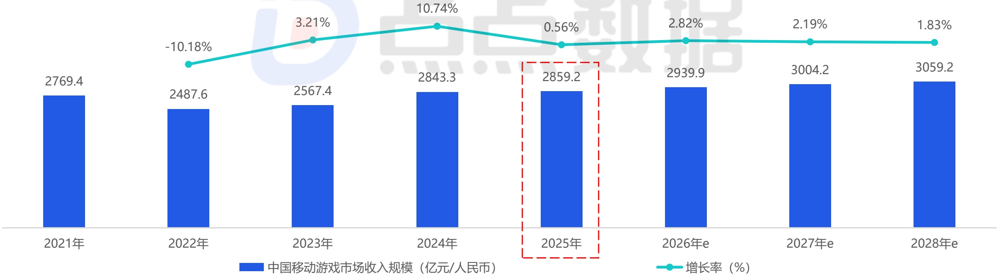
[image_caption]
这是一张展示中国移动游戏市场收入规模及其增长率的柱状图和折线图组合图表。

### 图表类型
- **柱状图**：表示每年的市场收入规模（单位：亿元/人民币）。
- **折线图**：表示每年的市场收入增长率（单位：%）。

### 主要信息与数据趋势
1. **2021年**
   - 市场收入规模：2769.4亿元
   - 增长率：-10.18%

2. **2022年**
   - 市场收入规模：2487.6亿元
   - 增长率：3.21%

3. **2023年**
   - 市场收入规模：2567.4亿元
   - 增长率：10.74%

4. **2024年**
   - 市场收入规模：2843.3亿元
   - 增长率：0.56%

5. **2025年**（预测值）
   - 市场收入规模：2859.2亿元
   - 增长率：2.82%

6. **2026年**（预测值）
   - 市场收入规模：2939.9亿元
   - 增长率：2.19%

7. **2027年**（预测值）
   - 市场收入规模：3004.2亿元
   - 增长率：1.83%

8. **2028年**（预测值）
   - 市场收入规模：3059.2亿元

### 数据趋势分析
- **市场收入规模**：从2021年的2769.4亿元开始，经历了一段下降后，从2022年开始逐年增长，预计到2028年将达到3059.2亿元。
- **增长率**：2021年为负增长，2022年转为正增长并达到3.21%，随后在2023年达到最高点10.74%，之后逐渐放缓，预计到2028年降至1.83%。

### 图例说明
- **蓝色柱状图**：表示中国移动游戏市场的收入规模（单位：亿元/人民币）。
- **青色折线图**：表示中国移动游戏市场的增长率（单位：%）。

### 特殊标记
- **2025年**的数据被红色虚线框特别标注，表明这是当前年份或一个关键预测点。

### 总结
该图表清晰地展示了中国移动游戏市场在过去几年的收入变化及未来几年的增长趋势，显示出市场的逐步复苏和稳定增长态势。
[/image_caption]

注释：1、中国移动游戏市场统计范围：仅包含在中国大陆地区上线的移动端游戏，不包含PC端、游戏主机端或其他硬件平台上的游戏（例如一款游戏同时发布了移动端版本、PC客户端版本和游戏主机端版本，本报告也仅统计移动端版本的相关数据）；2、收入规模包含统计范围内用户消费的总金额，不包含广告变现、第三方充值等其他收入模式；3、本报告中后续涉及的“中国收入”相关的统计数据，都以此标准进行统计；4、部分数据可能会在点点数据2026年相关报告中做出调整。来源：中国移动游戏市场收入规模是综合了点点数据、企业财报、专家访谈，根据点点数据统计模型核算所得。

## 中国移动游戏市场收入集中度

## 少数巨头的生态守卫战 vs 庞大长尾的残酷生存战

当TOP10的“超级产品”持续吸纳用户消费并占据近半市场时，新入局者或中型产品实现跃迁的窗口正急剧收窄。市场竞争从“百花齐放的内容角逐”，日益演变为“少数巨头的生态位守卫战”与“庞大长尾的残酷生存战”。多款头部产品今年的运营动向都表明其战略核心是不惜代价维护生命周期与用户活跃度，一切创新与资源投入都围绕此展开。而对于绝大多数开发者而言，在难以撼动头部格局的前提下，其生存策略要么是瞄准未被满足的垂直细分需求，在长尾中寻求小而美的利润空间。例如独立游戏赛道，今年就涌现了多款破圈产品（如《苏丹的游戏》《情感反诈模拟器》《逃离鸭科夫》等），这些作品或许难以在收入规模上挑战头部巨头，但它们通过满足特定玩家社群的深层情感与体验诉求，成功验证了在固化市场之外仍存在宝贵的价值洼地。

2023-2025年中国移动游戏市场收入集中度（仅App Store）

[image_caption]
该图像为一个柱状图，展示了2023年至2025年期间不同排名区间移动游戏收入规模的占比情况。图表分为三个年度（2023年、2024年、2025年），每个年度的收入占比被分为四个区间：1-10名、11-50名、51-200名以及其他移动游戏。

### 2023年
- **1-10名收入规模占比**：43.14%
- **11-50名收入规模占比**：26.62%
- **51-200名收入规模占比**：19.45%
- **其他移动游戏收入规模占比**：10.79%

### 2024年
- **1-10名收入规模占比**：43.23%
- **11-50名收入规模占比**：28.68%
- **51-200名收入规模占比**：18.62%
- **其他移动游戏收入规模占比**：9.47%

### 2025年
- **1-10名收入规模占比**：44.01%
- **11-50名收入规模占比**：27.20%
- **51-200名收入规模占比**：19.08%
- **其他移动游戏收入规模占比**：9.71%

每个年度的收入占比通过不同颜色的条形表示：
- 蓝色：1-10名收入规模占比
- 青色：11-50名收入规模占比
- 绿色：51-200名收入规模占比
- 橙色：其他移动游戏收入规模占比

图表上方还展示了对应年度的几款代表性游戏图标，但这些图标的具体内容未在描述中详细列出。

整体来看，1-10名游戏的收入占比在三年间略有波动，总体保持在43%左右；11-50名和51-200名游戏的收入占比变化较为明显，而其他移动游戏的收入占比则相对稳定且较低。
[/image_caption]

来源：点点数据自主研究及绘制

## 中国移动游戏市场用户规模

## 女性游戏玩家数量迅速增长 推动市场新一轮拓展与创新

根据中国互联网络信息中心（CNNIC）发布的《第56次中国互联网络发展状况统计报告》所示，中国移动网民数量在2025年6月达到11.16亿人，近年来始终保持着稳定的增长规模。而其中更为重要的是，报告中着重提及了女性玩家数量的影响：“截至2025年6月，女性在网络游戏用户中的占比为48.0%，较2024年底提升3.1个百分点，上升趋势明显；尤其在手机游戏领域，女性玩家已成为主力军之一。”就点点数据观察来看，除了《恋与深空》、《光与夜之恋》、《世界之外》等女性向游戏外，移动游戏玩法轻度化的发展趋势也是女性玩家崛起的重要驱动力之一。

2025年中国移动网民数量

[image_caption]
该图像为柱状图和折线图的组合图表，展示了中国移动网民数量及其环比增长率的变化趋势。

### 图表类型
- **柱状图**：表示中国移动网民数量（单位：亿人）
- **折线图**：表示环比增长率（单位：%）

### 主要信息与数据趋势
1. **时间范围**：从2021年12月到2025年6月，每隔半年的数据点。
2. **网民数量（亿人）**：
   - 2021年12月：10.29亿人
   - 2022年6月：10.47亿人
   - 2022年12月：10.65亿人
   - 2023年6月：10.76亿人
   - 2023年12月：10.91亿人
   - 2024年6月：10.96亿人
   - 2024年12月：11.05亿人
   - 2025年6月：11.16亿人

   网民数量总体呈上升趋势，从2021年12月的10.29亿人增长到2025年6月的11.16亿人。

3. **环比增长率（%）**：
   - 2021年12月至2022年6月：1.75%
   - 2022年6月至2022年12月：1.72%
   - 2022年12月至2023年6月：1.03%
   - 2023年6月至2023年12月：1.39%
   - 2023年12月至2024年6月：0.46%
   - 2024年6月至2024年12月：0.82%
   - 2024年12月至2025年6月：1.00%

   环比增长率在不同时间段有所波动，但整体保持正增长，表明网民数量持续增加。

### 总结
该图表清晰地展示了中国移动网民数量的稳步增长趋势，以及各时间段的环比增长率变化。网民数量从2021年12月的10.29亿人增长到2025年6月的11.16亿人，显示出中国移动互联网用户的持续扩大。环比增长率虽然有波动，但总体保持正向增长，反映了市场的稳定发展。
[/image_caption]

2025年中国上网设备占比分布

[image_caption]
这是一张柱状图，展示了不同类型设备的使用率百分比。图表的主要信息如下：

- 手机：99.4%
- 台式电脑：32.3%
- 笔记本电脑：30.9%
- 平板电脑：29.6%
- 电视：24.5%

从数据趋势来看，手机的使用率远高于其他设备，接近100%。台式电脑、笔记本电脑和平板电脑的使用率相对较低，且彼此之间的差距不大。电视的使用率最低，为24.5%。
[/image_caption]

中国移动游戏玩家数量约

7.9~8.3亿人

注释：1、中国游戏用户规模统计包括中国大陆地区游戏用户总数量；2、部分数据可能会在点点数据2026年相关报告中做出调整。

来源：1、中国移动网民数量是由中国互联网络信息中心（CNNIC）定期发布的《中国互联网络发展状况统计报告》中所得；2、中国移动游戏用户渗透率是综合了点点数据、企业财报、专家访谈，根据点点数据统计模型核算所得。

## 中国移动游戏市场用户设备特点

## 苹果手机依然统治高端游戏市场 上市3-5年的设备数量占比近6成

(注：下方数据所对比的三款代表产品皆为2025年下载量排名TOP10，且2025全年下载量至少超8000万)

设备系统

[image_caption]
这是一张柱状图，展示了不同类型游戏在不同设备上的占比情况。图表的X轴表示设备类型，包括Android设备、iOS设备和其他设备；Y轴表示占比，从0%到60%。

具体数据如下：
- **Android设备**：
  - FPS游戏代表（蓝色）：约38%
  - MOBA游戏代表（青色）：约50%
  - 休闲游戏代表（绿色）：约51%

- **iOS设备**：
  - FPS游戏代表（蓝色）：约46%
  - MOBA游戏代表（青色）：约29%
  - 休闲游戏代表（绿色）：约23%

- **其他设备**：
  - FPS游戏代表（蓝色）：约14%
  - MOBA游戏代表（青色）：约21%
  - 休闲游戏代表（绿色）：约26%

从图表中可以看出，Android设备上休闲游戏和MOBA游戏的占比最高，而iOS设备上FPS游戏的占比最高。其他设备上休闲游戏的占比相对较高。
[/image_caption]

TOP设备品牌

[image_caption]
这是一张柱状图，展示了不同品牌手机在三种不同类型游戏中的表现。图表的横轴表示不同的手机品牌，包括OPPO、vivo、华为和荣耀。纵轴表示百分比，范围从0%到30%。

具体数据如下：
- **OPPO**:
  - FPS游戏代表（蓝色柱）：约23%
  - MOBA游戏代表（青色柱）：约22%
  - 休闲游戏代表（绿色柱）：约26%
  
- **vivo**:
  - FPS游戏代表（蓝色柱）：约17%
  - MOBA游戏代表（青色柱）：约19%
  - 休闲游戏代表（绿色柱）：约21%
  
- **华为**:
  - FPS游戏代表（蓝色柱）：约14%
  - MOBA游戏代表（青色柱）：约15%
  - 休闲游戏代表（绿色柱）：约20%
  
- **荣耀**:
  - FPS游戏代表（蓝色柱）：约13%
  - MOBA游戏代表（青色柱）：约13%
  - 休闲游戏代表（绿色柱）：约15%

图表通过不同颜色的柱状图清晰地展示了各品牌在不同类型游戏中的表现差异，其中OPPO在休闲游戏中的表现最为突出，而荣耀在FPS和MOBA游戏中的表现相对较低。
[/image_caption]

设备价格

[image_caption]
这是一张柱状图，展示了不同收入区间（1-2K、2-3K、3-5K和其他）中不同类型游戏的占比情况。图表中的颜色分别代表：
- 蓝色：FPS游戏代表
- 浅蓝色：MOBA游戏代表
- 绿色：休闲游戏代表

具体数据如下：
- 在1-2K收入区间：
  - FPS游戏代表：约40%
  - MOBA游戏代表：约40%
  - 休闲游戏代表：约40%
- 在2-3K收入区间：
  - FPS游戏代表：约40%
  - MOBA游戏代表：约40%
  - 休闲游戏代表：约40%
- 在3-5K收入区间：
  - FPS游戏代表：约20%
  - MOBA游戏代表：约20%
  - 休闲游戏代表：约20%
- 在其他收入区间：
  - FPS游戏代表：约10%
  - MOBA游戏代表：约10%
  - 休闲游戏代表：约10%

从图表中可以看出，在1-2K和2-3K收入区间，三种类型游戏的占比相对较高且接近；而在3-5K和其他收入区间，三种类型游戏的占比显著降低。
[/image_caption]

[image_caption]
这是一张柱状图，展示了不同设备上市时间与不同类型游戏代表（FPS游戏、MOBA游戏、休闲游戏）之间的关系。图表的纵轴表示设备上市时间的比例，范围从0%到40%，横轴表示设备的上市时间区间，包括“6年前”、“上市5-6年”、“上市4-5年”、“上市3-4年”、“上市2-3年”和“上市0-2年”。每组柱状图由三种颜色的柱子组成，分别代表FPS游戏（蓝色）、MOBA游戏（青色）和休闲游戏（绿色）。

具体数据如下：
- **6年前**：FPS游戏约5%，MOBA游戏约3%，休闲游戏约4%。
- **上市5-6年**：FPS游戏约23%，MOBA游戏约21%，休闲游戏约22%。
- **上市4-5年**：FPS游戏约28%，MOBA游戏约26%，休闲游戏约28%。
- **上市3-4年**：FPS游戏约29%，MOBA游戏约30%，休闲游戏约29%。
- **上市2-3年**：FPS游戏约9%，MOBA游戏约10%，休闲游戏约9%。
- **上市0-2年**：FPS游戏约5%，MOBA游戏约5%，休闲游戏约5%。

从图表中可以看出，随着设备上市时间的增加，FPS游戏、MOBA游戏和休闲游戏的占比在“上市4-5年”和“上市3-4年”期间达到最高，之后逐渐下降。在“6年前”和“上市0-2年”期间，三类游戏的占比相对较低且较为接近。
[/image_caption]

来源：点点数据自主研究及绘制

## 中国游戏版号发布情况

## 整体版号供给连年增长 跨端策略成大作新标配

2025年游戏版号总数攀升至1771个，但与报告上文“市场实际收入近乎零增长”以及“新上线移动游戏市场收入占比骤降”形成尖锐对比。这或许预示着未来1~2年内，行业可能会出现一轮由市场自身发起的、基于商业回报率的“产能出清”。另一不容忽视的关键点是，多平台版号成为产品标准配置的趋势愈发明显。2025年至少有118款游戏同时获取了移动+PC的双平台版号，而这一数据在前两年分别为57和86。各大移动游戏厂商都纷纷尝试借助PC平台，在玩法深度、画面表现、用户付费习惯上探索差异化，以突破移动端同质化竞争的红海。

全部 游戏版号发布情况汇总

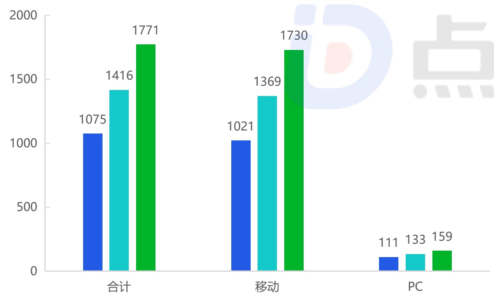
[image_caption]
这是一张柱状图，展示了不同类别下的数值对比。图表分为三个主要类别：“合计”、“移动”和“PC”，每个类别下有三个子类别的数据。

1. **合计**：
   - 蓝色柱状：1075
   - 浅蓝色柱状：1416
   - 绿色柱状：1771

2. **移动**：
   - 蓝色柱状：1021
   - 浅蓝色柱状：1369
   - 绿色柱状：1730

3. **PC**：
   - 蓝色柱状：111
   - 浅蓝色柱状：133
   - 绿色柱状：159

图表的纵轴表示数值，范围从0到2000。每个柱状的高度对应其数值大小，颜色区分不同的子类别。整体来看，绿色柱状在所有类别中数值最高，其次是浅蓝色，蓝色柱状数值最低。
[/image_caption]

2023年

2024年

国产游戏版号发布情况汇总

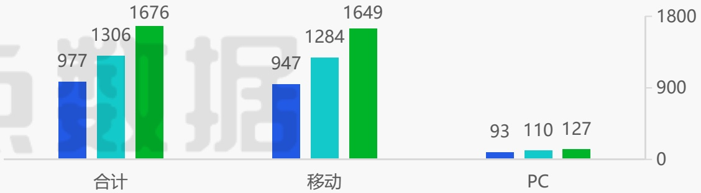
[image_caption]
这是一张柱状图，展示了不同类别下的数据对比。图表分为两大部分：合计和移动。

1. **合计**：
   - 蓝色柱状：977
   - 青色柱状：1306
   - 绿色柱状：1676

2. **移动**：
   - 蓝色柱状：947
   - 青色柱状：1284
   - 绿色柱状：1649

在右下角，还有一个小的柱状图，显示了PC类别的数据：
- 蓝色柱状：93
- 青色柱状：110
- 绿色柱状：127

纵轴的数值范围从0到1800，横轴分别标注了“合计”、“移动”和“PC”。每个柱状图的颜色对应不同的类别，蓝色、青色和绿色分别代表不同的数据系列。
[/image_caption]

进口游戏版号发布情况汇总

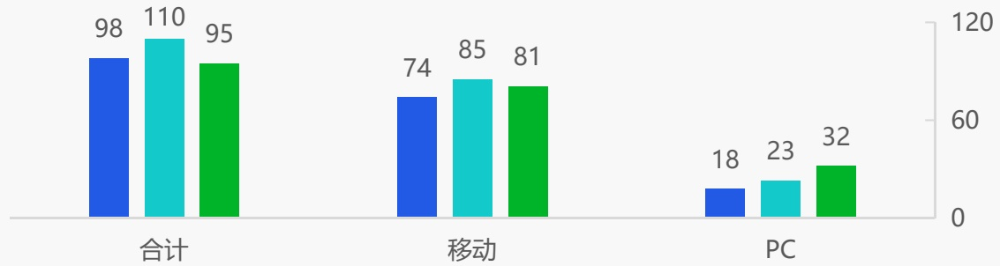
[image_caption]
这是一张柱状图，展示了不同类别下的数值对比。图表分为三个主要类别：合计、移动和PC。

1. **合计**：
   - 蓝色柱状表示98
   - 青色柱状表示110
   - 绿色柱状表示95

2. **移动**：
   - 蓝色柱状表示74
   - 青色柱状表示85
   - 绿色柱状表示81

3. **PC**：
   - 蓝色柱状表示18
   - 青色柱状表示23
   - 绿色柱状表示32

纵轴的数值范围从0到120，横轴分别对应“合计”、“移动”和“PC”三个类别。每个类别下有三个不同颜色的柱状，分别代表不同的数据点。整体来看，青色柱状在“合计”和“移动”类别中数值较高，而在“PC”类别中绿色柱状数值最高。
[/image_caption]

注释：因同一款游戏可能会获得多个不同平台的版号，所以会出现平台版号数量累加值大于获得版号的游戏总值的情况。

来源：国家新闻出版署。

## 中国移动游戏收入TOP榜

## 非头部厂商唯一生存路径——在极度细分的赛道中做到绝对精准与创新

2025年新入围榜单的4款游戏，它们的成功皆在于精准地捕捉并满足了某个特定用户群体未被充分满足的核心需求，并在玩法融合或题材表现上形成了足够的差异化壁垒。这些产品象征着市场在创新上的“毛细血管”仍未完全堵塞，行业仍保留着必要的多样性与活力；但这种模式难以驱动市场大盘增长，更多是巨头格局下的补充与点缀。

2024年

<table><tr><td>排名</td><td>icon</td><td>游戏名</td><td></td><td>排名</td><td>icon</td><td>游戏名</td><td>厂商</td><td>2025年流水预估(亿元)</td></tr><tr><td>1</td><td></td><td>王者荣耀</td><td>←</td><td>1</td><td></td><td>王者荣耀</td><td>腾讯</td><td>172.34</td></tr><tr><td>2</td><td></td><td>和平精英</td><td>←</td><td>2</td><td></td><td>和平精英</td><td>腾讯</td><td>86.84</td></tr><tr><td>3</td><td></td><td>地下城与勇士:起源</td><td>←</td><td>3</td><td></td><td>地下城与勇士:起源</td><td>腾讯</td><td>50.98</td></tr><tr><td>4</td><td></td><td>金铲铲之战</td><td></td><td>4</td><td></td><td>无尽冬日</td><td>点点互动</td><td>47.10</td></tr><tr><td>5</td><td></td><td>梦幻西游</td><td></td><td>5</td><td></td><td>三角洲行动</td><td>腾讯</td><td>45.68</td></tr><tr><td>6</td><td></td><td>英雄联盟手游</td><td></td><td>6</td><td></td><td>金铲铲之战</td><td>腾讯</td><td>38.48</td></tr><tr><td>7</td><td></td><td>穿越火线</td><td></td><td>7</td><td></td><td>梦幻西游</td><td>网易</td><td>37.90</td></tr><tr><td>8</td><td></td><td>逆水寒</td><td></td><td>8</td><td></td><td>穿越火线</td><td>腾讯</td><td>31.41</td></tr><tr><td>9</td><td></td><td>无尽冬日</td><td></td><td>9</td><td></td><td>火影忍者</td><td>腾讯</td><td>22.02</td></tr><tr><td>10</td><td></td><td>捕鱼大作战</td><td></td><td>10</td><td></td><td>英雄联盟手游</td><td>腾讯</td><td>20.73</td></tr><tr><td>11</td><td></td><td>三国志·战略版</td><td></td><td>11</td><td></td><td>第五人格</td><td>网易</td><td>16.41</td></tr><tr><td>12</td><td></td><td>原神</td><td></td><td>12</td><td></td><td>恋与深空</td><td>叠纸游戏</td><td>16.09</td></tr><tr><td>13</td><td></td><td>崩坏:星穹铁道</td><td></td><td>13</td><td></td><td>原神</td><td>米哈游</td><td>14.73</td></tr><tr><td>14</td><td></td><td>火影忍者</td><td></td><td>14</td><td></td><td>向僵尸开炮</td><td>海南畅梦科技</td><td>14.53</td></tr><tr><td>15</td><td></td><td>第五人格</td><td></td><td>15</td><td></td><td>捕鱼大作战</td><td>途游游戏</td><td>13.73</td></tr></table>

来源：中国移动游戏产品收入是综合了点点数据、企业财报、专家访谈，根据点点数据统计模型核算所得。

## 中国移动游戏2025年新品收入TOP榜

## 大厂仍然领头但产品数量骤减 中小厂在边缘创新中奋力突围

## 2025年中国移动游戏每季度新品全年收入TOP榜（仅App Store）（亿元）

## 2025Q1

燕云十六声

iOS流水：12.82

玩家评分：6.7

武侠·动作

英雄没有闪

iOS流水：10.41

玩家评分：6.1

放置·策略·养成

美职篮全明星

iOS流水：4.19

玩家评分：5.0

2K·篮球·竞技

龙之谷世界

iOS流水：4.02

玩家评分：4.5

3D·动作·还原

时光大爆炸

iOS流水：2.40

玩家评分：4.5

国风·种田·模拟

龙息：神寂

iOS流水：1.43

玩家评分：6.5

魔幻·策略·3D

## 2025Q2

杖剑传说

iOS流水：5.47

玩家评分：8.6

放置·冒险·竖屏

英勇之地

iOS流水：1.89

玩家评分：4.6

动作·刷宝·联机

永远的蔚蓝星球

iOS流水：4.84

玩家评分：5.9

塔防·合成·策略

雷霆战机：集结

iOS流水：1.43

玩家评分：6.3

街机·弹幕·射击

胜利女神：新的希望

iOS流水：2.10

玩家评分：7.2

二次元·卡牌·养成

全境守卫

iOS流水：0.72

玩家评分：6.9

塔防·割草·解压

## 2025Q3

无畏契约：源能行动

iOS流水：8.43

玩家评分：8.0

竞技·射击·动作

斗罗大陆：猎魂世界

iOS流水：1.41

玩家评分：6.8

IP·MMORPG

我的花园世界

iOS流水：2.90

玩家评分：6.5

国风·种田·休闲

奔奔王国

iOS流水：0.86

玩家评分：5.2

策略·SLG

灵兽大冒险

iOS流水：1.54

玩家评分：7.0

收集·宠物·养成

伊瑟

iOS流水：0.64

玩家评分：7.4

卡牌·策略·PVP

## 2025Q4

境·界刀鸣

iOS流水：1.09

玩家评分：8.4

动作·ARPG·IP

三国望神州

iOS流水：0.39

玩家评分：7.5

战旗·三国·国风

遗弃之地

iOS流水：0.50

玩家评分：4.9

策略·塔防

九牧之野

iOS流水：0.21

玩家评分：5.4

SLG·三国·战争

三国群英传：策定九州

iOS流水：0.48

评分：5.6

SLG·三国·战争

荒原曙光

iOS流水：0.19

玩家评分：4.9

沙盒·建造·生存

## 中国移动游戏市场新品收入占比

## 头部超级产品缺位致使新品整体收入大幅缩水

2025年新上线移动游戏市场收入占比从 \(18.9\%\) 骤降至 \(7.3\%\) ，这一数据或许会使得资本市场不再将新游作为短期财务增长引擎的预期。从往年新游TOP5名单可以看出，成功产品多依托于成熟的端游IP移植（如《逆水寒》《地下城与勇士》）、已验证的赛道融合（如《无尽冬日》）或强势的垂直品类（如《恋与深空》），其成功逻辑可以说是“确定性创新”。而到了2025年，市场环境使得这种“确定性”也在急剧减弱。高昂的研发与营销成本，迫使厂商在新项目立项上极度保守，倾向于在已有成功公式内进行微调，而非探索未知领域；同时，用户对范式化内容的厌倦加剧，使得缺乏真正颠覆性体验的产品即便制作精良，也难以引发广泛的付费热潮。但需要明确的是，在 \(7.3\%\) 的占比背后，同样也包含了大量中等规模新游的集体失声——它们既无法在品质上对标顶级大作，又无法在创意上形成稀缺性，最终在激烈的流量争夺中迅速沉寂。

2023-2025年新上线移动游戏在当年的市场收入规模占比（仅App Store）

[image_caption]
该图片展示的是一个饼图，用于表示不同年份（2023年、2024年、2025年）中某类应用或游戏在市场中的占比情况。每个饼图旁边列出了当年的TOP5新品。

### 2023年
- 占比：15.3%
- 当年新品TOP5：
  1. 逆水寒
  2. 崩坏：星穹铁道
  3. 晶核
  4. 冒险岛：枫之传说
  5. 合金弹头：觉醒

### 2024年
- 占比：18.9%
- 当年新品TOP5：
  1. 地下城与勇士：起源
  2. 无尽冬日
  3. 恋与深空
  4. 三国：谋定天下
  5. 向僵尸开炮

### 2025年
- 占比：1.5%
- 当年新品TOP5：
  1. 燕云十六声
  2. 英雄没有闪
  3. 无畏契约：源能行动
  4. 杖剑传说
  5. 永远的蔚蓝星球

饼图通过蓝色和白色区分了各年的占比，蓝色部分代表该年份的占比，白色部分代表剩余的占比。每年的饼图右侧还展示了当年的TOP5新品，每个新品都有对应的图标和名称。整体布局清晰，便于对比不同年份的市场表现和新品情况。
[/image_caption]

来源：点点数据自主研究及绘制

## 中国移动游戏下载量TOP榜

## 《三角洲行动》全年强势一举夺魁 《超自然行动》助力巨人重返榜单

《三角洲行动》作为FPS赛道的新入局者，即便是核心用户主要集中在PC端的情况下，依然在移动端下载量取得了霸榜的成绩，可见其针对移动场景的体验重构研发能力。而另一款值得关注的产品《超自然行动组》，是巨人网络继《球球大作战》后再次证明其对大众化、低门槛的实时社交轻竞技玩法拥有的深刻理解与运营底蕴。

2024年

<table><tr><td>排名</td><td>icon</td><td>游戏名</td><td>排名</td><td>icon</td><td>游戏名</td><td>厂商</td><td>2025年下载量预估（万次）</td></tr><tr><td>1</td><td></td><td>王者荣耀</td><td>1</td><td></td><td>三角洲行动</td><td>腾讯</td><td>6104.8</td></tr><tr><td>2</td><td></td><td>地下城与勇士：起源</td><td>2</td><td></td><td>王者荣耀</td><td>腾讯</td><td>4634.8</td></tr><tr><td>3</td><td></td><td>和平精英</td><td>3</td><td></td><td>和平精英</td><td>腾讯</td><td>3371.2</td></tr><tr><td>4</td><td></td><td>蛋仔派对</td><td>4</td><td></td><td>开心消消乐</td><td>乐元素</td><td>3124.3</td></tr><tr><td>5</td><td></td><td>开心消消乐</td><td>5</td><td></td><td>无畏契约：源能行动</td><td>腾讯</td><td>2217.5</td></tr><tr><td>6</td><td></td><td>金铲铲之战</td><td>6</td><td></td><td>蛋仔派对</td><td>网易</td><td>2067.1</td></tr><tr><td>7</td><td></td><td>第五人格</td><td>7</td><td></td><td>地下城与勇士：起源</td><td>腾讯</td><td>2015.4</td></tr><tr><td>8</td><td></td><td>欢乐钓鱼大师</td><td>8</td><td></td><td>金铲铲之战</td><td>腾讯</td><td>1812.0</td></tr><tr><td>9</td><td></td><td>颜色大作战</td><td>9</td><td></td><td>我的世界：移动版</td><td>网易</td><td>1635.8</td></tr><tr><td>10</td><td></td><td>元梦之星</td><td>10</td><td></td><td>燕云十六声</td><td>网易</td><td>1516.8</td></tr><tr><td>11</td><td></td><td>地铁跑酷</td><td>11</td><td></td><td>地铁跑酷</td><td>创梦天地</td><td>1326.4</td></tr><tr><td>12</td><td></td><td>我的世界：移动版</td><td>12</td><td></td><td>超自然行动组</td><td>巨人网络</td><td>1318.2</td></tr><tr><td>13</td><td></td><td>永劫无间</td><td>13</td><td></td><td>贪吃蛇大作战®</td><td>微派网络</td><td>1129.4</td></tr><tr><td>14</td><td></td><td>三角洲行动</td><td>14</td><td></td><td>腾讯欢乐斗地主</td><td>腾讯</td><td>1087.5</td></tr><tr><td>15</td><td></td><td>贪吃蛇大作战</td><td>15</td><td></td><td>迷你世界</td><td>迷你玩</td><td>1077.9</td></tr></table>

来源：中国移动游戏产品收入是综合了点点数据、企业财报、专家访谈，根据点点数据统计模型核算所得。

## 中国游戏行业投融资相关事件

## 市场短期无热点赛道致使投融资事件数量与新游戏公司数量双双锐减

回顾前两年，无论是2023年的AI技术扩散带来的“AI+游戏”军备竞赛，还是2024年互动影游、捉宠+种田、合成+SLG等玩法融合引发的规模化跟进，都为资本市场提供了相对明确的“叙事逻辑”和“对标对象”，资本可以基于对赛道增长潜力的预判进行下注，从而催生一批新公司与新产品。然而，2025年的游戏行业更像是市场挤出泡沫、回归商业本质的承上启下阶段。点点数据认为，当前资本市场的观望态度，是在用户增长见顶、流量成本高昂的背景下，对“下一轮技术或内容范式革命”的等待期。是AI驱动生成的真正动态游戏世界？是VR/AR硬件成熟带来的交互革命？还是某种尚未被定义的、融合了新型社交关系的玩法？在答案明朗之前，资本倾向于收缩泛化投资，转而进行更前沿、更基础、也更分散的“防御性”布局，这也解释了为何多次投资者占到了全年的 \(38\%\) 之多。

2025中国游戏行业投融资相关事件数据汇总

-24%

## 投融资事件数量

相较于2024年同比大幅下跌

-54%

## 新成立游戏公司数量

近三年新成立游戏公司数量分别为：110、85、39

## 投融资事件汇总

只包含公开投融资事件

## 每月事件数量

基于股权变更日期统计

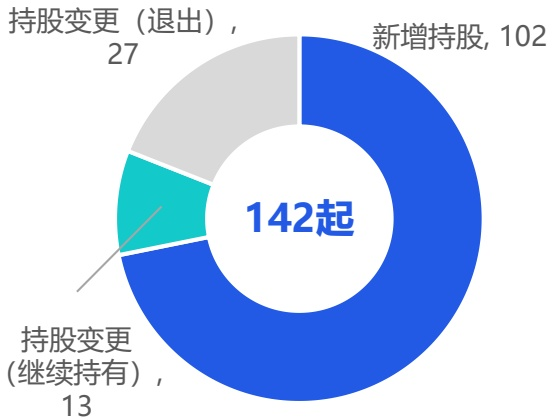
[image_caption]
这是一张饼图，展示了不同类型的持股变更情况。图表的主要信息如下：

- 新增持股：102起
- 持股变更（退出）：27起
- 持股变更（继续持有）：13起

总共有142起持股变更事件。饼图的不同颜色部分分别代表上述三种类型的变化，蓝色部分表示新增持股，灰色部分表示持股变更（退出），绿色部分表示持股变更（继续持有）。
[/image_caption]

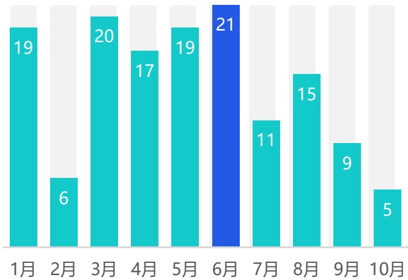
[image_caption]
这是一张柱状图，展示了从1月到10月的数值变化。每个柱子代表一个月的数据，柱子的颜色为青色和蓝色，其中6月的柱子为蓝色，其余为青色。具体数值如下：

- 1月：19
- 2月：6
- 3月：20
- 4月：17
- 5月：19
- 6月：21
- 7月：11
- 8月：15
- 9月：9
- 10月：5

图表显示了数值在不同月份的变化趋势，其中6月的数值最高，为21，而10月的数值最低，为5。整体来看，数值在年初较高，中间有波动，年末有所下降。
[/image_caption]

## 多次投资者

投资人全年投资2次及以上

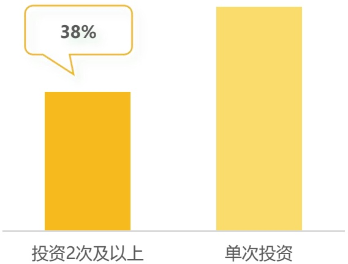
[image_caption]
这是一张柱状图，展示了两种投资类型的对比。左侧的柱子表示“投资2次及以上”，高度较低，上方有一个黄色对话框标注了38%。右侧的柱子表示“单次投资”，高度明显高于左侧，但没有具体数值标注。整体来看，单次投资的比例远高于投资2次及以上的情况。
[/image_caption]

注释：（1）基于GAMESHARK游鲨游戏圈的公开数据进行统计推算，其数据共计包含4012家游戏公司；（2）数据统计周期截止至2025年11月。

来源：GAMESHARK游鲨游戏圈。

## 目录 Contents

01

中国移动游戏市场现状分析

02

海外移动游戏市场现状分析

市场收入规模增长持续平缓，双平台下载量发生显著迁移；全新原创IP的大制作产品在2025几乎缺席；多地针对App Store开放第三方支付问题颁布相关法案。

03

移动游戏典型产品&企业案例分析

04

全球移动游戏市场发展趋势

## 海外移动游戏市场收入规模&下载量

## 市场收入规模增长持续平缓 双平台下载量发生显著迁移

2025年海外移动游戏市场的收入规模增长持续平缓，年增速维持在1%-2%的区间。与之相对的则是下载量的变化，其中双平台下载量的占比变化最为明显：Google Play的下载量份额从2022年的85%逐渐收缩至74%，而App Store则从15%攀升至26%，标志着高价值用户与核心市场注意力正加速向iOS生态聚集，这背后的形成原因或许是隐私政策变化、用户设备升级、平台营销能力等多方面的综合作用。对于游戏厂商而言，这直接影响了用户获取策略的一大方向——即需要大幅提升App Store的产品页面优化、本地化展示、争取编辑推荐等业务的重要性，甚至在部分地区应提高至与买量投放同等重要的战略高度。

2025年海外移动游戏市场收入规模 (亿元)

[image_caption]
这是一张柱状图，展示了2022年至2025年期间Google Play和App Store的市场数据及其整体增长率。图表的主要信息如下：

- **2022年**：
  - Google Play：2628.9
  - App Store：2558.7
  - 市场整体增长率：0.93%

- **2023年**：
  - Google Play：2597.4
  - App Store：2638.4
  - 市场整体增长率：1.15%

- **2024年**：
  - Google Play：2676.5
  - App Store：2619.6
  - 市场整体增长率：1.94%

- **2025年**：
  - Google Play：2690.3
  - App Store：2708.7

图表中，Google Play的数据用青色表示，App Store的数据用蓝色表示，市场整体增长率用绿色线条和点表示。从数据趋势来看，Google Play和App Store的市场数据在逐年增长，尤其是App Store的增长率在2025年达到了最高值。
[/image_caption]

2025年海外移动游戏市场下载量 (亿次)

[image_caption]
这是一张柱状图，展示了2022年至2025年期间Google Play和App Store的市场份额及其市场整体增长率。

1. **图表类型**：柱状图
2. **主要信息**：
   - **2022年**：
     - Google Play：619.2（占85%）
     - App Store：108.5（占15%）
     - 市场整体增长率：-6.21%
   - **2023年**：
     - Google Play：561.7（占85%）
     - App Store：120.8（占15%）
     - 市场整体增长率：1.44%
   - **2024年**：
     - Google Play：530.0（占74%）
     - App Store：162.3（占26%）
     - 市场整体增长率：5.42%
   - **2025年**：
     - Google Play：537.6（占74%）
     - App Store：192.2（占26%）

3. **数据趋势**：
   - Google Play的市场份额从2022年的85%逐渐下降到2025年的74%。
   - App Store的市场份额从2022年的15%逐渐上升到2025年的26%。
   - 市场整体增长率在2023年为正增长1.44%，并在2025年达到5.42%。

4. **颜色说明**：
   - 绿色条表示Google Play的市场份额。
   - 蓝色条表示App Store的市场份额。
   - 绿色线条表示市场整体增长率。

这张图表清晰地展示了Google Play和App Store在不同年份的市场份额变化以及市场整体的增长趋势。
[/image_caption]

注释：1、海外移动游戏市场统计包括所有在AppStore和GooglePlay上架的移动游戏产品（除中国大陆地区以外），不包含其他渠道或平台上的移动游戏产品；2、收入规模包含统计范围内用户消费的总金额，不包含广告变现、第三方充值等其他收入模式；3、本报告中后续涉及的“海外收入”相关的统计数据，都以此标准进行统计；4、部分数据可能会在点点数据2026年相关报告中做出调整。来源：海外游戏市场收入规模是综合了点点数据、企业财报、专家访谈，根据点点数据统计模型核算所得。

## 海外移动游戏收入TOP榜

## Supercell旗下又一老产品回归顶流《奔奔王国》成今年唯一上榜新品

纵观整体榜单，与往年相比，虽然排名次序上有些许变化，但上榜产品大都仍是熟悉的身影。其中最值得关注的当属《皇室战争》（Clash Royale）和《奔奔王国》（Kingshot）两款产品，它们分别代表了老产品系统性革新与新品的精准突袭两条不同的成功路径。在格局固化的全球市场中，新老产品的增长机会已然分化：老产品的复兴依赖于对核心进度、玩法与经济系统进行不惧风险的深度重构；而新品的突围则依赖于在已验证的模型上进行精准的微创新设计，并与饱和式的营销攻击高效协同。

(点点数据将在报告下一页对《皇室战争》《奔奔王国》两款产品展开具体分析。)

2025年海外移动游戏收入TOP30

<table><tr><td>排名</td><td>icon</td><td>游戏名</td><td>全年流水(亿元)</td><td>排名</td><td>icon</td><td>游戏名</td><td>全年流水(亿元)</td><td>排名</td><td>icon</td><td>游戏名</td><td>全年流水(亿元)</td></tr><tr><td>1</td><td>Last War:Survival</td><td>154.53</td><td>11</td><td colspan="2">实况足球</td><td>52.57</td><td>21</td><td>荒野乱斗</td><td>36.82</td><td></td><td></td></tr><tr><td>2</td><td>Royal Match</td><td>116.11</td><td>12</td><td colspan="2">怪物弹珠</td><td>50.33</td><td>22</td><td>Free Fire</td><td>36.35</td><td></td><td></td></tr><tr><td>3</td><td>无尽冬日</td><td>112.61</td><td>13</td><td colspan="2">皇室战争</td><td>46.40</td><td>23</td><td>王国之歌</td><td>33.28</td><td></td><td></td></tr><tr><td>4</td><td>大富翁GO!</td><td>100.45</td><td>14</td><td colspan="2">崩坏：星穹铁道</td><td>46.35</td><td>24</td><td>原神</td><td>33.02</td><td></td><td></td></tr><tr><td>5</td><td>金币大师</td><td>96.87</td><td>15</td><td colspan="2">梦幻花园</td><td>44.96</td><td>25</td><td>部落冲突</td><td>32.32</td><td></td><td></td></tr><tr><td>6</td><td>糖果粉碎传奇</td><td>95.71</td><td>16</td><td colspan="2">天堂M</td><td>44.82</td><td>26</td><td>使命召唤手游</td><td>32.30</td><td></td><td></td></tr><tr><td>7</td><td>宝可梦TCG Pocket</td><td>72.45</td><td>17</td><td colspan="2">奔奔王国</td><td>42.26</td><td>27</td><td>赛马娘</td><td>31.54</td><td></td><td></td></tr><tr><td>8</td><td>宝可梦GO</td><td>68.48</td><td>18</td><td colspan="2">Fate/Grand Order</td><td>41.35</td><td>28</td><td>Last Z: Survival Shooter</td><td>30.31</td><td></td><td></td></tr><tr><td>9</td><td>Roblox</td><td>66.53</td><td>19</td><td colspan="2">绝地求生M</td><td>41.20</td><td>29</td><td>Toon Blast</td><td>29.47</td><td></td><td></td></tr><tr><td>10</td><td>浪漫餐厅</td><td>53.95</td><td>20</td><td colspan="2">梦想城镇</td><td>38.96</td><td>30</td><td>文明霸业</td><td>28.89</td><td></td><td></td></tr></table>

来源：点点数据自主研究及绘制

## TOP榜产品《皇室战争》《奔奔王国》深度解析D点点数据

## 老产品复兴依赖不惧风险的深度重构 新品突围靠成熟模型下的微创新设计

## 皇室战争

Clash Royale

Supercell作为一家传奇的移动游戏开发商，其近年来的部分新品虽成绩不尽理想，但多款老产品焕发的“第二春”再次展现了其深厚的运营功力。继去年《荒野乱斗》通过商业化重做与英雄产出调整实现流水翻倍后，今年《皇室战争》的高位上榜，则是玩法创新与产出优化双轮驱动的结果。其核心在于进行了一场“系统性重生”：

一方面，游戏大幅提升了皇室征程（奖杯之路）的上限并引入全新高阶模式，彻底解决了老玩家缺乏长期目标的痛点，重构了进度追求生态；

另一方面，创新推出的“合成奇兵”模式，将自走棋的合成策略与IP角色结合，以低门槛、快节奏的新体验成功破圈，吸引了大量新老用户。

同时，游戏对经济系统进行了普惠性调整，将更多高级奖励下沉至广大中层玩家可触及的活动中，显著提升了整体的参与感与付费意愿。这套组合拳精准地激活了用户生态，让一款运营多年的产品重获增长动能。

2023-2025年《皇室战争》海外收入规模（亿元）

[image_caption]
这是一张柱状图，展示了2023年、2024年和2025年的数据对比。图表中有三个蓝色的柱子，分别对应这三个年份。2023年的值约为22，2024年的值约为22，2025年的值约为45。在2024年和2025年之间有一个红色的箭头，标注了94.8%的增长率。
[/image_caption]

来源：点点数据自主研究及绘制

## 奔奔王国

Kingshot

作为2025年唯一上榜的新品，《奔奔王国》的成功则体现了研发方点点互动在成熟赛道中极致高效的执行策略。其成功可归结于两点精准思路：

第一，成熟框架下的入口创新。该作并未冒险进行底层玩法颠覆，而是精准复用了旗下爆款《Whiteout Survival》已验证成功的“模拟经营+4X SLG”核心框架与变现模型。其真正的差异化在于对“入口”进行了轻度化改造，将易于上手、反馈即时的“塔防”玩法作为前期核心体验，大幅降低了传统SLG的入门门槛，有效吸引了泛用户群体。

第二，高度清晰的用户与市场定位。这既体现在其选取了与自家其他产品形成互补的中世纪题材与明快美术风格上，更贯穿于其“副玩法买量”的饱和式营销策略中。通过将买量素材高度聚焦于展示吸引人的塔防玩法，并借助工业化素材生产能力进行高强度投放，游戏快速穿透用户心智，完成了在红海市场的冷启动与用户积累。

2025年《奔奔王国》海外月收入规模（亿元）

[image_caption]
这是一张折线图，展示了从3月到12月的数据变化趋势。图表的横轴表示月份，从3月到12月依次排列；纵轴表示数值，范围从0到8。数据点如下：

- 3月：约0.5
- 4月：约1.5
- 5月：约2.5
- 6月：约3.5
- 7月：约4.5
- 8月：约5.5
- 9月：约6.0
- 10月：约6.0
- 11月：约6.0
- 12月：约6.5

从图中可以看出，数据在3月至8月期间呈上升趋势，8月达到峰值后在9月至11月保持稳定，12月略有回升。
[/image_caption]

## 海外移动游戏2025年新品收入TOP榜

## 全新原创的大制作在2025几乎缺席 IP是对冲市场不确定性的核心资产

回顾2024年的新品榜单，涌现了多款大制作、高期待、全新原创的重磅大作，如《绝区零》《鸣潮》《恋与深空》等。而2025年的新品头部阵营呈现出明显的“收敛”态势：《奔奔王国》《可狱不可囚》《吸血鬼》三款产品虽为原创IP，但他们的成功皆源于厂商对自身爆款产品框架的精准复用，其核心是成熟商业模型的优化与高效营销，而非玩法范式的颠覆；除此之外，其他上榜产品清一色是经典游戏IP的改编或重启。在用户获取成本高昂、市场注意力被长线运营产品牢牢固化的环境下，“IP情怀”与“已验证玩法模型的微创新”成为对冲市场不确定性、保障基础回报的最重要资产。新品不再被要求去凭空创造一个新世界，而是被期望能更安全、更高效地承接某个现有IP的粉丝情感，或满足某个已被验证的用户需求。

## 2025年海外移动游戏新品收入TOP榜

奔奔王国

全年流水：42.26亿元 点点互动

SD钢弹G世代永恒（日服）

全年流水：20.62亿元  
万代南梦宫

弓箭传说2

全年流水：17.48亿元海彼游戏

4

七骑士 Re:BIRTH

全年流水：15.86亿元  
网石游戏

5

枫之谷：放置冒险记

全年流水：14.26亿元 NEXON

6

洛奇M

全年流水：13.05亿元  
NEXON

7

吸血鬼

全年流水：12.10亿元网石游戏

8

RF ONLINE NEXT

全年流水：10.91亿元网石游戏

9

Disney Solitaire

全年流水：10.89亿元 SuperPlay

10

可狱不可囚

全年流水：8.89亿元益世界

11

暗影诗章：凌越世界

全年流水：8.58亿元 CyGames

12

SD钢弹G世代 永恒（国际服）

全年流水：8.39亿元  
万代南梦宫

13

19

全年流水：8.15亿元乐牛游戏

14

杖剑传说（港澳台新马服）

全年流水：7.73亿元 雷霆游戏

15

赛马娘（国际服）

全年流水：7.03亿元 CyGames

16

DC: Dark Legion

全年流水：6.04亿元 FunPlus

## 海外移动游戏市场新品收入占比

## 以务实策略校准新品预期 瞻准生态位进行资源配置

与中国移动游戏市场新品收入占比类似，海外新品的收入占比也处于下降态势，但下降力度较缓，这源于海外市场生态下的新品生态位相对稳固。仔细观察右图，如果剔除偶然出现的“超级爆款”《MONOPOLY GO!》后，近3年的TOP新品收入曲线（即对比绿色、青色、蓝色虚线三条曲线）高度接近。这意味着市场的新品容纳能力与增长模式已高度稳定化，呈现出明显的“基数稳固、尖峰难现”的成熟市场形态，超级爆款成为可遇不可求的“黑天鹅”，而绝大多数新品的成功被限制在一个可预测的区间内。这迫使厂商必须重新校准对新品的预期，更务实瞄准某个稳固的“生态位”进行产品设计和资源配置，追求健康的投资回报率，而非不计成本的规模神话。

新品收入占比

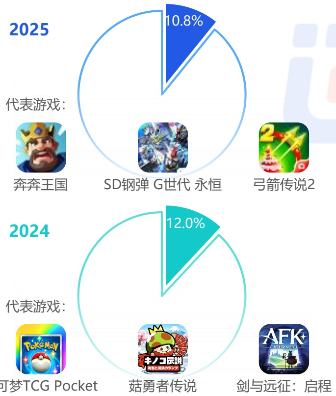
[image_caption]
该图像包含两个饼图，分别展示了2024年和2025年的代表游戏及其占比。

**2025年饼图：**
- 占比：10.8%
- 代表游戏：
  - 奔奔王国
  - SD钢弹 G世代 永恒
  - 弓箭传说2

**2024年饼图：**
- 占比：12.0%
- 代表游戏：
  - 可梦TCG Pocket
  - 菇勇者传说
  - 剑与远征：启程

每个饼图中，蓝色和青色的部分分别表示不同游戏的占比，其余部分为未标注的游戏。
[/image_caption]

2023-2025年新上线移动游戏在当年的市场收入规模分布

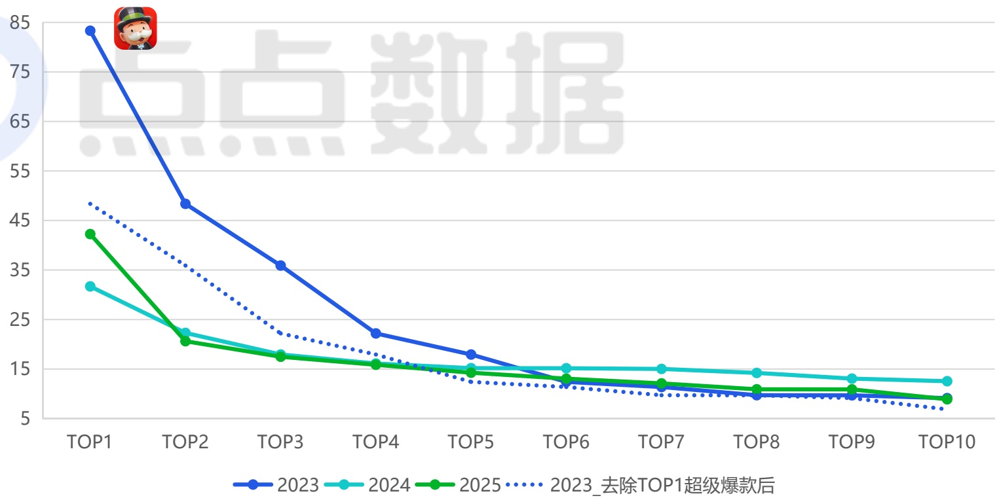
[image_caption]
这是一张折线图，展示了2023年至2025年期间不同排名（TOP1至TOP10）的数据变化趋势。图表的主要信息和数据趋势如下：

### 图表类型
- **折线图**

### 数据趋势
- **2023年**（蓝色实线）：从TOP1的85逐渐下降到TOP10的约7。
- **2024年**（青色实线）：从TOP1的30左右逐渐下降到TOP10的约12。
- **2025年**（绿色实线）：从TOP1的40左右逐渐下降到TOP10的约7。
- **2023_去除TOP1超级爆款后**（蓝色虚线）：从TOP1的约45逐渐下降到TOP10的约6。

### 具体数值
- **2023年**：
  - TOP1: 85
  - TOP2: 约45
  - TOP3: 约35
  - TOP4: 约23
  - TOP5: 约17
  - TOP6: 约15
  - TOP7: 约14
  - TOP8: 约13
  - TOP9: 约12
  - TOP10: 约7

- **2024年**：
  - TOP1: 约30
  - TOP2: 约23
  - TOP3: 约18
  - TOP4: 约15
  - TOP5: 约14
  - TOP6: 约15
  - TOP7: 约14
  - TOP8: 约14
  - TOP9: 约13
  - TOP10: 约12

- **2025年**：
  - TOP1: 约40
  - TOP2: 约23
  - TOP3: 约16
  - TOP4: 约15
  - TOP5: 约14
  - TOP6: 约14
  - TOP7: 约13
  - TOP8: 约12
  - TOP9: 约11
  - TOP10: 约7

- **2023_去除TOP1超级爆款后**：
  - TOP1: 约45
  - TOP2: 约35
  - TOP3: 约25
  - TOP4: 约18
  - TOP5: 约14
  - TOP6: 约12
  - TOP7: 约10
  - TOP8: 约9
  - TOP9: 约8
  - TOP10: 约6

### 总结
- **2023年**的数据在所有年份中最高，尤其是在TOP1的位置。
- **2024年**的数据相对平稳，没有显著的波动。
- **2025年**的数据在TOP1位置有显著提升，但整体趋势与2023年相似。
- **2023_去除TOP1超级爆款后**的数据在所有排名上都低于原始2023年的数据，显示出TOP1的超级爆款对整体数据的影响较大。

这张图表清晰地展示了不同年份和排名的数据变化趋势，特别是TOP1的超级爆款对整体数据的影响。
[/image_caption]

来源：点点数据自主研究及绘制

## 海外各地区移动游戏收入占比分布

## 美+日独占海外市场超50%份额 中国香港连续两年稳居TOP10

2025年海外移动游戏市场收入格局进一步固化，美国以1658.4亿元的规模占据绝对主导，仍是全球最高价值的战略区域。日本市场凭借1129.8亿元的收入稳居第二，其iOS收入占比接近7成，持续展现其作为高端市场的独特地位。综合报告前文海外整体的收入规模来看，美国+日本的收入规模已占据了全球超 \(50\%\) 的份额。排名第三的韩国市场占比约\(9.51\%\) ，其则是由Google Play贡献了近8成收入。值得注意的是，中国台湾与中国香港已连续两年双双稳定在TOP10，巩固了“港澳台地区”作为中国游戏厂商出海核心板块的战略价值。而以欧洲市场为主的第二梯队，虽然格局稳定且市场规模可观，但由于品类固化、本地化难以及最重要的买量成本居高不下，目前仍难以成为中国游戏厂商出海的主要锚点。

2025年海外各地区移动游戏收入分布

[image_caption]
这是一张柱状图，展示了不同国家和地区在AppStore和GooglePlay上的收入规模（单位：亿元）。图表的横轴表示不同的国家和地区，包括美国、日本、韩国、中国台湾、德国、英国、加拿大、法国、澳大利亚、中国香港和巴西。纵轴表示收入规模，范围从0到1000亿元。

具体数据如下：
- 美国：AppStore收入约为900亿元，GooglePlay收入约为750亿元。
- 日本：AppStore收入约为800亿元，GooglePlay收入约为350亿元。
- 韩国：AppStore收入约为100亿元，GooglePlay收入约为400亿元。
- 中国台湾：AppStore收入约为180亿元，GooglePlay收入约为80亿元。
- 德国：AppStore收入约为50亿元，GooglePlay收入约为150亿元。
- 英国：AppStore收入约为70亿元，GooglePlay收入约为100亿元。
- 加拿大：AppStore收入约为60亿元，GooglePlay收入约为50亿元。
- 法国：AppStore收入约为30亿元，GooglePlay收入约为70亿元。
- 澳大利亚：AppStore收入约为50亿元，GooglePlay收入约为40亿元。
- 中国香港：AppStore收入约为70亿元，GooglePlay收入约为50亿元。
- 巴西：AppStore收入约为10亿元，GooglePlay收入约为40亿元。

从图表中可以看出，美国和日本在两个平台上的收入规模显著高于其他国家和地区，而巴西的收入规模相对较低。AppStore的收入普遍高于GooglePlay。
[/image_caption]

[image_caption]
这是一张柱状图，展示了不同国家和地区在双平台上的总收入（单位：亿元）。图表的主要信息如下：

- **美国**：总收入最高，约为1700亿元。
- **日本**：总收入约为1200亿元。
- **韩国**：总收入约为500亿元。
- **中国台湾**：总收入约为300亿元。
- **德国**：总收入约为200亿元。
- **英国**：总收入约为150亿元。
- **加拿大**：总收入约为100亿元。
- **法国**：总收入约为80亿元。
- **澳大利亚**：总收入约为60亿元。
- **中国香港**：总收入约为50亿元。
- **巴西**：总收入最低，约为30亿元。

图表通过蓝色柱状条表示各国家和地区的总收入，横轴表示收入金额（单位：亿元），纵轴表示国家和地区名称。从图中可以看出，美国的总收入远高于其他国家和地区，而巴西的总收入最低。
[/image_caption]

来源：点点数据自主研究及绘制

## 美国移动游戏市场收入规模

## 玩家消费安全感直接影响不同生态位产品的营收潜力

对比下方数据，美国移动游戏市场收入规模与头部产品集中度呈现一定的负相关规律：当2024年市场收入萎缩 \(3.97\%\) 时，头部TOP10产品份额逆势攀升至 \(23.17\%\) ，结合当年美国宏观经济环境动荡的背景，玩家在这期间更倾向于“安全消费”，将时间与消费集中于社交生态稳固、试错风险低的头部产品；而在2023年、2025年市场收入有所增长时，头部份额回落至 \(21\%\) 左右，同时中腰部（11-200名）产品份额扩张至约 \(53\%\) ，表明一旦市场情绪稍缓，中国移动游戏玩家的探索意愿便会为具备差异化创新或卓越运营的“挑战者”开启时间窗口，市场的增量正由这些新晋或翻红的中腰部产品驱动。这一规律或许能为厂商提供一些战术方向：结合宏观经济预判玩家安全感预期，从而辅助决策当前战略核心应是深耕存量用户价值与运营效率还是推出重点新品争夺市场份额。

2025年美国移动游戏市场收入规模

[image_caption]
该图是一个柱状图和折线图结合的图表，展示了美国移动游戏市场收入规模及其增长率的变化情况。

### 图表类型
- **柱状图**：表示每年的市场收入规模（单位：亿元/人民币）。
- **折线图**：表示每年的市场收入增长率（单位：%）。

### 数据趋势
1. **2021年**
   - 市场收入规模：1740.0亿元/人民币
   - 增长率：3.25%

2. **2022年**
   - 市场收入规模：1648.6亿元/人民币
   - 增长率：-5.25%

3. **2023年**
   - 市场收入规模：1702.2亿元/人民币
   - 增长率：3.25%

4. **2024年**
   - 市场收入规模：1634.5亿元/人民币
   - 增长率：-3.97%

5. **2025年**
   - 市场收入规模：1658.4亿元/人民币
   - 增长率：1.46%

### 主要信息
- **市场收入规模**：从2021年的1740.0亿元/人民币开始，经历了一段下降（2022年为1648.6亿元/人民币），随后在2023年回升至1702.2亿元/人民币，之后再次下降（2024年为1634.5亿元/人民币），并在2025年略有回升至1658.4亿元/人民币。
- **增长率**：2021年和2023年增长率为正（3.25%），而2022年和2024年为负增长（-5.25%和-3.97%），2025年增长率为正（1.46%）。

### 图例
- **蓝色柱状图**：表示美国移动游戏市场收入规模（亿元/人民币）。
- **青色折线图**：表示增长率（%）。
[/image_caption]

来源：点点数据自主研究及绘制

2025年美国移动游戏市场收入集中度

[image_caption]
该图像展示了一张柱状图，详细比较了2023年、2024年和2025年不同收入排名区间的移动游戏收入占比情况。图表分为四个颜色区域，分别代表：

- 蓝色（1-10名收入占比）
- 青色（11-50名收入占比）
- 绿色（51-200名收入占比）
- 橙色（其他移动游戏收入占比）

具体数据如下：

### 2025年
- 1-10名收入占比：20.92%
- 11-50名收入占比：23.32%
- 51-200名收入占比：29.12%
- 其他移动游戏收入占比：26.64%

### 2024年
- 1-10名收入占比：23.17%
- 11-50名收入占比：22.76%
- 51-200名收入占比：27.68%
- 其他移动游戏收入占比：26.39%

### 2023年
- 1-10名收入占比：21.41%
- 11-50名收入占比：25.74%
- 51-200名收入占比：28.12%
- 其他移动游戏收入占比：24.73%

从数据趋势来看：
- 1-10名收入占比在2024年达到最高值23.17%，随后在2025年略微下降至20.92%。
- 11-50名收入占比在2023年达到最高值25.74%，2024年略有下降至22.76%，2025年回升至23.32%。
- 51-200名收入占比在2025年达到最高值29.12%，显示出这一区间收入的显著增长。
- 其他移动游戏收入占比在2025年为26.64%，略高于2024年的26.39%和2023年的24.73%。

图表下方展示了五款不同类型的移动游戏图标，包括角色扮演、消除类、策略类、模拟经营和老虎机类游戏，直观地展示了这些游戏的视觉风格和类型特点。
[/image_caption]

## 美国移动游戏收入TOP榜

## AppStore开放第三方支付渠道将市场从“平台中心化”推向“服务多元化”

2025年美国移动游戏市场最大的变化莫过于法院判决强制苹果AppStore开放第三方支付渠道，此规则变革的核心在于打破了支付环节的绝对绑定，将市场从“平台中心化”推向“服务多元化”。典型如总收入榜第8的《Roblox》，看似其通过App Store和Google Play两大传统渠道产生的收入大幅下滑，但结合市场公开情报，Roblox在2025年的运营情况可谓再创新高，这说明了第三方支付的开放实则赋予了其前所未有的战略灵活性。然而换个视角来看，《堡垒之夜》时隔五年后重返美国AppStore并迅速跻身新品畅销榜前列，也印证了政策变动并未削弱App Store作为主流应用商店的核心地位，反而凸显了其作为顶级流量入口的不可替代性。

2025年美国移动游戏收入TOP榜

<table><tr><td>排名</td><td>icon</td><td>游戏名</td><td>厂商</td><td>全年流水（亿元）</td><td>同比增长率</td></tr><tr><td>1</td><td colspan="2">MONOPOLY GO!</td><td>Scopely</td><td>75.21</td><td>-24.20%</td></tr><tr><td>2</td><td colspan="2">Royal Match</td><td>Dream Games</td><td>50.94</td><td>-14.23%</td></tr><tr><td>3</td><td colspan="2">糖果粉碎传奇</td><td>King</td><td>45.89</td><td>-3.95%</td></tr><tr><td>4</td><td colspan="2">Last War:Survival</td><td>First Fun</td><td>44.15</td><td>59.56%</td></tr><tr><td>5</td><td colspan="2">金币大师</td><td>Moon Active</td><td>27.80</td><td>3.38%</td></tr><tr><td>6</td><td colspan="2">无尽冬日</td><td>点点互动</td><td>23.50</td><td>3.82%</td></tr><tr><td>7</td><td colspan="2">宝可梦GO</td><td>Niantic</td><td>21.41</td><td>1.80%</td></tr><tr><td>8</td><td colspan="2">Roblox</td><td>Roblox</td><td>20.66</td><td>-50.21%</td></tr><tr><td>9</td><td colspan="2">皇室战争</td><td>Supercell</td><td>19.10</td><td>120.14%</td></tr><tr><td>10</td><td colspan="2">Township</td><td>Playrix</td><td>18.26</td><td>2.79%</td></tr></table>

2025年美国移动游戏收入新品TOP榜

<table><tr><td>排名</td><td>icon</td><td>游戏名</td><td>厂商</td><td>全年流水(亿元)</td><td>总榜排名</td><td>上线时间</td></tr><tr><td>1</td><td></td><td>奔奔王国</td><td>点点互动</td><td>14.54</td><td>12</td><td>2025年2月</td></tr><tr><td>2</td><td></td><td>Disney Solitaire</td><td>SuperPlay</td><td>5.35</td><td>63</td><td>2025年4月</td></tr><tr><td>3</td><td></td><td>弓箭传说2</td><td>HABBY</td><td>4.83</td><td>69</td><td>2025年1月</td></tr><tr><td>4</td><td></td><td>赛马娘（国际服）</td><td>Cygames</td><td>4.42</td><td>82</td><td>2025年6月</td></tr><tr><td>5</td><td></td><td>DC: Dark Legion</td><td>FunPlus</td><td>3.60</td><td>102</td><td>2025年3月</td></tr><tr><td>6</td><td></td><td>Screwdom</td><td>Zego</td><td>2.91</td><td>124</td><td>2025年1月</td></tr><tr><td>7</td><td></td><td>可狱不可囚</td><td>益世界</td><td>2.79</td><td>129</td><td>2025年3月</td></tr><tr><td>8</td><td></td><td>枫之谷：放置冒险日记</td><td>NEXON</td><td>2.19</td><td>158</td><td>2025年10月</td></tr><tr><td>9</td><td></td><td>堡垒之夜</td><td>Epic Games</td><td>2.01</td><td>177</td><td>2025年5月</td></tr><tr><td>10</td><td></td><td>帕萌战斗日记</td><td>莉莉丝</td><td>1.65</td><td>207</td><td>2025年1月</td></tr></table>

来源：点点数据自主研究及绘制

## 日本移动游戏市场收入规模

## 应用侧载与第三方支付相关法案于年末正式落地生效

2025年，日本移动游戏市场在总收入达到1129.8亿元、实现4.21%的同比增长。日本移动游戏玩家的“情感羁绊”与“社群归属”始终是比单纯玩法更重要的付费核心与运营壁垒，老牌产品能持续产生高额流水，其成功远超游戏性本身，根植于长期构建的角色故事、声优阵容、同人文化及玩家间的社群认同。需特别指出的是，日本《智能手机特定软件竞争促进法》已于2015年12月18日正式生效，与美国类似，该法案也同样要求平台开放应用侧载、允许第三方支付系统接入以及提供选择界面等。长远来看，这必将改变现有的渠道格局，为游戏厂商在日本市场带来新的分发与支付选择。

2025年日本移动游戏市场收入规模

[image_caption]
该图是一个柱状图和折线图结合的图表，展示了日本移动游戏市场收入规模及其增长率的变化情况。

**图表类型**：柱状图 + 折线图

**主要信息**：
- **X轴**：表示年份，从2021年到2025年。
- **Y轴**：左侧表示日本移动游戏市场收入规模（单位：亿元/人民币），右侧表示增长率（单位：%）。
- **蓝色柱状图**：显示每年的市场收入规模。
  - 2021年：1418.6亿元
  - 2022年：1056.5亿元
  - 2023年：1064.1亿元
  - 2024年：1084.2亿元
  - 2025年：1129.8亿元
- **绿色折线图**：显示每年的增长率。
  - 2021年到2022年：-25.53%
  - 2022年到2023年：0.72%
  - 2023年到2024年：1.89%
  - 2024年到2025年：4.21%

**数据趋势**：
- 市场收入规模在2021年达到峰值后，2022年出现显著下降，随后逐年缓慢增长。
- 增长率在2022年为负增长，之后逐渐转为正增长，并且增速逐年加快。
[/image_caption]

来源：点点数据自主研究及绘制

2025年日本移动游戏市场收入集中度

[image_caption]
该图像展示了一张水平堆叠条形图，用于比较2023年、2024年和2025年不同收入排名区间的移动游戏收入占比。图表分为四个颜色区域，分别代表：

- 蓝色（1-10名收入占比）
- 青色（11-50名收入占比）
- 绿色（51-200名收入占比）
- 橙色（其他移动游戏收入占比）

具体数据如下：

**2025年：**
- 1-10名收入占比：27.60%
- 11-50名收入占比：31.45%
- 51-200名收入占比：23.95%
- 其他移动游戏收入占比：17.01%

**2024年：**
- 1-10名收入占比：27.33%
- 11-50名收入占比：31.06%
- 51-200名收入占比：24.06%
- 其他移动游戏收入占比：17.55%

**2023年：**
- 1-10名收入占比：29.72%
- 11-50名收入占比：27.87%
- 51-200名收入占比：24.69%
- 其他移动游戏收入占比：17.72%

图表下方展示了五款不同类型的移动游戏图标，包括：
1. 一款色彩鲜艳的卡通风格游戏。
2. 一款以皮卡丘为主题的卡片游戏。
3. 一款动漫风格的角色扮演游戏。
4. 一款足球主题的体育游戏。
5. 一款机甲风格的科幻游戏。

整体来看，1-10名和11-50名的收入占比在三年间变化不大，而51-200名和其他移动游戏的收入占比略有波动。
[/image_caption]

## 日本移动游戏收入TOP榜

## “IP改编”与“玩法驱动”双轨竞争

作为二次元文化大国，以《宝可梦TCG Pocket》（收入增长 \(122.37\%\) ）和《Fate/Grand Order》（增长 \(22.23\%\) ）为代表的顶级IP产品依旧展现了经典IP无与伦比的持久号召力与商业化潜力。但另一方面，以《Last War:Survival》（增长 \(50.23\%\) ）和《无尽冬日》（增长 \(54.85\%\) ）为代表的、凭借玩法融合与高强度运营取胜的产品也成功跻身头部，印证了日本玩家对创新玩法与持续内容更新的接纳度正在提高。这种“双轨竞争的市场态势，同样反映在了新品榜单中：《SD钢弹G世代永恒》凭借强大的经典IP空降榜首，而点点互动的《奔奔王国》则依靠成熟的“X+SLG”框架成功打开市场。

2025年日本移动游戏收入TOP榜

<table><tr><td>排名</td><td>icon</td><td>游戏名</td><td>厂商</td><td>全年流水(亿元)</td><td>同比增长率</td></tr><tr><td>1</td><td>32</td><td>怪物弹珠</td><td>XFLAG</td><td>50.33</td><td>-14.03%</td></tr><tr><td>2</td><td>33</td><td>Fate/Grand Order</td><td>Aniplex</td><td>41.35</td><td>22.23%</td></tr><tr><td>3</td><td>34</td><td>Last War:Survival</td><td>First Fun</td><td>35.23</td><td>50.23%</td></tr><tr><td>4</td><td>35</td><td>宝可梦TCG Pocket</td><td>The Pokemon Company</td><td>34.41</td><td>122.37%</td></tr><tr><td>5</td><td>36</td><td>赛马娘</td><td>Cygames</td><td>31.54</td><td>-18.40%</td></tr><tr><td>6</td><td>37</td><td>eFootball</td><td>KONAMI</td><td>27.03</td><td>19.89%</td></tr><tr><td>7</td><td>38</td><td>崩坏：星穹铁道</td><td>米哈游</td><td>25.03</td><td>9.45%</td></tr><tr><td>8</td><td>39</td><td>智龙迷城</td><td>GungHo</td><td>23.24</td><td>-21.51%</td></tr><tr><td>9</td><td>40</td><td>无尽冬日</td><td>点点互动</td><td>22.08</td><td>54.85%</td></tr><tr><td>10</td><td>41</td><td>勇者斗恶龙 Walk</td><td>SQUARE ENIX</td><td>21.59</td><td>-2.37%</td></tr></table>

2025年日本移动游戏收入新品TOP榜

<table><tr><td>排名</td><td>icon</td><td>游戏名</td><td>厂商</td><td>全年流水(亿元)</td><td>总榜排名</td><td>上线时间</td></tr><tr><td>1</td><td colspan="2">SD钢弹 G世代 永恒</td><td>万代南梦宫</td><td>20.62</td><td>11</td><td>2025年4月</td></tr><tr><td>2</td><td colspan="2">暗影诗章: 凌越世界</td><td>Cygames</td><td>7.73</td><td>28</td><td>2025年6月</td></tr><tr><td>3</td><td colspan="2">魔法少女小圆 Magia Exedra</td><td>Aniplex</td><td>4.89</td><td>43</td><td>2025年3月</td></tr><tr><td>4</td><td colspan="2">奔奔王国</td><td>点点互动</td><td>3.50</td><td>60</td><td>2025年2月</td></tr><tr><td>5</td><td colspan="2">女神异闻录:夜幕魅影</td><td>SEGA</td><td>3.36</td><td>61</td><td>2025年6月</td></tr><tr><td>6</td><td colspan="2">弓箭传说2</td><td>海彼游戏</td><td>3.10</td><td>67</td><td>2025年1月</td></tr><tr><td>7</td><td colspan="2">杖剑传说</td><td>Boltray Games</td><td>2.92</td><td>72</td><td>2025年7月</td></tr><tr><td>8</td><td colspan="2">怪兽8号 THE GAME</td><td>Akatsuki Games</td><td>2.31</td><td>91</td><td>2025年8月</td></tr><tr><td>9</td><td colspan="2">Disney Solitaire</td><td>SuperPlay</td><td>2.01</td><td>104</td><td>2025年4月</td></tr><tr><td>10</td><td colspan="2">王者天下霸道</td><td>万代南梦宫</td><td>1.31</td><td>138</td><td>2025年10月</td></tr></table>

来源：点点数据自主研究及绘制

## 韩国移动游戏市场收入规模

## 社会动荡未影响游戏行业根基 政策推动下巨头厂商集体发力

尽管2025年韩国遭遇了宪政震荡、外部贸易冲击、医生罢工、半导体产业被制裁等动荡，导致消费者信心指数一度骤降，但移动游戏市场总收入仍实现了513.6亿元的规模，维持了微弱的正增长。这一“韧性”表现，固然离不开韩国移动游戏玩家极成熟的游戏行为与消费惯性，更深层次看，2025年韩国政府对游戏产业的定位也发生了历史性转变：从过去的严格管控转向主动扶持与正名，为产业提供了关键的政策缓冲。韩国总统公开宣称“游戏是文化产业的核心组成部分”，并废除了严苛的事前审查制度，大幅提升了游戏发行效率和透明度，也间接鼓励了游戏厂商加大投入与发行力度。这使得以NEXON、网石游戏为首的韩国本土巨头在2025年集中发力，罕见地推出了等多款基于经典端游IP改编的重磅MMORPG新品，以其高确定性的吸引力，在不确定的经济环境下形成了强大的供给刺激。

2025年韩国移动游戏市场收入规模

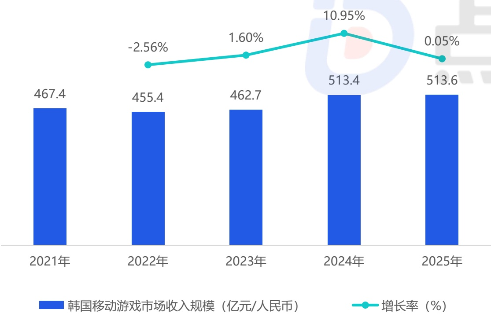
[image_caption]
该图表为柱状图与折线图的组合，展示了韩国移动游戏市场收入规模及其增长率的变化趋势。

**主要信息与数据趋势：**

- **时间范围**：2021年至2025年。
- **收入规模（亿元/人民币）**：
  - 2021年：467.4亿元
  - 2022年：455.4亿元（较2021年下降）
  - 2023年：462.7亿元（较2022年回升）
  - 2024年：513.4亿元（显著增长）
  - 2025年：513.6亿元（略有增长）

- **增长率（%）**：
  - 2021年至2022年：-2.56%（下降）
  - 2022年至2023年：1.60%（回升）
  - 2023年至2024年：10.95%（大幅增长）
  - 2024年至2025年：0.05%（微幅增长）

**整体趋势**：
- 韩国移动游戏市场收入规模在2021年至2022年间出现小幅下降，随后在2023年和2024年逐步回升，并在2024年达到峰值513.4亿元。2025年收入略有增长，但仍保持在较高水平。
- 增长率在2022年为负增长，但在2023年转为正增长，并在2024年达到最高点10.95%，显示出市场的强劲复苏和增长势头。2025年的增长率则趋于平稳，仅为0.05%。
[/image_caption]

来源：点点数据自主研究及绘制

2025年韩国移动游戏市场收入集中度

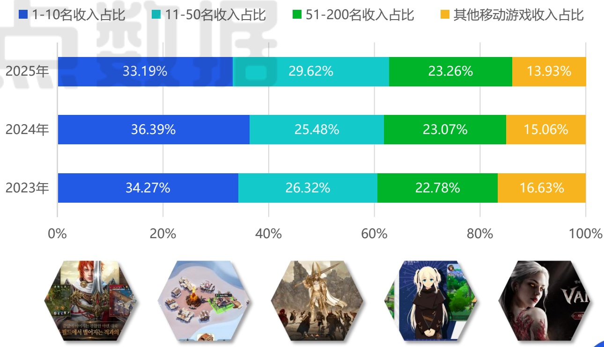
[image_caption]
该图像展示了一张柱状图，详细比较了2023年、2024年和2025年不同收入排名区间的移动游戏收入占比。图表分为四个颜色区域，分别代表：

- 蓝色（1-10名收入占比）
- 青色（11-50名收入占比）
- 绿色（51-200名收入占比）
- 橙色（其他移动游戏收入占比）

具体数据如下：

**2025年：**
- 1-10名收入占比：33.19%
- 11-50名收入占比：29.62%
- 51-200名收入占比：23.26%
- 其他移动游戏收入占比：13.93%

**2024年：**
- 1-10名收入占比：36.39%
- 11-50名收入占比：25.48%
- 51-200名收入占比：23.07%
- 其他移动游戏收入占比：15.06%

**2023年：**
- 1-10名收入占比：34.27%
- 11-50名收入占比：26.32%
- 51-200名收入占比：22.78%
- 其他移动游戏收入占比：16.63%

图表下方展示了五款游戏的图标，分别为：
1. 左侧第一款游戏图标，显示一位红发角色。
2. 第二款游戏图标，显示一个类似基地或城市的场景。
3. 第三款游戏图标，显示一位身穿盔甲的角色。
4. 第四款游戏图标，显示一位金发角色。
5. 右侧最后一款游戏图标，显示一位白发女性角色。

整体来看，1-10名收入占比在三年间略有波动，但总体保持较高水平；11-50名收入占比相对稳定；51-200名收入占比变化不大；其他移动游戏收入占比则逐年下降。
[/image_caption]

## 韩国移动游戏收入TOP榜

## 新品占据收入榜单超半数历史罕见 单一品类爆发提前释放了玩家需求

韩国移动游戏收入榜呈现出一个历史罕见的现象：TOP10产品中超半数席位被新品占据，并且新品几乎清一色是MMORPG品类，同时多为韩国经典端游IP的改编或重启之作。同一公司在一年内“祭出”多款同赛道下的重磅产品自我竞争，显然背后有不可撼动的力量在推动；但辩证的来看，新品能历史罕见的“清洗”收入榜单，也说明韩国移动游戏市场仍充满了生命力与竞争力，来自中国游戏厂商乐牛游戏的《I9》跻身TOP10就是最好的印证之一。另一方面值得注意的是，对比往年榜单中放置、休闲、体育等多品类开花的局面，2025年的韩国手游市场产品结构显著收缩。点点数据认为这种围绕MMORPG的结构收缩更像是一种过度消耗，其他细分品类或在未来两年反而有机会释放出更大市场潜力。

2025年韩国移动游戏收入TOP榜

<table><tr><td>排名</td><td>icon</td><td>游戏名</td><td>厂商</td><td>全年流水（亿元）</td><td>同比增长率</td></tr><tr><td>1</td><td>M</td><td>天堂M</td><td>NCSOFT</td><td>44.82</td><td>-20.72%</td></tr><tr><td>2</td><td></td><td>无尽冬日</td><td>点点互动</td><td>24.74</td><td>72.62%</td></tr><tr><td>3</td><td>X2</td><td>Last War:Survival</td><td>First Fun</td><td>23.62</td><td>-29.98%</td></tr><tr><td>4</td><td>DIN</td><td>奥丁：神判</td><td>Kakao Games</td><td>13.79</td><td>-32.45%</td></tr><tr><td>5</td><td>Rabbit</td><td>洛奇M</td><td>NEXON</td><td>13.05</td><td>2025年新品</td></tr><tr><td>6</td><td>Vnetmable</td><td>吸血鬼</td><td>网石游戏</td><td>12.10</td><td>2025年新品</td></tr><tr><td>7</td><td>netmable</td><td>七骑士 Re:BIRTH</td><td>网石游戏</td><td>11.33</td><td>2025年新品</td></tr><tr><td>8</td><td>RF netmable</td><td>RF ONLINE NEXT</td><td>网石游戏</td><td>10.45</td><td>2025年新品</td></tr><tr><td>9</td><td colspan="2">枫之谷：放置冒险记</td><td>NEXON</td><td>8.41</td><td>2025年新品</td></tr><tr><td>10</td><td></td><td>I9</td><td>乐牛游戏</td><td>8.15</td><td>2025年新品</td></tr></table>

2025年韩国移动游戏收入新品TOP榜

<table><tr><td>排名</td><td>icon</td><td>游戏名</td><td>厂商</td><td>全年流水(亿元)</td><td>总榜排名</td><td>上线时间</td></tr><tr><td>1</td><td>Bukidn</td><td>洛奇M</td><td>NEXON</td><td>13.05</td><td>5</td><td>2025年3月</td></tr><tr><td>2</td><td>Vnetmable</td><td>吸血鬼</td><td>网石游戏</td><td>12.10</td><td>6</td><td>2025年8月</td></tr><tr><td>3</td><td>netmable</td><td>七骑士 Re:BIRTH</td><td>网石游戏</td><td>11.33</td><td>7</td><td>2025年5月</td></tr><tr><td>4</td><td>RFnetmable</td><td>RF ONLINE NEXT</td><td>网石游戏</td><td>10.45</td><td>8</td><td>2025年3月</td></tr><tr><td>5</td><td colspan="2">枫之谷:放置冒险记</td><td>NEXON</td><td>8.41</td><td>9</td><td>2025年10月</td></tr><tr><td>6</td><td colspan="2">I9</td><td>乐牛游戏</td><td>8.15</td><td>10</td><td>2025年1月</td></tr><tr><td>7</td><td colspan="2">奔奔王国</td><td>点点互动</td><td>4.91</td><td>19</td><td>2025年2月</td></tr><tr><td>8</td><td colspan="2">尤弥尔传奇</td><td>娱美德</td><td>4.57</td><td>21</td><td>2025年2月</td></tr><tr><td>9</td><td colspan="2">不休旅途:绘卷世界</td><td>4399</td><td>4.11</td><td>22</td><td>2025年4月</td></tr><tr><td>10</td><td colspan="2">缔造者:放逐之地</td><td>DRIMAGE</td><td>2.27</td><td>44</td><td>2025年10月</td></tr></table>

来源：点点数据自主研究及绘制

## 港澳台移动游戏市场收入规模

## “头部稳定、腰部增强”的竞争格局形成均衡的市场驱动力

2025年港澳台移动游戏市场收入规模达到364.6亿元，几乎追平2021年的历史高点。更为重要的是，市场收入集中度数据揭示了其健康、分散的竞争结构：2023年至2025年间，头部TOP10产品的收入占比稳定在 \(23\% - 24\%\) 之间，未有明显扩张；与此同时，占据市场中坚力量的11-50名产品份额则从 \(26.82\%\) 稳步提升至 \(28.34\%\) 。这种“头部稳定、腰部增强”的格局，与日、韩等市场头部效应加剧的趋势形成鲜明对比，说明港澳台市场的增长驱动力相对均衡，并未被少数超级应用垄断，为中腰部产品的创新与生存留下了可观的空间。市场的韧性正源于此——它不是依靠一两款“爆款”的脉冲式拉动，而是建立在玩家稳定的付费习惯、多元的品类需求以及厂商持续稳定的内容供给之上。

2025年港澳台移动游戏市场收入规模

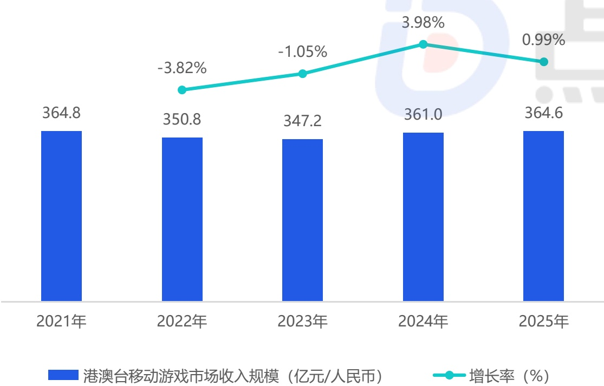
[image_caption]
该图像为柱状图和折线图的组合，展示了港澳台移动游戏市场收入规模及其增长率的变化趋势。

### 图表类型
- **柱状图**：表示每年的市场收入规模（单位：亿元/人民币）。
- **折线图**：表示每年的市场增长率（单位：%）。

### 数据描述
#### 市场收入规模（柱状图）
- **2021年**：364.8亿元
- **2022年**：350.8亿元
- **2023年**：347.2亿元
- **2024年**：361.0亿元
- **2025年**：364.6亿元

#### 增长率（折线图）
- **2021年到2022年**：-3.82%
- **2022年到2023年**：-1.05%
- **2023年到2024年**：3.98%
- **2024年到2025年**：0.99%

### 趋势分析
- **市场收入规模**：从2021年的364.8亿元开始，2022年和2023年有所下降，分别降至350.8亿元和347.2亿元。但从2024年开始回升至361.0亿元，并在2025年进一步增长至364.6亿元。
- **增长率**：2021年至2022年和2022年至2023年呈现负增长，分别为-3.82%和-1.05%。2023年至2024年出现显著正增长，达到3.98%，随后2024年至2025年增长放缓至0.99%。

### 图例
- **蓝色柱状**：港澳台移动游戏市场收入规模（亿元/人民币）
- **青绿色折线**：增长率（%）
[/image_caption]

来源：点点数据自主研究及绘制

2025年港澳台移动游戏市场收入集中度

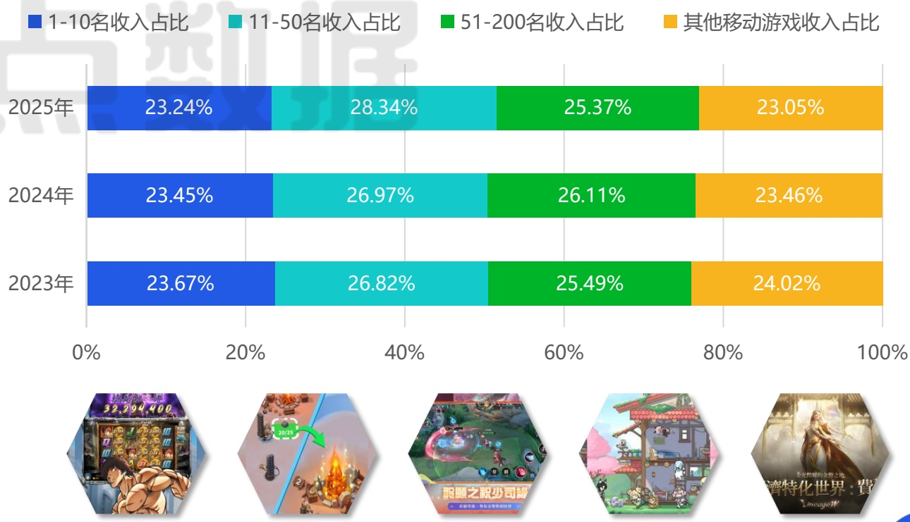
[image_caption]
该图像展示了一张柱状图，详细比较了2023年、2024年和2025年不同收入排名区间的移动游戏收入占比情况。图表分为四个颜色区域，分别代表：

- 蓝色（1-10名收入占比）
- 青色（11-50名收入占比）
- 绿色（51-200名收入占比）
- 橙色（其他移动游戏收入占比）

具体数据如下：

### 2025年
- 1-10名收入占比：23.24%
- 11-50名收入占比：28.34%
- 51-200名收入占比：25.37%
- 其他移动游戏收入占比：23.05%

### 2024年
- 1-10名收入占比：23.45%
- 11-50名收入占比：26.97%
- 51-200名收入占比：26.11%
- 其他移动游戏收入占比：23.46%

### 2023年
- 1-10名收入占比：23.67%
- 11-50名收入占比：26.82%
- 51-200名收入占比：25.49%
- 其他移动游戏收入占比：24.02%

从数据趋势来看：
- 1-10名收入占比在三年间变化不大，略有波动。
- 11-50名收入占比逐年增加，从2023年的26.82%上升到2025年的28.34%。
- 51-200名收入占比也呈现上升趋势，从2023年的25.49%增长到2025年的25.37%。
- 其他移动游戏收入占比相对稳定，略有下降。

图表下方展示了五款游戏的截图，分别为：
1. 一款老虎机类游戏，显示金额为32,294,400。
2. 一款角色扮演游戏，带有火焰效果。
3. 一款多人在线战斗竞技场（MOBA）类游戏，显示“巅峰之巅少司命”字样。
4. 一款像素风格的游戏，场景中有建筑物和角色。
5. 一款奇幻风格的游戏，标题为“特化世界：费”。

整体而言，该图表清晰地展示了不同收入排名区间移动游戏的收入占比变化趋势，并通过游戏截图直观地呈现了相关游戏的视觉元素。
[/image_caption]

## 港澳台移动游戏收入TOP榜

## 轻量化游戏出海港澳台的红利消退具备深度玩法的产品更获市场青睐

港澳台移动游戏收入榜宛如一面镜子映照市场的复杂构成：榜首是深耕本地多年的博彩类游戏《星城Online》；紧随其后的是大陆出海SLG的成功代表《寒霜启示录》；同时，全球性的IP产品如《宝可梦TCG Pocket》《天堂》《SD钢弹 G世代 永恒》等也在同台竞技。这种“本土产品、大陆出海、国际大作”三分天下的局面标志着市场的多元与成熟。但这其中也伴随着残酷的筛选：轻量化小游戏出海港澳台的红利期正在终结，市场偏好明确转向至玩法更具深度的产品。新品收入榜中，除《不休旅途：绘卷世界》外，传统意义上的轻度游戏已难觅踪影。取而代之的是如《杖剑传说》《奔奔王国》《七骑士 Re:BIRTH》等，这些产品要么本身是玩法融合的中重度游戏，要么是带有强IP和深养成线的作品。

2025年港澳台移动游戏收入TOP榜

<table><tr><td>排名</td><td>icon</td><td>游戏名</td><td>厂商</td><td>全年流水(亿元)</td><td>同比增长率</td></tr><tr><td>1</td><td>星城Online</td><td>星城Online</td><td>Wanin International</td><td>15.33</td><td>14.63%</td></tr><tr><td>2</td><td>寒霜启示录</td><td>点点互动</td><td>12.42</td><td>49.54%</td><td></td></tr><tr><td>3</td><td>最后的战争</td><td>First Fun</td><td>11.31</td><td>-21.17%</td><td></td></tr><tr><td>4</td><td>Garena 传说对决</td><td>Gerena</td><td>10.38</td><td>14.28%</td><td></td></tr><tr><td>5</td><td>杖剑传说</td><td>雷霆游戏</td><td>7.40</td><td>2025年新品</td><td></td></tr><tr><td>6</td><td>天堂W</td><td>NCSOFT</td><td>6.06</td><td>-6.85%</td><td></td></tr><tr><td>7</td><td>天堂M</td><td>NCSOFT</td><td>5.98</td><td>-3.39%</td><td></td></tr><tr><td>8</td><td>宝可梦 TCG Pocket</td><td>The Pokemon Company</td><td>5.87</td><td>36.91%</td><td></td></tr><tr><td>9</td><td>SD钢弹 G世代 永恒</td><td>万代南梦宫</td><td>5.02</td><td>2025年新品</td><td></td></tr><tr><td>10</td><td>崩坏：星穹铁道</td><td>米哈游</td><td>4.93</td><td>-10.59%</td><td></td></tr></table>

2025年港澳台移动游戏收入新品TOP榜

<table><tr><td>排名</td><td>icon</td><td>游戏名</td><td>厂商</td><td>全年流水(亿元)</td><td>总榜排名</td><td>上线时间</td></tr><tr><td>1</td><td colspan="2">杖剑传说</td><td>雷霆游戏</td><td>7.40</td><td>5</td><td>2025年7月</td></tr><tr><td>2</td><td colspan="2">SD钢弹 G世代 永恒</td><td>万代南梦宫</td><td>5.02</td><td>9</td><td>2025年4月</td></tr><tr><td>3</td><td colspan="2">奔奔王国</td><td>点点互动</td><td>4.35</td><td>15</td><td>2025年2月</td></tr><tr><td>4</td><td colspan="2">不休旅途：绘卷世界</td><td>4399</td><td>3.51</td><td>19</td><td>2025年3月</td></tr><tr><td>5</td><td colspan="2">枫之谷：放置冒险记</td><td>NEXON</td><td>2.67</td><td>28</td><td>2025年10月</td></tr><tr><td>6</td><td colspan="2">七骑士 Re:BIRTH</td><td>网石游戏</td><td>1.62</td><td>45</td><td>2025年9月</td></tr><tr><td>7</td><td colspan="2">RO仙境传说：曙光</td><td>GRAVITY</td><td>1.53</td><td>47</td><td>2025年7月</td></tr><tr><td>8</td><td colspan="2">时光杂货店</td><td>绝妙游戏M</td><td>1.42</td><td>50</td><td>2025年1月</td></tr><tr><td>9</td><td colspan="2">尸鬼三国</td><td>天游网络</td><td>1.36</td><td>52</td><td>2025年2月</td></tr><tr><td>10</td><td colspan="2">第七天炎</td><td>Funforge</td><td>1.24</td><td>55</td><td>2025年5月</td></tr></table>

来源：点点数据自主研究及绘制

## 目录 Contents

01

中国移动游戏市场现状分析

02

海外移动游戏市场现状分析

03

移动游戏典型产品&企业案例分析

《燕云十六声》：以独特历史切口形成独特市场定位，从备受质疑到全球破圈的逆袭之路；心动网络：理想主义底色下的“不着急”与长线定力。

04

全球移动游戏市场发展趋势

## 典型移动游戏产品案例分析：《燕云十六声》

## 以独特历史切口形成独特市场定位 从备受质疑到全球破圈的逆袭之路

《燕云十六声》自诞生之初便确立了极具挑战性的市场定位：一款以写实风格呈现、聚焦于中国五代十国至宋初历史背景的武侠开放世界游戏。然而，这一高辨识度的定位在初期也为产品带来了巨大争议。上线前，外界普遍对武侠题材能否在全球市场获得广泛共鸣持怀疑态度，游戏在国内社区甚至一度因早期形象被调侃为“村口黄毛”。开服后，舆论也呈现两极分化：一方面，其精良的画面、深厚的历史底蕴和沉浸式的开放世界获得了核心用户的赞誉；另一方面，战斗手感、部分系统设计以及“单人+多人”融合模式的初期不成熟，也引发了广泛的讨论和批评。

但公测后不久，《燕云十六声》凭借扎实的内容迅速积累了用户口碑，实现了数据与口碑的“双逆转”。游戏在短期内接连突破1500万、3000万乃至4000万玩家大关，成为网易近年来增长速度最快的产品之一。更具标志性意义的是其全球版本（2025年11月）的上线，游戏在未开放国区的情况下，横扫欧美多地区Steam畅销榜前十，最高同时在线人数突破25万，Steam好评率稳定在89%以上，并登陆全球超60个市场的App Store免费榜榜首。这一从“不被看好”到“全球破圈”的历程，验证了其差异化定位在经过高品质打磨后，所具备的跨越文化壁垒的潜力。

2025年《燕云十六声》中国日活跃用户数（仅App Store）

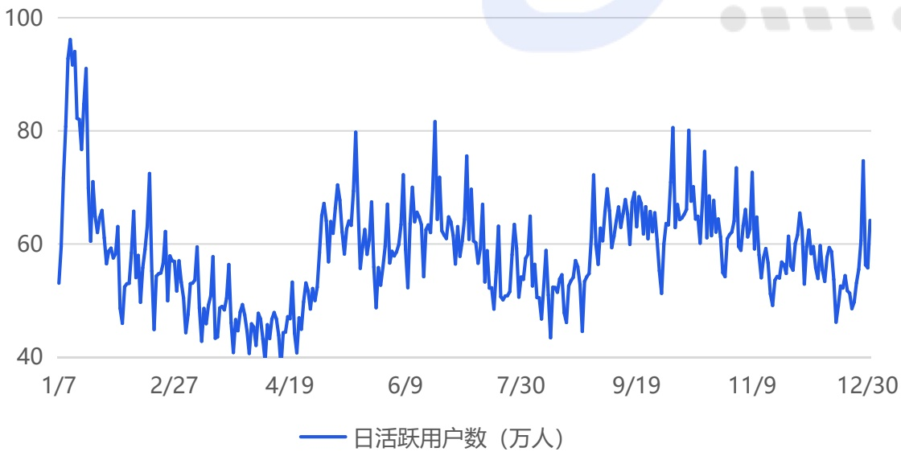
[image_caption]
这是一张折线图，展示了日活跃用户数（单位：万人）随时间变化的趋势。图表的横轴表示时间，从1月7日到12月30日，纵轴表示日活跃用户数，范围从40万人到100万人。折线图显示了用户数的波动情况，整体趋势在不同时间段内有上升和下降的波动。具体数值无法从图中直接读取，但可以看出用户数在某些日期有明显的高峰和低谷。
[/image_caption]

2025年《燕云十六声》中国月流水（仅App Store）

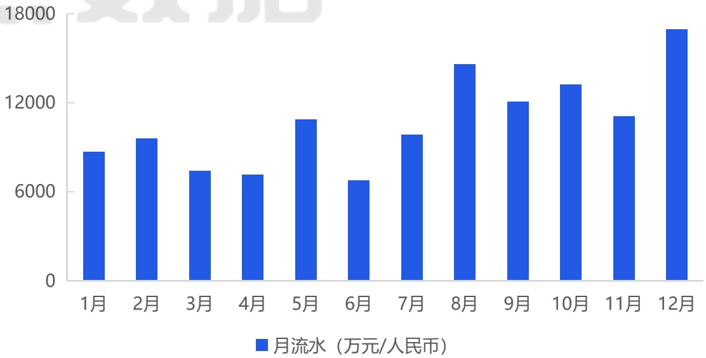
[image_caption]
这是一张柱状图，展示了某公司在一年中每个月的月流水（单位：万元/人民币）。图表的横轴表示月份，从1月到12月；纵轴表示月流水金额，范围从0到18000万元。

具体数据如下：
- 1月：约7000万元
- 2月：约8000万元
- 3月：约6500万元
- 4月：约6500万元
- 5月：约11000万元
- 6月：约6000万元
- 7月：约7500万元
- 8月：约14000万元
- 9月：约12000万元
- 10月：约13000万元
- 11月：约11500万元
- 12月：约18000万元

从图表中可以看出，月流水在不同月份之间有显著波动。其中，12月的月流水最高，达到约18000万元；6月的月流水最低，约为6000万元。整体趋势显示，月流水在下半年有明显的上升趋势，尤其是在12月达到了峰值。
[/image_caption]

来源：点点数据自主研究及绘制

## 典型移动游戏产品案例分析：《燕云十六声》

## 在商业模式、玩法创新、体验纯粹性上的取舍与代价

## 商业模式的“克制与激进”

《燕云十六声》采用了“纯外观付费”模式，坚决不售卖数值。但点点数据通过多方资料确认，其活跃用户与商业化表现已超项目组的原有预期，也验证了这条路径的健康与可持续性。这一选择的代价是放弃了短期爆发式营收的可能性，将盈利完全寄予玩家对内容与情感的长期认同。

通过解除“数值枷锁”，确保了所有玩家（无论付费与否）的核心体验公平与自由，从而维护了开放世界探索与武侠代入感的纯粹性，这被玩家和厂商共同视为游戏长期生命力的根本。

## 游戏玩法的“危险融合”

《燕云十六声》开创了“单人沉浸体验+多人社交要素”的融合模式。这在游戏初期确实因设计的不够成熟而被玩家评论为“体验拧巴”。且这种模式增加了巨大的设计复杂度和调优成本，且需要同时满足单机玩家与网游玩家两类群体的不同预期，风险极高。

但项目组坚持这一方向的探索，因为“江湖”的本质既有个体的孤独修行，也有门派势力的纷争与合作。后续通过优化联机体验、新增支持好友共建的家园社交功能等，正在逐步将这一独特模式打磨的更为完善。

## 体验至上的“大胆放弃”

“每日任务”可以说是当代网络游戏用以维持日活、提升用户留存的关键设计。但《燕云十六声》大胆放弃了这一系统，其初心在于避免玩家产生上线焦虑，让他们能真正“放慢脚步”体验江湖。其代价是可能损失一部分追求明确短期目标的用户留存数据。

反之，游戏用高质量、可自由探索的“奇遇”系统和持续更新的主线/支线内容来替代重复性任务，用内在的探索驱动力代替外在的数值激励，以此吸引和留住那些追求沉浸感的“志同道合”者。

来源：点点数据自主研究及绘制

## 典型移动游戏产品案例分析：《杖剑传说》

## 基于项目组擅长品类精准挖掘出“轻度MMO”的细分蓝海赛道

《杖剑传说》是一款在放置游戏的极简框架内，深度融入MMO的核心社交与成长体验，从而形成一款“足够轻度的MMO”。这种设计即摒除了传统MMO手游为了追求重度体验和用户粘性进行的复杂设计，导致玩家负担沉重；又解决了纯粹的放置游戏因内容单薄难以满足玩家对深度互动和长期目标的追求感缺失问题。《杖剑传说》并非对传统MMO做减法，而是在放置休闲的基底上，系统地增加组队副本、职业分工、公会社交等MMO的经典元素。这一定位精准命中了大量渴望MMO社交与成长乐趣，但受限于时间精力、无法承受高强度日常任务的“泛用户”与“时间碎片化用户”，开辟了一片竞争相对缓和的蓝海市场。在《厦门吉比特网络技术股份有限公司2025年第三季度报告》中，公司海外游戏业务营收同比大幅增长 \(59.46\%\) ，其中《杖剑传说》被明确为主要贡献者。（如右图所示）

## 本年第三季度较第二季度环比变动说明：

（1）本年第三季度营业收入、归属于上市公司股东的净利润较本年第二季度大幅增加，主要系：①《杖剑传说（大陆版）》《道友来挖宝》于2025年5月上线，本年第三季度运营了完整周期，营业收入及利润环比均大幅增加；②《杖剑传说（境外版）》于2025年7月上线，贡献增量营业收入及利润。此外，《问道手游》本年第二季度的九周年庆活动取得较好效果，第三季度营业收入及利润较第二季度下滑。

2025年《杖剑传说》全球日流水（万元）

[image_caption]
这是一张折线图，展示了从2023年5月29日至12月31日期间四个不同类别数据的变化趋势。图表的纵轴表示数值，范围从0到1,600；横轴表示时间，以每周为单位。

### 图表描述：

#### 1. **图表类型**：
   - 这是一张**折线图**，用于展示随时间变化的数据趋势。

#### 2. **图例说明**：
   - **三服合计**（青绿色区域）：表示所有服务的总和。
   - **国服（仅App Store）**（蓝色折线）：表示仅在App Store上的国服数据。
   - **繁中服**（黄色折线）：表示繁体中文服务器的数据。
   - **日服**（橙色折线）：表示日服的数据。

#### 3. **数据趋势分析**：

   - **三服合计**（青绿色区域）：
     - 整体趋势在7月中旬达到峰值，接近1,600，随后逐渐下降，至12月底降至约200左右。
     - 在7月中旬之前，数值较低，波动较小，但在7月中旬后显著上升，形成一个高峰，之后持续下降。

   - **国服（仅App Store）**（蓝色折线）：
     - 数值相对较低，整体波动较小，最高点出现在7月中旬，接近400，随后逐渐下降，至12月底降至约100左右。
     - 在7月中旬之前，数值较为平稳，之后随着“三服合计”的上升而有所增加，但幅度较小。

   - **繁中服**（黄色折线）：
     - 数值介于国服和日服之间，整体波动较大，最高点出现在7月中旬，接近800，随后逐渐下降，至12月底降至约100左右。
     - 在7月中旬之前，数值较低且波动较小，之后随着“三服合计”的上升而显著增加，但波动较大。

   - **日服**（橙色折线）：
     - 数值最低，整体波动较小，最高点出现在7月中旬，接近400，随后逐渐下降，至12月底降至约50左右。
     - 在7月中旬之前，数值较为平稳，之后随着“三服合计”的上升而有所增加，但幅度较小。

#### 4. **关键时间节点**：
   - **7月中旬**：所有类别的数据均达到峰值，尤其是“三服合计”和“繁中服”。
   - **12月底**：所有类别的数据均降至最低点，表明整体趋势为下降。

#### 5. **总结**：
   - 整体来看，“三服合计”在7月中旬达到最高点，随后逐渐下降，至12月底降至最低。
   - “国服（仅App Store）”和“日服”的数值相对较低，波动较小，而“繁中服”则表现出较大的波动性。
   - 所有类别的数据在12月底均降至最低点，表明整体趋势为下降。
[/image_caption]

来源：点点数据自主研究及绘制

## 典型移动游戏产品案例分析：《杖剑传说》

## “放置为表、MMO为里”，并通过IP联动将两者紧密藕合

《杖剑传说》在表层体验上，采用竖屏设计，主打“睡觉也能变强”的经典放置逻辑，以及探索地图、触发随机事件的轻度解谜玩法，极大降低了日常参与门槛。其核心的深层体验在于将MMORPG内核巧妙的编织进放置玩法的框架中。首先，游戏构建了一套深度策略性的战斗与养成体系。战斗采用半即时指令队列，玩家需要预先搭配8个主动与被动技能，策略核心在于技能组合与装备词条的BD构建，数百个技能形成的组合搭配从根源上保证了玩法的长期可探索性。其次，游戏保留了MMO的核心社交驱动。虽然个人放置挂机完全独立，但高收益的副本挑战鼓励甚至依赖玩家组队进行。游戏中“大佬带本”文化普遍，结合公会系统，成功复刻了传统MMO中基于协作的社交乐趣与归属感，这是保障留存与流水的关键所在。另一方面值得注意的是，《杖剑传说》在上线之后保持了高频的IP联动，平均每2个月便有一次新的联动活动上线，且这些IP都更偏向于核心二次元受众。同时得益于游戏纯2D的小清新美术风格在与二次元IP结合时拥有高适配性和低违和感，使得联动内容能快速落地并有效转化IP粉丝。

《杖剑传说》公测仅半年多就已实装了多个联动活动

杖剑传说 \(\times\) 蔬菜精灵

公测同步开启联动

来源：点点数据自主研究及绘制

杖剑传说 \(\mathsf{x}\) 为美好的世界献上祝福

公测2个月后

杖剑传说×洛天依×言和

公测4个月后

杖剑传说 x 罗小黑战记2

公测6个月后

## 典型移动游戏企业案例分析：心动网络

## 从“妖”产品到“妖”平台的独特气质

心动网络在游戏业务上始终散发出一种独特的“妖”气，这体现在其产品总能在看似非主流的设计中，精准捕捉并放大某种极致的用户乐趣。这种“妖”并非偶然，而是一种经过市场验证的差异化策略。从早期的《天天打波利》便定下基调，它主打“不花钱也能玩得爽”，以反常规的商业化姿态吸引了大量厌倦“Pay to Win”的玩家。随后的《不休的乌拉拉》则更具开创性，它将重度社交与放置玩法结合，首创“组队挂机”模式，以极强的社交链接+极低的社交负担进行反差融合，解决了传统放置游戏看似轻松实则耗时又耗力的痛点，成功开辟了新赛道。即便是近两年的《心动小镇》，将“轻量化模拟经营”与“随机邂逅”结合，既创造了低门槛、充满新鲜感的碎片化社交可能，又完全尊重了“社恐”玩家专注于自家花园的“单机”权利，实现了独特的“社交自由”。这些产品共同的特质是：它们不追求最大公约数的普适性，也不盲目堆砌最流行的元素，而是深入挖掘并满足一个具体、真实但未被充分重视的用户需求（如轻社交、爽放置、无压力养成等），并以一种风格鲜明、甚至有些“古怪”的方式呈现出来，最终形成令人意想不到的市场穿透力。

这种“妖”的气质同样渗透到了其平台业务TapTap中，并在此形成了更宏大的商业逻辑。TapTap最“妖”之处在于其“不联运、零分成”的商业模式，这直接挑战了游戏渠道依靠高额流水分成的金科玉律。这种理想主义的选择，使其迅速成为大量独立开发者和创新产品的首发与聚集地，构建了以内容发现和社区讨论为核心、而非以商业榜单为导向的独特平台文化。然而，它的“妖”更在于，这种看似“不赚钱”的承诺，反而成就了其极佳的经营状况。根据心动网络财报显示，TapTap凭借高毛利的广告模式，盈利能力非常健康。其核心在于，零分成策略吸引了最优质、最具差异化的游戏内容，这些内容又吸引了中国最核心、最活跃的硬核玩家群体。这个高质量的用户池，构成了TapTap高价值、高粘性的流量基础，使其广告变现效率远超传统渠道。

因此，心动的“妖”是一个从产品到平台的完整闭环：自研的“妖”游戏为TapTap提供独家内容与差异化吸引力；TapTap“妖”的平台规则则反哺整个开发生态，并为心动自身游戏提供了零成本、高转化的首发阵地和敏锐的用户洞察前沿。创始人的理想主义设定了方向，而公司精密的商业化运营与闭环设计，则让这种“妖”气质得以在现实商业世界中健康成长，而非空中楼阁。

## 典型移动游戏企业案例分析：心动网络

## 理想主义底色下的“不着急”与长线定力

心动网络的战略方向，深刻烙印着创始人黄一孟的理想主义色彩，这种色彩并非不切实际的空想，而是一种塑造了公司独特节奏与长期定力的核心哲学。在组织管理上，这种理想主义曾达到令人咋舌的极致：公司一度取消全员奖金，转而提供业内顶级的固定薪酬；推行无限假期；甚至为主动离职的员工提供高达六个月的“致意金”。这一系列反行业惯例的举措，其内核是极致的信任文化，旨在将员工从短期KPI和内部竞争中解放出来，专注于产品本身的热爱与长期价值。虽然部分激进制度后期因实际运营挑战而调整，但其精神遗产——对创意人才的尊重、对透明沟通的坚持、以及对“赛马内耗”的厌恶——已深入组织骨髓，这与他们做出的那些不循常规的“妖”产品在精神上一脉相承。

在产品和商业战略上，这种理想主义则表现为一种“不着急”的从容感。长期以来，心动自研游戏线常被市场诟病“单薄”、“依赖爆款”，但公司似乎并未因此陷入焦虑，去盲目扩张团队或追逐市场风口。相反，它表现出一种罕见的耐心：持续发行众多商业回报有限的买断制手游，扶持独立游戏；即便在TapTap已成为优质渠道后，也未将其简单变为榨取流量的工具，而是克制地维持广告模式，捍卫开发者生态。近几年，这种长期主义的坚持开始迎来系统性收获：《出发吧麦芬》《心动小镇》《伊瑟》等游戏的接连成功，证明其聚焦“长青化”、在优势赛道持续深耕的方法论愈发成熟。

这并非短期冲刺的结果，而是在一个独特系统支撑下的自然生长。TapTap作为“零分成”的独特渠道，是这一战略的基石。它让心动不必为了短期营收最大化而扭曲游戏设计，可以为了创新和用户体验牺牲部分短期利益；它提供了一个直接、纯净的玩家反馈环，让“妖”的产品创意能有被看见和验证的机会。因此，心动的战略给人一种“明明有机会赚快钱，却选择了更远的路”的印象。这份选择，正是创始人对“创造美好作品、构建健康生态”的理想主义坚持，这份坚持为公司抵御短期诱惑、执行长线战略提供了最根本的底气与支撑。

2025年心动网络旗下部分游戏国服月流水（仅App Store）

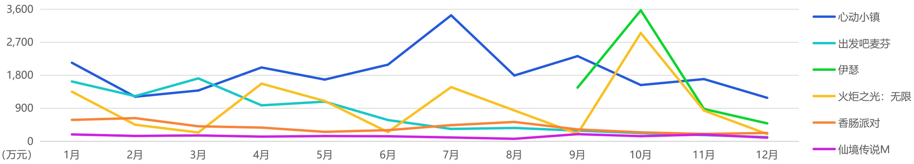
[image_caption]
这是一张折线图，展示了不同项目在一年中每个月的数值变化。图表的纵轴表示金额（单位：万元），横轴表示月份（从1月到12月）。图例中列出了七个项目的名称及其对应的颜色：

- 心动小镇（蓝色）
- 出发吧麦芬（青色）
- 伊瑟（绿色）
- 火炬之光：无限（黄色）
- 香肠派对（橙色）
- 仙境传说M（紫色）

### 数据趋势分析：

1. **心动小镇**：
   - 1月：约1800万元
   - 2月：约1500万元
   - 3月：约1700万元
   - 4月：约1900万元
   - 5月：约1700万元
   - 6月：约1900万元
   - 7月：约2900万元
   - 8月：约1800万元
   - 9月：约2000万元
   - 10月：约2100万元
   - 11月：约1800万元
   - 12月：约1500万元

2. **出发吧麦芬**：
   - 1月：约1700万元
   - 2月：约1200万元
   - 3月：约1700万元
   - 4月：约1000万元
   - 5月：约800万元
   - 6月：约500万元
   - 7月：约300万元
   - 8月：约400万元
   - 9月：约200万元
   - 10月：约100万元
   - 11月：约100万元
   - 12月：约100万元

3. **伊瑟**：
   - 1月：约100万元
   - 2月：约100万元
   - 3月：约100万元
   - 4月：约100万元
   - 5月：约100万元
   - 6月：约100万元
   - 7月：约100万元
   - 8月：约100万元
   - 9月：约1700万元
   - 10月：约3000万元
   - 11月：约900万元
   - 12月：约500万元

4. **火炬之光：无限**：
   - 1月：约1000万元
   - 2月：约600万元
   - 3月：约200万元
   - 4月：约1700万元
   - 5月：约900万元
   - 6月：约200万元
   - 7月：约1500万元
   - 8月：约800万元
   - 9月：约100万元
   - 10月：约2800万元
   - 11月：约900万元
   - 12月：约200万元

5. **香肠派对**：
   - 1月：约500万元
   - 2月：约600万元
   - 3月：约400万元
   - 4月：约400万元
   - 5月：约300万元
   - 6月：约300万元
   - 7月：约400万元
   - 8月：约500万元
   - 9月：约200万元
   - 10月：约100万元
   - 11月：约100万元
   - 12月：约100万元

6. **仙境传说M**：
   - 1月：约100万元
   - 2月：约100万元
   - 3月：约100万元
   - 4月：约100万元
   - 5月：约100万元
   - 6月：约100万元
   - 7月：约100万元
   - 8月：约100万元
   - 9月：约100万元
   - 10月：约100万元
   - 11月：约100万元
   - 12月：约100万元

### 主要信息：
- **心动小镇**在7月达到峰值，约为2900万元，之后有所下降。
- **出发吧麦芬**在年初表现较好，但随后逐渐下降，至10月后几乎不再有显著数值。
- **伊瑟**在9月和10月有显著增长，分别达到1700万元和3000万元。
- **火炬之光：无限**在4月和10月有两次显著增长，分别为1700万元和2800万元。
- **香肠派对**在年初表现较好，但随后逐渐下降，至10月后几乎不再有显著数值。
- **仙境传说M**在整个年度中数值相对稳定，保持在100万元左右。

这张折线图清晰地展示了各个项目在不同月份的销售或表现情况，有助于分析各项目的市场表现和季节性变化。
[/image_caption]

来源：点点数据自主研究及绘制

## 目录 Contents

01

中国移动游戏市场现状分析

02

海外移动游戏市场现状分析

03

移动游戏典型产品&企业案例分析

04

全球移动游戏市场发展趋势

小游戏与APP正在重新构建“多端协同”战略；即便是存量竞争时代买量仍是最主要的获客手段；2026年手游关键词：大世界捉宠+自动化基建。

## 小游戏与APP正在重新构建“多端协同”战略

## 小游戏扮演“流量漏斗”APP实现“价值沉淀”

当前，小游戏市场已从新兴补充渠道，演进为全球移动游戏行业中高速增长且极具战略想象空间的“第二曲线”。小游戏的核心优势自不必多说：即点即玩、PC端无缝衔接等，其更为关键的趋势在于，小游戏市场并非一个孤立生态，它已与原生APP市场形成深度协同与战略耦合，成为产品全域增长不可或缺的一环。一个鲜明标志是：小游戏畅销榜前列的产品中，有近半数同时拥有APP版本。同时，2025年以来，越来越多运营多年的长青APP游戏（如《皇室战争》）也开始推出数据完全互通的小游戏版本。这揭示了一个清晰的战略逻辑：小游戏与APP正构建一套高效的“双端协同”模型。小游戏扮演着高效的“前端流量漏斗”，以最低成本获取和筛选海量泛用户；而原生APP则作为深度的“价值沉淀池”，为用户提供更完整的视听体验、社交体系和长线内容，实现用户留存与付费深度的最大化。两者通过数据互通，共同优化用户的全程生命周期价值。

因此，小游戏已超越其轻量化的初始形态，不再是独立于主流游戏开发之外的细分市场。它代表着一种触及更广泛用户、覆盖全场景体验、并能与成熟产品生态进行流量反哺与体验互补的核心能力。对于任何移动游戏开发者而言，积极思考并布局“小游戏+APP”的协同策略，已不再是一个可选课题，而是关乎未来用户触达效率、产品生命周期管理以及在存量市场中构建竞争壁垒的关键战略方向之一。

## 小游戏畅销榜前列的多款产品都上架了原生APP版本

(下图中蓝色框体选中的游戏皆在App Store上架了原生APP)

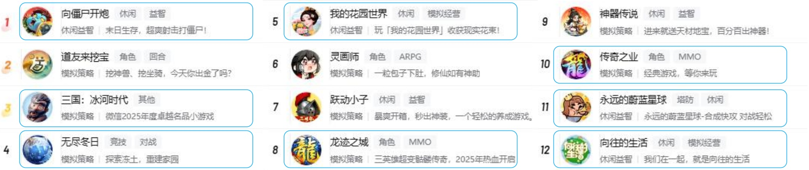
[image_caption]
该图片展示了一个游戏排行榜，包含12款不同类型的游戏推荐。以下是详细描述：

1. **向僵尸开炮**
   - 类型：休闲益智
   - 特点：末日生存，超爽射击打僵尸

2. **道友来挖宝**
   - 类型：模拟策略、角色、回合
   - 特点：挖神兽、挖坐骑，今天你出金了吗？

3. **三国：冰河时代**
   - 类型：模拟策略、其他
   - 特点：微信2025年度卓越名品小游戏

4. **无尽冬日**
   - 类型：模拟策略、竞技、对战
   - 特点：探索冻土，重建家园

5. **我的花园世界**
   - 类型：休闲、模拟经营
   - 特点：玩“我的花园世界”收获现实花束！

6. **灵画师**
   - 类型：角色、ARPG
   - 特点：一粒包子下肚，修仙如有神助

7. **跃动小子**
   - 类型：休闲、益智
   - 特点：暴爽开箱，秒出神装，一个轻松的养成游戏

8. **龙迹之城**
   - 类型：角色、MMO
   - 特点：三英雄超变骷髅传奇，2025年热血开启

9. **神器传说**
   - 类型：模拟策略、休闲、益智
   - 特点：进来就送天材地宝，百分百出神器！

10. **传奇之业**
    - 类型：模拟策略、角色、MMO
    - 特点：经典游戏，等你来玩

11. **永远的蔚蓝星球**
    - 类型：塔防、休闲、益智
    - 特点：永远的蔚蓝星球-合成快攻 对战轻松

12. **向往的生活**
    - 类型：休闲、益智、模拟经营
    - 特点：我们在一起，就是向往的生活

每个游戏都有对应的图标和简短描述，涵盖了多种游戏类型，如休闲、益智、模拟策略、角色扮演、竞技对战等。
[/image_caption]

## 老产品借小游戏重获新生

部落冲突：皇室战争（CR）

关注应用

下载报告

于2016年正式上线国服

部落冲突：皇室战争

Supercell旗下风靡全球的实时...

上次使用

2025年Q4登录微信小游戏

原始数据保留、双端互通

## 即便是存量竞争时代买量仍是最主要的获客手段

## 在“后IDFA”时代广告成本虽然攀升但在数据验证之下洗脑素材依然为王

从2018年起，全球移动游戏行业就开始“唱衰”广告买量，表示游戏要进入精品化时代；而2021年苹果默认关闭IDFA权限后，有更多从业者表现出了对游戏广告买量市场的失望甚至恐慌。但反观全球移动游戏市场，最为典型的必然是原本极度依赖精准买量的SLG类移动游戏，采用了副玩法买量的方式后完全改变了市场格局。在此之前，SLG移动游戏曾短期陷入“用户获取成本 \(>\) 长期LTV”的死亡螺旋，副玩法买量本质是厂商在数据不确定性与增长焦虑间做出的理性却又不得已的选择。这对于所有其他品类的游戏也都有极高的参考价值。

点点数据认为，现如今互联网泛娱乐的大多数形式都在趋向于“极度简化”的方向发展（无论是短视频、短剧、直播带货、甚至团播等），移动游戏的获客方式也在这其中发生着潜移默化的转变——游戏投放的核心应在于找到产品玩法调性与用户转化效果之间的最佳平衡点，从而在后IDFA时代的存量竞争中占据先机。

## 优势：

> 核心机制符号化

将复杂系统简化为直观的视觉符号和重复口号，瞬间传递核心爽点。

> 情绪驱动代替理性说服

情绪刺激+重复曝光强行形成记忆点，抢占用户心智

> AI时代下借势平台算法流量

洗脑素材可快速生成数百个变体，在快速迭代的同时也能获取更多流量倾斜

移动游戏的“洗脑”广告素材依然有着相对明确优劣势

## 劣势：

\(>\) 口碑与效果两极分化

虽然数据好看，但简单粗暴的广告内容容易引发部分用户的反感。

> 承诺“必须”与实物相符

依靠广告创意反向驱动产品，容易导致研发团队的成员反感，影响产品品质

Z世代的效果衰减乃至完全免疫

Z世代用户生长在信息爆炸的环境，对洗脑广告有明显的“免疫力”。

## 2026年手游关键词：大世界捉宠+自动化基建

## “情感化的收集欲望”与“可视化的成长反馈”深度融合而产生的复合乐趣

回顾2025年，移动游戏市场的关键词之一必然属于“搜打撤+FPS”。而展望2026年，点点数据认为其潜在关键词或许是“大世界捉宠+自动化基建”。这一趋势的源头可明确追溯至《幻兽帕鲁》的现象级成功，其将开放世界探索、宠物收集与模拟经营深度缝合。而《洛克王国》《帕萌战斗日记》《蓝色星原：旅谣》等一批产品的集中涌现，正是该模式约三年研发周期后的成果释放，标志着一个具有明确框架的新兴赛道正在兴起。

“大世界捉宠+自动化基建”模式的核心竞争力源于三重体验满足：一是“捉宠”所承载的收集、培养与陪伴的情感连结；二是“自动化基建”带来的规划、管理及见证家园繁荣的战略成就感与稳定资源收益；三是两者结合后产生的独特叙事——玩家与宠物伙伴从战斗到生产的全能协作关系，极大丰富了世界观的沉浸感与玩法深度。

然而，这一赛道要形成稳定产出，面临的挑战同样鲜明。首先，在商业化设计上存在固有矛盾：如何在不破坏“宠物伙伴”情感联结的前提下，设计合理付费点？粗暴的“抽宠”或“卖强度”极易引发舆论反噬。其次，内容消耗速度极快：自动化基建一旦进入稳态，容易陷入“上线收菜”的重复循环，对持续的地图扩张、宠物种类更新、生产链条深度提出极高要求。最后，技术实现复杂度不低：无缝大世界、宠物AI行为、自动化逻辑与性能优化，对中小团队而言仍是艰巨工程。因此，2026年该赛道的竞争，将不仅是创意的比拼，更是长线运营能力与内容工业化产能的较量。成功者或许并非单纯复刻《幻兽帕鲁》，而是能在此基础上，找到更契合移动端体验、更具情感温度且能构建健康商业循环的独特表达。

## 多款主打“捉宠”玩法的移动游戏将于2026年正式上线

《绝地求生》开发商Krafton已宣布将负责开发《幻兽帕鲁》手游。

或许这一轮的“品类之争”最终仍不可避免走向“一超多强”的市场格局，但它依然会为所有从业者及玩家带来深刻启示：

即便当前游戏市场由巨头所统治，但通过深度的玩法融合与情感设计，我们仍有机会开辟出属于新时代的“宝可梦”。

来源：点点数据自主研究及绘制

## 手游玩家需求迭代：可轻度可重度的双重需求

## 也可理解为“高性价比娱乐”与“低心理负担参与”的复合需求

近两年全球移动游戏市场出现了一批被传统眼光视为“数值驱动”的产品，如《菇勇者传说》《英雄没有闪》《英勇之地》《枫之谷：放置冒险記》等，接连取得爆发性成功并实现长线霸榜。这些产品在美术、题材或社交细节上虽各有创新，但其底层均未脱离数值成长的核心框架。点点数据认为：这类产品成功的核心在于构建了一套高度灵活的“可轻度可重度”的玩法系统。在“轻”的一端，它们普遍内嵌了成熟的放置挂机、一键日常、离线收益等自动化机制，确保玩家仅需每日投入十分钟甚至更短时间“收菜”，即可完成核心资源积累，维系角色的有效成长线，从而解决了传统重度游戏“一日不玩就掉队”的焦虑感。在“重”的一端，游戏则准备了深度的策略构筑（如复杂的技能/装备搭配）、挑战性的高难副本、赛季性的大规模活动或开放的世界探索内容。这些内容不强制每日参与，但为玩家在周末或闲暇时段提供了可连续投入数小时甚至更久的“内容深水区”，其奖励往往是稀缺外观、稀有道具或成就荣誉，以此满足玩家超越数值的深度追求与情感寄托。这种结构将“生存底线”与“发展上限”清晰分离，玩家可根据自身现实状况灵活切换角色——既是高效的“资源管理者”，也是沉浸的“世界探索者”。

这一趋势的兴起，远非“数值对对碰”的复古回潮，而是精准捕捉了存量时代大众玩家的内心矛盾：既渴望在娱乐中获得确定性的、低压力的正向反馈以对抗现实焦虑，又未曾熄灭对深度游戏体验的向往。从而完美对应了全球经济不确定性背景下，玩家群体普遍的“高性价比娱乐”与“低心理负担参与”的复合需求，在“轻负担”与“深满足”之间挖掘出的最佳平衡点。

## “可轻度可重度”的游戏产品方向

## 游戏类型天然合适

如竞技类移动游戏。除了MOBA、FPS等强竞技游戏外，近年来也涌现出多款派对、卡牌、解密、狼人杀等轻竞技玩法。与“可轻度可重度”的游戏环境天然吻合。

## 轻度游戏增加长周期深度玩法

为轻度游戏构建可长期钻研的“第二赛道”，可以是基于自身玩法的高难挑战或融合模拟经营等独立系统，提供独立于主线外的长期游戏目标。

## 重度游戏大幅简化日常并融合休闲玩法

通过“一键委托”或“资源追赶”等机制大幅压缩日常耗时，同时可植入部分休闲副玩法，提供独特的休闲乐趣和独立的奖励（多为外观、社交道具）。

## 将高难玩法的收益更多转向于荣誉性奖励

对于追求挑战的硬核玩家，高难玩法的奖励升华为“社交资本”，满足了其自我实现需求；而对于大众玩家，则卸下了“不打就落后”的强度焦虑，可以纯粹以休闲心态看待这些内容。

## 法律声明

Legal Statement

## 免责声明

报告中所有的文字、图片、表格均受有关商标和著作权的法律保护，部分文字和数据采集于公开信息，所有权为原作者所有。没有经过本公司新媒体许可，任何组织和个人不得以任何形式复制或传递，报告中所涉及的所有素材版权均归广告主所有。任何未经授权使用本报告的相关商业行为都将违反《中华人民共和国著作权法》和其他法律法规以及有关国际公约的规定。

## 法律条款

本报告中行业数据及市场预测主要为分析师采用桌面研究、行业访谈及其他研究方法，并且结合点点数据团队监测产品数据，通过统计预测模型估算获得，仅供参考。受研究方法和数据获取资源的限制，本报告只提供给用户作为市场参考资料，本公司对该报告的数据和观点不承担法律责任。任何机构或个人援引或基于上述数据信息所采取的任何行动所造成的法律后果均与点点数据无关，由此引发的相关争议或法律责任皆由行为人承担。

## POINT AWARDS

## 2025年度实力出海应用

2025 Premier Chinese-developed Mobile Apps in Global Markets

## 社交娱乐

TikTok

WeChat

rednote

BiliBili

Kwai

Soda Reels

Short Reels

Littmatch

## 照片视频

InShot

Hypic

UpFoto

VivaCut

Filmora

XRecorder

BeautyCam

Wink

## 实用工具

ShareMe

WPS Office

CamScanner

Seekee

CapCut

EasyShare

UC Browser

File Recovery

Xender

Meitu

## 购物

Shopee Indonesia

AliExpress

Taobao

Alibaba.com

查看所有上榜应用

Point Awards 2026 预报名

## POINT AWARDS

## 2025年度实力出海游戏

2025 Premier Chinese-developed Mobile Games in Global Markets

## 角色扮演

崩坏  
星穹铁道

原神

胜利女神新的希望

绝区零

弓箭传说2

放置少女

救世者之树新世界

## 策略

无尽冬日

奔奔王国

旭日之城

破晓的曙光

万国觉醒

冒险大作战

冒险者日记

19

杖劍傳說：坎斯汀之約

剑与远征启程

弹壳特攻队

战火与秩序

王国纪元

泰拉贝尔

黑道风云

## 动作

## 射击

## 消除

## 模拟

王者荣耀

第五人格

PUBG MOBILE

荒野行动

浪漫餐厅

麦吉大改造

恋与深空

偶像梦幻祭

## POINT AWARDS

## 2025年度先锋出海应用/游戏

2025 Pioneer Chinese-developed Mobile Apps/Games in Global Markets

## 应用

## 游戏

## 社交娱乐

JustTalk

Bass Booster & Equalizer

Kito

## AI

PolyBuzz

Kling Al

Saylo

## 财务金融

CoinSnap

[image_caption]
该图片展示了一个图标，图标主体为一个橙色背景的正方形，内有一个白色的抽象图形，形似一个带有缺口的圆环。正方形下方有一条蓝色横幅，上面用白色字体写着“Finanzas”。整体设计简洁明了，属于应用程序或服务的标志图标。
[/image_caption]

DiDi Finanzas

## 消除

漫游小镇

食光旅行

卡车之星

麦琪顿庄园

## 策略

Puzzles & Chaos: Frozen Castle

Doomsday: Last Survivors

Age ofEmpires Mobile

大黑帮

## 角色扮演

不休旅途绘卷世界

明日方舟

伊瑟

少女前线2：追放

## 娱乐场

Cash TornadoT Slots

Jackpot MasterTM Slots

## POINT AWARDS

## 2025年度中国卓越服务企业

2025 China's Outstanding Solution Providers

*排名不分先后

## 游戏数据/移动应用分析平台

Tap

全球商店数据

多维度榜单

下载/收入

[image_caption]
该图像为一个图标，显示了一个饼图的简化表示。饼图由一个圆形和一个从圆心延伸至圆周的扇形组成，扇形部分约占整个圆形的四分之一。此图标通常用于表示数据分布或比例关系。
[/image_caption]

竞品分析

用户画像

sdk技术集成

用户粘性

aso/asa策略分析

- 点点数据是移动应用、游戏数据监测服务商，为全球企业提供APP下载量、收入、使用行为和应用市场监测的一体化平台。

应用覆盖

1000万+

日活跃设备监控

1.7亿+

日数据存储量

100亿+

加入出海社群

监测国家地区数

276个

## 获取每日免费报告

每日微信群分享

最新行业报告

## 高端社群

所有行业报告均为公开合规版，知识产权属于发布机构，使用场景限于小范围内部学习。