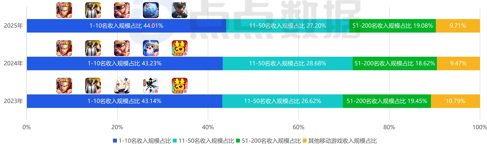

<!-- page 4 -->

## 中国移动游戏市场收入集中度

## 少数巨头的生态守卫战 vs 庞大长尾的残酷生存战

当TOP10的“超级产品”持续吸纳用户消费并占据近半市场时，新入局者或中型产品实现跃迁的窗口正急剧收窄。市场竞争从“百花齐放的内容角逐”，日益演变为“少数巨头的生态位守卫战”与“庞大长尾的残酷生存战”。多款头部产品今年的运营动向都表明其战略核心是不惜代价维护生命周期与用户活跃度，一切创新与资源投入都围绕此展开。而对于绝大多数开发者而言，在难以撼动头部格局的前提下，其生存策略要么是瞄准未被满足的垂直细分需求，在长尾中寻求小而美的利润空间。例如独立游戏赛道，今年就涌现了多款破圈产品（如《苏丹的游戏》《情感反诈模拟器》《逃离鸭科夫》等），这些作品或许难以在收入规模上挑战头部巨头，但它们通过满足特定玩家社群的深层情感与体验诉求，成功验证了在固化市场之外仍存在宝贵的价值洼地。

2023-2025年中国移动游戏市场收入集中度（仅App Store）

[image_caption]
该图像为一个柱状图，展示了2023年至2025年期间不同排名区间移动游戏收入规模的占比情况。图表分为三个年度（2023年、2024年、2025年），每个年度的收入占比被分为四个区间：1-10名、11-50名、51-200名以及其他移动游戏。

### 2023年
- **1-10名收入规模占比**：43.14%
- **11-50名收入规模占比**：26.62%
- **51-200名收入规模占比**：19.45%
- **其他移动游戏收入规模占比**：10.79%

### 2024年
- **1-10名收入规模占比**：43.23%
- **11-50名收入规模占比**：28.68%
- **51-200名收入规模占比**：18.62%
- **其他移动游戏收入规模占比**：9.47%

### 2025年
- **1-10名收入规模占比**：44.01%
- **11-50名收入规模占比**：27.20%
- **51-200名收入规模占比**：19.08%
- **其他移动游戏收入规模占比**：9.71%

每个年度的收入占比通过不同颜色的条形表示：
- 蓝色：1-10名收入规模占比
- 青色：11-50名收入规模占比
- 绿色：51-200名收入规模占比
- 橙色：其他移动游戏收入规模占比

图表上方还展示了对应年度的几款代表性游戏图标，但这些图标的具体内容未在描述中详细列出。

整体来看，1-10名游戏的收入占比在三年间略有波动，总体保持在43%左右；11-50名和51-200名游戏的收入占比变化较为明显，而其他移动游戏的收入占比则相对稳定且较低。
[/image_caption]

来源：点点数据自主研究及绘制