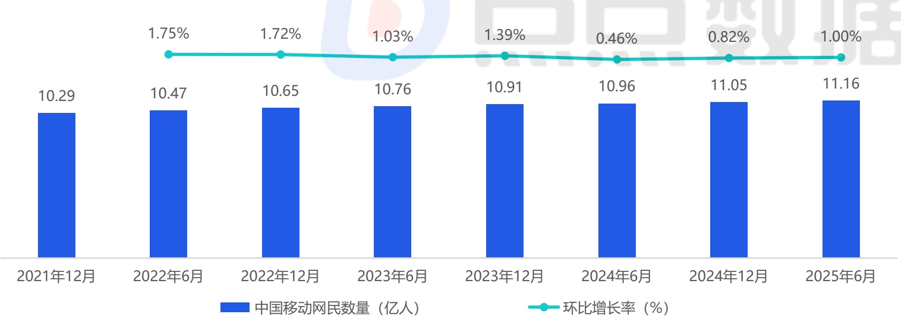
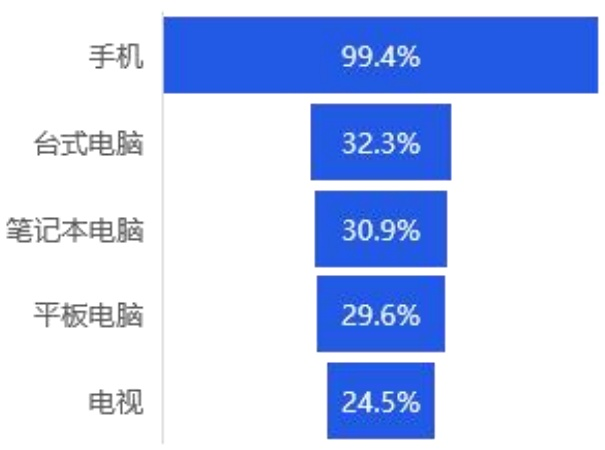

<!-- page 5 -->

## 中国移动游戏市场用户规模

## 女性游戏玩家数量迅速增长 推动市场新一轮拓展与创新

根据中国互联网络信息中心（CNNIC）发布的《第56次中国互联网络发展状况统计报告》所示，中国移动网民数量在2025年6月达到11.16亿人，近年来始终保持着稳定的增长规模。而其中更为重要的是，报告中着重提及了女性玩家数量的影响：“截至2025年6月，女性在网络游戏用户中的占比为48.0%，较2024年底提升3.1个百分点，上升趋势明显；尤其在手机游戏领域，女性玩家已成为主力军之一。”就点点数据观察来看，除了《恋与深空》、《光与夜之恋》、《世界之外》等女性向游戏外，移动游戏玩法轻度化的发展趋势也是女性玩家崛起的重要驱动力之一。

2025年中国移动网民数量

[image_caption]
该图像为柱状图和折线图的组合图表，展示了中国移动网民数量及其环比增长率的变化趋势。

### 图表类型
- **柱状图**：表示中国移动网民数量（单位：亿人）
- **折线图**：表示环比增长率（单位：%）

### 主要信息与数据趋势
1. **时间范围**：从2021年12月到2025年6月，每隔半年的数据点。
2. **网民数量（亿人）**：
   - 2021年12月：10.29亿人
   - 2022年6月：10.47亿人
   - 2022年12月：10.65亿人
   - 2023年6月：10.76亿人
   - 2023年12月：10.91亿人
   - 2024年6月：10.96亿人
   - 2024年12月：11.05亿人
   - 2025年6月：11.16亿人

   网民数量总体呈上升趋势，从2021年12月的10.29亿人增长到2025年6月的11.16亿人。

3. **环比增长率（%）**：
   - 2021年12月至2022年6月：1.75%
   - 2022年6月至2022年12月：1.72%
   - 2022年12月至2023年6月：1.03%
   - 2023年6月至2023年12月：1.39%
   - 2023年12月至2024年6月：0.46%
   - 2024年6月至2024年12月：0.82%
   - 2024年12月至2025年6月：1.00%

   环比增长率在不同时间段有所波动，但整体保持正增长，表明网民数量持续增加。

### 总结
该图表清晰地展示了中国移动网民数量的稳步增长趋势，以及各时间段的环比增长率变化。网民数量从2021年12月的10.29亿人增长到2025年6月的11.16亿人，显示出中国移动互联网用户的持续扩大。环比增长率虽然有波动，但总体保持正向增长，反映了市场的稳定发展。
[/image_caption]

2025年中国上网设备占比分布

[image_caption]
这是一张柱状图，展示了不同类型设备的使用率百分比。图表的主要信息如下：

- 手机：99.4%
- 台式电脑：32.3%
- 笔记本电脑：30.9%
- 平板电脑：29.6%
- 电视：24.5%

从数据趋势来看，手机的使用率远高于其他设备，接近100%。台式电脑、笔记本电脑和平板电脑的使用率相对较低，且彼此之间的差距不大。电视的使用率最低，为24.5%。
[/image_caption]

中国移动游戏玩家数量约

7.9~8.3亿人

注释：1、中国游戏用户规模统计包括中国大陆地区游戏用户总数量；2、部分数据可能会在点点数据2026年相关报告中做出调整。

来源：1、中国移动网民数量是由中国互联网络信息中心（CNNIC）定期发布的《中国互联网络发展状况统计报告》中所得；2、中国移动游戏用户渗透率是综合了点点数据、企业财报、专家访谈，根据点点数据统计模型核算所得。