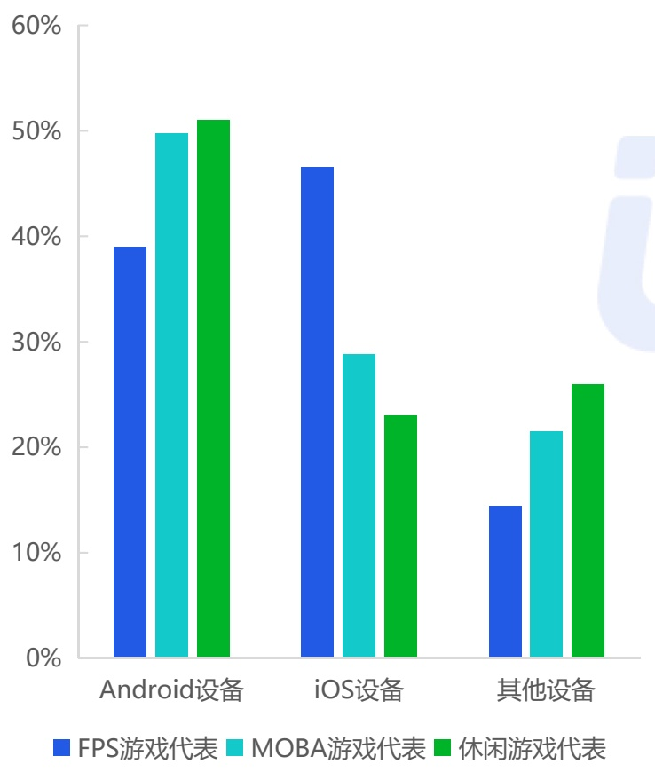
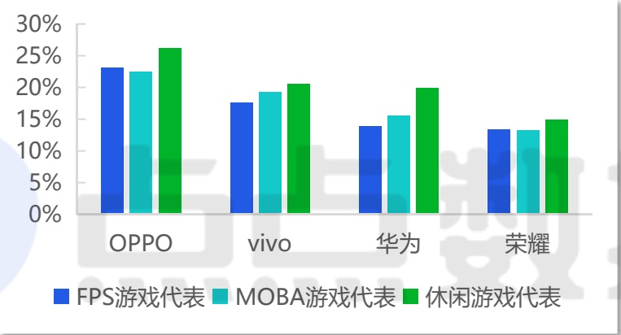
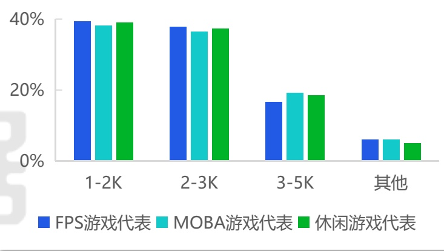
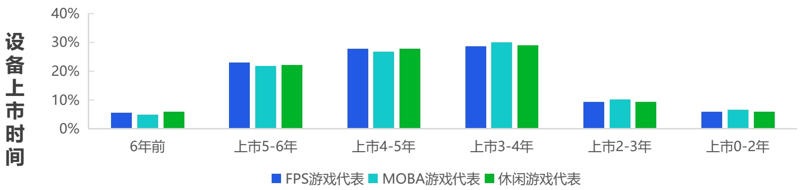

<!-- page 6 -->

## 中国移动游戏市场用户设备特点

## 苹果手机依然统治高端游戏市场 上市3-5年的设备数量占比近6成

(注：下方数据所对比的三款代表产品皆为2025年下载量排名TOP10，且2025全年下载量至少超8000万)

设备系统

[image_caption]
这是一张柱状图，展示了不同类型游戏在不同设备上的占比情况。图表的X轴表示设备类型，包括Android设备、iOS设备和其他设备；Y轴表示占比，从0%到60%。

具体数据如下：
- **Android设备**：
  - FPS游戏代表（蓝色）：约38%
  - MOBA游戏代表（青色）：约50%
  - 休闲游戏代表（绿色）：约51%

- **iOS设备**：
  - FPS游戏代表（蓝色）：约46%
  - MOBA游戏代表（青色）：约29%
  - 休闲游戏代表（绿色）：约23%

- **其他设备**：
  - FPS游戏代表（蓝色）：约14%
  - MOBA游戏代表（青色）：约21%
  - 休闲游戏代表（绿色）：约26%

从图表中可以看出，Android设备上休闲游戏和MOBA游戏的占比最高，而iOS设备上FPS游戏的占比最高。其他设备上休闲游戏的占比相对较高。
[/image_caption]

TOP设备品牌

[image_caption]
这是一张柱状图，展示了不同品牌手机在三种不同类型游戏中的表现。图表的横轴表示不同的手机品牌，包括OPPO、vivo、华为和荣耀。纵轴表示百分比，范围从0%到30%。

具体数据如下：
- **OPPO**:
  - FPS游戏代表（蓝色柱）：约23%
  - MOBA游戏代表（青色柱）：约22%
  - 休闲游戏代表（绿色柱）：约26%
  
- **vivo**:
  - FPS游戏代表（蓝色柱）：约17%
  - MOBA游戏代表（青色柱）：约19%
  - 休闲游戏代表（绿色柱）：约21%
  
- **华为**:
  - FPS游戏代表（蓝色柱）：约14%
  - MOBA游戏代表（青色柱）：约15%
  - 休闲游戏代表（绿色柱）：约20%
  
- **荣耀**:
  - FPS游戏代表（蓝色柱）：约13%
  - MOBA游戏代表（青色柱）：约13%
  - 休闲游戏代表（绿色柱）：约15%

图表通过不同颜色的柱状图清晰地展示了各品牌在不同类型游戏中的表现差异，其中OPPO在休闲游戏中的表现最为突出，而荣耀在FPS和MOBA游戏中的表现相对较低。
[/image_caption]

设备价格

[image_caption]
这是一张柱状图，展示了不同收入区间（1-2K、2-3K、3-5K和其他）中不同类型游戏的占比情况。图表中的颜色分别代表：
- 蓝色：FPS游戏代表
- 浅蓝色：MOBA游戏代表
- 绿色：休闲游戏代表

具体数据如下：
- 在1-2K收入区间：
  - FPS游戏代表：约40%
  - MOBA游戏代表：约40%
  - 休闲游戏代表：约40%
- 在2-3K收入区间：
  - FPS游戏代表：约40%
  - MOBA游戏代表：约40%
  - 休闲游戏代表：约40%
- 在3-5K收入区间：
  - FPS游戏代表：约20%
  - MOBA游戏代表：约20%
  - 休闲游戏代表：约20%
- 在其他收入区间：
  - FPS游戏代表：约10%
  - MOBA游戏代表：约10%
  - 休闲游戏代表：约10%

从图表中可以看出，在1-2K和2-3K收入区间，三种类型游戏的占比相对较高且接近；而在3-5K和其他收入区间，三种类型游戏的占比显著降低。
[/image_caption]

[image_caption]
这是一张柱状图，展示了不同设备上市时间与不同类型游戏代表（FPS游戏、MOBA游戏、休闲游戏）之间的关系。图表的纵轴表示设备上市时间的比例，范围从0%到40%，横轴表示设备的上市时间区间，包括“6年前”、“上市5-6年”、“上市4-5年”、“上市3-4年”、“上市2-3年”和“上市0-2年”。每组柱状图由三种颜色的柱子组成，分别代表FPS游戏（蓝色）、MOBA游戏（青色）和休闲游戏（绿色）。

具体数据如下：
- **6年前**：FPS游戏约5%，MOBA游戏约3%，休闲游戏约4%。
- **上市5-6年**：FPS游戏约23%，MOBA游戏约21%，休闲游戏约22%。
- **上市4-5年**：FPS游戏约28%，MOBA游戏约26%，休闲游戏约28%。
- **上市3-4年**：FPS游戏约29%，MOBA游戏约30%，休闲游戏约29%。
- **上市2-3年**：FPS游戏约9%，MOBA游戏约10%，休闲游戏约9%。
- **上市0-2年**：FPS游戏约5%，MOBA游戏约5%，休闲游戏约5%。

从图表中可以看出，随着设备上市时间的增加，FPS游戏、MOBA游戏和休闲游戏的占比在“上市4-5年”和“上市3-4年”期间达到最高，之后逐渐下降。在“6年前”和“上市0-2年”期间，三类游戏的占比相对较低且较为接近。
[/image_caption]

来源：点点数据自主研究及绘制