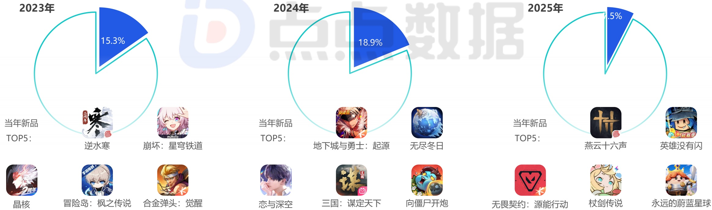

<!-- page 10 -->

## 中国移动游戏市场新品收入占比

## 头部超级产品缺位致使新品整体收入大幅缩水

2025年新上线移动游戏市场收入占比从 \(18.9\%\) 骤降至 \(7.3\%\) ，这一数据或许会使得资本市场不再将新游作为短期财务增长引擎的预期。从往年新游TOP5名单可以看出，成功产品多依托于成熟的端游IP移植（如《逆水寒》《地下城与勇士》）、已验证的赛道融合（如《无尽冬日》）或强势的垂直品类（如《恋与深空》），其成功逻辑可以说是“确定性创新”。而到了2025年，市场环境使得这种“确定性”也在急剧减弱。高昂的研发与营销成本，迫使厂商在新项目立项上极度保守，倾向于在已有成功公式内进行微调，而非探索未知领域；同时，用户对范式化内容的厌倦加剧，使得缺乏真正颠覆性体验的产品即便制作精良，也难以引发广泛的付费热潮。但需要明确的是，在 \(7.3\%\) 的占比背后，同样也包含了大量中等规模新游的集体失声——它们既无法在品质上对标顶级大作，又无法在创意上形成稀缺性，最终在激烈的流量争夺中迅速沉寂。

2023-2025年新上线移动游戏在当年的市场收入规模占比（仅App Store）

[image_caption]
该图片展示的是一个饼图，用于表示不同年份（2023年、2024年、2025年）中某类应用或游戏在市场中的占比情况。每个饼图旁边列出了当年的TOP5新品。

### 2023年
- 占比：15.3%
- 当年新品TOP5：
  1. 逆水寒
  2. 崩坏：星穹铁道
  3. 晶核
  4. 冒险岛：枫之传说
  5. 合金弹头：觉醒

### 2024年
- 占比：18.9%
- 当年新品TOP5：
  1. 地下城与勇士：起源
  2. 无尽冬日
  3. 恋与深空
  4. 三国：谋定天下
  5. 向僵尸开炮

### 2025年
- 占比：1.5%
- 当年新品TOP5：
  1. 燕云十六声
  2. 英雄没有闪
  3. 无畏契约：源能行动
  4. 杖剑传说
  5. 永远的蔚蓝星球

饼图通过蓝色和白色区分了各年的占比，蓝色部分代表该年份的占比，白色部分代表剩余的占比。每年的饼图右侧还展示了当年的TOP5新品，每个新品都有对应的图标和名称。整体布局清晰，便于对比不同年份的市场表现和新品情况。
[/image_caption]

来源：点点数据自主研究及绘制