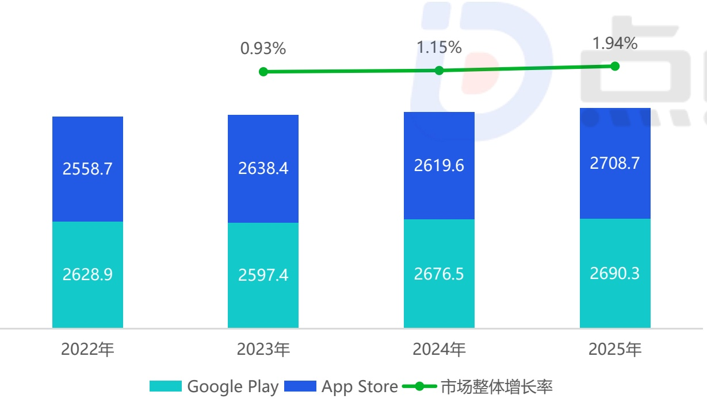
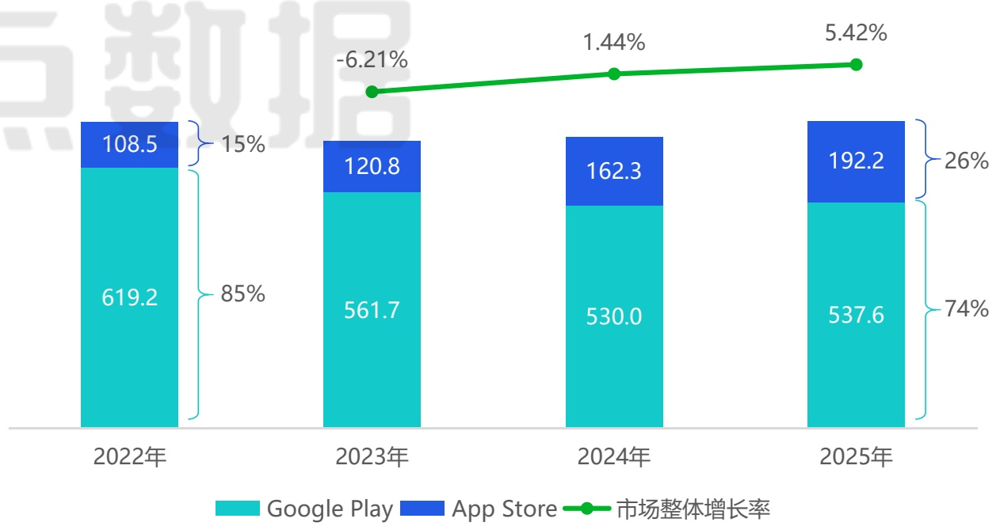

<!-- page 14 -->

## 海外移动游戏市场收入规模&下载量

## 市场收入规模增长持续平缓 双平台下载量发生显著迁移

2025年海外移动游戏市场的收入规模增长持续平缓，年增速维持在1%-2%的区间。与之相对的则是下载量的变化，其中双平台下载量的占比变化最为明显：Google Play的下载量份额从2022年的85%逐渐收缩至74%，而App Store则从15%攀升至26%，标志着高价值用户与核心市场注意力正加速向iOS生态聚集，这背后的形成原因或许是隐私政策变化、用户设备升级、平台营销能力等多方面的综合作用。对于游戏厂商而言，这直接影响了用户获取策略的一大方向——即需要大幅提升App Store的产品页面优化、本地化展示、争取编辑推荐等业务的重要性，甚至在部分地区应提高至与买量投放同等重要的战略高度。

2025年海外移动游戏市场收入规模 (亿元)

[image_caption]
这是一张柱状图，展示了2022年至2025年期间Google Play和App Store的市场数据及其整体增长率。图表的主要信息如下：

- **2022年**：
  - Google Play：2628.9
  - App Store：2558.7
  - 市场整体增长率：0.93%

- **2023年**：
  - Google Play：2597.4
  - App Store：2638.4
  - 市场整体增长率：1.15%

- **2024年**：
  - Google Play：2676.5
  - App Store：2619.6
  - 市场整体增长率：1.94%

- **2025年**：
  - Google Play：2690.3
  - App Store：2708.7

图表中，Google Play的数据用青色表示，App Store的数据用蓝色表示，市场整体增长率用绿色线条和点表示。从数据趋势来看，Google Play和App Store的市场数据在逐年增长，尤其是App Store的增长率在2025年达到了最高值。
[/image_caption]

2025年海外移动游戏市场下载量 (亿次)

[image_caption]
这是一张柱状图，展示了2022年至2025年期间Google Play和App Store的市场份额及其市场整体增长率。

1. **图表类型**：柱状图
2. **主要信息**：
   - **2022年**：
     - Google Play：619.2（占85%）
     - App Store：108.5（占15%）
     - 市场整体增长率：-6.21%
   - **2023年**：
     - Google Play：561.7（占85%）
     - App Store：120.8（占15%）
     - 市场整体增长率：1.44%
   - **2024年**：
     - Google Play：530.0（占74%）
     - App Store：162.3（占26%）
     - 市场整体增长率：5.42%
   - **2025年**：
     - Google Play：537.6（占74%）
     - App Store：192.2（占26%）

3. **数据趋势**：
   - Google Play的市场份额从2022年的85%逐渐下降到2025年的74%。
   - App Store的市场份额从2022年的15%逐渐上升到2025年的26%。
   - 市场整体增长率在2023年为正增长1.44%，并在2025年达到5.42%。

4. **颜色说明**：
   - 绿色条表示Google Play的市场份额。
   - 蓝色条表示App Store的市场份额。
   - 绿色线条表示市场整体增长率。

这张图表清晰地展示了Google Play和App Store在不同年份的市场份额变化以及市场整体的增长趋势。
[/image_caption]

注释：1、海外移动游戏市场统计包括所有在AppStore和GooglePlay上架的移动游戏产品（除中国大陆地区以外），不包含其他渠道或平台上的移动游戏产品；2、收入规模包含统计范围内用户消费的总金额，不包含广告变现、第三方充值等其他收入模式；3、本报告中后续涉及的“海外收入”相关的统计数据，都以此标准进行统计；4、部分数据可能会在点点数据2026年相关报告中做出调整。来源：海外游戏市场收入规模是综合了点点数据、企业财报、专家访谈，根据点点数据统计模型核算所得。