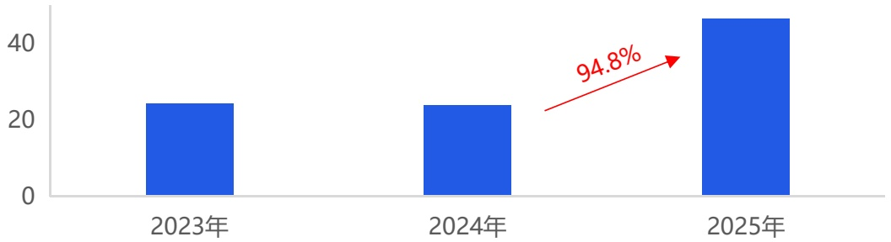
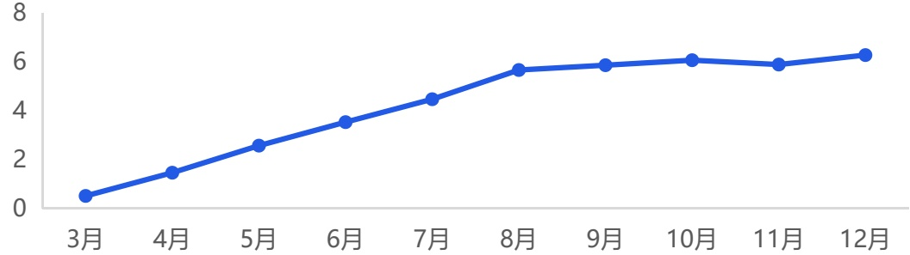

<!-- page 16 -->

## TOP榜产品《皇室战争》《奔奔王国》深度解析D点点数据

## 老产品复兴依赖不惧风险的深度重构 新品突围靠成熟模型下的微创新设计

## 皇室战争

Clash Royale

Supercell作为一家传奇的移动游戏开发商，其近年来的部分新品虽成绩不尽理想，但多款老产品焕发的“第二春”再次展现了其深厚的运营功力。继去年《荒野乱斗》通过商业化重做与英雄产出调整实现流水翻倍后，今年《皇室战争》的高位上榜，则是玩法创新与产出优化双轮驱动的结果。其核心在于进行了一场“系统性重生”：

一方面，游戏大幅提升了皇室征程（奖杯之路）的上限并引入全新高阶模式，彻底解决了老玩家缺乏长期目标的痛点，重构了进度追求生态；

另一方面，创新推出的“合成奇兵”模式，将自走棋的合成策略与IP角色结合，以低门槛、快节奏的新体验成功破圈，吸引了大量新老用户。

同时，游戏对经济系统进行了普惠性调整，将更多高级奖励下沉至广大中层玩家可触及的活动中，显著提升了整体的参与感与付费意愿。这套组合拳精准地激活了用户生态，让一款运营多年的产品重获增长动能。

2023-2025年《皇室战争》海外收入规模（亿元）

[image_caption]
这是一张柱状图，展示了2023年、2024年和2025年的数据对比。图表中有三个蓝色的柱子，分别对应这三个年份。2023年的值约为22，2024年的值约为22，2025年的值约为45。在2024年和2025年之间有一个红色的箭头，标注了94.8%的增长率。
[/image_caption]

来源：点点数据自主研究及绘制

## 奔奔王国

Kingshot

作为2025年唯一上榜的新品，《奔奔王国》的成功则体现了研发方点点互动在成熟赛道中极致高效的执行策略。其成功可归结于两点精准思路：

第一，成熟框架下的入口创新。该作并未冒险进行底层玩法颠覆，而是精准复用了旗下爆款《Whiteout Survival》已验证成功的“模拟经营+4X SLG”核心框架与变现模型。其真正的差异化在于对“入口”进行了轻度化改造，将易于上手、反馈即时的“塔防”玩法作为前期核心体验，大幅降低了传统SLG的入门门槛，有效吸引了泛用户群体。

第二，高度清晰的用户与市场定位。这既体现在其选取了与自家其他产品形成互补的中世纪题材与明快美术风格上，更贯穿于其“副玩法买量”的饱和式营销策略中。通过将买量素材高度聚焦于展示吸引人的塔防玩法，并借助工业化素材生产能力进行高强度投放，游戏快速穿透用户心智，完成了在红海市场的冷启动与用户积累。

2025年《奔奔王国》海外月收入规模（亿元）

[image_caption]
这是一张折线图，展示了从3月到12月的数据变化趋势。图表的横轴表示月份，从3月到12月依次排列；纵轴表示数值，范围从0到8。数据点如下：

- 3月：约0.5
- 4月：约1.5
- 5月：约2.5
- 6月：约3.5
- 7月：约4.5
- 8月：约5.5
- 9月：约6.0
- 10月：约6.0
- 11月：约6.0
- 12月：约6.5

从图中可以看出，数据在3月至8月期间呈上升趋势，8月达到峰值后在9月至11月保持稳定，12月略有回升。
[/image_caption]