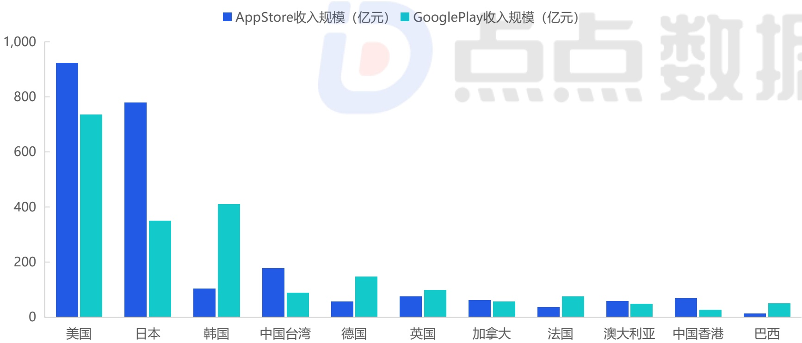
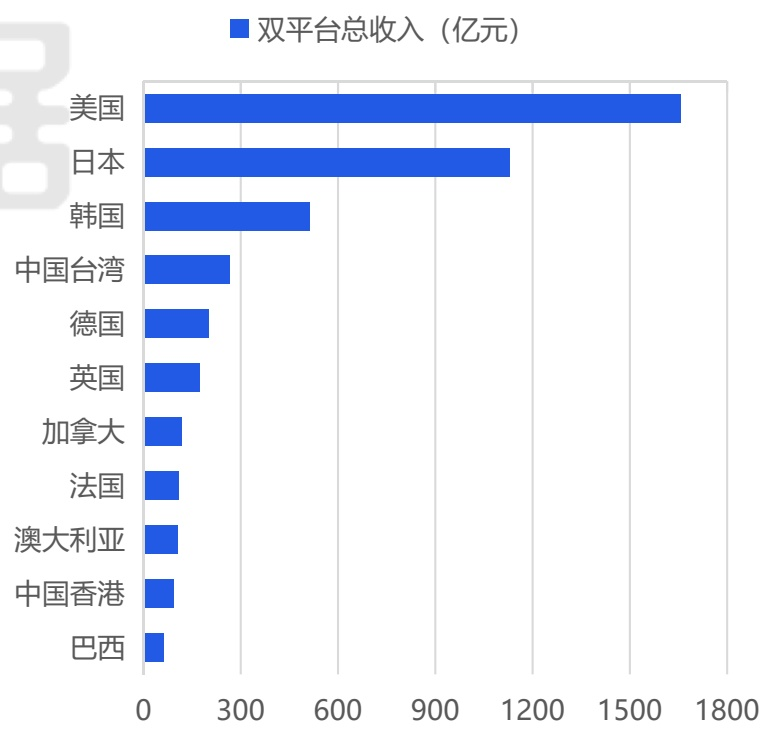

<!-- page 19 -->

## 海外各地区移动游戏收入占比分布

## 美+日独占海外市场超50%份额 中国香港连续两年稳居TOP10

2025年海外移动游戏市场收入格局进一步固化，美国以1658.4亿元的规模占据绝对主导，仍是全球最高价值的战略区域。日本市场凭借1129.8亿元的收入稳居第二，其iOS收入占比接近7成，持续展现其作为高端市场的独特地位。综合报告前文海外整体的收入规模来看，美国+日本的收入规模已占据了全球超 \(50\%\) 的份额。排名第三的韩国市场占比约\(9.51\%\) ，其则是由Google Play贡献了近8成收入。值得注意的是，中国台湾与中国香港已连续两年双双稳定在TOP10，巩固了“港澳台地区”作为中国游戏厂商出海核心板块的战略价值。而以欧洲市场为主的第二梯队，虽然格局稳定且市场规模可观，但由于品类固化、本地化难以及最重要的买量成本居高不下，目前仍难以成为中国游戏厂商出海的主要锚点。

2025年海外各地区移动游戏收入分布

[image_caption]
这是一张柱状图，展示了不同国家和地区在AppStore和GooglePlay上的收入规模（单位：亿元）。图表的横轴表示不同的国家和地区，包括美国、日本、韩国、中国台湾、德国、英国、加拿大、法国、澳大利亚、中国香港和巴西。纵轴表示收入规模，范围从0到1000亿元。

具体数据如下：
- 美国：AppStore收入约为900亿元，GooglePlay收入约为750亿元。
- 日本：AppStore收入约为800亿元，GooglePlay收入约为350亿元。
- 韩国：AppStore收入约为100亿元，GooglePlay收入约为400亿元。
- 中国台湾：AppStore收入约为180亿元，GooglePlay收入约为80亿元。
- 德国：AppStore收入约为50亿元，GooglePlay收入约为150亿元。
- 英国：AppStore收入约为70亿元，GooglePlay收入约为100亿元。
- 加拿大：AppStore收入约为60亿元，GooglePlay收入约为50亿元。
- 法国：AppStore收入约为30亿元，GooglePlay收入约为70亿元。
- 澳大利亚：AppStore收入约为50亿元，GooglePlay收入约为40亿元。
- 中国香港：AppStore收入约为70亿元，GooglePlay收入约为50亿元。
- 巴西：AppStore收入约为10亿元，GooglePlay收入约为40亿元。

从图表中可以看出，美国和日本在两个平台上的收入规模显著高于其他国家和地区，而巴西的收入规模相对较低。AppStore的收入普遍高于GooglePlay。
[/image_caption]

[image_caption]
这是一张柱状图，展示了不同国家和地区在双平台上的总收入（单位：亿元）。图表的主要信息如下：

- **美国**：总收入最高，约为1700亿元。
- **日本**：总收入约为1200亿元。
- **韩国**：总收入约为500亿元。
- **中国台湾**：总收入约为300亿元。
- **德国**：总收入约为200亿元。
- **英国**：总收入约为150亿元。
- **加拿大**：总收入约为100亿元。
- **法国**：总收入约为80亿元。
- **澳大利亚**：总收入约为60亿元。
- **中国香港**：总收入约为50亿元。
- **巴西**：总收入最低，约为30亿元。

图表通过蓝色柱状条表示各国家和地区的总收入，横轴表示收入金额（单位：亿元），纵轴表示国家和地区名称。从图中可以看出，美国的总收入远高于其他国家和地区，而巴西的总收入最低。
[/image_caption]

来源：点点数据自主研究及绘制