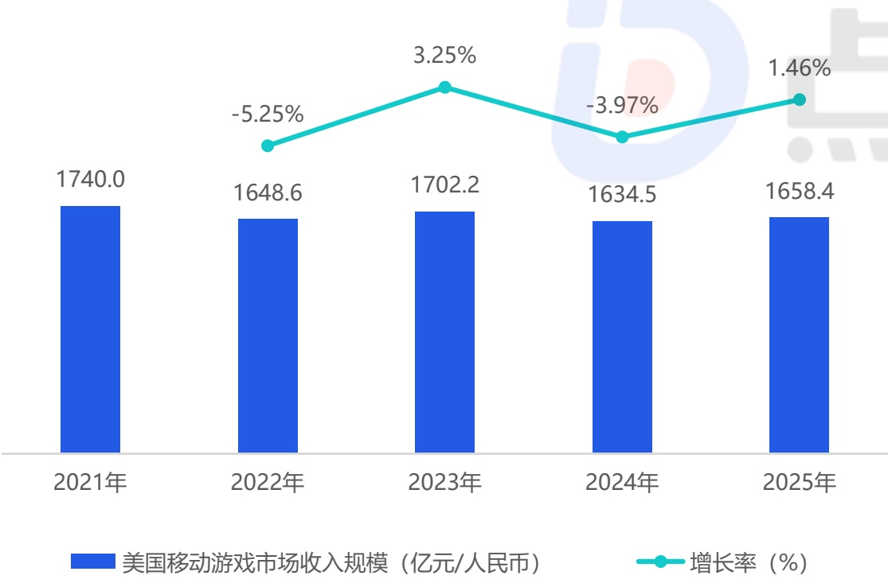
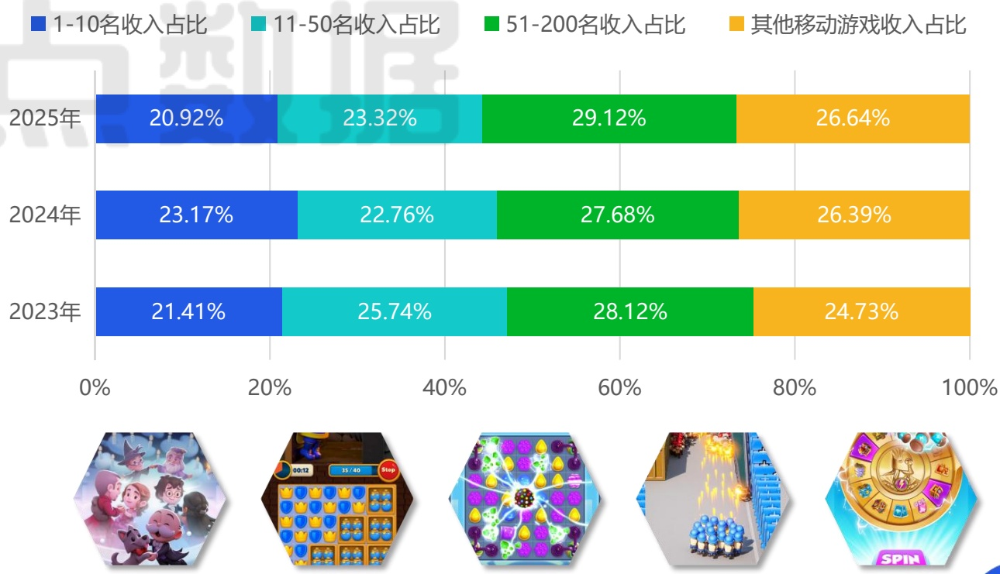

<!-- page 20 -->

## 美国移动游戏市场收入规模

## 玩家消费安全感直接影响不同生态位产品的营收潜力

对比下方数据，美国移动游戏市场收入规模与头部产品集中度呈现一定的负相关规律：当2024年市场收入萎缩 \(3.97\%\) 时，头部TOP10产品份额逆势攀升至 \(23.17\%\) ，结合当年美国宏观经济环境动荡的背景，玩家在这期间更倾向于“安全消费”，将时间与消费集中于社交生态稳固、试错风险低的头部产品；而在2023年、2025年市场收入有所增长时，头部份额回落至 \(21\%\) 左右，同时中腰部（11-200名）产品份额扩张至约 \(53\%\) ，表明一旦市场情绪稍缓，中国移动游戏玩家的探索意愿便会为具备差异化创新或卓越运营的“挑战者”开启时间窗口，市场的增量正由这些新晋或翻红的中腰部产品驱动。这一规律或许能为厂商提供一些战术方向：结合宏观经济预判玩家安全感预期，从而辅助决策当前战略核心应是深耕存量用户价值与运营效率还是推出重点新品争夺市场份额。

2025年美国移动游戏市场收入规模

[image_caption]
该图是一个柱状图和折线图结合的图表，展示了美国移动游戏市场收入规模及其增长率的变化情况。

### 图表类型
- **柱状图**：表示每年的市场收入规模（单位：亿元/人民币）。
- **折线图**：表示每年的市场收入增长率（单位：%）。

### 数据趋势
1. **2021年**
   - 市场收入规模：1740.0亿元/人民币
   - 增长率：3.25%

2. **2022年**
   - 市场收入规模：1648.6亿元/人民币
   - 增长率：-5.25%

3. **2023年**
   - 市场收入规模：1702.2亿元/人民币
   - 增长率：3.25%

4. **2024年**
   - 市场收入规模：1634.5亿元/人民币
   - 增长率：-3.97%

5. **2025年**
   - 市场收入规模：1658.4亿元/人民币
   - 增长率：1.46%

### 主要信息
- **市场收入规模**：从2021年的1740.0亿元/人民币开始，经历了一段下降（2022年为1648.6亿元/人民币），随后在2023年回升至1702.2亿元/人民币，之后再次下降（2024年为1634.5亿元/人民币），并在2025年略有回升至1658.4亿元/人民币。
- **增长率**：2021年和2023年增长率为正（3.25%），而2022年和2024年为负增长（-5.25%和-3.97%），2025年增长率为正（1.46%）。

### 图例
- **蓝色柱状图**：表示美国移动游戏市场收入规模（亿元/人民币）。
- **青色折线图**：表示增长率（%）。
[/image_caption]

来源：点点数据自主研究及绘制

2025年美国移动游戏市场收入集中度

[image_caption]
该图像展示了一张柱状图，详细比较了2023年、2024年和2025年不同收入排名区间的移动游戏收入占比情况。图表分为四个颜色区域，分别代表：

- 蓝色（1-10名收入占比）
- 青色（11-50名收入占比）
- 绿色（51-200名收入占比）
- 橙色（其他移动游戏收入占比）

具体数据如下：

### 2025年
- 1-10名收入占比：20.92%
- 11-50名收入占比：23.32%
- 51-200名收入占比：29.12%
- 其他移动游戏收入占比：26.64%

### 2024年
- 1-10名收入占比：23.17%
- 11-50名收入占比：22.76%
- 51-200名收入占比：27.68%
- 其他移动游戏收入占比：26.39%

### 2023年
- 1-10名收入占比：21.41%
- 11-50名收入占比：25.74%
- 51-200名收入占比：28.12%
- 其他移动游戏收入占比：24.73%

从数据趋势来看：
- 1-10名收入占比在2024年达到最高值23.17%，随后在2025年略微下降至20.92%。
- 11-50名收入占比在2023年达到最高值25.74%，2024年略有下降至22.76%，2025年回升至23.32%。
- 51-200名收入占比在2025年达到最高值29.12%，显示出这一区间收入的显著增长。
- 其他移动游戏收入占比在2025年为26.64%，略高于2024年的26.39%和2023年的24.73%。

图表下方展示了五款不同类型的移动游戏图标，包括角色扮演、消除类、策略类、模拟经营和老虎机类游戏，直观地展示了这些游戏的视觉风格和类型特点。
[/image_caption]