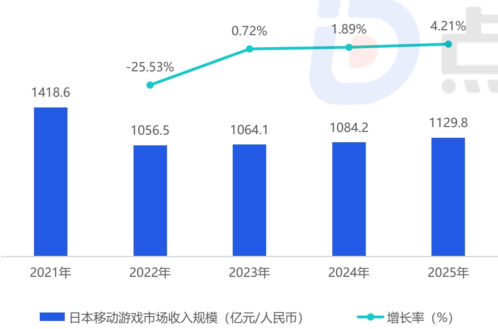
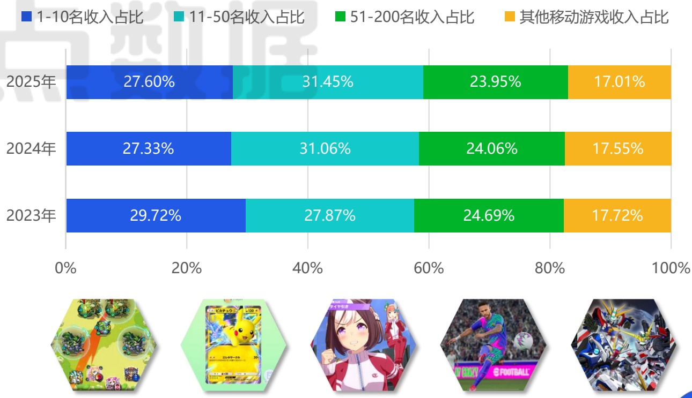

<!-- page 22 -->

## 日本移动游戏市场收入规模

## 应用侧载与第三方支付相关法案于年末正式落地生效

2025年，日本移动游戏市场在总收入达到1129.8亿元、实现4.21%的同比增长。日本移动游戏玩家的“情感羁绊”与“社群归属”始终是比单纯玩法更重要的付费核心与运营壁垒，老牌产品能持续产生高额流水，其成功远超游戏性本身，根植于长期构建的角色故事、声优阵容、同人文化及玩家间的社群认同。需特别指出的是，日本《智能手机特定软件竞争促进法》已于2015年12月18日正式生效，与美国类似，该法案也同样要求平台开放应用侧载、允许第三方支付系统接入以及提供选择界面等。长远来看，这必将改变现有的渠道格局，为游戏厂商在日本市场带来新的分发与支付选择。

2025年日本移动游戏市场收入规模

[image_caption]
该图是一个柱状图和折线图结合的图表，展示了日本移动游戏市场收入规模及其增长率的变化情况。

**图表类型**：柱状图 + 折线图

**主要信息**：
- **X轴**：表示年份，从2021年到2025年。
- **Y轴**：左侧表示日本移动游戏市场收入规模（单位：亿元/人民币），右侧表示增长率（单位：%）。
- **蓝色柱状图**：显示每年的市场收入规模。
  - 2021年：1418.6亿元
  - 2022年：1056.5亿元
  - 2023年：1064.1亿元
  - 2024年：1084.2亿元
  - 2025年：1129.8亿元
- **绿色折线图**：显示每年的增长率。
  - 2021年到2022年：-25.53%
  - 2022年到2023年：0.72%
  - 2023年到2024年：1.89%
  - 2024年到2025年：4.21%

**数据趋势**：
- 市场收入规模在2021年达到峰值后，2022年出现显著下降，随后逐年缓慢增长。
- 增长率在2022年为负增长，之后逐渐转为正增长，并且增速逐年加快。
[/image_caption]

来源：点点数据自主研究及绘制

2025年日本移动游戏市场收入集中度

[image_caption]
该图像展示了一张水平堆叠条形图，用于比较2023年、2024年和2025年不同收入排名区间的移动游戏收入占比。图表分为四个颜色区域，分别代表：

- 蓝色（1-10名收入占比）
- 青色（11-50名收入占比）
- 绿色（51-200名收入占比）
- 橙色（其他移动游戏收入占比）

具体数据如下：

**2025年：**
- 1-10名收入占比：27.60%
- 11-50名收入占比：31.45%
- 51-200名收入占比：23.95%
- 其他移动游戏收入占比：17.01%

**2024年：**
- 1-10名收入占比：27.33%
- 11-50名收入占比：31.06%
- 51-200名收入占比：24.06%
- 其他移动游戏收入占比：17.55%

**2023年：**
- 1-10名收入占比：29.72%
- 11-50名收入占比：27.87%
- 51-200名收入占比：24.69%
- 其他移动游戏收入占比：17.72%

图表下方展示了五款不同类型的移动游戏图标，包括：
1. 一款色彩鲜艳的卡通风格游戏。
2. 一款以皮卡丘为主题的卡片游戏。
3. 一款动漫风格的角色扮演游戏。
4. 一款足球主题的体育游戏。
5. 一款机甲风格的科幻游戏。

整体来看，1-10名和11-50名的收入占比在三年间变化不大，而51-200名和其他移动游戏的收入占比略有波动。
[/image_caption]