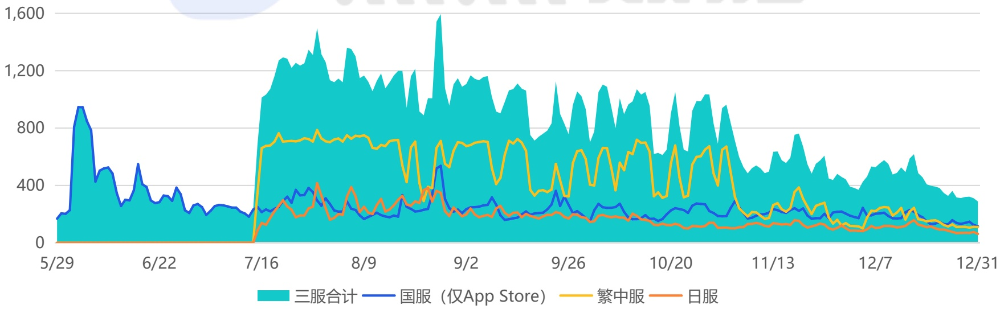

<!-- page 31 -->

## 典型移动游戏产品案例分析：《杖剑传说》

## 基于项目组擅长品类精准挖掘出“轻度MMO”的细分蓝海赛道

《杖剑传说》是一款在放置游戏的极简框架内，深度融入MMO的核心社交与成长体验，从而形成一款“足够轻度的MMO”。这种设计即摒除了传统MMO手游为了追求重度体验和用户粘性进行的复杂设计，导致玩家负担沉重；又解决了纯粹的放置游戏因内容单薄难以满足玩家对深度互动和长期目标的追求感缺失问题。《杖剑传说》并非对传统MMO做减法，而是在放置休闲的基底上，系统地增加组队副本、职业分工、公会社交等MMO的经典元素。这一定位精准命中了大量渴望MMO社交与成长乐趣，但受限于时间精力、无法承受高强度日常任务的“泛用户”与“时间碎片化用户”，开辟了一片竞争相对缓和的蓝海市场。在《厦门吉比特网络技术股份有限公司2025年第三季度报告》中，公司海外游戏业务营收同比大幅增长 \(59.46\%\) ，其中《杖剑传说》被明确为主要贡献者。（如右图所示）

## 本年第三季度较第二季度环比变动说明：

（1）本年第三季度营业收入、归属于上市公司股东的净利润较本年第二季度大幅增加，主要系：①《杖剑传说（大陆版）》《道友来挖宝》于2025年5月上线，本年第三季度运营了完整周期，营业收入及利润环比均大幅增加；②《杖剑传说（境外版）》于2025年7月上线，贡献增量营业收入及利润。此外，《问道手游》本年第二季度的九周年庆活动取得较好效果，第三季度营业收入及利润较第二季度下滑。

2025年《杖剑传说》全球日流水（万元）

[image_caption]
这是一张折线图，展示了从2023年5月29日至12月31日期间四个不同类别数据的变化趋势。图表的纵轴表示数值，范围从0到1,600；横轴表示时间，以每周为单位。

### 图表描述：

#### 1. **图表类型**：
   - 这是一张**折线图**，用于展示随时间变化的数据趋势。

#### 2. **图例说明**：
   - **三服合计**（青绿色区域）：表示所有服务的总和。
   - **国服（仅App Store）**（蓝色折线）：表示仅在App Store上的国服数据。
   - **繁中服**（黄色折线）：表示繁体中文服务器的数据。
   - **日服**（橙色折线）：表示日服的数据。

#### 3. **数据趋势分析**：

   - **三服合计**（青绿色区域）：
     - 整体趋势在7月中旬达到峰值，接近1,600，随后逐渐下降，至12月底降至约200左右。
     - 在7月中旬之前，数值较低，波动较小，但在7月中旬后显著上升，形成一个高峰，之后持续下降。

   - **国服（仅App Store）**（蓝色折线）：
     - 数值相对较低，整体波动较小，最高点出现在7月中旬，接近400，随后逐渐下降，至12月底降至约100左右。
     - 在7月中旬之前，数值较为平稳，之后随着“三服合计”的上升而有所增加，但幅度较小。

   - **繁中服**（黄色折线）：
     - 数值介于国服和日服之间，整体波动较大，最高点出现在7月中旬，接近800，随后逐渐下降，至12月底降至约100左右。
     - 在7月中旬之前，数值较低且波动较小，之后随着“三服合计”的上升而显著增加，但波动较大。

   - **日服**（橙色折线）：
     - 数值最低，整体波动较小，最高点出现在7月中旬，接近400，随后逐渐下降，至12月底降至约50左右。
     - 在7月中旬之前，数值较为平稳，之后随着“三服合计”的上升而有所增加，但幅度较小。

#### 4. **关键时间节点**：
   - **7月中旬**：所有类别的数据均达到峰值，尤其是“三服合计”和“繁中服”。
   - **12月底**：所有类别的数据均降至最低点，表明整体趋势为下降。

#### 5. **总结**：
   - 整体来看，“三服合计”在7月中旬达到最高点，随后逐渐下降，至12月底降至最低。
   - “国服（仅App Store）”和“日服”的数值相对较低，波动较小，而“繁中服”则表现出较大的波动性。
   - 所有类别的数据在12月底均降至最低点，表明整体趋势为下降。
[/image_caption]

来源：点点数据自主研究及绘制